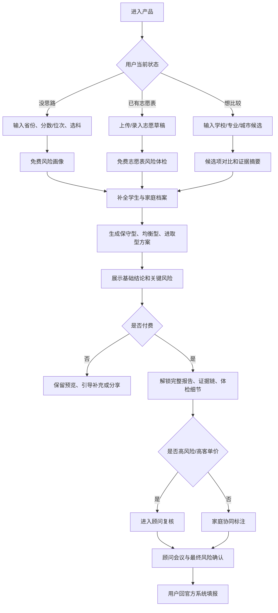
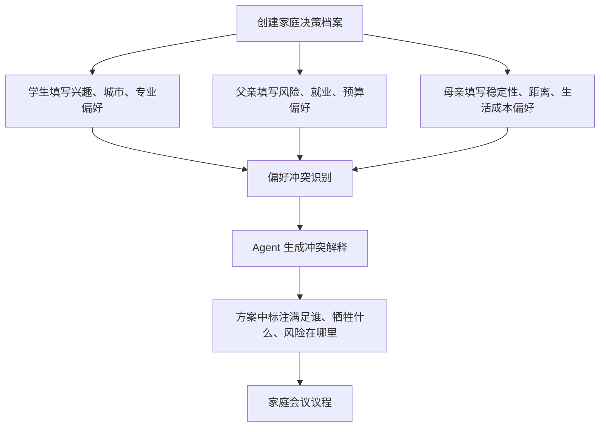
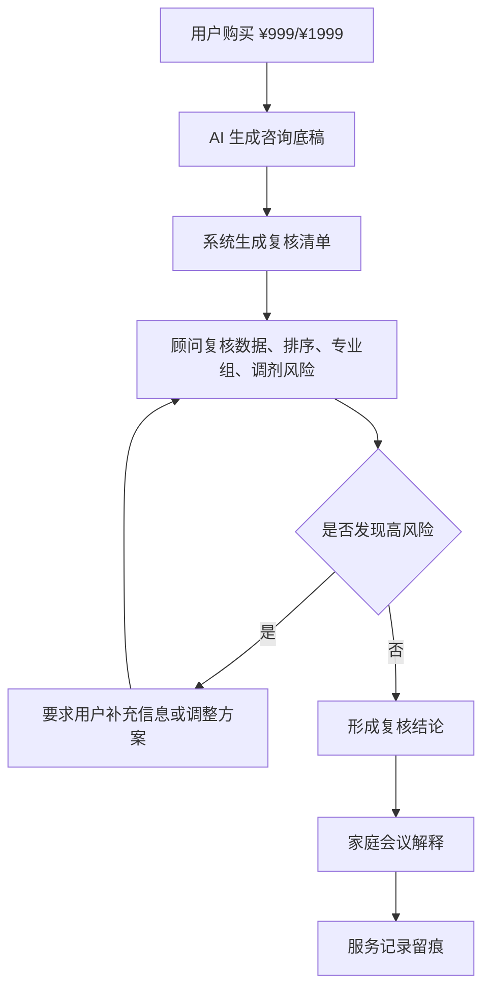
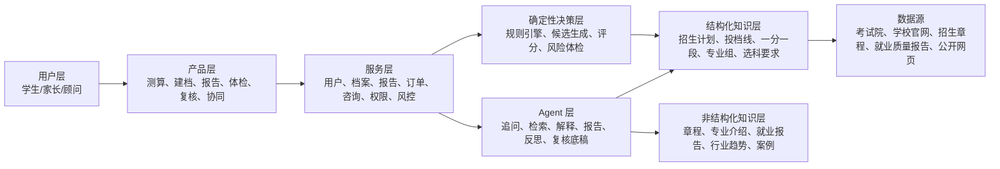
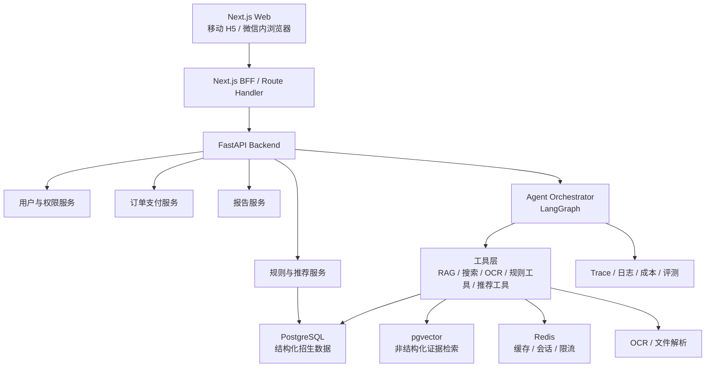
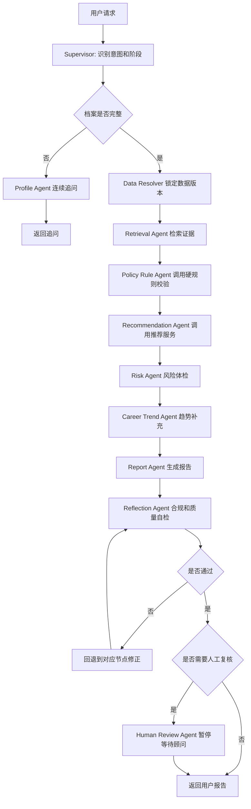
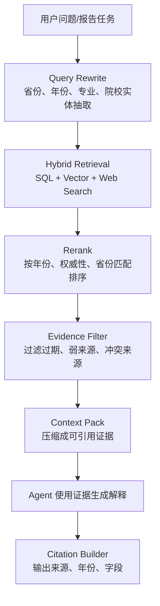

# 志愿规划 Agent 业务导向 + 技术导向 PRD

版本：v0.3  
日期：2026-06-28  
产品形态：Next.js Web 应用，首期优先移动端 H5 与微信内浏览器体验  
后端框架：FastAPI + LangGraph  
核心能力：结构化招生数据、规则引擎、RAG 证据链、多 Agent 协同、志愿表风险体检、专家复核

---

## 1. 产品定位

### 1.1 一句话定位

志愿规划 Agent 是面向高考生和家长的 **AI 志愿决策助理 + 专家复核咨询平台**，通过考生建档、招生规则校验、冲稳保方案生成、志愿表风险体检、家庭偏好协同和顾问复核，帮助家庭在短时间内形成可解释、可追溯、可复核的志愿填报方案。

### 1.2 项目目标

本项目同时服务三个目标：

| 目标 | 说明 | 对产品设计的要求 |
|---|---|---|
| Agent 项目经验 | 练习复杂业务中的 Agent 编排、工具调用、规则约束、Human-in-the-loop | 不能停留在普通聊天机器人，需要有真实任务流、状态流和质检机制 |
| 个人作品集 | 面向面试官展示技术深度、架构思考和业务理解 | 需要清楚说明为什么需要 Agent、哪些部分不能交给 LLM、如何评测和风控 |
| 真实业务价值 | 帮助考生快速选择更适合自己的城市、大学和专业 | 推荐必须绑定省份、年份、位次、专业组、规则和数据来源 |

### 1.3 核心差异

本产品不是“又一个志愿填报聊天机器人”，而是“志愿填报决策系统”。

用户真正需要的不是 AI 随口推荐几所大学，而是：

- 可核验的数据来源和证据链。
- 省份、批次、位次、专业组、选科、体检、单科、学费等硬规则校验。
- 志愿表整体风险体检，而不是孤立看某一个学校。
- 学生、父母之间的偏好冲突识别和解释。
- 高风险场景下的专家复核和服务留痕。
- 明确的合规边界：不承诺录取，不代替官方填报。

### 1.4 产品原则

- 不承诺录取，不宣传内部数据，不使用“保录”“必中”“精准录取”“包过”“保上”等话术。
- AI 只做辅助决策，最终填报必须回到省级考试院官方系统。
- 所有关键推荐必须绑定证据链：数据源、年份、省份、批次、位次、院校专业组、规则命中。
- 高风险结论必须触发人工复核或显著提示，不能包装成确定性结论。
- 免费工具解决“查什么”，本产品解决“怎么选、风险在哪里、家庭如何达成一致”。
- RAG 用于解释和补充证据，不替代结构化规则和确定性校验。

### 1.5 不做清单

首期明确不做：

- 不做 Taro 多端重构。
- 不做原生微信小程序首发。
- 不做全国所有省份一次性覆盖。
- 不做官方填报系统代填。
- 不收集或保管用户官方考试院账号密码。
- 不承诺录取概率的精确性，不把模拟概率包装成真实预测。
- 不把向量库当作招生计划、投档线、位次表的唯一事实来源。

---

## 2. 用户、场景与商业目标

### 2.1 目标用户

| 用户 | 核心诉求 | 付费动机 |
|---|---|---|
| 高考生 | 专业兴趣、城市体验、未来职业路径 | 希望自己的偏好被家长理解 |
| 家长 | 就业稳定、学校层次、风险控制、预算 | 降低滑档、退档、误报和家庭争执焦虑 |
| 信息弱势家庭 | 不懂规则、不懂专业、不懂城市产业 | 用较低成本获得结构化建议 |
| 中高分家庭 | 不想浪费分数，担心专业组和排序风险 | 购买深度报告、顾问复核和最终检查 |
| 本地升学顾问 | 提升咨询效率、报告质量和服务留痕 | 使用顾问工作台，后续扩展 B 端 |

### 2.2 用户分层

| 分层 | 核心问题 | 产品重点 |
|---|---|---|
| 低分段用户 | 怎样避免滑档，有没有稳妥学校 | 保底充足性、批次选择、民办/专科/地域取舍 |
| 中分段用户 | 城市、学校、专业如何取舍 | 多目标排序、家庭偏好协同、专业风险解释 |
| 高分段用户 | 如何不浪费分，如何降低专业组风险 | 位次精细比较、热门专业拥挤度、专家复核 |
| 已有志愿表用户 | 这张表有没有坑 | 志愿表风险体检、梯度检查、禁忌专业命中 |
| 家庭冲突用户 | 孩子想去大城市，父母想要稳定 | 冲突可视化、折中方案、家庭会议议程 |

### 2.3 核心痛点

- 分数出来后时间短，信息分散，家庭决策压力大。
- 免费工具能查学校和分数，但无法解释“为什么适合我”。
- 家长看就业和稳定，学生看兴趣和城市，家庭内耗严重。
- 新高考院校专业组、选科限制、体检限制、调剂风险复杂。
- 通用大模型能解释专业，但缺少稳定、可追溯、按省份绑定的招生规则和责任链。
- 志愿表是组合决策，单个学校看起来安全，不代表整张表安全。

### 2.4 商业目标

MVP 阶段目标：

- 验证“免费风险画像 -> AI 报告 -> 顾问复核”的付费漏斗。
- 验证“志愿表风险体检”是否是最强转化入口。
- 验证家庭协同是否能提高报告分享率和高价咨询转化。
- 验证结构化规则 + Agent 解释的产品形态是否能建立信任。

核心指标：

| 指标 | MVP 目标 |
|---|---:|
| 建档完成率 | 60%+ |
| 免费风险画像生成率 | 70%+ |
| 志愿表体检完成率 | 40%+ |
| AI 报告付费转化率 | 8%+ |
| ¥99 -> ¥399 升级率 | 20%+ |
| 顾问复核转化率 | 15%+ |
| 报告分享率 | 30%+ |
| 退款率 | < 5% |
| 重大数据错误投诉 | 0 |
| 高风险漏检 | 0 容忍 |

---

## 3. 产品入口与业务链路

### 3.1 三个核心入口

首期不只做“从 0 开始测算”，而是提供三个更贴近真实场景的入口。

| 入口 | 适合用户 | 首屏任务 | 后续转化 |
|---|---|---|---|
| 我还没思路 | 刚出分，不知道怎么选 | 输入省份、分数/位次、选科，生成风险画像 | 补全建档 -> 三套方案 -> 报告 |
| 我已有志愿表 | 已经用 Excel/纸笔列了方案 | 上传或录入志愿表，做免费风险体检 | 解锁详细体检 -> 替代方案 -> 顾问复核 |
| 我想比较学校/专业 | 已有几个候选项 | 对比城市、学校、专业、就业和风险 | 进入完整建档和方案生成 |

### 3.2 C 端主流程



### 3.3 家庭协同流程

家庭协同不应只在报告生成后出现，而应贯穿建档、方案和复核。



### 3.4 顾问复核流程



### 3.5 付费链路

| 阶段 | 免费/付费 | 用户看到什么 | 目标 |
|---|---|---|---|
| 快速测算 | 免费 | 风险画像、数据完整度、省份覆盖状态 | 建立信任 |
| 志愿表体检 | 免费预览 | 基础风险项、是否建议复核 | 强转化入口 |
| 补全建档 | 免费 | Agent 追问、偏好冲突提示 | 收集决策变量 |
| 初步方案 | 免费预览 | 部分方向、关键风险摘要 | 形成付费动机 |
| AI 初版报告 | ¥99 | 三套方案、基础证据链、基础风险解释 | 低价转化 |
| 深度报告 | ¥399 | 完整证据链、志愿表体检、替代方案、AI 答疑 | 主力收入 |
| 顾问复核 | ¥999 | 人审结论、复核记录、家庭会议 | 信任背书 |
| 填报陪跑 | ¥1999 | 两次复核、最终表检查、应急答疑 | 高价值服务 |

基础高风险提示不能被付费墙完全遮挡。付费解锁的是详细证据、替代方案、解释和人工服务，而不是把明显风险藏起来。

---

## 4. MVP 范围

### 4.1 首期范围

MVP 不追求全国完整覆盖，优先做窄而深的闭环。

建议首期选择：

- 1-2 个重点省份，例如河南、山东或广东。
- 1 种主流程，例如普通本科批。
- 1 套稳定数据链路：招生计划、历年投档线、一分一段表、院校专业组、选科要求。
- 3 个核心能力：建档、方案生成、志愿表风险体检。
- 1 个商业闭环：AI 深度报告 + 顾问复核。

### 4.2 分阶段建设

| 阶段 | 目标 | 范围 |
|---|---|---|
| Phase 0 | 产品原型 | 模拟数据、本地推荐逻辑、完整演示闭环 |
| Phase 1 | Web MVP | Next.js 前端、FastAPI 基础服务、PostgreSQL、真实省份数据样本 |
| Phase 2 | 规则与报告 | 结构化规则引擎、风险体检、证据链、报告版本 |
| Phase 3 | Agent 深化 | LangGraph 编排、RAG、Reflection、SSE 进度、Trace |
| Phase 4 | 商业化 | 支付、顾问工作台、Human-in-the-loop、服务留痕 |
| Phase 5 | 扩展 | 多省份数据、自动更新校验、相似案例库、录取后服务 |

### 4.3 首期验收标准

- 用户能从三个入口之一开始使用。
- 用户能完成考生建档和家庭偏好补全。
- 系统能生成三套冲稳保方案。
- 每个关键推荐能展示数据年份、省份、位次、专业组和来源。
- 用户能录入或上传志愿表并看到风险体检。
- 高风险项能触发人工复核提示。
- 顾问能看到 AI 底稿、复核清单和报告版本。

---

## 5. 前端技术方案

### 5.1 技术选型

首期前端推荐：**Next.js + React + TypeScript**。

不再使用 Taro 作为首期方案。原因：

- 当前目标是网页版产品，不是原生小程序多端应用。
- Next.js 更适合构建完整 Web 产品，内置路由、服务端渲染、数据获取、Route Handler、图片优化和部署生态。
- 本产品需要报告分享页、微信内浏览器访问、登录态、支付回调、文件上传、服务端数据预取和轻量 BFF，这些能力更适合 Next.js。
- React + Vite 更适合轻量前端原型；当产品进入登录、报告、支付、分享和服务端协同时，Next.js 的工程结构更完整。
- 后续如果必须做原生微信小程序，可以复用 FastAPI 后端和核心业务 API，单独开发小程序壳，而不是首期牺牲 Web 工程效率。

准确说，React 和 Next.js 不是同级二选一：React 是 UI 库，Next.js 是基于 React 的 Web 应用框架。

### 5.2 小程序兼容策略

首期“小程序兼容”重新定义为：

- 优先适配移动端 H5。
- 保证微信内浏览器打开、分享、登录和支付体验。
- 报告页支持微信分享卡片。
- 文件上传、图片预览、长报告阅读适配移动端。

暂不承诺：

- 首期不编译成微信原生小程序。
- 首期不使用 Taro 跨端组件体系。
- 首期不保证所有微信小程序原生能力。

### 5.3 前端模块

| 模块 | 页面/组件 |
|---|---|
| 首页入口 | EntrySelector、QuickStartCards |
| 测算入口 | ProvinceScoreForm、SubjectSelector、RankInput |
| 志愿表体检 | VolunteerSheetInput、VolunteerUpload、RiskChecklist |
| 候选对比 | SchoolMajorCompare、CityCompare、EvidenceSummary |
| 建档问诊 | FamilyProfileForm、PreferenceSelector、AgentQuestionPanel |
| 报告展示 | RiskOverview、PlanTabs、CandidateCard、EvidenceDrawer |
| 家庭协同 | FamilyShare、MemberAnnotation、ConflictPanel |
| 付费转化 | PackageCards、PaymentModal、UpgradeReason |
| 顾问复核 | AdvisorDraft、ReviewChecklist、MeetingAgenda |
| 通用组件 | Button、Tabs、Tag、Modal、Toast、Stepper、Skeleton |

### 5.4 前端状态

- 本地状态：当前步骤、临时表单、上传文件、草稿志愿表。
- 服务端状态：用户档案、报告、订单、Agent run、顾问复核状态。
- 推荐使用 TanStack Query 管理服务端状态。
- 表单建议使用 React Hook Form + Zod 做校验。
- 报告页使用稳定 URL，支持分享、权限控制和版本展示。

---

## 6. 业务架构



### 6.1 模块职责

| 模块 | 说明 |
|---|---|
| 用户建档 | 学生基础信息、考试信息、家庭背景、偏好、禁忌、预算 |
| 多模态输入 | 文字、图片/OCR、PDF/Excel 解析，识别成绩单、志愿草稿、招生计划截图 |
| 风险画像 | 数据完整度、省份覆盖、选科风险、专业组调剂风险、预算风险 |
| 候选生成 | 基于省份、批次、位次、选科和预算生成候选集合 |
| 推荐方案 | 冲稳保分层，输出保守型、均衡型、进取型三套方案 |
| 志愿表体检 | 检查梯度、保底、选科、体检、调剂、学费、禁忌专业 |
| 报告交付 | 可分享、可导出、可追溯、可升级咨询 |
| 顾问工作台 | AI 底稿、复核清单、会议议程、服务留痕 |
| 家庭协同 | 学生/父母分别标注喜欢、不能接受、有疑问 |
| 订单支付 | 套餐、优惠、退款、发票，后续接微信支付/支付宝 |
| 合规风控 | 禁词、承诺检测、数据源展示、未成年人数据保护 |

---

## 7. 技术架构

### 7.1 总体架构



### 7.2 后端技术方案

后端框架：FastAPI。

选择理由：

- Python 生态适合 Agent、RAG、数据清洗、OCR、规则处理和模型调用。
- FastAPI 支持类型提示、OpenAPI、自动文档和高性能异步接口。
- 与 LangGraph、LangChain、PostgreSQL、pgvector、Redis 集成成本低。

后端分层：

| 层级 | 职责 |
|---|---|
| API 层 | REST/SSE/WebSocket、鉴权、限流、参数校验 |
| Domain 层 | 用户、档案、订单、报告、咨询、权限 |
| Decision 层 | 候选生成、规则过滤、评分排序、风险体检 |
| Agent 层 | LangGraph 多 Agent 编排、Memory、工具调用 |
| Retrieval 层 | SQL 检索、RAG 检索、rerank、引用证据 |
| Data 层 | PostgreSQL、pgvector、Redis、对象存储 |
| Observability | 日志、Trace、成本、命中率、异常审计 |

### 7.3 确定性系统与 Agent 边界

高考志愿是高风险决策，不能让 LLM 直接决定事实或规则。

| 能力 | 推荐实现 | 原因 |
|---|---|---|
| 省份、批次、位次、选科匹配 | 结构化 SQL + 规则引擎 | 必须准确、可测试、可追溯 |
| 体检限制、单科限制、学费预算 | 规则引擎 | 高风险约束，不能靠 LLM 猜 |
| 候选学校生成 | 确定性服务 | 需要稳定复现 |
| 冲稳保分层 | 算法 + 可配置阈值 | 便于评测和调参 |
| 风险体检 | 规则引擎优先，Agent 解释 | 风险不能漏检 |
| 专业解释、城市解释 | RAG + Agent | 适合自然语言解释 |
| 家庭偏好冲突解释 | Agent | 适合多目标权衡和表达 |
| 报告生成 | 模板 + Agent | 兼顾结构稳定和可读性 |
| 合规检查 | 规则 + Reflection Agent | 禁词和承诺必须强约束 |

推荐核心流程：

```text
用户输入
-> Profile Resolver 档案补全
-> Data Resolver 数据版本锁定
-> Rule Engine 硬规则过滤
-> Candidate Generator 候选生成
-> Scoring Engine 排序打分
-> Risk Engine 风险体检
-> Agent Explainer 解释与报告生成
-> Compliance Checker 合规质检
-> Human Review 人工复核
```

---

## 8. 多 Agent 架构设计

### 8.1 Agent 角色

采用 **Supervisor + Specialist Agents** 架构。Supervisor 负责阶段识别、任务拆解、状态聚合和最终输出；专业 Agent 负责单一职责。

| Agent | 职责 | 主要工具 |
|---|---|---|
| Supervisor Agent | 判断任务阶段，调度子 Agent，合并结论 | LangGraph state、routing |
| Profile Agent | 连续追问，补全学生和家庭信息 | 用户档案库、Memory |
| Retrieval Agent | 从招生、政策、专业、就业、行业库检索证据 | SQL、向量库、rerank |
| Policy Rule Agent | 调用规则工具校验省份、选科、体检、单科、批次 | 规则引擎、结构化招生库 |
| Recommendation Agent | 调用推荐服务生成候选和排序解释 | 推荐算法、历史位次库 |
| Risk Agent | 检查滑档、退档、调剂、热门扎堆、保底不足 | 风险规则、志愿草稿解析 |
| Career Trend Agent | 分析专业与 5-10 年行业趋势 | 行业报告库、联网搜索 |
| Report Agent | 生成面向家长可读的报告 | 报告模板、证据链 |
| Reflection Agent | 自检是否过度承诺、数据缺失、风险漏报 | 合规规则、LLM judge |
| Human Review Agent | 生成顾问复核底稿和清单 | 顾问工作台、interrupt |

### 8.2 Agent 工作流



### 8.3 Agent 范式选择

采用 **Supervisor Multi-Agent + Plan and Solve 主流程 + ReAct 子 Agent + Reflection 质检 + Human-in-the-loop 复核**。

原因：

- 志愿填报不是开放闲聊，而是高风险决策，需要稳定流程。
- 主流程适合先规划：建档 -> 检索 -> 校验 -> 推荐 -> 风险 -> 报告。
- 每个子任务适合 ReAct：查政策、查章程、查专业、调用规则工具。
- 最终报告必须 Reflection：检查是否缺证据、是否过度承诺、是否漏风险。
- 高风险或高客单服务必须 Human-in-the-loop：顾问确认后再交付。

不建议单纯使用 ReAct 作为总架构。它适合工具调用，但不适合作为整个志愿决策链路的唯一控制器。

### 8.4 Memory 设计

Memory 分三层：

| 类型 | 存储 | 内容 | 用途 |
|---|---|---|---|
| 短期记忆 | LangGraph checkpoint / Redis | 当前对话、当前报告生成状态、当前工具调用结果 | 多轮问诊、可恢复 |
| 长期用户记忆 | PostgreSQL + LangGraph Store | 家庭预算、城市偏好、专业禁忌、过往选择 | 跨会话个性化 |
| 语义记忆 | pgvector | 用户自由文本偏好、顾问总结、历史咨询摘要 | 相似案例召回 |

生产环境必须使用持久化存储，不使用 InMemoryStore 承载关键状态。

---

## 9. 数据与 RAG 设计

### 9.1 数据源分层

| 数据 | 类型 | 权威级别 | 用途 |
|---|---|---|---|
| 省考试院招生计划 | 结构化表格/PDF | 最高 | 招生计划、批次、院校专业组、计划数 |
| 一分一段表 | 结构化表格 | 最高 | 分数与位次转换 |
| 历年投档线 | 结构化表格 | 高 | 冲稳保判断、位次对比 |
| 学校招生章程 | PDF/HTML | 高 | 体检、单科、外语、专业限制 |
| 专业选科要求 | 结构化规则 | 高 | 选科硬过滤 |
| 就业质量报告 | PDF/HTML | 中 | 就业方向和区域解释 |
| 专业介绍 | 文本 | 中 | 专业学习内容解释 |
| 行业趋势报告 | 报告/新闻 | 中低 | 趋势补充，不能作为硬结论 |
| 顾问案例库 | 内部文本 | 内部 | 相似案例和服务经验 |

### 9.2 数据版本与状态

每份报告必须绑定数据版本，避免“今天查到的结果”和“昨天生成的报告”不一致。

核心字段：

- `dataset_version`
- `source_id`
- `source_type`
- `authority_level`
- `year`
- `province`
- `batch`
- `retrieved_at`
- `parsed_at`
- `verified_at`
- `checksum`

数据状态：

| 状态 | 说明 |
|---|---|
| raw | 原始文件已抓取或上传 |
| parsed | 已解析成结构化字段或文本 chunk |
| verified | 已完成抽样校验或人工校验 |
| published | 可用于正式报告 |
| deprecated | 已过期，不再用于新报告 |

### 9.3 知识库分类

| 知识库 | 数据类型 | 更新频率 | 检索方式 |
|---|---|---|---|
| 招生计划库 | 结构化表格 | 每年/批次 | SQL + 条件过滤 |
| 历年投档线库 | 结构化表格 | 每年 | SQL + 位次区间 |
| 一分一段库 | 结构化表格 | 每年/省份 | SQL |
| 院校专业组库 | 结构化表格 | 每年/省份 | SQL |
| 选科要求库 | 结构化规则 | 每年 | Rule Engine |
| 体检限制库 | 规则文本 | 低频 | 规则 + RAG |
| 招生章程库 | PDF/HTML | 每年 | RAG |
| 专业介绍库 | 文本 | 中频 | RAG |
| 就业质量报告库 | PDF/HTML | 每年 | RAG |
| 行业趋势库 | 报告/新闻 | 高频 | RAG + 联网搜索 |
| 顾问案例库 | 内部文本 | 持续 | 向量检索 |

### 9.4 RAG 流程



### 9.5 向量数据库选型

MVP 推荐：**PostgreSQL + pgvector**。

理由：

- 早期数据规模可控，业务表和向量检索放在同一个数据库，运维简单。
- 方便把结构化过滤条件和语义检索结合起来。
- 作品集阶段能展示完整数据链路，而不是过早引入复杂基础设施。

中期可升级：**Qdrant 或 Milvus**。

升级条件：

- 文档规模显著增长。
- 并发检索压力上升。
- 混合检索、过滤条件和召回评测复杂度提高。

原则：

- 结构化强约束数据必须进入 PostgreSQL。
- RAG 只负责解释、补充和非结构化证据。
- 录取概率、选科、批次、体检限制必须走规则和结构化数据。

---

## 10. 推荐算法与规则

### 10.1 推荐评分

总分 100：

- 录取安全性：35%
- 专业适配：20%
- 就业/行业趋势：15%
- 城市与家庭资源：15%
- 成本与风险：15%

公式：

```text
overall_score =
  admission_score * 0.35 +
  major_fit_score * 0.20 +
  career_trend_score * 0.15 +
  city_family_score * 0.15 +
  cost_risk_score * 0.15
```

权重需要按用户风险风格调整：

| 风险风格 | 调整 |
|---|---|
| 保守 | 提高录取安全性和成本风险权重 |
| 均衡 | 保持默认权重 |
| 进取 | 提高学校层次、城市和专业偏好权重，但保底规则不能放松 |

### 10.2 冲稳保分层

录取概率是模拟分层，不是真实录取承诺。

建议分层：

| 层级 | 含义 | 处理 |
|---|---|---|
| 保 | 位次明显安全，适合作为兜底 | 必须有足够数量 |
| 稳 | 位次相对匹配，风险可控 | 主体方案 |
| 冲 | 有一定上探空间 | 控制数量和顺序 |
| 高冲 | 风险明显较高 | 只做少量展示，并提示不确定性 |

### 10.3 硬过滤规则

- 省份、批次不匹配，过滤。
- 选科要求不满足，过滤或标红。
- 体检限制命中，标红或禁止推荐。
- 单科成绩限制不满足，过滤。
- 学费超过预算，降权或提示。
- 院校专业组中包含不可接受专业，标为高风险。
- 保底数量不足，方案不允许进入最终交付。
- 数据版本未发布或未校验，不允许生成正式报告。

### 10.4 志愿表风险项

| 风险 | 示例 | 处理 |
|---|---|---|
| 保底不足 | 整张表只有冲和稳，没有足够保底 | 高风险，建议人工复核 |
| 梯度过密 | 多个志愿位次差距过小 | 中高风险，建议拉开梯度 |
| 热门专业扎堆 | 计算机、临床、法学等集中 | 提示专业组调剂和竞争风险 |
| 不可接受专业命中 | 专业组内含用户禁忌专业 | 高风险，必须提示 |
| 选科冲突 | 用户选科不满足专业要求 | 禁止推荐或标红 |
| 体检限制 | 色弱、视力等限制命中 | 高风险，必须复核 |
| 学费超预算 | 中外合作/民办超预算 | 提示成本风险 |
| 地域冲突 | 用户不接受外省但方案包含外省 | 提示偏好冲突 |

### 10.5 风险等级

| 风险等级 | 条件 | 处理 |
|---|---|---|
| 低风险 | 数据完整、冲稳保合理、无明显调剂红线 | 可直接生成报告 |
| 中风险 | 缺少部分数据、热门专业集中、梯度偏密 | 提醒用户补充或升级体检 |
| 高风险 | 保底不足、选科冲突、体检限制、不可接受专业命中 | 必须人工复核或显著提示 |

---

## 11. API 设计

### 11.1 核心接口

| 方法 | 路径 | 说明 |
|---|---|---|
| POST | `/api/v1/auth/wechat-login` | 微信登录/手机号登录 |
| POST | `/api/v1/profile` | 创建/更新学生档案 |
| GET | `/api/v1/profile/{id}` | 获取档案 |
| POST | `/api/v1/risk/preview` | 免费风险画像 |
| POST | `/api/v1/volunteer/check` | 志愿表风险体检 |
| POST | `/api/v1/compare` | 学校/专业/城市候选对比 |
| POST | `/api/v1/agent/chat` | Agent 多轮问诊 |
| POST | `/api/v1/reports/generate` | 生成志愿报告 |
| GET | `/api/v1/reports/{id}` | 获取报告 |
| GET | `/api/v1/reports/{id}/versions` | 获取报告版本 |
| POST | `/api/v1/orders` | 创建订单 |
| POST | `/api/v1/payments/callback` | 支付回调 |
| POST | `/api/v1/advisor/review` | 创建顾问复核任务 |
| POST | `/api/v1/family/annotations` | 家庭成员标注 |
| GET | `/api/v1/sources/{id}` | 查看证据来源 |

### 11.2 Agent 流式接口

```http
POST /api/v1/agent/runs
Content-Type: application/json
```

请求：

```json
{
  "thread_id": "thread_123",
  "user_id": "user_123",
  "profile_id": "profile_123",
  "task_type": "generate_report",
  "input": {
    "province": "河南",
    "score": 612,
    "rank": 32680,
    "subjects": ["物理", "化学"]
  }
}
```

响应：

```json
{
  "run_id": "run_123",
  "status": "running",
  "stream_url": "/api/v1/agent/runs/run_123/events"
}
```

事件流：

```text
event: node_started
data: {"node":"retrieval_agent"}

event: evidence_found
data: {"source_id":"src_001","title":"某省招生计划"}

event: rule_checked
data: {"rule":"subject_requirement","status":"passed"}

event: human_interrupt
data: {"reason":"high_risk_volunteer_plan","review_task_id":"review_123"}

event: completed
data: {"report_id":"report_123"}
```

---

## 12. 数据模型

### 12.1 核心表

| 表 | 关键字段 |
|---|---|
| users | id、openid、phone、role、created_at |
| student_profiles | id、user_id、province、score、rank、subjects、batch、family_budget、risk_style |
| preferences | profile_id、major_prefs、city_prefs、rejected_majors、career_priority |
| family_members | id、profile_id、role、preference_json、created_at |
| universities | id、name、province、city、level、tags、official_code |
| majors | id、name、category、degree_type、tags |
| admission_plans | year、province、batch、university_id、major_group、major_code、quota、subjects、tuition、dataset_version |
| admission_scores | year、province、university_id、major_group、min_score、min_rank、dataset_version |
| rank_segments | year、province、score、rank_min、rank_max、dataset_version |
| rule_requirements | id、type、province、year、target_id、rule_json、source_id |
| documents | id、type、title、source_url、year、authority_level、checksum、status |
| chunks | id、document_id、content、embedding、metadata |
| reports | id、profile_id、status、risk_score、plan_json、evidence_json、dataset_version |
| report_versions | id、report_id、version_no、version_type、content_json、created_by |
| volunteer_checks | id、profile_id、report_id、risk_items、status |
| orders | id、user_id、package_id、amount、status |
| advisor_reviews | id、report_id、advisor_id、status、checklist、conclusion |
| family_annotations | report_id、member_role、target_id、annotation_type |
| agent_runs | id、thread_id、user_id、status、cost、trace_url |

### 12.2 证据链结构

```json
{
  "source_id": "src_001",
  "source_type": "admission_plan",
  "title": "2026 年河南省本科批招生计划",
  "authority_level": "official",
  "year": 2026,
  "province": "河南",
  "batch": "本科批",
  "dataset_version": "henan_2026_v1",
  "retrieved_at": "2026-06-25T10:00:00+08:00",
  "fields": ["major_group", "subjects", "quota", "tuition"],
  "quote": "不超过合规长度的短引用或字段摘要"
}
```

### 12.3 报告版本

| 版本 | 说明 |
|---|---|
| ai_draft | AI 初稿 |
| user_adjusted | 用户调整后的版本 |
| advisor_reviewed | 顾问复核版本 |
| final_check | 最终检查版本 |

每个版本保存：

- 输入参数。
- 数据版本。
- 推荐结果。
- 风险项。
- 证据链。
- Agent run id。
- 模型版本。
- 生成时间。
- 操作人。

---

## 13. 安全、合规与风控

### 13.1 内容合规

禁止输出：

- 保证录取、必中、精准录取、内部数据、包过、保上。
- 代替考试院填报。
- 要求用户提供官方系统密码。
- 夸大专业就业收入或承诺未来薪资。
- 暗示付费后可以获得不公平录取优势。

### 13.2 数据合规

- 未成年人数据最小化采集。
- 敏感信息加密存储。
- 支持用户删除档案和报告。
- 上传图片、语音、PDF 设置过期清理策略。
- 顾问只能访问自己服务订单相关资料。
- 报告分享页必须有权限控制和失效机制。
- 训练、评测、调试数据需要脱敏。

### 13.3 Agent 风控

- Prompt 注入防护：RAG 文档作为数据，不允许覆盖系统规则。
- 工具权限隔离：搜索、数据库、支付、顾问任务拆分权限。
- 高风险结论强制 human-in-the-loop。
- 所有 Agent 输出进入 Reflection Agent 做合规检查。
- 关键报告保存 prompt、工具调用、证据来源、模型版本和生成时间。
- Agent 不得绕过规则引擎直接生成最终推荐。

### 13.4 人工复核触发条件

满足任一条件，触发人工复核提示：

- 用户无位次或位次可信度低。
- 数据源缺失或未验证。
- 保底不足。
- 专业组内含不可接受专业。
- 选科、体检、单科限制冲突。
- 用户购买顾问复核或填报陪跑。
- 报告风险等级为高。
- Reflection Agent 判断存在过度承诺或证据不足。

---

## 14. 评测与验收

### 14.1 业务验收

- 用户能完成测算、建档、生成报告、查看三套方案。
- 用户能从已有志愿表直接进入风险体检。
- 用户能查看每个关键推荐的证据链。
- 用户能购买套餐并解锁完整证据链和替代方案。
- 用户上传志愿草稿后能看到风险体检。
- 顾问能看到 AI 底稿和复核清单。
- 家庭成员能分别标注并看到分歧提醒。

### 14.2 技术验收

- FastAPI 自动生成 OpenAPI 文档。
- Agent run 支持 thread_id 恢复。
- RAG 检索结果带 source_id 和 metadata。
- 结构化规则优先于 LLM 判断。
- 报告生成链路有 trace、cost、latency 记录。
- 高风险报告触发 human interrupt。
- 报告绑定 dataset_version。

### 14.3 质量指标

| 指标 | 目标 |
|---|---:|
| 免费风险画像 P95 延迟 | < 2s |
| 志愿表体检 P95 延迟 | < 5s |
| 报告生成 P95 延迟 | < 45s |
| RAG citation 覆盖率 | 95%+ |
| 硬规则误判率 | < 0.5% |
| Agent 工具调用失败率 | < 2% |
| 高风险漏检率 | 0 容忍 |
| 合规禁词漏检 | 0 容忍 |

### 14.4 黄金评测集

作品集和工程验收都需要准备 30-50 个黄金案例。

案例类型：

- 选科不满足专业要求。
- 体检限制命中。
- 保底不足。
- 梯度过密。
- 热门专业扎堆。
- 不可接受专业命中。
- 学费超预算。
- 省份数据缺失。
- 位次缺失，只提供分数。
- 家庭偏好冲突。
- 报告出现“保证录取”等违规表达。

每个案例保存：

- 输入档案。
- 输入志愿表。
- 预期风险项。
- 预期是否触发人工复核。
- 预期证据来源。
- 实际输出对比。

---

## 15. 作品集展示重点

面试展示时，不应只强调“用了 LangGraph/RAG”，而要强调复杂业务中的工程判断。

推荐表达：

- 这个项目不是聊天机器人，而是高风险决策辅助系统。
- 结构化规则决定能不能报，Agent 负责解释为什么。
- RAG 不能替代招生计划、位次表和选科要求。
- 每份报告都绑定数据版本、证据链、Agent trace 和合规检查。
- 高风险结论进入 Human-in-the-loop，顾问复核后交付。
- 评测集覆盖选科、体检、保底、梯度、禁忌专业和合规禁词。

建议准备的作品集材料：

- 产品流程图。
- Agent 架构图。
- 数据模型图。
- 一份完整样例报告。
- 一个志愿表风险体检案例。
- 一个 LangGraph trace 截图。
- 一组黄金评测集结果。
- 一页“为什么不能只用大模型”的架构说明。

---

## 16. 参考资料

- Next.js 官方文档：https://nextjs.org/docs
- React 官方文档：https://react.dev/
- FastAPI 官方文档：https://fastapi.tiangolo.com/
- LangChain RAG 官方文档：https://docs.langchain.com/oss/python/langchain/rag
- LangGraph Persistence 官方文档：https://docs.langchain.com/oss/python/langgraph/persistence
- LangGraph API Reference：https://reference.langchain.com/python/langgraph/overview
- LangGraph Human-in-the-loop / Interrupts：https://langchain-ai.github.io/langgraph/how-tos/human_in_the_loop/wait-user-input/
