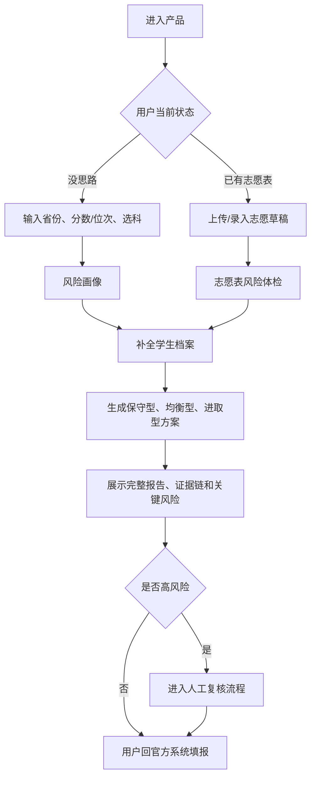
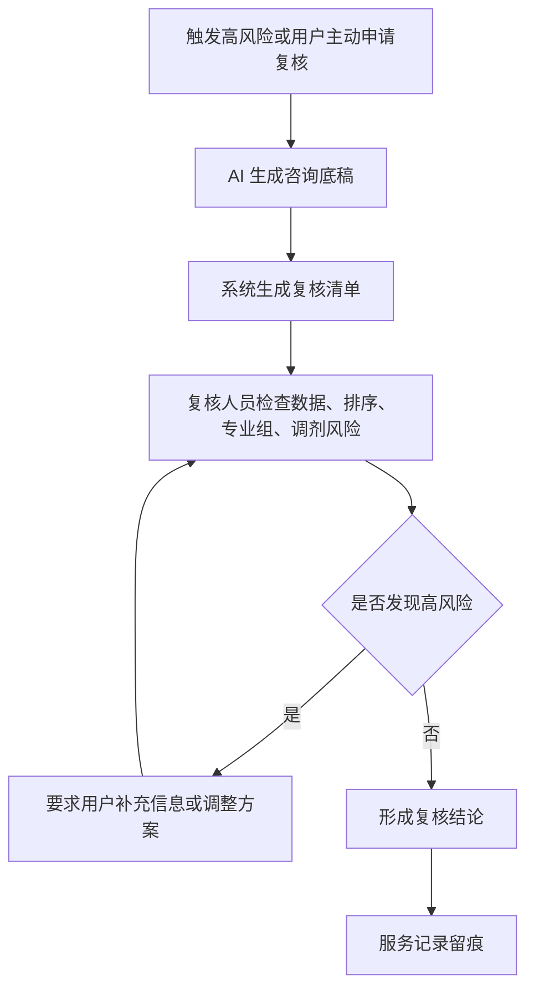
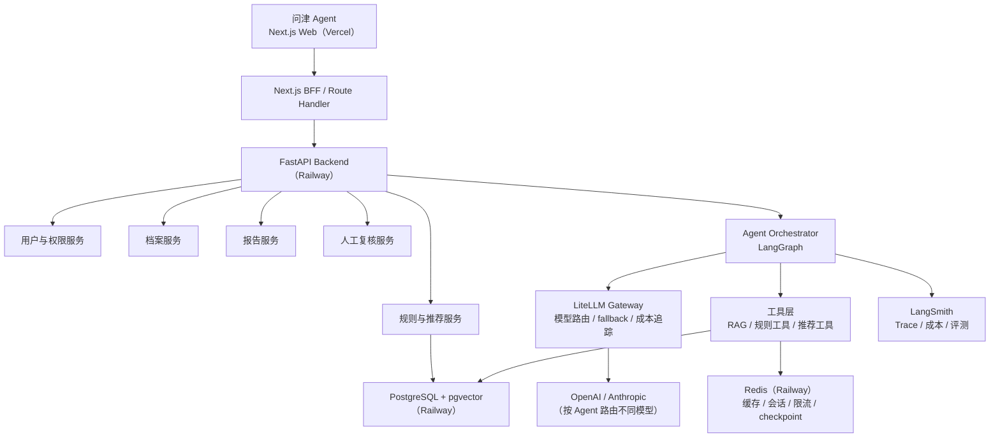

# 问津 Agent 产品总纲 PRD

版本：v0.7  
日期：2026-06-28  
产品形态：Next.js Web 应用  
后端框架：FastAPI + LangGraph  
当前版本策略：**所有功能免费使用，不做收费、套餐、订单、支付和付费解锁**

---

## Changelog

| 版本 | 日期       | 主要变更                                                                                                                                                |
| ---- | ---------- | ------------------------------------------------------------------------------------------------------------------------------------------------------- |
| v0.7 | 2026-06-28 | 完全移除家庭协同功能（含标注、冲突识别、会议议程）；删除 Section 9 家庭协同流程图；同步清理所有正文引用；人工复核流程去除家庭会议解释节点；章节重新编号 |
| v0.6 | 2026-06-28 | 同步后端 PRD 移除决策：家庭协同流程去除 Agent 冲突解释节点；验收标准去除报告版本；确定性边界表修正家庭协同实现方式；不做清单补充比较功能                |
| v0.5 | 2026-06-28 | 产品改名为问津 Agent，新增命名含义说明；去除 H5 / 微信内浏览器相关表述                                                                                  |
| v0.4 | 2026-06-28 | 首次拆分前后端 PRD；补充人工复核流程图；补充分阶段建设计划和首期验收标准                                                                                |

---

## 1. 文档结构

本项目的前端体验、后端 Agent、结构化数据和规则系统复杂度都较高，因此从 v0.4 开始拆分 PRD：

| 文档                                           | 说明                                                |
| ---------------------------------------------- | --------------------------------------------------- |
| [README.md](./README.md)                       | 产品总纲、业务定位、整体链路、MVP 范围              |
| [docs/frontend-prd.md](./docs/frontend-prd.md) | 前端页面、交互流程、组件、状态管理                  |
| [docs/backend-prd.md](./docs/backend-prd.md)   | 后端 API、数据模型、规则引擎、RAG、Agent 架构、评测 |

拆分原因：

- 前端 PRD 关注"用户怎么走完决策流程"，包括页面、表单、报告和移动端体验。
- 后端 PRD 关注"系统如何可靠地产生结论"，包括结构化数据、规则校验、Agent 编排、证据链和风控。
- 面试展示时，可以分别讲产品体验和工程架构，层次更清晰。

---

## 2. 产品定位

### 2.1 产品命名

产品名称：**问津 Agent**

"津"本为渡口，"问津"即探问前路方向。语出《论语》："长沮、桀溺耦而耕，孔子过之，使子路问津焉。"

志愿填报恰是人生中最重要的"渡口"之一——一次选择，影响城市、专业、职业和人生轨迹。问津 Agent 的使命，是在这个渡口前帮助家庭看清方向、辨别风险、做出更好的选择。

### 2.2 一句话定位

问津 Agent 是面向高考生和家长的 **AI 志愿决策助理 + 专家复核咨询平台**，通过考生建档、招生规则校验、冲稳保方案生成、志愿表风险体检和人工复核，帮助家庭形成可解释、可追溯、可复核的志愿填报方案。

### 2.3 项目目标

| 目标           | 说明                                                               | 对产品设计的要求                                                   |
| -------------- | ------------------------------------------------------------------ | ------------------------------------------------------------------ |
| Agent 项目经验 | 练习复杂业务中的 Agent 编排、工具调用、规则约束、Human-in-the-loop | 不能停留在普通聊天机器人，需要有真实任务流、状态流和质检机制       |
| 个人作品集     | 面向面试官展示技术深度、架构思考和业务理解                         | 需要清楚说明为什么需要 Agent、哪些部分不能交给 LLM、如何评测和风控 |
| 真实业务价值   | 帮助考生快速选择更适合自己的城市、大学和专业                       | 推荐必须绑定省份、年份、位次、专业组、规则和数据来源               |

### 2.4 当前版本商业策略

当前版本不做商业化收费，所有功能免费开放。

本阶段目标不是验证付费转化，而是验证：

- 用户是否愿意完整建档。
- 志愿表风险体检是否有真实使用价值。
- Agent 生成的报告是否足够可信、可解释。
- 规则引擎 + RAG + Agent 的架构是否能稳定处理复杂案例。
- 该项目是否能作为有业务深度的 Agent 作品集。

收费、套餐、订单、支付、发票、退款等能力全部移到未来版本，不进入当前 MVP。

---

## 3. 核心差异

本产品不是"又一个志愿填报聊天机器人"，而是"志愿填报决策系统"。

用户真正需要的不是 AI 随口推荐几所大学，而是：

- 可核验的数据来源和证据链。
- 省份、批次、位次、专业组、选科、体检、单科、学费等硬规则校验。
- 志愿表整体风险体检，而不是孤立看某一个学校。
- 高风险场景下的人工复核和服务留痕。
- 明确的合规边界：不承诺录取，不代替官方填报。

---

## 4. 产品原则

- 不承诺录取，不宣传内部数据，不使用"保录""必中""精准录取""包过""保上"等话术。
- AI 只做辅助决策，最终填报必须回到省级考试院官方系统。
- 所有关键推荐必须绑定证据链：数据源、年份、省份、批次、位次、院校专业组、规则命中。
- 高风险结论必须触发人工复核或显著提示，不能包装成确定性结论。
- 当前版本全部功能免费开放，不做付费墙。
- RAG 用于解释和补充证据，不替代结构化规则和确定性校验。

---

## 5. 不做清单

当前版本明确不做：

- 不做原生微信小程序。
- 不做全国所有省份一次性覆盖。
- 不做收费套餐、订单支付、会员权益、付费解锁。
- 不做官方填报系统代填。
- 不收集或保管用户官方考试院账号密码。
- 不承诺录取概率的精确性，不把模拟概率包装成真实预测。
- 不把向量库当作招生计划、投档线、位次表的唯一事实来源。
- 不做学校/专业/城市比较功能（Compare Service），移入 Phase 2。
- 不做家庭协同（标注、冲突识别、会议议程），移入 Phase 2。

---

## 6. 目标用户与场景

### 6.1 目标用户

| 用户         | 核心诉求                           | 产品价值                           |
| ------------ | ---------------------------------- | ---------------------------------- |
| 高考生       | 专业兴趣、城市体验、未来职业路径   | 让自己的偏好被结构化表达           |
| 家长         | 就业稳定、学校层次、风险控制、预算 | 降低滑档、退档、误报焦虑           |
| 信息弱势家庭 | 不懂规则、不懂专业、不懂城市产业   | 用免费工具获得结构化建议           |
| 中高分家庭   | 不想浪费分数，担心专业组和排序风险 | 获得位次、专业组、梯度和风险复核   |
| 本地升学顾问 | 提升咨询效率、报告质量和服务留痕   | 使用顾问工作台做复核演示和案例沉淀 |

### 6.2 用户分层

| 分层           | 核心问题                         | 产品重点                                 |
| -------------- | -------------------------------- | ---------------------------------------- |
| 低分段用户     | 怎样避免滑档，有没有稳妥学校     | 保底充足性、批次选择、民办/专科/地域取舍 |
| 中分段用户     | 城市、学校、专业如何取舍         | 多目标排序、专业风险解释                 |
| 高分段用户     | 如何不浪费分，如何降低专业组风险 | 位次精细比较、热门专业拥挤度、人工复核   |
| 已有志愿表用户 | 这张表有没有坑                   | 志愿表风险体检、梯度检查、禁忌专业命中   |

---

## 7. 三个核心入口

| 入口              | 适合用户                  | 首屏任务                                | 后续路径                             |
| ----------------- | ------------------------- | --------------------------------------- | ------------------------------------ |
| 我还没思路        | 刚出分，不知道怎么选      | 输入省份、分数/位次、选科，生成风险画像 | 补全建档 -> 三套方案 -> 报告         |
| 我已有志愿表      | 已经用 Excel/纸笔列了方案 | 上传或录入志愿表，做风险体检            | 查看详细体检 -> 替代方案 -> 人工复核 |
| 我想比较学校/专业 | 已有几个候选项            | Phase 2，当前版本暂不开放               | —                                    |

---

## 8. 主业务流程



---

## 9. 人工复核流程

当前版本的人工复核是免费流程，用于展示 Human-in-the-loop 设计和高风险报告处理方式。



---

## 10. MVP 范围

MVP 不追求全国完整覆盖，优先做窄而深的闭环。

建议首期选择：

- 1-2 个重点省份，例如河南、山东或广东。
- 1 种主流程，例如普通本科批。
- 1 套稳定数据链路：招生计划、历年投档线、一分一段表、院校专业组、选科要求。
- 3 个核心能力：建档、方案生成、志愿表风险体检。
- 1 个免费复核闭环：AI 报告 + 高风险人工复核。

### 10.1 分阶段建设

| 阶段    | 目标         | 范围                                                         |
| ------- | ------------ | ------------------------------------------------------------ |
| Phase 0 | 产品原型     | 模拟数据、本地推荐逻辑、完整演示闭环                         |
| Phase 1 | Web MVP      | Next.js 前端、FastAPI 基础服务、PostgreSQL、真实省份数据样本 |
| Phase 2 | 规则与报告   | 结构化规则引擎、风险体检、证据链                             |
| Phase 3 | Agent 深化   | LangGraph 编排、RAG、Reflection、SSE 进度、Trace             |
| Phase 4 | 复核与案例库 | 人工复核工作台、服务留痕、相似案例库                         |
| Phase 5 | 扩展         | 多省份数据、家庭协同、学校对比、自动更新校验                 |
| Future  | 商业化       | 如需商业化，再设计套餐、订单、支付、发票和退款               |

### 10.2 首期验收标准

- 用户能从两个入口（没思路 / 已有志愿表）开始使用。
- 用户能完成完整建档。
- 系统能生成三套冲稳保方案。
- 每个关键推荐能展示数据年份、省份、位次、专业组和来源。
- 用户能手动录入志愿表并看到风险体检结果。
- 高风险项能触发人工复核提示。
- 复核人员能看到 AI 底稿和复核清单。
- 全流程不出现收费、套餐、订单、支付或付费解锁。

---

## 11. 总体技术架构



---

## 12. 确定性系统与 Agent 边界

高考志愿是高风险决策，不能让 LLM 直接决定事实或规则。

| 能力                         | 推荐实现                 | 原因                      |
| ---------------------------- | ------------------------ | ------------------------- |
| 省份、批次、位次、选科匹配   | 结构化 SQL + 规则引擎    | 必须准确、可测试、可追溯  |
| 体检限制、单科限制、学费预算 | 规则引擎                 | 高风险约束，不能靠 LLM 猜 |
| 候选学校生成                 | 确定性服务               | 需要稳定复现              |
| 冲稳保分层                   | 算法 + 可配置阈值        | 便于评测和调参            |
| 风险体检                     | 规则引擎优先，Agent 解释 | 风险不能漏检              |
| 专业解释、城市解释           | RAG + Agent              | 适合自然语言解释          |
| 报告生成                     | 模板 + Agent             | 兼顾结构稳定和可读性      |
| 合规检查                     | 规则 + Reflection Agent  | 禁词和承诺必须强约束      |

核心流程：

```text
用户输入
-> Profile Resolver 档案补全
-> Data Resolver 数据版本锁定
-> Rule Engine 硬规则过滤
-> Candidate Generator 候选生成
-> Scoring Engine 排序打分
-> Risk Engine 风险体检
-> Agent Explainer 解释与报告生成
-> Compliance Checker 合规质检
-> Human Review 人工复核
```

---

## 13. 当前版本核心指标

当前版本不看付费转化，改看使用价值、报告质量和工程稳定性。

| 指标                 | MVP 目标 |
| -------------------- | -------: |
| 建档完成率           |     60%+ |
| 风险画像生成率       |     70%+ |
| 志愿表体检完成率     |     40%+ |
| 报告生成完成率       |     70%+ |
| 报告分享率           |     30%+ |
| 人工复核触发准确率   |     95%+ |
| RAG citation 覆盖率  |     95%+ |
| 硬规则误判率         |   < 0.5% |
| Agent 工具调用失败率 |     < 2% |
| 高风险漏检率         |   0 容忍 |
| 合规禁词漏检         |   0 容忍 |

---

## 14. 作品集展示重点

面试展示时，不应只强调"用了 LangGraph/RAG"，而要强调复杂业务中的工程判断。

推荐表达：

- 这个项目不是聊天机器人，而是高风险决策辅助系统。
- 结构化规则决定能不能报，Agent 负责解释为什么。
- RAG 不能替代招生计划、位次表和选科要求。
- 每份报告都绑定数据版本、证据链、Agent trace 和合规检查。
- 高风险结论进入 Human-in-the-loop，人工复核后交付。
- 评测集覆盖选科、体检、保底、梯度、禁忌专业和合规禁词。

---

## 15. 参考资料

- Next.js 官方文档：https://nextjs.org/docs
- React 官方文档：https://react.dev/
- FastAPI 官方文档：https://fastapi.tiangolo.com/
- LangChain RAG 官方文档：https://docs.langchain.com/oss/python/langchain/rag
- LangGraph Persistence 官方文档：https://docs.langchain.com/oss/python/langgraph/persistence
- LangGraph API Reference：https://reference.langchain.com/python/langgraph/overview
- LangGraph Human-in-the-loop / Interrupts：https://langchain-ai.github.io/langgraph/how-tos/human_in_the_loop/wait-user-input/
