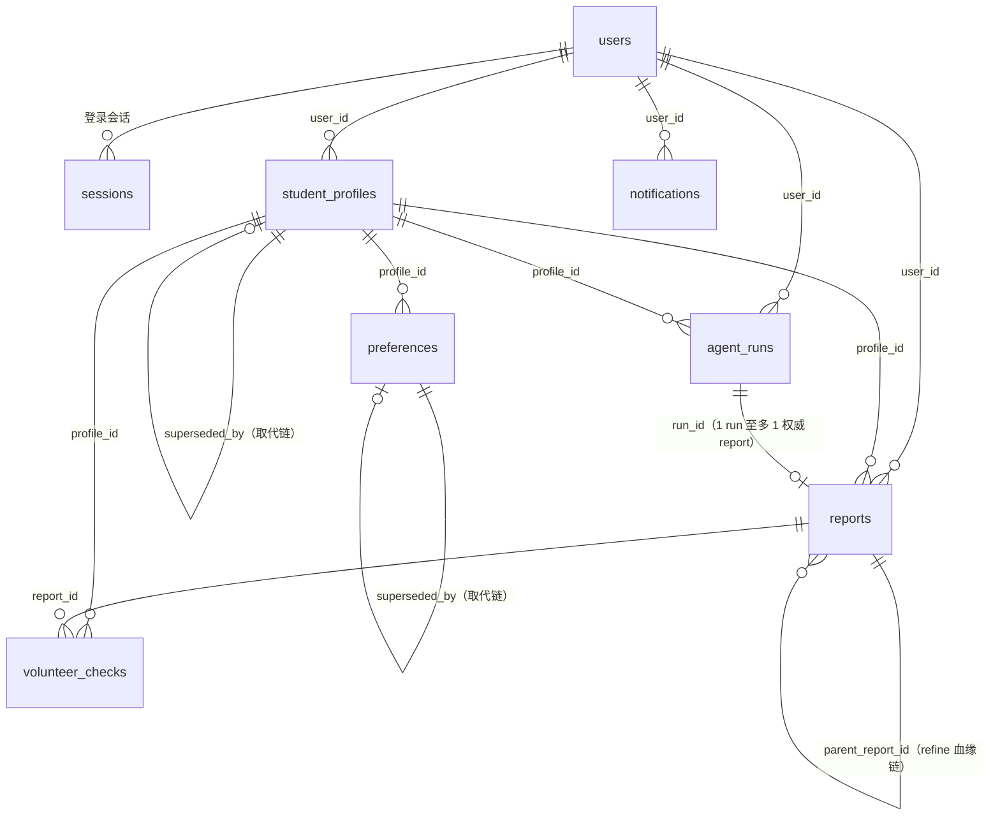
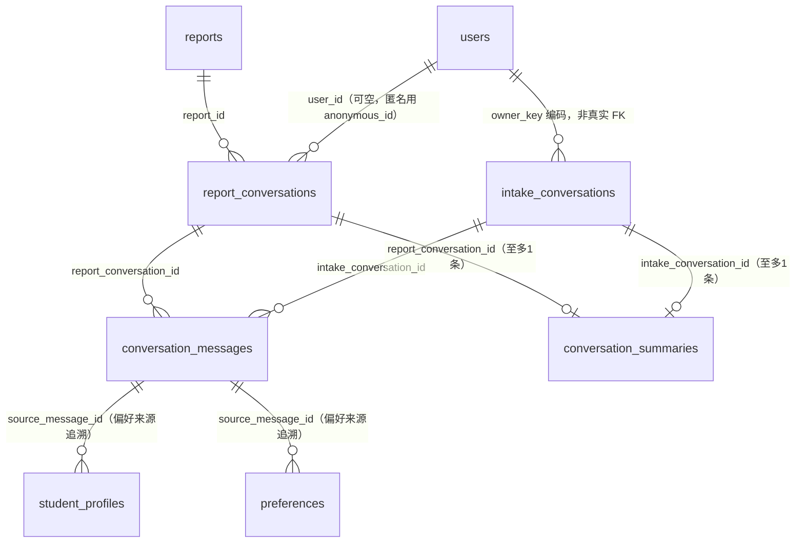
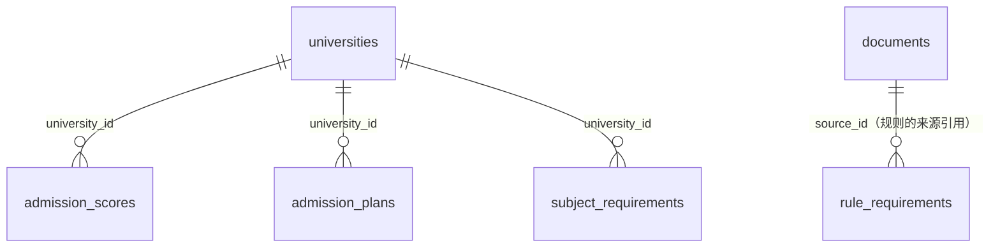
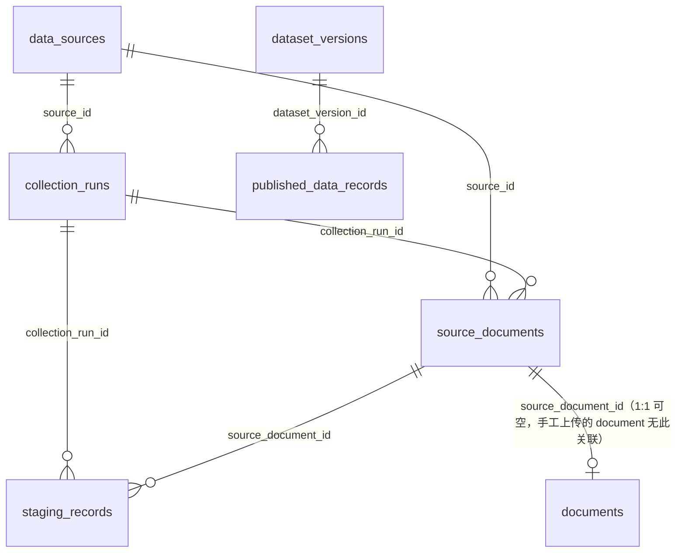
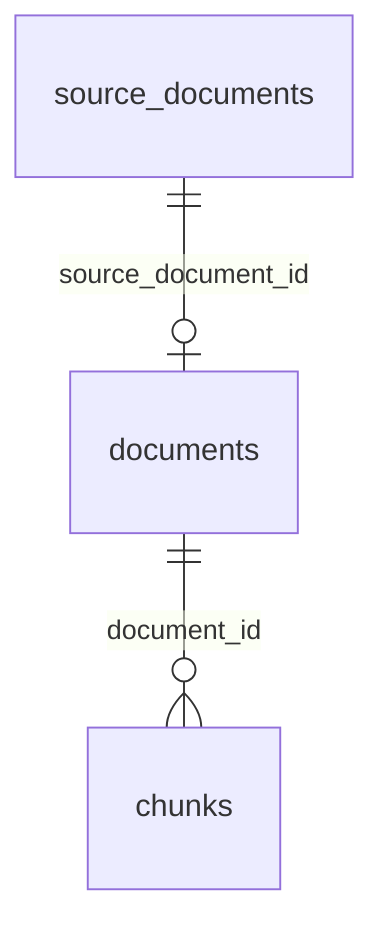

# 数据库表结构参考

本文档是**数据字典**：逐表列出字段含义与表间外键映射，供查库、写迁移、排查数据问题时查阅。
设计动机与取舍见 [`03_data_model.md`](../../../docs/03_data_model.md)；本文档只保证"当前 ORM 模型的字段/关系是什么"，
以 `backend/app/models/*.py` 为唯一真实来源（若与本文档冲突，以代码为准）。

---

## 0. 表总览（按业务模块分组）

| 模块 | 表名 | 一句话用途 |
| --- | --- | --- |
| 用户与鉴权 | `users` | 账号（邮箱+密码） |
| | `sessions`（ORM 类名 `AuthSession`） | 登录/匿名会话 |
| 学生档案 | `student_profiles` | 建档信息（分数/位次/选科/预算） |
| | `preferences` | 专业/城市偏好 |
| Agent 运行与报告 | `agent_runs` | 一次 LangGraph 执行的元数据 |
| | `reports` | 生成的志愿方案报告 |
| | `volunteer_checks` | 志愿表风险体检结果 |
| 对话与记忆 | `report_conversations` | 报告问答会话身份 |
| | `intake_conversations` | 建档前聊天会话身份 |
| | `conversation_messages` | 两种会话共用的逐条消息 |
| | `conversation_summaries` | 两种会话共用的结构化增量摘要 |
| 招生数据（规则引擎只读） | `universities` | 院校基本信息 |
| | `admission_scores` | 历年投档分数线/位次 |
| | `admission_plans` | 招生计划（名额/学费） |
| | `rank_segments` | 分数→全省累计位次换算表 |
| | `subject_requirements` | 选科/体检限制 |
| | `rule_requirements` | 通用规则 + 来源引用 |
| | `province_thresholds` | 冲稳保位次阈值 + 志愿数上限配置 |
| 数据采集流水线（离线，产出上面的招生数据） | `data_sources` | 数据源注册表 |
| | `collection_runs` | 一次采集任务的执行记录 |
| | `source_documents` | 采集到的原始文件 |
| | `staging_records` | 解析后待校验的中间记录 |
| | `dataset_versions` | 发布批次（版本号） |
| | `published_data_records` | 已发布、带溯源的正式数据 |
| RAG 文档 | `documents` | 供检索的文档（政策/简章/专业介绍等） |
| | `chunks` | 文档切片 + 向量 |
| 通知与可观测性 | `notifications` | 站内通知 |
| | `prompt_invocations` | Prompt 调用审计（不存用户原文） |

**非业务表（不在本文档范围）**：`checkpoints` / `checkpoint_blobs` / `checkpoint_writes` 由 LangGraph 自动创建管理，不通过 Alembic 维护，见 `CLAUDE.md`「数据模型要点」。

---

## 1. 表间关系图

### 1.1 核心业务链路：建档 → 生成报告 → 风险体检

### 1.2 对话与记忆：report_conversations / intake_conversations 共用消息表

> `conversation_messages`/`conversation_summaries` 用 `CHECK` 约束保证 `report_conversation_id`/`intake_conversation_id` 恰好一个非空——两条会话线复用同一张物理表，而不是各建一张平行表。

### 1.3 招生数据（规则引擎只读）

> `admission_scores`/`admission_plans`/`rank_segments`/`province_thresholds` 彼此之间**没有外键**，靠业务代码按 `(province, year[, batch, subject_type])` 组合键联合查询，见 `app/engine/scoring.py`、`app/engine/thresholds.py`。

### 1.4 数据采集流水线（离线，产出招生数据/RAG 文档）

> `staging_records` → `published_data_records` 之间**没有外键**：`staging_records.review_status` 通过人工/规则校验后，由发布脚本（如 `backend/scripts/publish_jiangsu_admission_plans.py`）读取校验通过的记录、生成新的 `published_data_records` 行，`provenance_json` 里记录来源而不是靠 FK 约束。

### 1.5 RAG 文档与向量

---

## 2. 字段字典

### 2.1 用户与鉴权

#### `users`

| 字段 | 类型 | 可空 | 说明 |
| --- | --- | --- | --- |
| `id` | string(36) PK | 否 | UUID |
| `email` | string(254) | 是 | 登录邮箱，唯一约束 |
| `password_hash` | string(256) | 是 | 密码哈希 |
| `email_verified` | bool | 否 | 是否已通过验证码校验邮箱 |
| `openid` | string(128) | 是 | 唯一约束；Phase 2 微信 OAuth 预留字段，当前无写入路径 |
| `role` | string(20) | 否 | `user` / `admin`，默认 `user` |
| `created_at` | timestamptz | 否 | |

#### `sessions`（ORM 类名 `AuthSession`，勿与 SQLAlchemy `Session` 混淆）

| 字段 | 类型 | 可空 | 说明 |
| --- | --- | --- | --- |
| `id` | string(36) PK | 否 | |
| `user_id` | FK → `users.id` | 是 | 登录用户的会话；匿名会话下为空 |
| `anonymous_id` | string(36) | 是 | 匿名会话标识，登录用户下为空 |
| `expires_at` | timestamptz | 否 | 会话过期时间 |
| `created_at` | timestamptz | 否 | |

---

### 2.2 学生档案与偏好

`student_profiles` / `preferences` 共用同一组"来源与状态"字段（`_ProvenanceMixin`，迁移 `017`）：

| 字段 | 类型 | 可空 | 说明 |
| --- | --- | --- | --- |
| `source_type` | string(20) | 否 | `user_explicit`（表单/聊天里明确填写，当前唯一写入路径）/ `model_inferred`（AI 从对话推断，字段已预留但无写入逻辑），默认 `user_explicit` |
| `confidence` | float | 是 | 仅 `model_inferred` 有意义，`user_explicit` 恒为 `NULL` |
| `status` | string(20) | 否 | `confirmed` / `proposed` / `rejected` / `superseded`，默认 `confirmed` |
| `last_confirmed_at` | timestamptz | 是 | 最后一次被确认的时间 |
| `source_message_id` | FK → `conversation_messages.id`（`ON DELETE SET NULL`） | 是 | 来源于某条聊天消息时指向该行；表单提交场景恒为空 |
| `superseded_by` | FK → 自身表主键（`ON DELETE SET NULL`） | 是 | 指向取代自己的新记录，构成取代链而非直接覆盖旧值 |
| `superseded_at` | timestamptz | 是 | 被取代的时间 |

#### `student_profiles`

| 字段 | 类型 | 可空 | 说明 |
| --- | --- | --- | --- |
| `id` | string(36) PK | 否 | |
| `user_id` | FK → `users.id` | 是 | 登录用户；建档尚未绑定账号时为空 |
| `anonymous_id` | string(36) | 是 | 匿名建档阶段的草稿归属；登录/注册后由 `auth.py::_bind_anonymous_data` 批量改写为 `user_id` |
| `province` | string(50) | 否 | 高考所在省份 |
| `score` | int | 是 | 高考分数 |
| `rank` | int | 是 | 全省位次 |
| `subjects` | JSON list | 是 | 选科，例如 `["物理","化学"]` |
| `batch` | string(50) | 否 | 本科批 / 专科批 / 提前批，默认 `本科批` |
| `family_budget` | int | 是 | 年度学费预算（元） |
| `risk_style` | string(20) | 是 | `conservative` / `balanced` / `aggressive` |
| `completeness_score` | float | 否 | 建档信息完整度 0-100，默认 0 |
| `created_at` / `updated_at` | timestamptz | 否 | |

（以上外加 §2.2 顶部的 `_ProvenanceMixin` 7 个字段）

#### `preferences`

| 字段 | 类型 | 可空 | 说明 |
| --- | --- | --- | --- |
| `id` | string(36) PK | 否 | |
| `profile_id` | FK → `student_profiles.id` | 否 | |
| `major_prefs` | JSON list | 是 | 专业偏好 |
| `city_prefs` | JSON list | 是 | 城市偏好 |
| `rejected_majors` | JSON list | 是 | 禁忌专业 |
| `career_priority` | string(100) | 是 | 职业倾向，如 `tech` / `business` / `medical` |
| `created_at` / `updated_at` | timestamptz | 否 | |

（以上外加 `_ProvenanceMixin` 7 个字段）

---

### 2.3 Agent 运行与报告

#### `agent_runs`

| 字段 | 类型 | 可空 | 说明 |
| --- | --- | --- | --- |
| `id` | string(36) PK | 否 | |
| `thread_id` | string(36)，唯一 | 否 | LangGraph checkpoint 用的线程 ID，同时是幂等键 |
| `user_id` | FK → `users.id` | 是 | |
| `anonymous_id` | string(36) | 是 | 匿名会话发起的 run，用于把产出的 `Report` 正确归属 |
| `profile_id` | FK → `student_profiles.id` | 是 | |
| `task_type` | string(50) | 否 | `generate_report` / `check_volunteer` |
| `status` | string(20) | 否 | `queued` / `running` / `interrupted` / `completed` / `failed` / `timeout`，默认 `queued` |
| `cost_tokens` | int | 否 | 默认 0 |
| `cost_usd` | float | 否 | 默认 0.0 |
| `trace_url` | string(500) | 是 | LangSmith Trace URL |
| `error_msg` | text | 是 | |
| `debug_summary_json` | JSONB | 是 | `{node_timings, tool_call_summary, state_summary, cost_breakdown}`，供 Admin Debug Console 使用 |
| `duration_seconds` | float | 是 | 完成时写入的实际耗时 |
| `created_at` | timestamptz | 否 | |
| `completed_at` | timestamptz | 是 | |

#### `reports`

| 字段 | 类型 | 可空 | 说明 |
| --- | --- | --- | --- |
| `id` | string(36) PK | 否 | |
| `profile_id` | FK → `student_profiles.id` | 是 | |
| `user_id` | FK → `users.id` | 是 | |
| `anonymous_id` | string(36) | 是 | 匿名建档阶段生成报告的归属，登录后绑定到 `user_id` |
| `run_id` | FK → `agent_runs.id`，唯一 | 是 | 一个 `run_id` 只对应一份权威报告；reflection 重试循环内多次执行 report 节点按 `run_id` upsert 同一行 |
| `status` | string(20) | 否 | `generating` / `completed` / `failed`，默认 `generating` |
| `risk_level` | string(20) | 是 | `low` / `medium` / `high` |
| `risk_score` | float | 是 | |
| `plan_json` | JSON dict | 是 | 冲稳保三档结构化方案（`conservative`/`balanced`/`aggressive`） |
| `evidence_json` | JSON list | 是 | 直接内嵌的证据链，20-50 条量级 |
| `dataset_version` | string(100) | 是 | 生成该报告时使用的数据集版本 |
| `version` | int | 否 | 默认 1；同一血缘链内从 1 递增 |
| `parent_report_id` | FK → `reports.id` | 是 | `/refine` 产出新版本时指向被 refine 的报告 |
| `run_summary_json` | JSONB | 是 | 用户可见的生成过程摘要，供报告页"决策过程回放"只读展示 |
| `created_at` | timestamptz | 否 | |
| `deleted_at` | timestamptz | 是 | 软删除 |

#### `volunteer_checks`

| 字段 | 类型 | 可空 | 说明 |
| --- | --- | --- | --- |
| `id` | string(36) PK | 否 | |
| `profile_id` | FK → `student_profiles.id` | 是 | |
| `report_id` | FK → `reports.id` | 是 | |
| `risk_items_json` | JSON list | 是 | 风险条目列表 |
| `overall_risk_level` | string(20) | 是 | `low` / `medium` / `high` |
| `status` | string(20) | 否 | `pending` / `completed`，默认 `pending` |
| `created_at` | timestamptz | 否 | |

---

### 2.4 对话与记忆

#### `report_conversations`（报告问答会话身份，消息本体不在这张表）

| 字段 | 类型 | 可空 | 说明 |
| --- | --- | --- | --- |
| `id` | string(36) PK | 否 | |
| `report_id` | FK → `reports.id`（`ON DELETE CASCADE`） | 否 | |
| `user_id` | FK → `users.id`（`ON DELETE SET NULL`） | 是 | |
| `anonymous_id` | string(36) | 是 | 匿名会话标识；避免所有匿名用户共享 `user_id IS NULL` 导致互相读到对方问答历史 |
| `version` | int | 否 | 默认 0；乐观锁列（`version_id_col`），并发 `get_or_create` 冲突时 SQLAlchemy 抛 `StaleDataError`，调用方重试 |
| `created_at` / `updated_at` | timestamptz | 否 | |

#### `intake_conversations`（建档前聊天会话身份）

| 字段 | 类型 | 可空 | 说明 |
| --- | --- | --- | --- |
| `id` | string(36) PK | 否 | 即会话/thread id |
| `owner_key` | string(48) | 否 | 登录用户是 `user_id`（36 位）；匿名会话是 `"anon:" + 36 位 uuid`（41 字符）；**非唯一**，一个 owner 可有多条会话 |
| `title` | string(100) | 是 | 首条消息截断生成，之后可能被 LLM 摘要或用户重命名覆盖，`NULL` 表示尚未产生过消息 |
| `version` | int | 否 | 乐观锁，同 `report_conversations` |
| `created_at` / `updated_at` | timestamptz | 否 | |
| `deleted_at` | timestamptz | 是 | 软删除；删除后传其 id 发消息会 404 |

#### `conversation_messages`（两种会话共用的逐条消息，追加式存储）

| 字段 | 类型 | 可空 | 说明 |
| --- | --- | --- | --- |
| `id` | string(36) PK | 否 | |
| `report_conversation_id` | FK → `report_conversations.id`（CASCADE） | 是 | 与 `intake_conversation_id` 二选一（CHECK 约束） |
| `intake_conversation_id` | FK → `intake_conversations.id`（CASCADE） | 是 | 同上 |
| `seq` | int | 否 | 同一会话内递增序号 |
| `role` | string(20) | 否 | |
| `content` | text | 否 | |
| `citations` | JSONB | 是 | 仅 `report_conversation` 侧消息使用，`intake` 侧恒为空 |
| `created_at` | timestamptz | 否 | |

唯一约束：`(report_conversation_id, seq)`、`(intake_conversation_id, seq)`（Postgres 中 `NULL` 互不冲突，两条约束分别只对自己类型的行生效）。

#### `conversation_summaries`（两种会话共用的结构化增量摘要，每个会话至多一条）

| 字段 | 类型 | 可空 | 说明 |
| --- | --- | --- | --- |
| `id` | string(36) PK | 否 | |
| `report_conversation_id` / `intake_conversation_id` | FK（CASCADE） | 是 | 二选一，同上 CHECK 约束 |
| `summary_json` | JSONB | 否 | `{confirmed_facts, preferences, rejected_options, previous_decisions, open_questions}` 五个字符串数组字段，不是自然语言摘要 |
| `covered_through_seq` | int | 否 | 默认 0；摘要覆盖到哪条消息 `seq` 为止，Agent 拼接"摘要 + seq > 此值的原文"作为完整上下文 |
| `summary_version` | int | 否 | 默认 1 |
| `source_model` | string(50) | 否 | 生成摘要用的模型标识 |
| `prompt_version` | string(20) | 否 | |
| `tokens_before` / `tokens_after` | int | 是 | |
| `status` | string(20) | 否 | `ready` / `failed`，默认 `ready`；`failed` 时 `summary_json` 仍是上一次成功内容 |
| `created_at` / `updated_at` | timestamptz | 否 | |

---

### 2.5 招生数据（规则引擎只读数据源）

#### `universities`

| 字段 | 类型 | 可空 | 说明 |
| --- | --- | --- | --- |
| `id` | string(36) PK | 否 | |
| `name` | string(200) | 否 | |
| `code` | string(20) | 是 | 教育部院校代码 |
| `city` / `province` | string(50) | 是 | 学校所在城市/省份 |
| `school_type` | string(50) | 是 | 综合/理工/师范/医科/财经/农业/军事 |
| `is_985` / `is_211` / `is_shuangyiliu` | bool | 否 | 默认 `False` |
| `has_medical_program` | bool | 否 | 默认 `False` |
| `annual_tuition_min` / `annual_tuition_max` | int | 是 | 元/年 |

#### `admission_scores`（历年投档分数线，按年/省份/批次/科类）

| 字段 | 类型 | 可空 | 说明 |
| --- | --- | --- | --- |
| `id` | string(36) PK | 否 | |
| `university_id` | FK → `universities.id`（CASCADE） | 否 | |
| `year` | int | 否 | |
| `province` | string(50) | 否 | 招生省份 |
| `batch` | string(50) | 否 | 本科批/专科批/提前批 |
| `subject_type` | string(20) | 否 | `physics` / `history` |
| `major_category` | string(100) | 是 | 专业大类，`NULL` 表示全校口径 |
| `min_score` / `avg_score` / `max_score` | int | 是 | |
| `min_rank` / `avg_rank` | int | 是 | `min_rank` 是冲稳保分层的主要排序依据 |
| `enrollment_count` | int | 是 | |

#### `admission_plans`（招生计划：名额与学费，区别于上面的历年投档线）

| 字段 | 类型 | 可空 | 说明 |
| --- | --- | --- | --- |
| `id` | string(36) PK | 否 | |
| `year` / `province` / `batch` | — | 否 | |
| `university_id` | FK → `universities.id`（CASCADE） | 否 | |
| `major_group` | string(100) | 是 | 只有省考试院正式招生计划文件才带 |
| `major_code` | string(50) | 是 | 同上 |
| `major_name` | string(200) | 是 | `major_code`/`major_group` 缺失时（如本校招生网自采数据），靠 `major_name + subject_type` 区分同校同批次下的不同专业——同一专业名称完全可能物理类/历史类各招一次、计划数不同（迁移 `020` 新增） |
| `subject_type` | string(20) | 是 | |
| `quota` | int | 是 | 招生名额 |
| `subjects` | JSON list | 是 | 选科要求 |
| `tuition` | int | 是 | 学费 |
| `dataset_version` | string(100) | 是 | |
| `created_at` | timestamptz | 否 | |

#### `rank_segments`（分数 → 全省累计位次换算表）

| 字段 | 类型 | 可空 | 说明 |
| --- | --- | --- | --- |
| `id` | string(36) PK | 否 | |
| `year` / `province` / `subject_type` | — | 否 | |
| `score` | int | 否 | |
| `cumulative_rank` | int | 否 | 该分数对应的全省累计位次 |

唯一索引：`(province, year, subject_type, score)`。

#### `subject_requirements`（选科/体检限制）

| 字段 | 类型 | 可空 | 说明 |
| --- | --- | --- | --- |
| `id` | string(36) PK | 否 | |
| `university_id` | FK → `universities.id`（CASCADE） | 否 | |
| `major_name` | string(200) | 否 | |
| `required_subjects` | JSON list | 是 | 必选科目，如 `["物理"]`；空列表表示不限 |
| `optional_subjects` | JSON list | 是 | 可选科目池 |
| `optional_required_count` | int | 否 | 默认 0；需从 `optional_subjects` 中至少选 N 门 |
| `restricted_subjects` | JSON list | 是 | 选了该科目则不可报（极少见） |
| `medical_restrictions` | JSON dict | 是 | 体检限制，如 `{"color_blind": "不招", "height_min": 155}` |

#### `rule_requirements`（通用规则 + 来源引用，可追溯配置）

| 字段 | 类型 | 可空 | 说明 |
| --- | --- | --- | --- |
| `id` | string(36) PK | 否 | |
| `type` | string(50) | 否 | 规则类型（选科/体检/批次等） |
| `province` / `year` | — | 是 | |
| `target_id` | string(36) | 是 | 关联对象 id；**未声明 FK 约束**，按 `type` 多态指向不同表 |
| `rule_json` | JSON dict | 是 | |
| `source_id` | FK → `documents.id` | 是 | 该规则的来源文档 |
| `created_at` | timestamptz | 否 | |

#### `province_thresholds`（冲稳保位次阈值 + 志愿数上限，替代代码内硬编码）

| 字段 | 类型 | 可空 | 默认值 | 说明 |
| --- | --- | --- | --- | --- |
| `id` | string(36) PK | 否 | | |
| `province` / `year` | — | 否 | | 联合唯一约束 |
| `high_rush_rank_gap` | int | 否 | 5000 | "高冲"判定边界 |
| `rush_rank_gap_min` | int | 否 | 1000 | "冲"判定边界 |
| `rush_rank_gap_max` | int | 否 | 5000 | 当前冲稳保分层逻辑**未使用**此列 |
| `target_rank_gap` | int | 否 | 1000 | 当前冲稳保分层逻辑**未使用**此列 |
| `safe_rank_gap` | int | 否 | 2000 | "保"判定边界 |
| `max_volunteers` | int | 否 | 96 | 该省志愿表最大条数，前端 `/api/v1/data/availability` 读取，**不能硬编码 30** |

**分层判定的实际用法**（`app/engine/scoring.py::assign_tier`）：`rank_gap = 历史投档位次均值 − 学生位次`（正值代表学生位次优于历史均值，越正越"保"；负值越大越需要"冲"）。判定只消费三条边界：`rank_gap < -high_rush_rank_gap` → `high_rush`；`< -rush_rank_gap_min` → `rush`；`<= safe_rank_gap` → `target`；否则 `safe`。`rush_rank_gap_max`/`target_rank_gap` 两列目前**只存在于表结构里，未被判定逻辑读取**——如果要在 `03_data_model.md` 的历史设计草稿基础上核对，请以这里列出的代码实际行为为准。

---

### 2.6 数据采集流水线（离线，产出上面的招生数据/RAG 文档）

#### `data_sources`（数据源注册表）

| 字段 | 类型 | 可空 | 说明 |
| --- | --- | --- | --- |
| `id` | string(100) PK | 否 | 人工可读 ID（非 UUID） |
| `name` | string(200) | 否 | |
| `entry_url` | string(1000) | 否 | 采集入口 URL |
| `data_type` | string(50) | 否 | |
| `year` | int | 是 | |
| `target_university_code` | string(20) | 是 | |
| `collection_method` | string(30) | 否 | 采集方式（爬虫/人工/API 等） |
| `parser` | string(100) | 否 | 解析器标识 |
| `update_frequency` | string(50) | 否 | |
| `authority_level` | string(30) | 否 | |
| `enabled` | bool | 否 | 默认 `True` |
| `last_success_at` | timestamptz | 是 | |
| `last_checksum` | string(64) | 是 | |
| `created_at` / `updated_at` | timestamptz | 否 | |

#### `collection_runs`（一次采集任务的执行记录）

| 字段 | 类型 | 可空 | 说明 |
| --- | --- | --- | --- |
| `id` | string(36) PK | 否 | |
| `source_id` | FK → `data_sources.id` | 否 | |
| `status` | string(30) | 否 | 默认 `running` |
| `started_at` / `finished_at` | timestamptz | 否/是 | |
| `artifact_count` / `parsed_count` / `valid_count` / `review_count` / `rejected_count` | int | 否 | 各阶段计数，默认 0 |
| `error_message` | text | 是 | |

#### `source_documents`（采集到的原始文件）

| 字段 | 类型 | 可空 | 说明 |
| --- | --- | --- | --- |
| `id` | string(36) PK | 否 | |
| `source_id` | FK → `data_sources.id` | 否 | |
| `collection_run_id` | FK → `collection_runs.id` | 否 | |
| `source_url` | string(1000) | 否 | |
| `title` | string(500) | 否 | |
| `checksum` | string(64) | 否 | 用于同一 `source_id` 下去重 |
| `storage_path` | string(1000) | 否 | |
| `content_type` | string(200) | 是 | |
| `size_bytes` | int | 否 | |
| `status` | string(30) | 否 | 默认 `raw` |
| `collected_at` | timestamptz | 否 | |

唯一约束：`(source_id, checksum)`。

#### `staging_records`（解析后待校验的中间记录）

| 字段 | 类型 | 可空 | 说明 |
| --- | --- | --- | --- |
| `id` | string(36) PK | 否 | |
| `source_document_id` | FK → `source_documents.id` | 否 | |
| `collection_run_id` | FK → `collection_runs.id` | 否 | |
| `record_type` | string(80) | 否 | |
| `natural_key` | string(64) | 否 | 业务自然键，用于同一文档内去重 |
| `review_status` | string(30) | 否 | 校验状态 |
| `payload_json` | JSON dict | 否 | 解析出的结构化数据 |
| `issues_json` | JSON list | 是 | 校验发现的问题 |
| `reviewed_by` / `reviewed_at` | — | 是 | |
| `created_at` | timestamptz | 否 | |

唯一约束：`(source_document_id, natural_key)`。

#### `dataset_versions`（发布批次）

| 字段 | 类型 | 可空 | 说明 |
| --- | --- | --- | --- |
| `id` | string(36) PK | 否 | |
| `name` | string(150)，唯一 | 否 | 如 `henan_2026_v1` |
| `dataset_type` / `province` / `year` / `version` | — | 否 | 联合唯一约束 `(dataset_type, province, year, version)` |
| `status` | string(30) | 否 | 默认 `draft` |
| `record_count` | int | 否 | 默认 0 |
| `manifest_json` | JSON dict | 是 | |
| `created_at` | timestamptz | 否 | |
| `published_at` | timestamptz | 是 | |

#### `published_data_records`（已发布、带溯源的正式数据）

| 字段 | 类型 | 可空 | 说明 |
| --- | --- | --- | --- |
| `id` | string(36) PK | 否 | |
| `dataset_version_id` | FK → `dataset_versions.id` | 否 | |
| `record_type` | string(80) | 否 | |
| `natural_key` | string(64) | 否 | |
| `province` / `year` | — | 否 | |
| `subject_type` / `batch` | — | 是 | |
| `university_code` / `major_group_code` / `major_code` | — | 是 | |
| `payload_json` | JSON dict | 否 | 正式数据本体 |
| `provenance_json` | JSON dict | 否 | 溯源信息（来源文档/采集时间等），替代显式 FK 到 `staging_records` |
| `created_at` | timestamptz | 否 | |

唯一约束：`(dataset_version_id, natural_key)`。

> `backend/scripts/publish_jiangsu_admission_plans.py`、`publish_jiangsu_rank_segments.py` 负责把校验通过的 `staging_records`/`published_data_records` 落到 `admission_plans`/`rank_segments` 等业务表——这一步是脚本里的批量写入，不是数据库层的外键或触发器。

---

### 2.7 RAG 文档与切片

#### `documents`

| 字段 | 类型 | 可空 | 说明 |
| --- | --- | --- | --- |
| `id` | string(36) PK | 否 | |
| `type` | string(50) | 否 | `admission_plan` / `admission_score` / `rank_segment` / `charter` / `major_intro` / `employment_report` / `policy` |
| `title` | string(500) | 否 | |
| `source_url` | string(1000) | 是 | |
| `year` | int | 是 | |
| `authority_level` | string(30) | 是 | `official` / `semi-official` / `third-party` / `internal` |
| `checksum` | string(64) | 是 | 文件内容 SHA256，用于去重 |
| `source_document_id` | FK → `source_documents.id`，唯一 | 是 | 关联采集流水线的原始文件；手工上传的文档无此关联 |
| `raw_storage_path` | string(1000) | 是 | |
| `status` | string(20) | 否 | `raw` / `parsed` / `verified` / `published` / `deprecated`，默认 `raw` |
| `created_at` | timestamptz | 否 | |
| `deleted_at` | timestamptz | 是 | 软删除 |

#### `chunks`

| 字段 | 类型 | 可空 | 说明 |
| --- | --- | --- | --- |
| `id` | string(36) PK | 否 | |
| `document_id` | FK → `documents.id` | 否 | |
| `content` | text | 否 | |
| `embedding` | `vector(1536)`（pgvector） | 是 | |
| `embedding_model` | string(100) | 是 | 生成该向量所用的模型标识，如 `text-embedding-3-small`；切换 embedding 模型时用于按模型过滤，见 `CLAUDE.md`「Embedding 模型一致性」 |
| `metadata_json` | JSON dict | 是 | 省份/年份/`university_id`/`major_id`/`page_num` 等过滤字段 |
| `created_at` | timestamptz | 否 | |

---

### 2.8 通知与可观测性

#### `notifications`

| 字段 | 类型 | 可空 | 说明 |
| --- | --- | --- | --- |
| `id` | string(36) PK | 否 | |
| `user_id` | FK → `users.id`（CASCADE） | 否 | |
| `type` | string(50) | 否 | 如 `review_completed` / `run_failed` |
| `payload_json` | JSONB | 是 | |
| `read_at` | timestamptz | 是 | |
| `created_at` | timestamptz | 否 | |

#### `prompt_invocations`

| 字段 | 类型 | 可空 | 说明 |
| --- | --- | --- | --- |
| `id` | string(36) PK | 否 | |
| `prompt_name` | string(100)，索引 | 否 | |
| `prompt_version` | string(20) | 否 | |
| `prompt_hash` | string(80) | 否 | |
| `model_alias` | string(100) | 否 | LiteLLM 虚拟模型名 |
| `status` | string(20)，索引 | 否 | |
| `latency_ms` | int | 否 | |
| `error_type` | string(100) | 是 | |
| `context_json` | JSONB | 是 | best-effort 审计，**不保存用户原文和动态上下文** |
| `created_at` | timestamptz，索引 | 否 | |

---

## 3. 外键关系一览表

| 子表.字段 | → 父表.字段 | ON DELETE | 含义 |
| --- | --- | --- | --- |
| `sessions.user_id` | `users.id` | — | 登录会话归属 |
| `student_profiles.user_id` | `users.id` | — | 建档用户 |
| `student_profiles.source_message_id` | `conversation_messages.id` | SET NULL | 偏好来源消息 |
| `student_profiles.superseded_by` | `student_profiles.id` | SET NULL | 取代链（自引用） |
| `preferences.profile_id` | `student_profiles.id` | — | |
| `preferences.source_message_id` | `conversation_messages.id` | SET NULL | |
| `preferences.superseded_by` | `preferences.id` | SET NULL | 取代链（自引用） |
| `agent_runs.user_id` | `users.id` | — | |
| `agent_runs.profile_id` | `student_profiles.id` | — | |
| `reports.profile_id` | `student_profiles.id` | — | |
| `reports.user_id` | `users.id` | — | |
| `reports.run_id` | `agent_runs.id` | — | 唯一，1 run ↔ 至多 1 权威 report |
| `reports.parent_report_id` | `reports.id` | — | refine 血缘链（自引用） |
| `volunteer_checks.profile_id` | `student_profiles.id` | — | |
| `volunteer_checks.report_id` | `reports.id` | — | |
| `report_conversations.report_id` | `reports.id` | CASCADE | |
| `report_conversations.user_id` | `users.id` | SET NULL | |
| `conversation_messages.report_conversation_id` | `report_conversations.id` | CASCADE | 与 `intake_conversation_id` 二选一 |
| `conversation_messages.intake_conversation_id` | `intake_conversations.id` | CASCADE | 同上 |
| `conversation_summaries.report_conversation_id` | `report_conversations.id` | CASCADE | 二选一 |
| `conversation_summaries.intake_conversation_id` | `intake_conversations.id` | CASCADE | 同上 |
| `admission_scores.university_id` | `universities.id` | CASCADE | |
| `admission_plans.university_id` | `universities.id` | CASCADE | |
| `subject_requirements.university_id` | `universities.id` | CASCADE | |
| `rule_requirements.source_id` | `documents.id` | — | |
| `collection_runs.source_id` | `data_sources.id` | — | |
| `source_documents.source_id` | `data_sources.id` | — | |
| `source_documents.collection_run_id` | `collection_runs.id` | — | |
| `staging_records.source_document_id` | `source_documents.id` | — | |
| `staging_records.collection_run_id` | `collection_runs.id` | — | |
| `published_data_records.dataset_version_id` | `dataset_versions.id` | — | |
| `documents.source_document_id` | `source_documents.id` | — | 唯一，1:1 可空 |
| `chunks.document_id` | `documents.id` | — | |
| `notifications.user_id` | `users.id` | CASCADE | |

**未声明 FK 约束但存在逻辑关联的字段**（供排查数据一致性时留意，不受数据库约束保护）：

| 字段 | 逻辑指向 | 为什么没建 FK |
| --- | --- | --- |
| `rule_requirements.target_id` | 按 `type` 多态指向不同表 | 多态外键无法用单一 FK 约束表达 |
| `intake_conversations.owner_key` | `users.id` 或 `"anon:" + anonymous_id` | 复合语义字段，两种取值分别对应不同"父表" |
| `student_profiles.anonymous_id` / `reports.anonymous_id` / `agent_runs.anonymous_id` | 匿名会话标识（非表） | 匿名会话不落库为独立实体，只是字符串标识 |
| `published_data_records.provenance_json` 内的来源信息 | `staging_records` / `source_documents` | 发布链路用应用层脚本读写，未建模成外键 |

---

## 4. 几个容易踩坑的映射细节

1. **`student_profiles`/`preferences` 的取代链**：更新一条已确认的档案信息不是原地 `UPDATE`，而是插入新行并把旧行的 `superseded_by` 指向新行、`superseded_at` 记录时间——查询"当前有效值"必须加 `status='confirmed'` 或 `superseded_by IS NULL`，否则会读到历史值。

2. **`owner_key`/`anonymous_id` 不是外键，是字符串编码**：`intake_conversations.owner_key`、`student_profiles.anonymous_id` 等字段用字符串区分"登录用户"和"匿名会话"，登录/注册时 `auth.py::_bind_anonymous_data` 批量把 `anon:{anonymous_id}` 改写为真实 `user_id`。查这些表时要注意同一自然人在登录前后可能对应两种不同的标识值。

3. **`conversation_messages`/`conversation_summaries` 的二选一父表**：两张表分别用一个 CHECK 约束保证 `report_conversation_id`/`intake_conversation_id` 恰好一个非空，本质是"一张物理表承载两条逻辑关系"，写代码时不能假设某一列必然非空。

4. **招生数据之间无 FK，靠组合键 JOIN**：`admission_scores`/`admission_plans`/`rank_segments`/`province_thresholds` 之间的关联全部是 `(province, year[, batch, subject_type])` 应用层组合查询，数据库层不会保证"某省某年一定有对应的位次段数据"，导入新数据时要自行核对组合键覆盖是否完整。

5. **两套数据溯源机制并存**：招生规则类数据走 `rule_requirements.source_id → documents.id`（RAG 文档体系）；采集流水线产出的正式数据走 `published_data_records.provenance_json`（不建 FK，字符串化溯源）。两者不是互相替代关系，分别服务于"人工审核规则配置"和"批量采集自动发布"两条不同的数据流入路径。

6. **`documents.source_document_id` 是可空的 1:1**：只有经数据采集流水线产出的文档才会关联到 `source_documents`；人工上传的政策/简章文档没有这一步，该字段为空是正常状态，不代表数据缺失。

7. **`staging_records` → `published_data_records` → 业务表（如 `admission_plans`）是同一批数据的三个信任阶段，不是三份重复数据**：

   | 表 | 阶段 | 数据形态 | 能不能改/删 |
   | --- | --- | --- | --- |
   | `staging_records` | 刚解析出来，还没审核 | `payload_json` 一个大 JSON 字段，什么 `record_type` 都塞在一起，带 `review_status`（valid/needs_review/rejected） | 可以，审核/人工修正就是改这张表 |
   | `published_data_records` | 审核通过，正式发布 | 同样是 JSON，但只包含已确认全部 valid 的记录，按 `dataset_version` 分批，版本一旦发布不可变（想改只能发新版本） | 不可变，只能追加新版本 |
   | 业务表（`admission_plans`/`admission_scores`/`rank_segments`） | 消费者实际查询 | 真正的结构化列，不是 JSON | 可以按业务需要更新 |

    核心原因：采集/解析这一步天然不可靠，但业务表必须干净。                                                                                 
     1. staging_records 是"缓冲区"——官网页面结构一变、OCR 识别错一个字，解析出来的东西可能是错的。先落一张能带       review_status 的表，让"发现问题"和"污染业务数据"这两件事分开，出问题时能挑出坏记录单独处理，不会因为一条脏数据就把
       整批发布拖下水。                                                                                                  
       2. published_data_records 是"发布版本快照"——PipelineRepository.publish() 只接受全部 valid的记录，且一旦发布就不可变（只能发新版本，不能原地改）。好处是任何时候都能准确说清楚"业务表现在这份数据是哪一次发 布产生的"，出问题也能追溯到具体哪个dataset_version，甚至可以整版本回滚——不用像直接写业务表那样，"这行数据到底哪次改坏的"完全没有版本痕迹。           
     3. admission_plans                                                                                                
     才是消费者用的——推荐引擎不该关心"这是第几版发布""哪些字段还没审核完"，它只想要一张干净、结构化、能直接 WHERE    university_id=... AND year=... 查询的表。
   
   分层原因：采集/解析这一步天然不可靠（官网页面结构变化、OCR 识别错误），把"发现问题"和"污染业务数据"分开——出问题时能挑出坏记录单独处理，不会因为一条脏数据拖垮整批发布；发布版本不可变则保证任何时候都能追溯"业务表这份数据来自哪次发布"，必要时整版本回滚，而不是像直接写业务表那样完全没有版本痕迹。
   
   **踩坑实例**：`sync_admission_plans`（发布区 → 业务表这一步）曾经因为去重 key 漏了 `major_name`/`subject_type`（`admission_plans` 原本连这两个字段都没有，迁移 `020` 才补上），把江苏 2026 年招生计划 491 条记录错误合并成 17 条——但因为 `staging_records`/`published_data_records` 两层全程没受影响，修复 bug 后直接从 `published_data_records` 重新同步一次就恢复了全部 491 条，完全不需要重新采集。这正是分层设计的价值：业务表同步逻辑写错了，不会丢失或污染发布区的原始数据。
