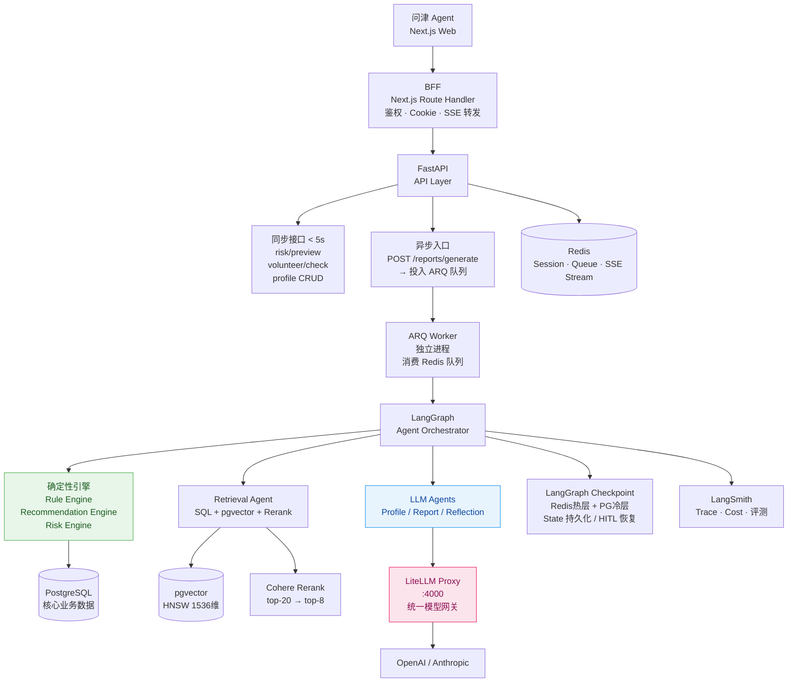
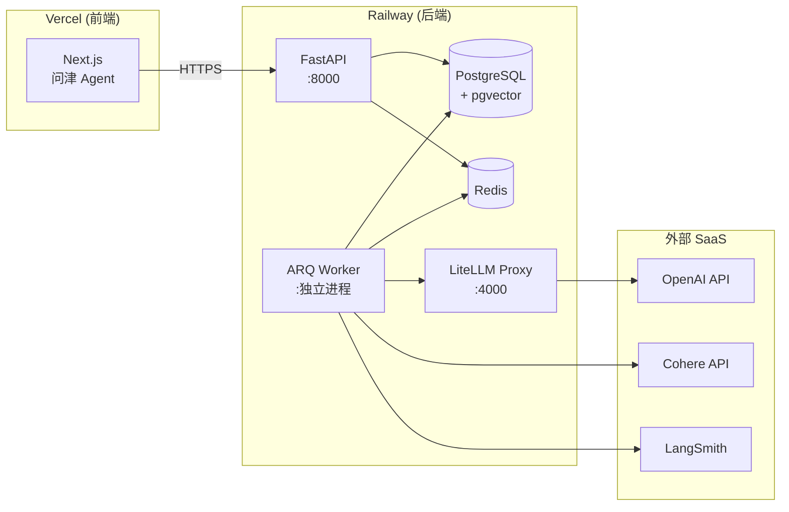

# 系统架构总览

**项目**：问津 Agent — 面向高考生和家长的 AI 志愿决策助理  
**核心功能**：建档 → 冲稳保方案生成 → 志愿表风险体检 → 可追溯报告 → 人工复核闭环

---

## 1. 分层架构与职责边界

```
┌──────────────────────────────────────────────────────────┐
│                   前端 (Next.js)                          │
│   页面渲染 · 状态管理(Zustand) · 服务端状态(TanStack Query) │
└───────────────────────────┬──────────────────────────────┘
                            │ HTTPS / SSE
┌───────────────────────────▼──────────────────────────────┐
│              BFF 层 (Next.js Route Handler)               │
│   唯一职责：轻量鉴权、HttpOnly Cookie 注入、SSE 流转发      │
│   !! 不含业务逻辑，任何业务判断下沉到 FastAPI !!             │
└───────────────────────────┬──────────────────────────────┘
                            │ 内网 HTTP
┌───────────────────────────▼──────────────────────────────┐
│              API 层 (FastAPI)                             │
│   同步接口：profile / risk preview / volunteer check       │
│   异步入口：POST /reports/generate → 投入 ARQ 队列         │
│   SSE 端点：GET /agent/runs/{id}/events（读 Redis Stream） │
└──────────────┬─────────────────────────┬─────────────────┘
               │ Redis Queue             │ PostgreSQL / Redis
               ▼                         ▼
┌──────────────────────┐   ┌─────────────────────────────┐
│   ARQ Worker         │   │      基础设施层               │
│   独立进程，消费队列   │   │  PostgreSQL  Redis  LiteLLM  │
│   运行 LangGraph 图   │   └─────────────────────────────┘
└──────────┬───────────┘
           ▼
┌──────────────────────────────────────────────────────────┐
│              LangGraph Agent Orchestrator                 │
│   多节点有向图 · Checkpoint 持久化 · interrupt/resume      │
│   并行执行(Send API) · Reflection 自检循环保护             │
└──────────────────────────────────────────────────────────┘
           │                         │
           ▼                         ▼
┌──────────────────┐       ┌──────────────────────────────┐
│  确定性引擎层     │       │  LiteLLM Proxy Gateway       │
│  Rule Engine     │       │  统一 LLM 调用入口            │
│  Recommendation  │       │  模型路由 · fallback · 成本追踪│
│  Risk Engine     │       └──────────┬───────────────────┘
│  （不经过 LLM）   │                  ▼
└──────────────────┘       LLM Providers (OpenAI / Anthropic)
```

---

## 2. 每一层为什么这么设计

### 2.1 BFF 层 — 职责收窄到鉴权和协议转换

**问题**：前端直连 FastAPI 会有两个问题：① EventSource 不支持自定义请求头，无法发 Bearer Token；② CORS 跨域配置复杂且存在安全风险。

**方案**：在 Next.js 内置一个 BFF Route Handler，专门处理：
- 把 JWT/Session 存成 `HttpOnly; SameSite=Strict` Cookie，浏览器自动携带，不暴露在 JS 层
- SSE 请求从 BFF 内网转发，用户侧只看到同域请求

**坚持的边界**：BFF 里不写任何业务判断（如"分数够不够"），业务逻辑全部在 FastAPI。  
原因：一旦 BFF 混入业务逻辑，未来替换前端框架时逻辑就散了；测试也更复杂。

### 2.2 ARQ 异步任务 — 为什么不用 FastAPI BackgroundTasks

这是一个常见的面试问题。

**FastAPI BackgroundTasks 的致命缺陷**：它在 API 进程内作为协程运行，一旦进程重启（部署、OOM、崩溃），任务直接丢失，没有持久化。

报告生成需要 45s+ 的多轮 LLM 调用，如果中途进程重启，用户会看到任务"消失"。

**ARQ 的优势**：
- 任务序列化后存 Redis，Worker 进程和 API 进程完全解耦
- Worker 可以独立扩容（多 Worker 消费同一队列）
- 进程重启后 ARQ 会重新拾取未完成任务
- 结合 LangGraph Checkpoint，可以从上次完成的节点继续，不重跑已完成节点

```
用户点击"生成方案"
        ↓
POST /reports/generate
        ↓ 立即返回 run_id（非阻塞）
ARQ 任务入队 (Redis LPUSH)
        ↓
ARQ Worker 消费
        ↓
LangGraph 图执行（45s+）
        ↓
进度事件写 Redis Stream
        ↓
SSE 端点读 Redis Stream → 推送前端
```

### 2.3 确定性引擎 — 规则引擎给结论，Agent 给解释

这是整个系统最重要的设计原则。

**背景**：高考志愿是一次性高风险决策，填错了要等一年。LLM 有幻觉、有不确定性，不能让它直接决定"这个专业你能不能报"。

**边界划分**：

```
确定性系统（SQL + Rule Engine）负责：
  ✓ 省份/批次匹配        → 数据库精确查询，零误差
  ✓ 选科要求校验         → 规则表达式，可测试，可追溯
  ✓ 体检/单科限制        → 高风险约束，不能靠 LLM 猜
  ✓ 冲稳保分层           → 算法 + 可配置阈值，便于评测调参
  ✓ 保底充足性检查        → 保底 < 10 所直接阻断，不允许降级

LLM Agent 负责：
  ✓ 专业介绍、城市解释    → 自然语言生成，适合 RAG
  ✓ 报告文案生成          → 结构由模板保证，语言由 Agent 生成
  ✓ 合规语义检测          → 正则覆盖不了的隐晦表达
```

如果让 LLM 做规则判断，当它判断"体检条件不符"时，你没法在用户投诉时拿出可审计的证据链。规则引擎每次执行都有完整的输入输出日志。

### 2.4 LiteLLM Proxy — 避免厂商锁定

所有 LLM 调用统一经过 LiteLLM Proxy（内部监听 :4000），Agent 代码里只写 `model="gpt-4o"`，从不直接调用 OpenAI SDK。

**好处**：
- 切换模型只改 LiteLLM config，业务代码零改动
- 统一的 fallback 策略（OpenAI 429 → 自动 fallback 到 Anthropic）
- 统一成本追踪，每个 Agent 节点的 token 消耗都有归因
- per-Agent 速率限制：Report Agent 允许高并发，Reflection Agent 单次轮次严格限流

---

## 3. 系统整体 Mermaid 图



---

## 4. 关键非功能设计

### 4.1 可恢复性

LangGraph 每个节点执行完成后自动写 Checkpoint 到 Redis。进程崩溃后，用户可以通过 `POST /agent/runs/{id}/resume` 从上次完成的节点继续，已完成节点不重跑。

### 4.2 游标分页

所有列表接口用游标分页（cursor-based），不用 offset：

```
GET /api/v1/reports?cursor=eyJpZCI6Ijk5In0&limit=20
```

**为什么不用 offset**：当新报告持续写入时，offset=20 的第 21 条可能因为新记录插入而变成上次的第 20 条，导致重复或跳过。游标锚定到某条记录的 ID，不受插入影响。

### 4.3 幂等设计

`POST /agent/runs` 以 `thread_id` 为幂等键，24h 内同一 thread_id 已有活跃 run 时返回 `409 Conflict` 并附带现有 `run_id`。防止用户因网络重试创建多个并行 run 浪费成本。

### 4.4 限流分层

| 层次 | 实现 | 策略 |
|------|------|------|
| 全局 IP 限流 | Redis 计数器 | 防爬虫 |
| 用户维度 | Redis 计数器 | 每用户每日 10 次报告生成 |
| 并发 run 数 | Redis 计数器 | 同一用户最多 2 个活跃 run |
| Token 预算 | LiteLLM / State | 单次 run 上限 150K tokens |

---

## 5. 部署拓扑



**为什么选 Railway 而非 ECS/K8s**：MVP 阶段，Railway 提供了接近 Heroku 的部署体验，支持 PostgreSQL + pgvector 插件，一个 `railway.toml` 就能配置多服务。省去了 K8s 的运维复杂度，面试作品集的重点在架构设计而不是运维。
