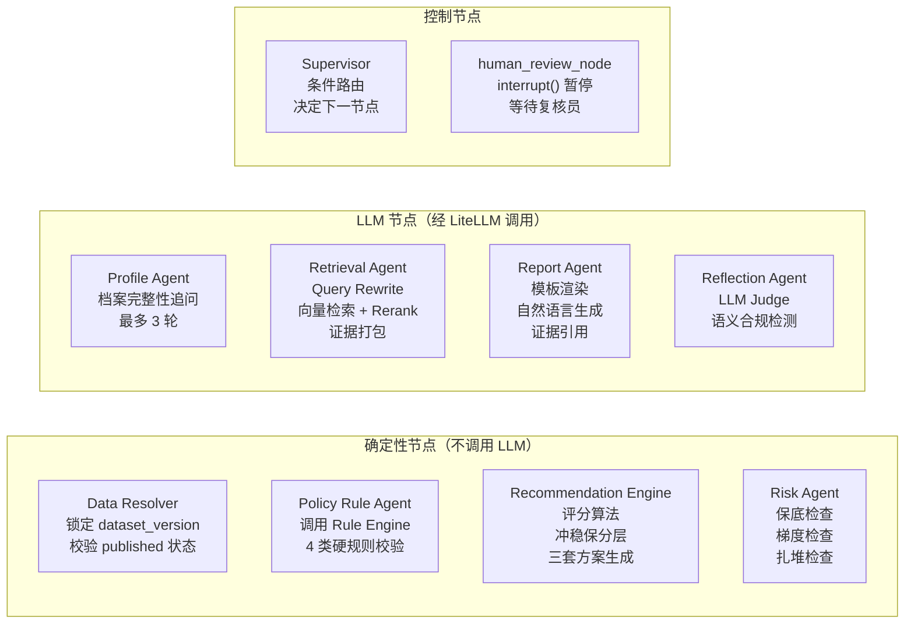
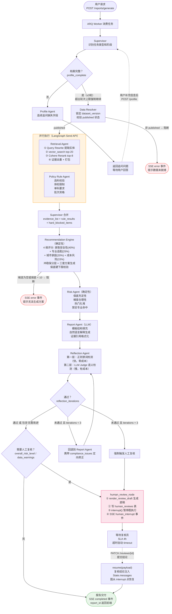
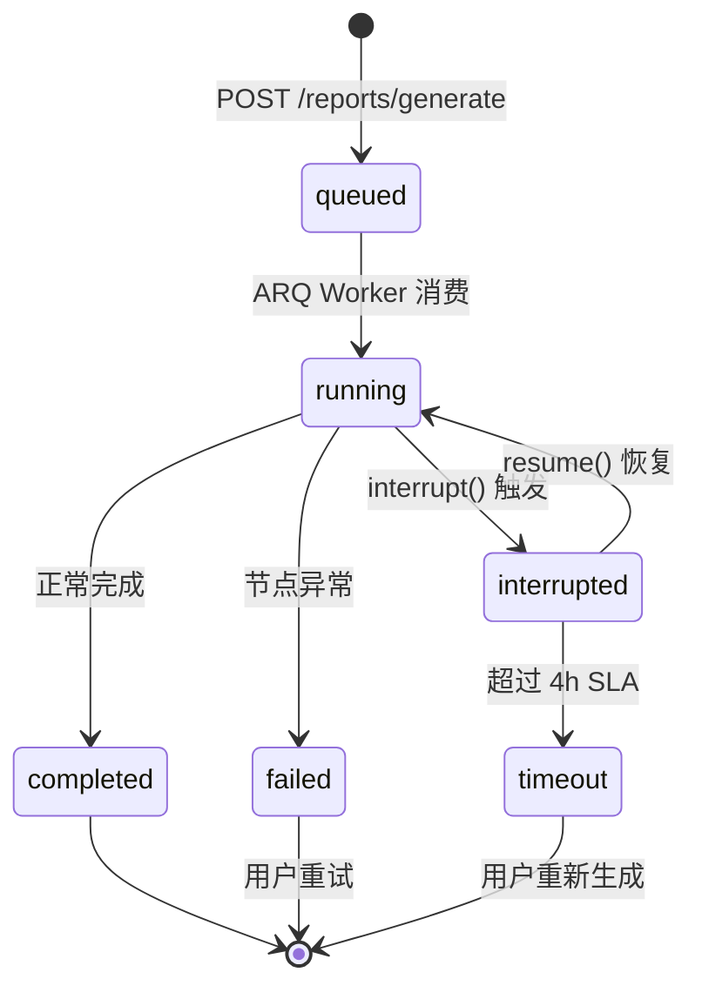
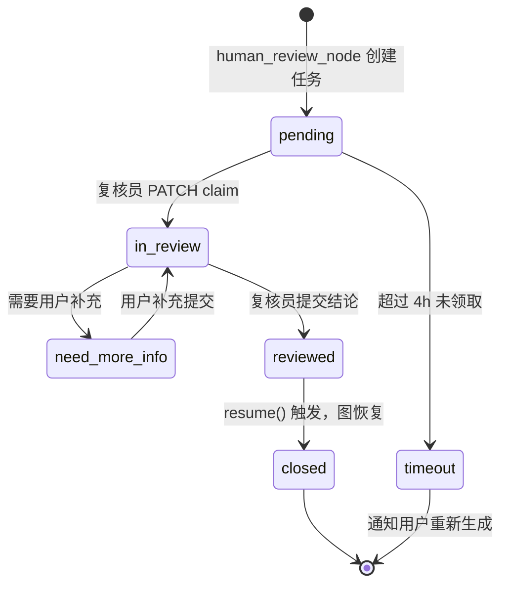
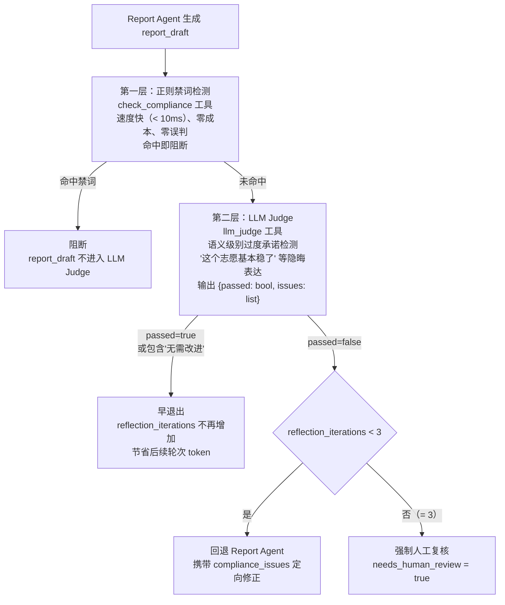

# Agent 编排设计

> **v1.1（2026-07-01）**：已移除 `human_review_node` 与 HITL `interrupt()`；Reflection 超 3 轮后 best-effort 交付。当前图：`data_resolver → 并行 retrieval/policy_rule → recommendation → risk → report → reflection`。

---

## 1. 为什么选 LangGraph 而不是 LangChain Agents / CrewAI / AutoGen

这是面试必问的问题。

| 框架 | 执行模型 | HITL 支持 | 状态持久化 | 并行执行 | 适合场景 |
|------|---------|----------|-----------|---------|---------|
| LangChain ReAct Agent | 单 Agent 循环 | 无原生支持 | 无 | 无 | 简单工具调用 |
| CrewAI | Agent-to-Agent 调用 | 无原生支持 | 无 | 有限 | 角色扮演协作 |
| AutoGen | 多 Agent 对话 | 有限 | 无 | 有限 | 开放式对话 |
| **LangGraph** | **有向图 + Checkpoint** | **interrupt() 原生** | **Redis/PG 双层** | **Send API** | **高可靠工作流** |

**核心诉求决定选型**：

1. **HITL（人工复核）** — 报告生成后可能需要暂停等待复核员审核（最长 4h），期间进程可能重启。LangGraph 的 `interrupt()` + Checkpoint 是目前唯一能在进程重启后恢复到 interrupt 点的框架。

2. **确定性 + LLM 混合** — 大部分节点是确定性的（Rule Engine、Recommendation Engine），只有少数节点是 LLM。LangGraph 的节点可以是任意 Python 函数，不强制 LLM。

3. **并行执行** — Retrieval Agent 和 Policy Rule Agent 互不依赖，LangGraph `Send` API 可以真正并发执行，缩短报告生成延迟。

4. **可追溯** — 每个节点执行后 State 快照持久化，可以回放任意节点的输入输出，对高风险决策至关重要。

---

## 2. Agent 节点角色与职责边界



**关键设计原则：每个节点只写自己负责的 State 字段，只读上游字段。**

| 节点 | 只写字段 | 只读字段 |
|------|---------|---------|
| Profile Agent | `profile`, `profile_complete`, `profile_pending_questions` | — |
| Data Resolver | `dataset_version`, `data_warnings` | `profile` |
| Retrieval Agent | `evidence_list`, `retrieval_complete` | `profile`, `dataset_version` |
| Policy Rule Agent | `rule_results`, `hard_blocked_items` | `profile`, `dataset_version` |
| Recommendation Agent | `candidates`, `scored_candidates`, `tier_summary` | `evidence_list`, `rule_results`, `hard_blocked_items` |
| Risk Agent | `risk_items`, `overall_risk_level` | `scored_candidates` |
| Report Agent | `report_draft`, `report_id` | 所有上游字段 |
| Reflection Agent | `compliance_passed`, `compliance_issues`, `reflection_iterations` | `report_draft` |

这种"字段所有权"设计防止了多节点写同一字段的竞争问题。

---

## 3. 完整工作流图



---

## 4. LangGraph State Schema 设计

```python
class VolunteerPlanState(TypedDict):
    # ── 基础 ──
    run_id: str
    thread_id: str
    user_id: str
    profile_id: str
    task_type: Literal["generate_report", "check_volunteer"]

    # ── 档案 ──
    profile: dict | None
    profile_complete: bool
    profile_pending_questions: list[str]   # Profile Agent 待追问的问题列表

    # ── 数据版本 ──
    dataset_version: str | None
    data_warnings: list[str]              # 数据不完整、降级、截断等提示

    # ── 并行写入字段 —— 必须加 Annotated Reducer ──
    # !! 如果不加 reducer，并行的 Retrieval Agent 和 Policy Rule Agent
    #    后执行的节点会覆盖先执行节点写入的结果 !!
    evidence_list: Annotated[list[dict], operator.add]
    rule_results:  Annotated[list[dict], operator.add]
    hard_blocked_items: Annotated[list[str], operator.add]

    # ── 候选集 ──
    candidates: list[dict]
    scored_candidates: list[dict]
    tier_summary: dict                    # {rush: N, target: N, safe: N, high_rush: N}

    # ── 风险 ──
    risk_items: list[dict]
    overall_risk_level: Literal["low", "medium", "high"]

    # ── 报告 ──
    report_draft: dict | None
    report_id: str | None

    # ── 合规自检 ──
    compliance_passed: bool
    compliance_issues: list[str]
    reflection_iterations: int            # 最大 3，超出强制触发 human review

    # ── HITL ──
    needs_human_review: bool
    review_reasons: list[str]
    review_task_id: str | None

    # ── 对话消息（HITL resume payload 注入此字段）──
    messages: Annotated[list[BaseMessage], add_messages]

    # ── 运行元数据 ──
    started_at: str
    completed_at: str | None
    error: str | None
    degraded_agents: list[str]            # 记录哪些 Agent 发生了降级
```

**为什么并行字段必须加 `Annotated[list, operator.add]`**：

LangGraph 在并行分支执行完成后合并 State。如果两个并行节点都往 `evidence_list` 写数据，默认合并策略是"后写覆盖"，先完成的节点数据丢失。

`operator.add` 告诉 LangGraph 合并时对这个字段做列表拼接（`list_a + list_b`），保留所有结果。这是最容易忽略的并发 Bug，上线后很难排查。

---

## 5. HITL（Human-in-the-Loop）机制详解

### 5.1 为什么需要 interrupt/resume 而不是简单的"等待"

朴素的做法是：生成报告 → 发邮件给复核员 → 轮询数据库 → 结果出来再交付。

问题：
- 报告生成的 LangGraph 图必须一直运行保持状态，占用 Worker 线程
- 进程重启后状态全丢
- 无法精确地"从暂停点"继续，只能重跑

LangGraph `interrupt()` 的工作方式：

```python
# human_review_node 内部
def human_review_node(state: VolunteerPlanState):
    draft = render_review_draft(state)         # LLM 调用：生成复核底稿
    create_human_review_task(draft)            # 写 human_reviews 表
    interrupt({"review_task_id": review_id})   # ← 图执行在此暂停
    # 进程可以安全重启，State 已存 Checkpoint
    # 复核员提交结论后，resume() 会让图从这里继续
```

```python
# 复核员提交结论后
review_service.patch(review_id, conclusion="approved")
agent_run_service.resume(run_id, payload={
    "review_conclusion": "approved",
    "reviewer_notes": "...",
})
# LangGraph 从 checkpoint 恢复 State，继续执行 interrupt 之后的节点
```

### 5.2 HITL 完整状态机



### 5.3 复核任务状态机



### 5.4 复核触发条件

```python
def should_trigger_human_review(state: VolunteerPlanState) -> bool:
    return any([
        state["overall_risk_level"] == "high",          # 高风险报告
        state["reflection_iterations"] >= 3,            # Reflection 3 轮未通过
        not state["profile"].get("rank"),               # 无位次，可信度低
        any(w.startswith("data_missing") for w in state["data_warnings"]),  # 关键数据缺失
        state["tier_summary"].get("safe", 0) < 10,      # 保底不足硬阻断前的预警
        "medical_restriction" in [r["rule_type"] for r in state["rule_results"]],  # 体检冲突
    ])
```

---

## 6. Reflection Agent — 合规自检的两层机制



**两层的设计原因**：

- 禁词（"保证录取"、"内部数据"）用正则就能 100% 覆盖，没必要花 LLM 的钱
- 隐晦的过度承诺（"录取概率极高"、"这所学校基本没问题"）需要 LLM 的语义理解
- 先跑正则，过了再跑 LLM，降低约 60% 的合规检测成本

**早退出机制**：

```python
for i in range(MAX_REFLECTION_ITERATIONS):  # MAX = 3
    feedback = await reflection_agent.run(state["report_draft"])
    state["reflection_iterations"] += 1
    
    # 早退出：只要通过，不等满 3 轮
    if feedback.passed or "无需改进" in feedback.text:
        state["compliance_passed"] = True
        break
    
    state["compliance_issues"] = feedback.issues
    state["report_draft"] = await report_agent.fix(feedback.issues)
else:
    # 满 3 轮未通过
    state["needs_human_review"] = True
```

---

## 7. 工具可靠性设计（ToolResponse 三态协议）

工具调用结果不能只有成功/失败两种状态，向量检索超时、Cohere API 限流等场景需要精细处理。

```python
class ToolStatus(Enum):
    SUCCESS = "success"
    PARTIAL = "partial"   # 降级执行，数据不完整但可继续
    ERROR   = "error"     # 阻断，无法继续

@dataclass
class ToolResponse:
    status: ToolStatus
    data: Any
    message: str          # 用户可读的中文说明
    degraded: bool = False

# 使用示例：Retrieval Agent
result = await vector_search_tool(query, top_k=20)
if result.status == ToolStatus.ERROR:
    # 向量检索完全失败 → 降级到 SQL 检索
    result = await sql_search_tool(query)
    state["degraded_agents"].append("retrieval_agent")
    state["data_warnings"].append("向量检索不可用，已降级到结构化数据检索")
elif result.status == ToolStatus.PARTIAL:
    # 部分数据返回 → 继续但在报告中标注
    state["data_warnings"].append(result.message)
```

**CircuitBreaker 保护外部调用**：

```python
# 防止 Cohere API 故障时大量请求堆积
circuit_breaker = CircuitBreaker(
    failure_threshold=5,       # 5 次失败后熔断
    recovery_timeout=30,       # 30s 后尝试恢复
    expected_exception=CohereAPIError,
)

@circuit_breaker
async def rerank_evidence(chunks: list, query: str) -> ToolResponse:
    ...

# 熔断时降级：跳过 rerank，直接用向量检索分数排序
```

---

## 8. 并行执行的实现细节

```python
# LangGraph Send API 实现并行
def after_data_resolver(state: VolunteerPlanState):
    """Data Resolver 完成后，同时启动 Retrieval 和 Rule 两个分支"""
    return [
        Send("retrieval_agent", state),    # 分支 1
        Send("policy_rule_agent", state),  # 分支 2
    ]

# graph 定义
graph.add_conditional_edges(
    "data_resolver",
    after_data_resolver,
    ["retrieval_agent", "policy_rule_agent"],  # 两个目标节点
)

# 两个并行节点完成后，LangGraph 自动合并 State
# evidence_list 和 rule_results 通过 Reducer 追加合并
graph.add_edge("retrieval_agent", "merge_node")
graph.add_edge("policy_rule_agent", "merge_node")
```

**并行带来的延迟优化**：

```
顺序执行（旧设计）：  Retrieval(8s) + Rule(2s) = 10s
并行执行（当前设计）：max(Retrieval(8s), Rule(2s)) = 8s

整体报告生成从 ~55s 降到 ~47s，P95 目标 45s
```
