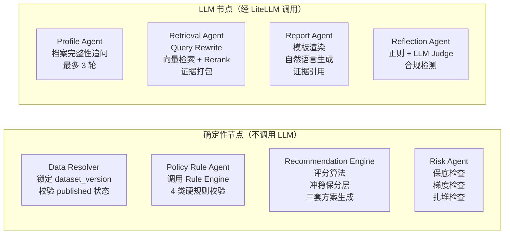
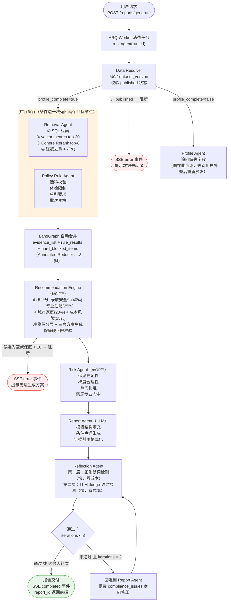
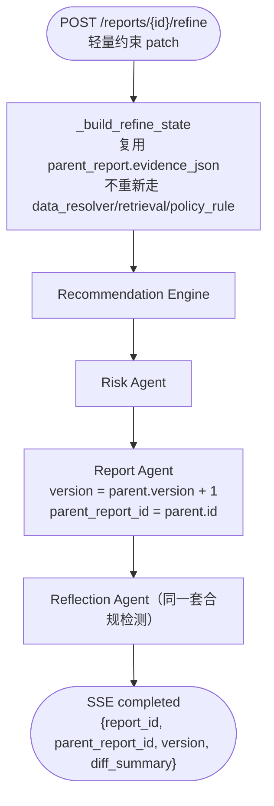
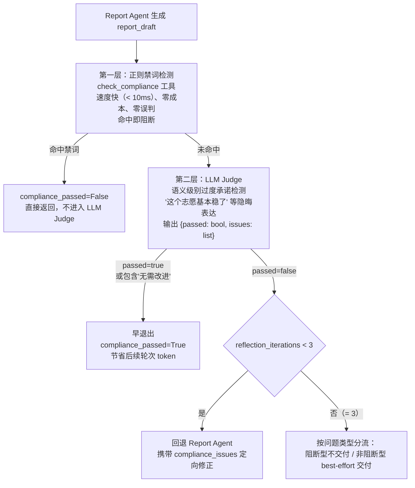

# Agent 编排设计

> **v1.1（2026-07-01）**：已移除 `human_review_node` 与 HITL `interrupt()`；Reflection 超 3 轮后 best-effort 交付。
> **v2（本次同步）**：新增 `refine_graph` 局部重新生成子图（`/reports/{id}/refine`）；新增用户侧协作 SSE 事件（`agents_parallel_started/merged`、`self_check_round`、`degraded_notice`），详见 §6。
>
> 主图：`data_resolver → 并行 retrieval/policy_rule → recommendation → risk → report → reflection`（8 节点，见 `backend/app/agent/graph.py::create_graph`）。
> 子图：`recommendation → risk → report → reflection`（见 `create_refine_graph`，供 `/refine` 复用已有证据链做局部重跑）。

---

## 1. 为什么选 LangGraph 而不是 LangChain Agents / CrewAI / AutoGen

这是面试必问的问题。

| 框架 | 执行模型 | 状态持久化 | 并行执行 | 适合场景 |
|------|---------|-----------|---------|---------|
| LangChain ReAct Agent | 单 Agent 循环 | 无 | 无 | 简单工具调用 |
| CrewAI | Agent-to-Agent 调用 | 无 | 有限 | 角色扮演协作 |
| AutoGen | 多 Agent 对话 | 无 | 有限 | 开放式对话 |
| **LangGraph** | **有向图 + Checkpoint** | **Redis 7 天 TTL** | **条件边扇出** | **高可靠工作流** |

**核心诉求决定选型**：

1. **暂停/恢复** — Profile Agent 追问缺失字段时（最多 3 轮），图在当前 run 结束但 checkpoint 保留；用户补充信息后走 `POST /profile`，下一次 `POST /reports/generate` 重新驱动图，从已收集的字段继续判断。这依赖 Checkpoint 持久化，不依赖 LangGraph 的 `interrupt()`（该机制曾用于已移除的人工复核流程，当前代码库不再使用）。

2. **确定性 + LLM 混合** — 大部分节点是确定性的（Rule Engine、Recommendation Engine、Risk Engine），只有 Profile/Retrieval/Report/Reflection 四个节点调用 LLM。LangGraph 的节点可以是任意 Python 函数，不强制 LLM。

3. **并行执行** — Retrieval Agent 和 Policy Rule Agent 互不依赖，通过条件边一次返回两个目标节点名实现真正并发，缩短报告生成延迟。

4. **可追溯** — 每个节点执行后 State 快照持久化到 Redis checkpoint，`/refine` 复用被重新生成报告的 `evidence_json` 而不重新检索，就是靠这份可追溯的 State 落地实现的。

---

## 2. Agent 节点角色与职责边界



**关键设计原则：每个节点只写自己负责的 State 字段，只读上游字段。**

| 节点 | 只写字段 | 只读字段 |
|------|---------|---------|
| Profile Agent | `profile`, `profile_complete`, `profile_pending_questions` | — |
| Data Resolver | `dataset_version`, `data_warnings` | `profile` |
| Retrieval Agent | `evidence_list`, `retrieval_complete` | `profile`, `dataset_version` |
| Policy Rule Agent | `rule_results`, `hard_blocked_items` | `profile`, `dataset_version` |
| Recommendation Agent | `candidates`, `scored_candidates`, `tier_summary` | `evidence_list`, `rule_results`, `hard_blocked_items` |
| Risk Agent | `risk_items`, `overall_risk_level` | `scored_candidates` |
| Report Agent | `report_draft`, `report_id`, `version`, `parent_report_id`（写入时原样透传，不做计算） | 所有上游字段 |
| Reflection Agent | `compliance_passed`, `compliance_issues`, `reflection_iterations` | `report_draft` |

这种"字段所有权"设计防止了多节点写同一字段的竞争问题。

---

## 3. 完整工作流图（主图）



**达最大轮次（3）仍未通过时的分流**（`_route_after_reflection` 只负责路由到 `end`，阻断/best-effort 的判断在 Report Service 写库前完成）：

- 阻断型合规问题（保证录取、确定性概率承诺等）→ 不交付，`agent_runs.status = failed`。
- 非阻断型质量问题（证据覆盖不足等）→ best-effort 交付，`compliance_issues` / `data_warnings` 一并展示在报告页。

---

## 3.1 局部重新生成子图（`refine_graph`）

`POST /reports/{id}/refine` 走一个更小的子图，只包含 `recommendation → risk → report → reflection` 四个节点（`create_refine_graph`），复用主图完全相同的节点函数：



判断 patch 是轻量约束（预算/城市偏好/排除院校等）还是重大约束（省份/选科/批次）的白名单校验在 `api/v1/reports.py::_LIGHT_PATCH_KEYS` 完成，命中重大约束字段直接返回 `422 requires_full_regenerate`，不进入这个子图。

---

## 4. LangGraph State Schema 设计

```python
class VolunteerPlanState(TypedDict):
    # ── 基础 ──
    run_id: str
    thread_id: str
    user_id: str
    anonymous_id: str              # 匿名会话下的建档 run 没有 user_id 时使用
    profile_id: str
    task_type: Literal["generate_report", "check_volunteer"]

    # ── 档案 ──
    profile: dict | None
    profile_complete: bool
    profile_pending_questions: list[str]   # Profile Agent 待追问的问题列表

    # ── 数据版本 ──
    dataset_version: str | None
    data_warnings: list[str]              # 数据不完整、降级、截断等提示

    # ── 并行写入字段 —— 必须加 Annotated Reducer ──
    # !! 如果不加 reducer，并行的 Retrieval Agent 和 Policy Rule Agent
    #    后执行的节点会覆盖先执行节点写入的结果 !!
    evidence_list: Annotated[list[dict], operator.add]
    rule_results:  Annotated[list[dict], operator.add]
    hard_blocked_items: Annotated[list[str], operator.add]

    # ── 候选集 ──
    candidates: list[dict]
    scored_candidates: list[dict]
    tier_summary: dict                    # {rush: N, target: N, safe: N, high_rush: N}

    # ── 风险 ──
    risk_items: list[dict]
    overall_risk_level: Literal["low", "medium", "high"]

    # ── 报告 ──
    report_draft: dict | None
    report_id: str | None
    version: int                          # 同一血缘链内从 1 递增
    parent_report_id: str | None          # /refine 产出的新版本指向被 refine 的报告

    # ── 合规自检 ──
    compliance_passed: bool
    compliance_issues: list[str]
    reflection_iterations: int            # 最大 3，超出 best-effort 交付

    # ── 多轮对话消息 ──
    messages: Annotated[list[BaseMessage], add_messages]

    # ── 运行元数据 ──
    started_at: str
    completed_at: str | None
    error: str | None
    degraded_agents: list[str]            # 记录哪些 Agent 发生了降级

    # ── Debug 工具调用日志（Admin Debug Console 用）──
    tool_call_log: Annotated[list[dict], operator.add]  # {node, tool, status, latency_ms}
```

**为什么并行字段必须加 `Annotated[list, operator.add]`**：

LangGraph 在并行分支执行完成后合并 State。如果两个并行节点都往 `evidence_list` 写数据，默认合并策略是"后写覆盖"，先完成的节点数据丢失。

`operator.add` 告诉 LangGraph 合并时对这个字段做列表拼接（`list_a + list_b`），保留所有结果。这是最容易忽略的并发 Bug，上线后很难排查。

---

## 5. Reflection Agent — 合规自检的两层机制



**两层的设计原因**：

- 禁词（"保证录取"、"内部数据"）用正则就能 100% 覆盖，没必要花 LLM 的钱。
- 隐晦的过度承诺（"录取概率极高"、"这所学校基本没问题"）需要 LLM 的语义理解。
- 先跑正则，过了再跑 LLM，降低约 60% 的合规检测成本。

**早退出机制**（实现见 `backend/app/agent/nodes/reflection_agent.py::reflection_agent`）：

```python
for i in range(MAX_REFLECTION_ITERATIONS):  # MAX = 3
    feedback = await reflection_agent.run(state["report_draft"])
    state["reflection_iterations"] += 1

    # 早退出：只要通过，不等满 3 轮
    if feedback.passed or "无需改进" in feedback.text:
        state["compliance_passed"] = True
        break

    state["compliance_issues"] = feedback.issues
    state["report_draft"] = await report_agent.fix(feedback.issues)
else:
    # 满 3 轮未通过：按问题类型分流（阻断 / best-effort），不再有人工复核分支
    state["compliance_passed"] = False
```

---

## 6. 用户侧协作事件 与 Admin Debug 事件流（两层共用一条 Stream）

`backend/app/agent/graph.py::_wrap_with_debug` 包裹每个节点，围绕执行前后推送两类事件到同一条 `sse:{run_id}` Redis Stream：

| 事件类型 | 前缀 | 消费方 | 实现位置 |
| --- | --- | --- | --- |
| `node_started`/`node_completed`/`tool_called`/`degraded`/`circuit_breaker`/`parallel_fan_out`/`parallel_fan_in`/`reflection_iteration`/`state_checkpoint` | `debug:` | Admin Debug Console（`GET /admin/runs/{id}/debug-events`，全量转发） | `app/agent/debug_events.py::emit_debug_event` |
| `node_started`（友好文案）/`evidence_found`/`rule_checked`/`candidates_ready`/`risk_found`/`agents_parallel_started`/`agents_parallel_merged`/`self_check_round`/`degraded_notice`/`completed`/`error` | 无前缀 | 用户侧对话内生成过程卡片（`GET /agent/runs/{id}/events`） | 各节点文件内的 `_push_sse` + `app/agent/user_events.py::push_user_event` |

`GET /agent/runs/{id}/events`（`api/v1/agent.py`）转发前会跳过 `debug:` 前缀事件，保证两层呈现物理隔离，不是靠前端自己过滤。

**四个新增用户侧事件的转译来源**：

- `agents_parallel_started` / `agents_parallel_merged`：在 `_wrap_with_debug` 里，`retrieval_agent`/`policy_rule_agent` 开始、`recommendation`（fan-in 节点）开始时各广播一次，对应 debug 层的 `parallel_fan_out`/`parallel_fan_in`，只保留友好文案。
- `self_check_round`：在 `reflection` 节点完成后广播，对应 debug 层的 `reflection_iteration`，只传 `issue_category`（`over_promise`/`none`，当前 Reflection 只做合规检测，`evidence_gap` 类别留给未来 `check_evidence_coverage` 落地后启用），不传原始违规文本。
- `degraded_notice`：在 `retrieval_agent.py` 里 `emit_degraded` 调用旁同步广播，固定文案"检索遇到延迟，已切换备用数据源"，不暴露 Cohere/pgvector 等具体服务名。

---

## 7. 工具可靠性设计（ToolResponse 三态协议）

工具调用结果不能只有成功/失败两种状态，向量检索超时、Cohere API 限流等场景需要精细处理。

```python
class ToolStatus(Enum):
    SUCCESS = "success"
    PARTIAL = "partial"   # 降级执行，数据不完整但可继续
    ERROR   = "error"     # 阻断，无法继续

@dataclass
class ToolResponse:
    status: ToolStatus
    data: Any
    message: str          # 用户可读的中文说明
    degraded: bool = False
```

**CircuitBreaker 保护外部调用**：Cohere Rerank / LiteLLM Proxy / pgvector 三个外部调用点，连续 3 次 `ERROR` → `OPEN`（300s 冷却）→ `HALF_OPEN` 试探 → 成功则 `CLOSED`。单进程协程内存态，实现见 `app/agent/circuit_breaker.py`。

---

## 8. 并行执行的实现细节

当前代码库用的是**条件边一次返回多个目标节点名**，不是显式 `Send()` API 调用（`backend/app/agent/graph.py::_route_after_data_resolver`）：

```python
def _route_after_data_resolver(state: VolunteerPlanState) -> list[str]:
    if state.get("profile_complete", False):
        return ["retrieval_agent", "policy_rule_agent"]   # 同时触发两个节点
    return ["profile_agent"]

graph.add_conditional_edges(
    "data_resolver",
    _route_after_data_resolver,
    {
        "retrieval_agent": "retrieval_agent",
        "policy_rule_agent": "policy_rule_agent",
        "profile_agent": "profile_agent",
    },
)

# 两个并行节点都指向同一个 fan-in 节点，LangGraph 等待两者都完成后再合并 State
graph.add_edge("retrieval_agent", "recommendation")
graph.add_edge("policy_rule_agent", "recommendation")
```

**并行带来的延迟优化**：

```
顺序执行：  Retrieval(~8s) + Rule(~2s) = ~10s
并行执行：  max(Retrieval(~8s), Rule(~2s)) = ~8s
```

报告生成 P95 目标 45s（见 `docs/backend-prd-v2.md` §14.2）。

---

## 9. 记忆管理：本系统里的几类记忆机制与实现模式

> 面试常见问题："这套系统的记忆管理是怎么设计的？"——"记忆"在本项目里不是单一机制，而是按寿命和用途分层实现，没有一处是"把全部历史无差别塞给 LLM"。

### 9.1 按寿命/用途分类

| 类型 | 场景 | 本项目实现 | 通用实现模式 |
|---|---|---|---|
| 会话内工作记忆 | 单次 Agent 执行 / 单轮对话内，多节点间共享上下文 | `VolunteerPlanState`（§4）+ LangGraph Checkpoint（Redis 热层，7 天 TTL，见 §1）；`intake_agent.py` 单次请求只取最近 16 条消息传给 LLM，滑动窗口截断 | 消息列表直接塞进上下文，配合窗口截断防止超长 |
| 跨会话长期记忆（对话历史） | 用户下次回来想接上之前的聊天 | `report_conversations`（按 `report_id` 隔离）、`intake_conversations`（按 `owner_key`）：Redis 热层（`chat:history:*`/`intake:history:*`，7 天 TTL）+ Postgres 冷层 best-effort 异步写入兜底 | Redis 热层（低延迟、有 TTL）+ DB 冷层（持久化），按会话/线程 ID 隔离读写；ID 一般对应 URL 里的资源 id（本项目是 `report_id`），或独立的 `conversation_id`/`thread_id` |
| 结构化用户画像 | "预算 8 万""选了物理化学生物"这类必须参与规则判断的信息 | `profiles` 表 + Profile Agent 追问机制（只写 `profile`/`profile_complete`/`profile_pending_questions`，§2） | LLM/规则从对话中抽取字段写入普通业务表，不留在语义记忆里——高风险判断必须能被规则引擎直接读取和审计 |
| 检索增强记忆（外部知识） | 记忆量大、按需召回、大部分内容跟当前请求无关 | pgvector 向量库存招生政策/院校信息（Retrieval Agent，§2/§3），检索 top-8 相关证据注入 Report Agent，而非全量塞入 | 内容 embedding 化存向量库，检索时取 top-k 相关片段注入 prompt |
| 摘要压缩记忆 | 上下文超长但不想完全丢弃早期信息 | 当前系统未启用；Reflection 的定向修正复用的是 `compliance_issues`（问题摘要）而非全量历史重放，可视为该模式的局部体现 | 定期把旧内容压缩成摘要，替代原文注入上下文 |

### 9.2 选型原则

一句话：**能结构化就结构化存（可被规则/代码直接验证），结构化不了但需要精确复现就分层存储按线程隔离，量大但稀疏相关就上向量检索，超长上下文兜底用摘要压缩。**

高风险决策场景（志愿填报）尤其要优先第一种——语义记忆只负责"聊天体验的连续性"，不能替代结构化数据参与规则判断。这是 §2.3（`docs/01_architecture_overview.md`）"规则引擎给结论，Agent 给解释"原则在记忆设计上的延伸：能沉淀成结构化字段的，就不要只留在对话记录里。

### 9.3 已知缺口

`intake_conversations` 当前是 `owner_key` 唯一约束——每个用户/匿名会话只有**一条**历史，没有会话/线程维度，不支持"多会话列表 + 切换历史会话继续聊"（`report_conversations` 按 `report_id` 天然具备这个维度，可作为改造参考范式）。
