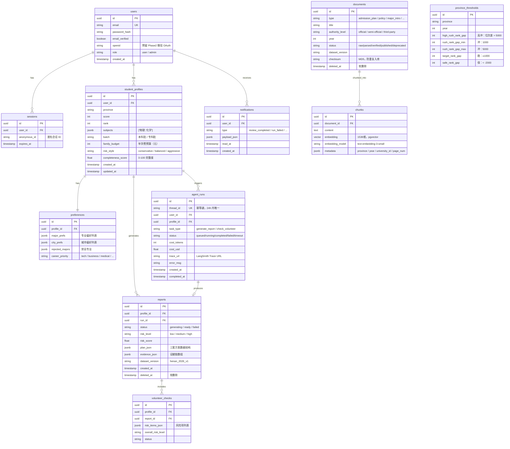
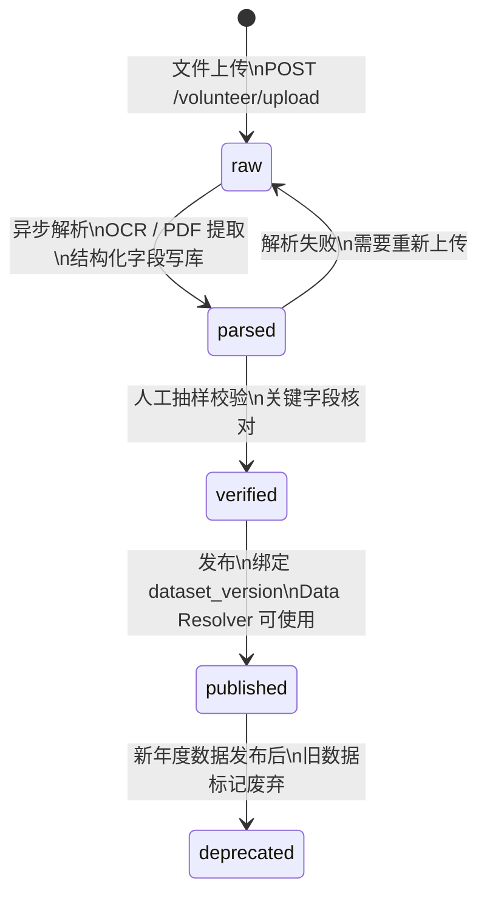

# 数据模型设计

---

## 1. 核心表关系 ER 图



> **v1.1**：`sessions` 表 ORM 类名为 `AuthSession`；已删除 `human_reviews` 表及相关索引。

---

## 2. 关键表设计决策

### 2.1 admission_scores 必须有 batch 字段

```sql
CREATE TABLE admission_scores (
    year        INTEGER NOT NULL,
    province    VARCHAR NOT NULL,
    batch       VARCHAR NOT NULL,  -- '本科批' / '专科批' / '提前批'
    university_id UUID NOT NULL,
    major_group VARCHAR NOT NULL,
    min_score   INTEGER,
    min_rank    INTEGER,           -- 投档最低位次（主要排序依据）
    dataset_version VARCHAR NOT NULL,
    PRIMARY KEY (year, province, batch, university_id, major_group)
);
```

**为什么 batch 是必填**：同一所大学在本科批和专科批的最低位次差距可能在 2 万名以上。如果没有 batch 字段，查询"郑州大学 2025 年投档线"会返回混合数据，冲稳保分层算法会产生严重错误。

早期版本没有这个字段，导致高专科批位次的考生被错误推荐了本科批的学校。v0.9 修复后加了 `batch` 字段和复合主键。

### 2.2 chunks 表的 embedding_model 字段

```sql
CREATE TABLE chunks (
    id             UUID PRIMARY KEY,
    document_id    UUID REFERENCES documents(id),
    content        TEXT,
    embedding      vector(1536),          -- pgvector，维度由模型决定
    embedding_model VARCHAR NOT NULL,     -- 'text-embedding-3-small'
    metadata       JSONB
);
```

**为什么要记录 embedding_model**：

OpenAI `text-embedding-3-small` 是 1536 维，BAAI/BGE 是 1024 维，两套模型的向量空间完全不兼容，不能混用（混用后 cosine similarity 会产生随机结果，看起来能运行但推荐结果完全错误）。

Phase 2 切换到自托管 BGE 时，需要：
1. 用 `WHERE embedding_model = 'text-embedding-3-small'` 过滤出旧向量
2. 批量重新生成 BGE 向量（重建 pipeline）
3. 重建 pgvector HNSW 索引（维度从 1536 改 1024）

没有 `embedding_model` 字段就没法做增量迁移，只能全库删除重建。

### 2.3 reports.plan_json 结构设计

```json
{
  "plans": [
    {
      "type": "conservative",
      "label": "保守型",
      "candidates": [
        {
          "id": "cand_001",
          "university_name": "郑州大学",
          "major_group": "060001",
          "major_name": "计算机科学与技术",
          "tier": "safe",
          "admission_safety_score": 82,
          "overall_score": 74.5,
          "rank_reference": {"year": 2025, "min_rank": 38500},
          "recommendation_reasons": ["历年最低位次稳定，安全边际充足"],
          "risk_items": [],
          "evidence_ids": ["src_001", "src_003"]
        }
      ]
    }
  ]
}
```

**为什么 evidence 不单独建表而是嵌入 reports.evidence_json**：

MVP 阶段每份报告的证据量在 20-50 条，JSON 数组完全够用，查询 pattern 也是"按 report_id 取全部证据"，不需要按 source_id 反查报告。单独建表只增加 JOIN 复杂度，没有带来查询优化。

后续如果需要"这条证据被哪些报告引用"的反查，再考虑拆出 `evidence_citations` 表。

### 2.4 human_reviews（已移除，v1.1）

人工复核表及 `timeout_at` 定时扫描逻辑已删除。历史设计见 `docs/backend-prd.md` Section 11。

### 2.5 province_thresholds 表 — 替代代码内硬编码

```sql
CREATE TABLE province_thresholds (
    id              UUID PRIMARY KEY,
    province        VARCHAR NOT NULL,
    year            INTEGER NOT NULL,
    high_rush_rank_gap  INTEGER DEFAULT 5000,
    rush_rank_gap_min   INTEGER DEFAULT 1000,
    rush_rank_gap_max   INTEGER DEFAULT 5000,
    target_rank_gap     INTEGER DEFAULT 1000,
    safe_rank_gap       INTEGER DEFAULT -2000,
    UNIQUE (province, year)
);
```

冲稳保阈值与省份录取规模强相关（河南 80 万考生 vs 某省 5 万考生，位次差的含义完全不同）。早期版本把 `rush_rank_gap > 1000` 这种数字硬编码在推荐算法里，一旦要支持新省份就要改代码、重新部署。

现在通过 `province_thresholds` 表配置，数据运营可以直接修改阈值，算法代码只读这张表，不需要改代码。

### 2.6 intake_conversations 多会话设计

```sql
CREATE TABLE intake_conversations (
    id              VARCHAR(36) PRIMARY KEY,       -- 即会话/thread id
    owner_key       VARCHAR(48) NOT NULL,           -- user_id 或 "anon:{anonymous_id}"，非唯一
    title           VARCHAR(100),                   -- 首条用户消息截断生成
    messages_json   JSONB NOT NULL DEFAULT '[]',
    created_at      TIMESTAMPTZ NOT NULL DEFAULT NOW(),
    updated_at      TIMESTAMPTZ NOT NULL DEFAULT NOW()
);
CREATE INDEX ix_intake_conversations_owner_key ON intake_conversations (owner_key);
CREATE INDEX ix_intake_conversations_owner_key_updated_at ON intake_conversations (owner_key, updated_at, id);
```

最初版本 `owner_key` 有唯一约束——一个用户/匿名会话只存一条建档前聊天历史，没有会话维度，导致侧栏无法展示"新建对话 + 历史列表 + 点击恢复"（首页每次都是同一条历史）。迁移 009 去掉唯一约束，`id` 变成真正的会话/thread id，一个 owner_key 下可以有多条会话，按 `updated_at` 倒序做游标分页（参考 `reports` 表的分页范式）。

**懒创建**：`POST /intake/chat` 不传 `conversation_id` 时不会立即建行，而是等这轮对话的 `done` 事件产出、拿到完整回复后才 upsert——避免"新建对话"按钮点一下、或用户中途放弃没发消息，就在表里留一堆空会话。

**owner_key 长度踩过的坑**：最初 `owner_key VARCHAR(36)` 是照抄 uuid 长度设的，但匿名会话的 owner_key 实际是 `"anon:" + 36 位 uuid`（41 字符），插入时被 `StringDataRightTruncationError` 打断——而这个错误被写库函数的 best-effort `try/except Exception: pass` 悄悄吞掉，长期没有暴露：匿名用户的建档聊天历史事实上从未真正落过 Postgres 冷层，只靠 Redis 7 天 TTL 硬撑。教训：`owner_key` 这类"多种 ID 拼前缀"的复合字段，列宽要按最长的那种取值算，不能照抄单一 ID 类型的长度；best-effort 的 `except: pass` 至少要考虑加一条监控/日志，否则这类静默截断可以完全不被发现。

---

## 3. 关键索引策略

```sql
-- 报告生成主路径：高频查询，必须覆盖索引
CREATE INDEX idx_admission_scores_main
    ON admission_scores (province, year, batch);

CREATE INDEX idx_admission_plans_major_group
    ON admission_plans (province, year, batch, major_group);

-- 位次转换查询
CREATE INDEX idx_rank_segments_lookup
    ON rank_segments (province, year, score);

-- 向量检索：HNSW 索引，比 IVFFlat 更适合高准确度场景
CREATE INDEX idx_chunks_embedding
    ON chunks USING hnsw (embedding vector_cosine_ops)
    WITH (m = 16, ef_construction = 64);
-- m=16: 每个节点连接数，越大越准确但内存更高，16 是默认推荐值
-- ef_construction=64: 构建时搜索宽度，建完后不影响查询速度

-- 元数据过滤加速（按省份缩小向量检索范围）
CREATE INDEX idx_chunks_metadata_province
    ON chunks USING gin (metadata jsonb_path_ops);

-- 用户 run 历史 + 限流计数
CREATE INDEX idx_agent_runs_user_status
    ON agent_runs (user_id, status, created_at DESC);
```

**HNSW vs IVFFlat 的选择**：

| 指标 | IVFFlat | HNSW |
|------|---------|------|
| 构建速度 | 快 | 慢 |
| 查询准确度 | 中（受 nprobe 影响） | 高（图结构，更精准） |
| 内存占用 | 低 | 高 |
| 适合场景 | 超大数据集 | 中小数据集，高准确度 |

MVP 阶段 chunks 表数据量在 10-50 万行，HNSW 性能更优且准确度更高，选 HNSW。

---

## 4. 软删除设计

`documents` 和 `reports` 表使用 `deleted_at` 字段实现软删除：

```sql
-- 查询时过滤软删除
SELECT * FROM reports
WHERE profile_id = :profile_id
  AND deleted_at IS NULL
ORDER BY created_at DESC;

-- 软删除
UPDATE reports SET deleted_at = NOW() WHERE id = :id;
```

**为什么用软删除而不是物理删除**：
- 报告包含证据链和决策过程，可能有法律纠纷时需要追溯
- 用户"删除报告"后如果想恢复，可以在运营后台找回
- 历史数据可用于评测集和模型改进

---

## 5. 数据状态流转（documents 表）



**关键约束**：
- `Data Resolver` 在 Agent run 启动时校验 `dataset_version` 对应的所有 documents 是否全为 `published` 状态
- 非 `published` 状态时，系统**硬阻断**报告生成，通过 SSE 推送错误，不允许降级跳过
- 原因：用未验证的数据生成报告，一旦数据有误（历年录取线抄错），直接导致考生填错志愿

---

## 6. 不建表清单（有意为之）

以下表在 MVP 阶段刻意不建：

| 表 | 原因 |
|----|------|
| `orders / payments / packages` | 当前版本全部免费，不做商业化 |
| `report_versions` | 报告修改直接覆盖 `report_draft`，历史版本通过 LangGraph Checkpoint 可追溯，不需要额外版本表 |
| `candidate_sets` | 候选集数据嵌入 `reports.plan_json`，数据量不大，拆表只增加 JOIN 复杂度 |
| `evidence_citations` | 证据链嵌入 `reports.evidence_json`，20-50 条 JSON，不需要独立表 |
| `family_annotations` | 家庭协同功能 Phase 2 再做 |

**设计原则**：在数据量和查询 pattern 明确之前不过度设计表结构。过早拆表会导致 JOIN 复杂度上升，而 JOIN 在 PostgreSQL 里有性能代价。
