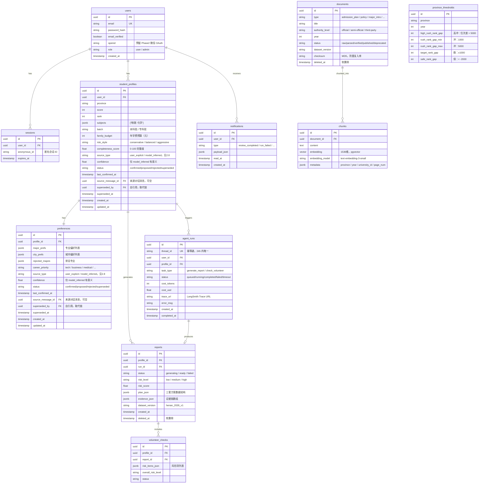
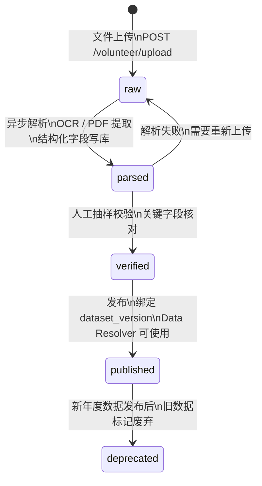

# 数据模型设计

---

## 1. 核心表关系 ER 图


```mermaid
erDiagram
    users {
        uuid id PK
        string email UK
        string password_hash
        boolean email_verified
        string openid "预留 Phase2 微信 OAuth"
        string role "user / admin"
        timestamp created_at
    }

    sessions {
        uuid id PK
        uuid user_id FK
        string anonymous_id "匿名会话 ID"
        timestamp expires_at
    }

    student_profiles {
        uuid id PK
        uuid user_id FK
        string province
        int score
        int rank
        jsonb subjects "['物理','化学']"
        string batch "本科批 / 专科批"
        int family_budget "年学费预算（元）"
        string risk_style "conservative / balanced / aggressive"
        float completeness_score "0-100 完整度"
        string source_type "user_explicit / model_inferred，见2.8"
        float confidence "仅 model_inferred 有意义"
        string status "confirmed/proposed/rejected/superseded"
        timestamp last_confirmed_at
        uuid source_message_id FK "来源对话消息，可空"
        uuid superseded_by FK "自引用，取代链"
        timestamp superseded_at
        timestamp created_at
        timestamp updated_at
    }

    preferences {
        uuid id PK
        uuid profile_id FK
        jsonb major_prefs "专业偏好列表"
        jsonb city_prefs "城市偏好列表"
        jsonb rejected_majors "禁忌专业"
        string career_priority "tech / business / medical / ..."
        string source_type "user_explicit / model_inferred，见2.8"
        float confidence "仅 model_inferred 有意义"
        string status "confirmed/proposed/rejected/superseded"
        timestamp last_confirmed_at
        uuid source_message_id FK "来源对话消息，可空"
        uuid superseded_by FK "自引用，取代链"
        timestamp superseded_at
        timestamp created_at
        timestamp updated_at
    }

    agent_runs {
        uuid id PK
        string thread_id UK "幂等键，24h 内唯一"
        uuid user_id FK
        uuid profile_id FK
        string task_type "generate_report / check_volunteer"
        string status "queued/running/completed/failed/timeout"
        int cost_tokens
        float cost_usd
        string trace_url "LangSmith Trace URL"
        string error_msg
        timestamp created_at
        timestamp completed_at
    }

    reports {
        uuid id PK
        uuid profile_id FK
        uuid run_id FK
        string status "generating / ready / failed"
        string risk_level "low / medium / high"
        float risk_score
        jsonb plan_json "三套方案数据结构"
        jsonb evidence_json "证据链数组"
        string dataset_version "henan_2026_v1"
        timestamp created_at
        timestamp deleted_at "软删除"
    }

    volunteer_checks {
        uuid id PK
        uuid profile_id FK
        uuid report_id FK
        jsonb risk_items_json "风险项列表"
        string overall_risk_level
        string status
    }


    notifications {
        uuid id PK
        uuid user_id FK
        string type "review_completed / run_failed / ..."
        jsonb payload_json
        timestamp read_at
        timestamp created_at
    }

    documents {
        uuid id PK
        string type "admission_plan / policy / major_intro / ..."
        string title
        string authority_level "official / semi-official / third-party"
        int year
        string status "raw/parsed/verified/published/deprecated"
        string dataset_version
        string checksum "MD5，防重复入库"
        timestamp deleted_at "软删除"
    }

    chunks {
        uuid id PK
        uuid document_id FK
        text content
        vector embedding "1536维，pgvector"
        string embedding_model "text-embedding-3-small"
        jsonb metadata "province / year / university_id / page_num"
    }

    province_thresholds {
        uuid id PK
        string province
        int year
        int high_rush_rank_gap "高冲：位次差 > 5000"
        int rush_rank_gap_min "冲：1000"
        int rush_rank_gap_max "冲：5000"
        int target_rank_gap "稳：±1000"
        int safe_rank_gap "保：< -2000"
    }

    users ||--o{ sessions : "has"
    users ||--o{ student_profiles : "has"
    student_profiles ||--|| preferences : "has"
    student_profiles ||--o{ agent_runs : "triggers"
    student_profiles ||--o{ reports : "generates"
    agent_runs ||--o| reports : "produces"
    reports ||--o{ volunteer_checks : "includes"
    users ||--o{ notifications : "receives"
    documents ||--o{ chunks : "chunked_into"
```

> **v1.1**：`sessions` 表 ORM 类名为 `AuthSession`；已删除 `human_reviews` 表及相关索引。

---

## 2. 关键表设计决策

### 2.1 admission_scores 必须有 batch 字段

```sql
CREATE TABLE admission_scores (
    year        INTEGER NOT NULL,
    province    VARCHAR NOT NULL,
    batch       VARCHAR NOT NULL,  -- '本科批' / '专科批' / '提前批'
    university_id UUID NOT NULL,
    major_group VARCHAR NOT NULL,
    min_score   INTEGER,
    min_rank    INTEGER,           -- 投档最低位次（主要排序依据）
    dataset_version VARCHAR NOT NULL,
    PRIMARY KEY (year, province, batch, university_id, major_group)
);
```

**为什么 batch 是必填**：同一所大学在本科批和专科批的最低位次差距可能在 2 万名以上。如果没有 batch 字段，查询"郑州大学 2025 年投档线"会返回混合数据，冲稳保分层算法会产生严重错误。

早期版本没有这个字段，导致高专科批位次的考生被错误推荐了本科批的学校。v0.9 修复后加了 `batch` 字段和复合主键。

### 2.2 chunks 表的 embedding_model 字段

```sql
CREATE TABLE chunks (
    id             UUID PRIMARY KEY,
    document_id    UUID REFERENCES documents(id),
    content        TEXT,
    embedding      vector(1536),          -- pgvector，维度由模型决定
    embedding_model VARCHAR NOT NULL,     -- 'text-embedding-3-small'
    metadata       JSONB
);
```

**为什么要记录 embedding_model**：

OpenAI `text-embedding-3-small` 是 1536 维，BAAI/BGE 是 1024 维，两套模型的向量空间完全不兼容，不能混用（混用后 cosine similarity 会产生随机结果，看起来能运行但推荐结果完全错误）。

Phase 2 切换到自托管 BGE 时，需要：
1. 用 `WHERE embedding_model = 'text-embedding-3-small'` 过滤出旧向量
2. 批量重新生成 BGE 向量（重建 pipeline）
3. 重建 pgvector HNSW 索引（维度从 1536 改 1024）

没有 `embedding_model` 字段就没法做增量迁移，只能全库删除重建。

### 2.3 reports.plan_json 结构设计

```json
{
  "plans": [
    {
      "type": "conservative",
      "label": "保守型",
      "candidates": [
        {
          "id": "cand_001",
          "university_name": "郑州大学",
          "major_group": "060001",
          "major_name": "计算机科学与技术",
          "tier": "safe",
          "admission_safety_score": 82,
          "overall_score": 74.5,
          "rank_reference": {"year": 2025, "min_rank": 38500},
          "recommendation_reasons": ["历年最低位次稳定，安全边际充足"],
          "risk_items": [],
          "evidence_ids": ["src_001", "src_003"]
        }
      ]
    }
  ]
}
```

**为什么 evidence 不单独建表而是嵌入 reports.evidence_json**：

MVP 阶段每份报告的证据量在 20-50 条，JSON 数组完全够用，查询 pattern 也是"按 report_id 取全部证据"，不需要按 source_id 反查报告。单独建表只增加 JOIN 复杂度，没有带来查询优化。

后续如果需要"这条证据被哪些报告引用"的反查，再考虑拆出 `evidence_citations` 表。

### 2.4 human_reviews（已移除，v1.1）

人工复核表及 `timeout_at` 定时扫描逻辑已删除。历史设计见 `docs/backend-prd.md` Section 11。

### 2.5 province_thresholds 表 — 替代代码内硬编码

```sql
CREATE TABLE province_thresholds (
    id              UUID PRIMARY KEY,
    province        VARCHAR NOT NULL,
    year            INTEGER NOT NULL,
    high_rush_rank_gap  INTEGER DEFAULT 5000,
    rush_rank_gap_min   INTEGER DEFAULT 1000,
    rush_rank_gap_max   INTEGER DEFAULT 5000,
    target_rank_gap     INTEGER DEFAULT 1000,
    safe_rank_gap       INTEGER DEFAULT -2000,
    UNIQUE (province, year)
);
```

冲稳保阈值与省份录取规模强相关（河南 80 万考生 vs 某省 5 万考生，位次差的含义完全不同）。早期版本把 `rush_rank_gap > 1000` 这种数字硬编码在推荐算法里，一旦要支持新省份就要改代码、重新部署。

现在通过 `province_thresholds` 表配置，数据运营可以直接修改阈值，算法代码只读这张表，不需要改代码。

### 2.6 intake_conversations 多会话设计

```sql
CREATE TABLE intake_conversations (
    id              VARCHAR(36) PRIMARY KEY,       -- 即会话/thread id
    owner_key       VARCHAR(48) NOT NULL,           -- user_id 或 "anon:{anonymous_id}"，非唯一
    title           VARCHAR(100),                   -- 首条用户消息截断生成，之后可能被 LLM 摘要升级或用户重命名
    version         INTEGER NOT NULL DEFAULT 0,      -- 乐观锁（version_id_col），见 §2.7
    created_at      TIMESTAMPTZ NOT NULL DEFAULT NOW(),
    updated_at      TIMESTAMPTZ NOT NULL DEFAULT NOW(),
    deleted_at      TIMESTAMPTZ                      -- 软删除，见 §4
);
CREATE INDEX ix_intake_conversations_owner_key ON intake_conversations (owner_key);
CREATE INDEX ix_intake_conversations_owner_key_updated_at ON intake_conversations (owner_key, updated_at, id);
```

> 消息内容不再存在这张表里——曾经有过一个 `messages_json JSONB` 列（整段对话历史存成一个数组，见下方 §2.7 "已移除"部分），P2 迁移把它拆成了独立的 `conversation_messages` 表。`report_conversations`（一报告一会话，报告问答 ConversationAgent 用）的结构演进与此完全同构。

最初版本 `owner_key` 有唯一约束——一个用户/匿名会话只存一条建档前聊天历史，没有会话维度，导致侧栏无法展示"新建对话 + 历史列表 + 点击恢复"（首页每次都是同一条历史）。迁移 009 去掉唯一约束，`id` 变成真正的会话/thread id，一个 owner_key 下可以有多条会话，按 `updated_at` 倒序做游标分页（参考 `reports` 表的分页范式）。迁移 010 补了 `deleted_at`，支持会话软删除（对齐 §4 reports/documents 的既有约定）。

**懒创建**：`POST /intake/chat` 不传 `conversation_id` 时不会立即建行，而是等这轮对话的 `done` 事件产出、拿到完整回复后才 upsert——避免"新建对话"按钮点一下、或用户中途放弃没发消息，就在表里留一堆空会话。

**标题三层来源，优先级从低到高**：① 首条消息截断（≤20 字，同步产生，即时可用）→ ② `done` 事件后台任务用轻量模型 `profile-agent` 生成的自然语言摘要（best-effort，只在标题还是①的截断态时才覆盖）→ ③ 用户手动重命名（`PATCH /intake/conversations/{id}`，覆盖一切，且不再被②覆盖）。重命名不更新 `updated_at`——避免侧栏排序因为改名而跳动，只有真实消息往来才算"活跃"。

**匿名转登录合并**：`auth.py::_bind_anonymous_data`（登录/注册成功时调用，已经在合并 `StudentProfile`/`Report`）批量把 `owner_key == "anon:{anonymous_id}"` 的行改写成 `owner_key = user_id`，多条匿名会话一次性转移。这是个 ORM 层 `update()` 批量语句，会触发 `updated_at` 的 `onupdate` 回调一并刷新——副作用是合并后的会话在侧栏会排到比较靠前的位置，属于可接受的良性副作用，不需要特殊处理。

**owner_key 长度踩过的坑**：最初 `owner_key VARCHAR(36)` 是照抄 uuid 长度设的，但匿名会话的 owner_key 实际是 `"anon:" + 36 位 uuid`（41 字符），插入时被 `StringDataRightTruncationError` 打断——而这个错误被写库函数的 best-effort `try/except Exception: pass` 悄悄吞掉，长期没有暴露：匿名用户的建档聊天历史事实上从未真正落过 Postgres 冷层，只靠 Redis 7 天 TTL 硬撑。教训：`owner_key` 这类"多种 ID 拼前缀"的复合字段，列宽要按最长的那种取值算，不能照抄单一 ID 类型的长度；best-effort 的 `except: pass` 至少要考虑加一条监控/日志，否则这类静默截断可以完全不被发现。

**LLM 标题摘要踩过的坑**：Moonshot Kimi（`kimi-k2.6`）是推理模型，即使"拟一个 14 字标题"这么简单的任务也会先输出几百字 `reasoning_content` 才产出最终 `content`——实测 `max_tokens=30~150` 时预算全部耗在推理过程上，`content` 字段永远是空字符串，直到给到 `max_tokens=500` 才能看到真正的标题输出；且该模型只接受 `temperature=1`，传其他值会被 LiteLLM 直接拒绝 400。这类"reasoning 模型"调小任务的 token 预算，不能照搬非推理模型的经验值估算。

### 2.7 conversation_messages / conversation_summaries（追加式消息 + 结构化摘要，P2）

```sql
CREATE TABLE conversation_messages (
    id                       VARCHAR(36) PRIMARY KEY,
    report_conversation_id   VARCHAR(36) REFERENCES report_conversations(id) ON DELETE CASCADE,
    intake_conversation_id   VARCHAR(36) REFERENCES intake_conversations(id) ON DELETE CASCADE,
    seq                      INTEGER NOT NULL,        -- 同一会话内递增序号
    role                     VARCHAR(20) NOT NULL,
    content                  TEXT NOT NULL,
    citations                JSONB,                    -- 仅 report_conversation 侧消息使用
    created_at               TIMESTAMPTZ NOT NULL DEFAULT NOW(),
    CHECK ((report_conversation_id IS NULL) != (intake_conversation_id IS NULL)),
    UNIQUE (report_conversation_id, seq),
    UNIQUE (intake_conversation_id, seq)
);

CREATE TABLE conversation_summaries (
    id                       VARCHAR(36) PRIMARY KEY,
    report_conversation_id   VARCHAR(36) REFERENCES report_conversations(id) ON DELETE CASCADE,
    intake_conversation_id   VARCHAR(36) REFERENCES intake_conversations(id) ON DELETE CASCADE,
    summary_json             JSONB NOT NULL,           -- {confirmed_facts, preferences, rejected_options, previous_decisions, open_questions}
    covered_through_seq      INTEGER NOT NULL DEFAULT 0,
    summary_version          INTEGER NOT NULL DEFAULT 1,
    source_model             VARCHAR(50) NOT NULL,
    prompt_version           VARCHAR(20) NOT NULL,
    tokens_before            INTEGER,
    tokens_after             INTEGER,
    status                   VARCHAR(20) NOT NULL DEFAULT 'ready',
    created_at               TIMESTAMPTZ NOT NULL DEFAULT NOW(),
    updated_at               TIMESTAMPTZ NOT NULL DEFAULT NOW(),
    CHECK ((report_conversation_id IS NULL) != (intake_conversation_id IS NULL)),
    UNIQUE (report_conversation_id),   -- 每个会话至多一条摘要行
    UNIQUE (intake_conversation_id)
);
```

**已移除**：`report_conversations.messages_json` / `intake_conversations.messages_json`（曾经的整段 JSONB 数组）在迁移 `016` 中被删除，历史数据已由迁移 `015` 用 `jsonb_array_elements_with_ordinality` 展开回填进 `conversation_messages`（`seq` = 原数组下标）。

**为什么拆表**：旧设计每次追加消息都要"读整个数组 → 追加 → 整体写回"，两个并发请求可能读到同一份旧数组、后写请求覆盖丢失先写请求的内容（P0 曾经用 Postgres `version_id_col` 乐观锁 + Redis 侧 Lua 脚本缓解，但底层仍是整体覆盖写）。拆成一行一条消息后，追加只是一次 INSERT，两个并发写入最多在 `seq` 唯一约束上冲突，冲突方重新计算 `seq`（取当前 `MAX(seq)+1`）重试即可——消息内容本身不会再丢失，实测 20 个并发请求写同一会话，消息总数与预期完全一致、`seq` 无重复无缺口。

**`report_conversation_id`/`intake_conversation_id` 二选一**：两张表都用 CHECK 约束保证恰好一个非空，而不是做成两张平行的表（`report_conversation_messages`/`intake_conversation_messages`）——这样 `ConversationSummary`/摘要生成逻辑可以共用同一套读写函数，只在最外层用 `parent_kind: "report" | "intake"` 区分。**踩过的坑**：`conversation_store.py` 里所有涉及这两张表的函数都不接受"裸列对象"参数，只接受 `parent_kind` 字符串——早期实现让调用方传 `ConversationMessage.report_conversation_id` 这样的列对象，结果在 `load_summary`/`upsert_summary` 里被误用去过滤 `ConversationSummary` 表，SQLAlchemy 没有报错，而是把 `ConversationMessage` 隐式加入 `FROM` 子句形成了非预期的笛卡尔积，导致 `scalar_one_or_none()` 抛出"Multiple rows were found"——两个模型即使列名相同也不能共享列对象，必须在各自函数内部按 `parent_kind` 重新解析出"自己模型的列"。

**结构化增量摘要**：`summary_json` 不是自然语言摘要，是 `confirmed_facts`/`preferences`/`rejected_options`/`previous_decisions`/`open_questions` 五个字符串数组字段。`covered_through_seq` 记录摘要覆盖到哪条消息为止，Agent 侧把"摘要 + `seq > covered_through_seq` 的最近原文"拼在一起作为完整上下文，即结构化摘要负责早期事实、原文窗口负责最新语境。摘要由 `POST /intake/chat` / `POST /reports/{id}/chat` 的 `done` 分支触发一个 FastAPI `BackgroundTasks`（不阻塞响应，进程重启允许丢失这次更新——下次消息滑出窗口会重新触发），只有当"最新消息 `seq` - 已覆盖 `seq` ≥ Agent 的历史窗口长度"（`MAX_HISTORY_MESSAGES`，报告问答 10 条/建档聊天 16 条）时才重新生成，避免每条消息都触发一次 LLM 调用。

**LLM 调用踩过的坑**：摘要生成用的 Prompt 比标题摘要复杂得多，Moonshot Kimi（`kimi-k2.6`）的 `reasoning_content` 经常很长，最初用非流式 `client.post()` 等完整响应，`max_tokens=3000`、超时给到 240s 仍然稳定触发 `httpx.ReadTimeout`——最终改成和 `conversation_agent.py`/`intake_agent.py` 一样的流式请求（逐 chunk 读取再攒成完整字符串），才彻底解决超时问题；另外模型偶尔会把 `confirmed_facts` 这类字段输出成 `{"annual_budget": "12万元/年"}` 这样的对象而不是 Prompt 要求的字符串数组，解析层做了归一化（对象展开成 `"key：value"` 字符串装进数组）兜底，不依赖模型每次都严格遵守格式指令。

### 2.8 student_profiles / preferences 的来源与状态字段（P4 第 1 步）

迁移 `017` 给 `student_profiles`/`preferences` 各加了 7 列（详见 docs/memory-architecture.md 第六节 P4 的六段式分析，这里只记录字段本身）：

| 列 | 含义 |
| --- | --- |
| `source_type` | `user_explicit`（用户表单/聊天明确填写或表达）/ `model_inferred`（AI 从对话推断，目前无写入路径） |
| `confidence` | 置信度，仅 `model_inferred` 有意义，`user_explicit` 恒为 `NULL` |
| `status` | `confirmed` / `proposed` / `rejected` / `superseded`，对齐 §5.4 状态机 |
| `last_confirmed_at` | 最后一次被确认的时间 |
| `source_message_id` | 来源于某条对话消息时指向 `conversation_messages.id`（`ON DELETE SET NULL`），表单提交场景恒为 `NULL` |
| `superseded_by` / `superseded_at` | 自引用，标记这条记录被哪条新记录取代、何时取代，取代链而非直接覆盖 |

**这一步只加字段，不接任何提取/确认逻辑**：`POST /profile`（唯一写入路径）在创建时把 `source_type='user_explicit'`、`status='confirmed'`、`last_confirmed_at=当前时间` 写死——一次性表单提交本身就等价于一次显式确认。历史数据由迁移 `017` 回填 `last_confirmed_at = created_at`（`preferences` 表原本连 `created_at`/`updated_at` 都没有，这次一并补上）。是否要接入"从聊天里提取候选偏好 + 用户确认"这条链路（P4 第 2 步，方案 B），留给下一次迭代评估。

**顺手修的一个既有 bug**：验证这次迁移时发现 `create_profile` 在 `db.add(profile)` 之后没有 `flush` 就直接 `db.add(pref)`——`StudentProfile`/`Preference` 之间只有裸 FK 列、没有声明 `relationship()`，SQLAlchemy 的 flush 排序不会据此自动推断跨表插入顺序，实测在提交带 `preference` 的请求时稳定触发 `ForeignKeyViolationError`（对照 `git show HEAD` 版本复现确认是迁移前就存在的问题，与本次字段改动无关）。修法是在两次 `db.add` 之间插入一次 `await db.flush()`。

---

## 3. 关键索引策略

```sql
-- 报告生成主路径：高频查询，必须覆盖索引
CREATE INDEX idx_admission_scores_main
    ON admission_scores (province, year, batch);

CREATE INDEX idx_admission_plans_major_group
    ON admission_plans (province, year, batch, major_group);

-- 位次转换查询
CREATE INDEX idx_rank_segments_lookup
    ON rank_segments (province, year, score);

-- 向量检索：HNSW 索引，比 IVFFlat 更适合高准确度场景
CREATE INDEX idx_chunks_embedding
    ON chunks USING hnsw (embedding vector_cosine_ops)
    WITH (m = 16, ef_construction = 64);
-- m=16: 每个节点连接数，越大越准确但内存更高，16 是默认推荐值
-- ef_construction=64: 构建时搜索宽度，建完后不影响查询速度

-- 元数据过滤加速（按省份缩小向量检索范围）
CREATE INDEX idx_chunks_metadata_province
    ON chunks USING gin (metadata jsonb_path_ops);

-- 用户 run 历史 + 限流计数
CREATE INDEX idx_agent_runs_user_status
    ON agent_runs (user_id, status, created_at DESC);
```

**HNSW vs IVFFlat 的选择**：

| 指标 | IVFFlat | HNSW |
|------|---------|------|
| 构建速度 | 快 | 慢 |
| 查询准确度 | 中（受 nprobe 影响） | 高（图结构，更精准） |
| 内存占用 | 低 | 高 |
| 适合场景 | 超大数据集 | 中小数据集，高准确度 |

MVP 阶段 chunks 表数据量在 10-50 万行，HNSW 性能更优且准确度更高，选 HNSW。

---

## 4. 软删除设计

`documents` 和 `reports` 表使用 `deleted_at` 字段实现软删除：

```sql
-- 查询时过滤软删除
SELECT * FROM reports
WHERE profile_id = :profile_id
  AND deleted_at IS NULL
ORDER BY created_at DESC;

-- 软删除
UPDATE reports SET deleted_at = NOW() WHERE id = :id;
```

**为什么用软删除而不是物理删除**：
- 报告包含证据链和决策过程，可能有法律纠纷时需要追溯
- 用户"删除报告"后如果想恢复，可以在运营后台找回
- 历史数据可用于评测集和模型改进

---

## 5. 数据状态流转（documents 表）


```mermaid
stateDiagram-v2
    [*] --> raw: 文件上传\nPOST /volunteer/upload

    raw --> parsed: 异步解析\nOCR / PDF 提取\n结构化字段写库
    parsed --> verified: 人工抽样校验\n关键字段核对

    verified --> published: 发布\n绑定 dataset_version\nData Resolver 可使用

    published --> deprecated: 新年度数据发布后\n旧数据标记废弃

    parsed --> raw: 解析失败\n需要重新上传
```

**关键约束**：
- `Data Resolver` 在 Agent run 启动时校验 `dataset_version` 对应的所有 documents 是否全为 `published` 状态
- 非 `published` 状态时，系统**硬阻断**报告生成，通过 SSE 推送错误，不允许降级跳过
- 原因：用未验证的数据生成报告，一旦数据有误（历年录取线抄错），直接导致考生填错志愿

---

## 6. 不建表清单（有意为之）

以下表在 MVP 阶段刻意不建：

| 表 | 原因 |
|----|------|
| `orders / payments / packages` | 当前版本全部免费，不做商业化 |
| `report_versions` | 报告修改直接覆盖 `report_draft`，历史版本通过 LangGraph Checkpoint 可追溯，不需要额外版本表 |
| `candidate_sets` | 候选集数据嵌入 `reports.plan_json`，数据量不大，拆表只增加 JOIN 复杂度 |
| `evidence_citations` | 证据链嵌入 `reports.evidence_json`，20-50 条 JSON，不需要独立表 |
| `family_annotations` | 家庭协同功能 Phase 2 再做 |

**设计原则**：在数据量和查询 pattern 明确之前不过度设计表结构。过早拆表会导致 JOIN 复杂度上升，而 JOIN 在 PostgreSQL 里有性能代价。
