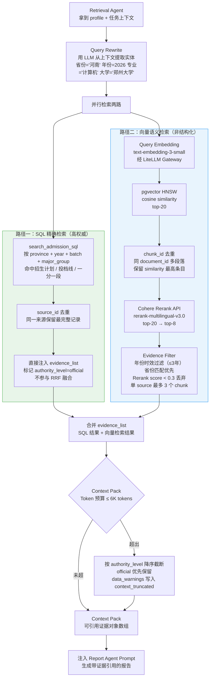
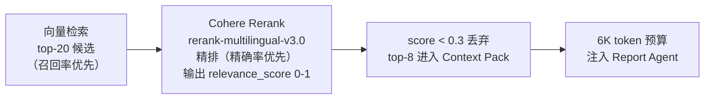

# RAG 检索管道设计

---

## 1. 为什么需要 RAG，RAG 负责什么

系统中有两类知识：

| 知识类型 | 示例 | 处理方式 | 理由 |
|---------|------|---------|------|
| 结构化精确数据 | 郑州大学 2025 年计算机专业最低位次 38500 | SQL 精确查询 | 必须 100% 准确，不允许近似 |
| 非结构化解释性内容 | 计算机专业主要学什么、就业方向如何 | RAG | 自然语言，适合语义检索 |
| 政策规则文本 | 招生章程中关于色觉的体检要求 | RAG | PDF/HTML，无法结构化 |
| 就业质量报告 | 某大学近三年就业率、主要去向城市 | RAG | 非结构化，段落语义 |

**RAG 不做什么**：录取概率、选科校验、保底判断。这些有了 RAG 的回答反而不可信，必须走规则和结构化数据。

---

## 2. 检索管道全流程



---

## 3. 为什么 MVP 不做 BM25 + RRF 混合检索

这是面试时容易被问到的权衡点。

**BM25 适合的场景**：关键词精确匹配，比如"郑州大学 060001 专业组"这种代码类查询。

**我们的实际情况**：
- 代码类查询已经由 SQL 精确检索覆盖，SQL 的准确率是 100%，BM25 在这里没有增量价值
- 非结构化文档（专业介绍、就业报告）的查询是语义类的，向量检索更合适
- BM25 需要额外建倒排索引（pg_trgm 或 `pg_bm25` 扩展），增加运维复杂度
- RRF 融合逻辑本身也需要调参和测试

**结论**：SQL（精确）+ 向量（语义）已经覆盖了两种典型场景，BM25 的边际价值不足以支撑 MVP 阶段的额外复杂度。Phase 2 向量检索效果验证后再引入。

虽然如此，系统已经在 `chunks` 表上准备了 `pg_bm25` 扩展的索引结构（`CREATE INDEX ... USING bm25`），升级时只需要更改检索函数，不需要改数据模型。

---

## 4. Embedding 模型选择与一致性约束

### 4.1 MVP 选择 text-embedding-3-small

| 维度 | text-embedding-3-small (OpenAI) | BAAI/BGE-large-zh |
|------|--------------------------------|-------------------|
| 维度 | 1536 | 1024 |
| 中文理解 | 良好 | 更好（专为中文优化） |
| 部署方式 | API 调用（经 LiteLLM） | 需要 GPU 自托管 |
| 启动时间 | 立即可用 | 需要 GPU 实例配置 |
| 成本 | 按 token 计费 | 固定 GPU 费用 |

MVP 选 OpenAI API 的理由：7-10 天内要部署上线，不想花时间配 GPU 运维。Phase 2 在 Railway 支持 GPU 后迁移。

### 4.2 为什么不能混用两套模型

```
text-embedding-3-small: 向量空间维度 1536，每个维度有特定语义含义
BAAI/BGE-large-zh:     向量空间维度 1024，完全不同的语义空间

如果查询 embedding 用 BGE，文档 embedding 是 text-3-small：
  cosine_similarity("计算机", "计算机相关内容") = 接近随机值
```

这不是理论问题，是数学上的必然。维度不同甚至连计算都会报错；即使强行统一维度，不同模型的向量空间也不对齐，相似度计算无意义。

### 4.3 模型迁移流程

```python
# 迁移时，用 embedding_model 字段过滤旧向量
old_chunks = db.query(Chunk).filter(
    Chunk.embedding_model == "text-embedding-3-small"
).all()

for chunk in old_chunks:
    new_embedding = bge_model.encode(chunk.content)    # 1024维
    chunk.embedding = new_embedding
    chunk.embedding_model = "bge-large-zh-v1.5"

# 迁移完成后，重建 HNSW 索引（维度变了，必须重建）
db.execute("DROP INDEX idx_chunks_embedding")
db.execute("""
    CREATE INDEX idx_chunks_embedding
    ON chunks USING hnsw (embedding vector_cosine_ops)
    WITH (m=16, ef_construction=64)
""")
```

---

## 5. Reranker 设计决策



**为什么两阶段而不是直接 top-8**：

向量检索的 embedding 是固定维度的稠密向量，擅长语义相关性，但不擅长细粒度的语言相关性判断（比如"河南省 2026 年招生计划"和"河南省 2025 年招生计划"在向量空间里距离很近，但对报告来说 2025 年比 2026 年差得多）。

Reranker 是 Cross-Encoder 架构，直接计算 query-document pair 的相关性分数，比 Bi-Encoder（向量检索）精度高得多，但计算量大，不适合做 top-200 的全量排序。

两阶段的设计：向量检索用 Bi-Encoder 快速缩小范围（召回），Reranker 用 Cross-Encoder 精确排序（精排），这是工业界标准做法。

**为什么用 Cohere 而不是自托管**：自托管 BGE-reranker 需要 GPU，Cohere API 每次请求约 $0.001，整个报告生成周期最多调用 3-5 次 rerank（每次处理约 20 个候选），成本可忽略不计。

---

## 6. Evidence Filter 阈值设计

```python
def filter_evidence(chunks: list[dict], province: str) -> list[dict]:
    filtered = []
    source_count = defaultdict(int)

    for chunk in chunks:
        # 年份时效：3年内有效，超过标 stale
        age = current_year - chunk["metadata"]["year"]
        if age > 3:
            chunk["stale"] = True  # 不丢弃，但在报告中标注

        # 省份匹配：同省优先，无同省数据允许全国性数据
        if chunk["metadata"].get("province") not in (province, None, "全国"):
            continue

        # Rerank 分数下限
        if chunk.get("rerank_score", 1.0) < 0.3:
            continue

        # 单 source 最大 3 个 chunk（防止单一来源主导报告）
        doc_id = chunk["document_id"]
        if source_count[doc_id] >= 3:
            continue
        source_count[doc_id] += 1

        filtered.append(chunk)

    # authority_level 排序：official > semi-official > third-party
    authority_order = {"official": 0, "semi-official": 1, "third-party": 2}
    filtered.sort(key=lambda x: (authority_order.get(x["authority_level"], 3),
                                  -x.get("rerank_score", 0)))
    return filtered[:8]  # top-8
```

**单 source 最多 3 个 chunk 的设计理由**：

招生章程是一个很长的 PDF，被切成 30-50 个 chunk，向量检索可能返回同一 PDF 的 10 个相邻段落，内容高度重复。这样 Context Pack 几乎全是一个来源，其他重要证据（就业报告、一分一段表）反而进不来，导致报告证据单一。限制每个 document 最多 3 个 chunk 强制多样化。

---

## 7. Context Pack Token 预算管理

```python
MAX_CONTEXT_TOKENS = 6000  # 约 4000 中文字

def build_context_pack(evidence_list: list[dict]) -> tuple[list[dict], list[str]]:
    packed = []
    total_tokens = 0
    warnings = []

    for evidence in evidence_list:
        tokens = count_tokens(evidence["quote"])
        if total_tokens + tokens > MAX_CONTEXT_TOKENS:
            warnings.append("context_truncated")
            break
        packed.append(evidence)
        total_tokens += tokens

    return packed, warnings
```

**6K tokens 限制的依据**：

Report Agent 的 system prompt + 结构化指令约 2K tokens，plan_json 骨架约 2K tokens，剩余 prompt budget 中给 RAG 证据留 6K，总 prompt 约 10K tokens，加上生成报告的 output tokens（约 3K），单次 Report Agent 调用约 13K tokens。

整个报告生成 run 有 5-6 个 LLM 节点，平均单节点 5K tokens，总计约 25-30K，远低于 150K 的 run 预算上限。

---

## 8. 检索质量评测指标

| 指标 | 计算方式 | 目标值 |
|------|---------|-------|
| Citation 覆盖率 | 报告关键结论（推荐理由、风险提示）中有 source_id 引用的比例 | ≥ 95% |
| 年份新鲜度 | evidence_list 中 year = current_year 的比例 | ≥ 80% |
| 省份匹配率 | evidence_list 中 province = user_province 的比例 | ≥ 90% |
| Rerank 召回率 | top-8 中有效（score ≥ 0.3）的比例 | ≥ 85% |

这些指标在 LangSmith 的 Trace 中记录，每次 run 都可以追踪。
