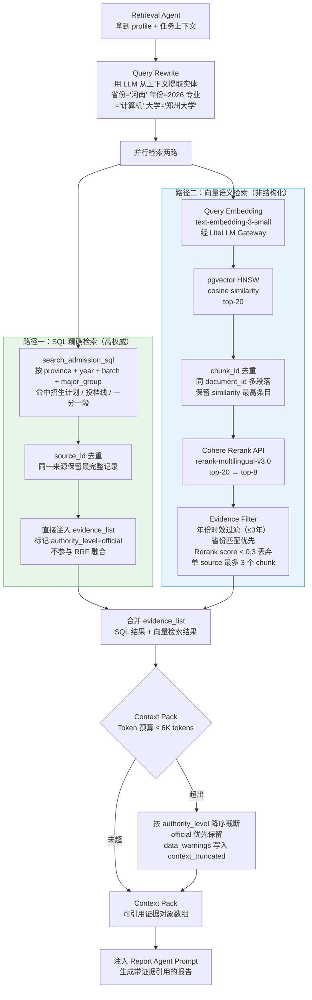
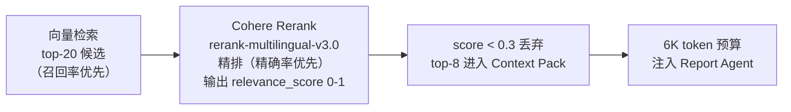

# RAG 检索管道设计

---

## 1. 为什么需要 RAG，RAG 负责什么

系统中有两类知识：

| 知识类型 | 示例 | 处理方式 | 理由 |
|---------|------|---------|------|
| 结构化精确数据 | 郑州大学 2025 年计算机专业最低位次 38500 | SQL 精确查询 | 必须 100% 准确，不允许近似 |
| 非结构化解释性内容 | 计算机专业主要学什么、就业方向如何 | RAG | 自然语言，适合语义检索 |
| 政策规则文本 | 招生章程中关于色觉的体检要求 | RAG | PDF/HTML，无法结构化 |
| 就业质量报告 | 某大学近三年就业率、主要去向城市 | RAG | 非结构化，段落语义 |

**RAG 不做什么**：录取概率、选科校验、保底判断。这些有了 RAG 的回答反而不可信，必须走规则和结构化数据。

---

## 2. 检索管道全流程


```mermaid
flowchart TD
    QUERY["Retrieval Agent\n拿到 profile + 任务上下文"]
    --> QR["Query Rewrite\n用 LLM 从上下文提取实体\n省份='河南' 年份=2026 专业='计算机' 大学='郑州大学'"]

    QR --> SPLIT["并行检索两路"]

    subgraph EXACT["路径一：SQL 精确检索（高权威）"]
        SQL_SEARCH["search_admission_sql\n按 province + year + batch + major_group\n命中招生计划 / 投档线 / 一分一段"]
        SQL_DEDUP["source_id 去重\n同一来源保留最完整记录"]
        SQL_INJECT["直接注入 evidence_list\n标记 authority_level=official\n不参与 RRF 融合"]
    end

    subgraph SEMANTIC["路径二：向量语义检索（非结构化）"]
        EMBED["Query Embedding\ntext-embedding-3-small\n经 LiteLLM Gateway"]
        VECTOR["pgvector HNSW\ncosine similarity\ntop-20"]
        CHUNK_DEDUP["chunk_id 去重\n同 document_id 多段落\n保留 similarity 最高条目"]
        RERANK["Cohere Rerank API\nrerank-multilingual-v3.0\ntop-20 → top-8"]
        FILTER["Evidence Filter\n年份时效过滤（≤3年）\n省份匹配优先\nRerank score < 0.3 丢弃\n单 source 最多 3 个 chunk"]
    end

    SPLIT --> SQL_SEARCH
    SPLIT --> EMBED
    SQL_SEARCH --> SQL_DEDUP --> SQL_INJECT
    EMBED --> VECTOR --> CHUNK_DEDUP --> RERANK --> FILTER

    SQL_INJECT --> MERGE["合并 evidence_list\nSQL 结果 + 向量检索结果"]
    FILTER --> MERGE

    MERGE --> BUDGET{"Context Pack\nToken 预算 ≤ 6K tokens"}
    BUDGET -- "超出" --> TRUNCATE["按 authority_level 降序截断\nofficial 优先保留\ndata_warnings 写入 context_truncated"]
    BUDGET -- "未超" --> PACK["Context Pack\n可引用证据对象数组"]

    TRUNCATE --> PACK
    PACK --> REPORT_AGENT["注入 Report Agent Prompt\n生成带证据引用的报告"]

    style EXACT fill:#e8f5e9,stroke:#4CAF50
    style SEMANTIC fill:#e8f4fd,stroke:#2196F3
```

---

## 3. 为什么 MVP 不做 BM25 + RRF 混合检索

这是面试时容易被问到的权衡点。

**BM25 适合的场景**：关键词精确匹配，比如"郑州大学 060001 专业组"这种代码类查询。

**我们的实际情况**：
- 代码类查询已经由 SQL 精确检索覆盖，SQL 的准确率是 100%，BM25 在这里没有增量价值
- 非结构化文档（专业介绍、就业报告）的查询是语义类的，向量检索更合适
- BM25 需要额外建倒排索引（pg_trgm 或 `pg_bm25` 扩展），增加运维复杂度
- RRF 融合逻辑本身也需要调参和测试

**结论**：SQL（精确）+ 向量（语义）已经覆盖了两种典型场景，BM25 的边际价值不足以支撑 MVP 阶段的额外复杂度。Phase 2 向量检索效果验证后再引入。

虽然如此，系统已经在 `chunks` 表上准备了 `pg_bm25` 扩展的索引结构（`CREATE INDEX ... USING bm25`），升级时只需要更改检索函数，不需要改数据模型。

---

## 4. Embedding 模型选择与一致性约束

### 4.1 MVP 选择 text-embedding-3-small

| 维度 | text-embedding-3-small (OpenAI) | BAAI/BGE-large-zh |
|------|--------------------------------|-------------------|
| 维度 | 1536 | 1024 |
| 中文理解 | 良好 | 更好（专为中文优化） |
| 部署方式 | API 调用（经 LiteLLM） | 需要 GPU 自托管 |
| 启动时间 | 立即可用 | 需要 GPU 实例配置 |
| 成本 | 按 token 计费 | 固定 GPU 费用 |

MVP 选 OpenAI API 的理由：7-10 天内要部署上线，不想花时间配 GPU 运维。Phase 2 在 Railway 支持 GPU 后迁移。

### 4.2 为什么不能混用两套模型

```
text-embedding-3-small: 向量空间维度 1536，每个维度有特定语义含义
BAAI/BGE-large-zh:     向量空间维度 1024，完全不同的语义空间

如果查询 embedding 用 BGE，文档 embedding 是 text-3-small：
  cosine_similarity("计算机", "计算机相关内容") = 接近随机值
```

这不是理论问题，是数学上的必然。维度不同甚至连计算都会报错；即使强行统一维度，不同模型的向量空间也不对齐，相似度计算无意义。

### 4.3 模型迁移流程

```python
# 迁移时，用 embedding_model 字段过滤旧向量
old_chunks = db.query(Chunk).filter(
    Chunk.embedding_model == "text-embedding-3-small"
).all()

for chunk in old_chunks:
    new_embedding = bge_model.encode(chunk.content)    # 1024维
    chunk.embedding = new_embedding
    chunk.embedding_model = "bge-large-zh-v1.5"

# 迁移完成后，重建 HNSW 索引（维度变了，必须重建）
db.execute("DROP INDEX idx_chunks_embedding")
db.execute("""
    CREATE INDEX idx_chunks_embedding
    ON chunks USING hnsw (embedding vector_cosine_ops)
    WITH (m=16, ef_construction=64)
""")
```

---

## 5. Reranker 设计决策


```mermaid
flowchart LR
    V["向量检索\ntop-20 候选\n（召回率优先）"]
    --> RERANK["Cohere Rerank\nrerank-multilingual-v3.0\n精排（精确率优先）\n输出 relevance_score 0-1"]
    --> FILTER["score < 0.3 丢弃\ntop-8 进入 Context Pack"]
    --> PACK["6K token 预算\n注入 Report Agent"]
```

**为什么两阶段而不是直接 top-8**：

向量检索的 embedding 是固定维度的稠密向量，擅长语义相关性，但不擅长细粒度的语言相关性判断（比如"河南省 2026 年招生计划"和"河南省 2025 年招生计划"在向量空间里距离很近，但对报告来说 2025 年比 2026 年差得多）。

Reranker 是 Cross-Encoder 架构，直接计算 query-document pair 的相关性分数，比 Bi-Encoder（向量检索）精度高得多，但计算量大，不适合做 top-200 的全量排序。

两阶段的设计：向量检索用 Bi-Encoder 快速缩小范围（召回），Reranker 用 Cross-Encoder 精确排序（精排），这是工业界标准做法。

**为什么用 Cohere 而不是自托管**：自托管 BGE-reranker 需要 GPU，Cohere API 每次请求约 $0.001，整个报告生成周期最多调用 3-5 次 rerank（每次处理约 20 个候选），成本可忽略不计。

---

## 6. Evidence Filter 阈值设计

```python
def filter_evidence(chunks: list[dict], province: str) -> list[dict]:
    filtered = []
    source_count = defaultdict(int)

    for chunk in chunks:
        # 年份时效：3年内有效，超过标 stale
        age = current_year - chunk["metadata"]["year"]
        if age > 3:
            chunk["stale"] = True  # 不丢弃，但在报告中标注

        # 省份匹配：同省优先，无同省数据允许全国性数据
        if chunk["metadata"].get("province") not in (province, None, "全国"):
            continue

        # Rerank 分数下限
        if chunk.get("rerank_score", 1.0) < 0.3:
            continue

        # 单 source 最大 3 个 chunk（防止单一来源主导报告）
        doc_id = chunk["document_id"]
        if source_count[doc_id] >= 3:
            continue
        source_count[doc_id] += 1

        filtered.append(chunk)

    # authority_level 排序：official > semi-official > third-party
    authority_order = {"official": 0, "semi-official": 1, "third-party": 2}
    filtered.sort(key=lambda x: (authority_order.get(x["authority_level"], 3),
                                  -x.get("rerank_score", 0)))
    return filtered[:8]  # top-8
```

**单 source 最多 3 个 chunk 的设计理由**：

招生章程是一个很长的 PDF，被切成 30-50 个 chunk，向量检索可能返回同一 PDF 的 10 个相邻段落，内容高度重复。这样 Context Pack 几乎全是一个来源，其他重要证据（就业报告、一分一段表）反而进不来，导致报告证据单一。限制每个 document 最多 3 个 chunk 强制多样化。

---

## 7. Context Pack Token 预算管理

```python
MAX_CONTEXT_TOKENS = 6000  # 约 4000 中文字

def build_context_pack(evidence_list: list[dict]) -> tuple[list[dict], list[str]]:
    packed = []
    total_tokens = 0
    warnings = []

    for evidence in evidence_list:
        tokens = count_tokens(evidence["quote"])
        if total_tokens + tokens > MAX_CONTEXT_TOKENS:
            warnings.append("context_truncated")
            break
        packed.append(evidence)
        total_tokens += tokens

    return packed, warnings
```

**6K tokens 限制的依据**：

Report Agent 的 system prompt + 结构化指令约 2K tokens，plan_json 骨架约 2K tokens，剩余 prompt budget 中给 RAG 证据留 6K，总 prompt 约 10K tokens，加上生成报告的 output tokens（约 3K），单次 Report Agent 调用约 13K tokens。

整个报告生成 run 有 5-6 个 LLM 节点，平均单节点 5K tokens，总计约 25-30K，远低于 150K 的 run 预算上限。

---

## 8. 检索质量评测指标

| 指标 | 计算方式 | 目标值 |
|------|---------|-------|
| Citation 覆盖率 | 报告关键结论（推荐理由、风险提示）中有 source_id 引用的比例 | ≥ 95% |
| 年份新鲜度 | evidence_list 中 year = current_year 的比例 | ≥ 80% |
| 省份匹配率 | evidence_list 中 province = user_province 的比例 | ≥ 90% |
| Rerank 召回率 | top-8 中有效（score ≥ 0.3）的比例 | ≥ 85% |

这些指标在 LangSmith 的 Trace 中记录，每次 run 都可以追踪。

---

## 9. 向量模型选型复议（2026-08-22）

> 背景：`data_pipeline` 的 `#11-embed` 任务在跑 `scripts/chunk_documents.py --embed-only` 时，LiteLLM 转发到 `litellm_config.yaml` 里配置的 `openai/moonshot-v1-emb-small` 返回 `403 The API you are accessing is not open`，因此重新调研了一遍向量模型选型。以下是联网调研的原始结论，按用户要求原文存档，不做删减。

### 结论先说

不建议死磕 Moonshot 的 `moonshot-v1-emb-small`——查了 Moonshot 官方文档和现有资料，**没有找到这个模型名真实存在的证据**，很可能是当初配置 `litellm_config.yaml` 时没验证过的占位/误填，值得先去 Moonshot 控制台核实这模型是否真的存在，而不是假设"申请权限就能用"。

对这个项目（中文为主、pgvector、LiteLLM网关、目前无GPU、数据量还小），推荐顺序：

1. **阿里云百炼 DashScope `text-embedding-v3`/`v4`（Qwen系列）**——托管API，中文检索质量第一梯队，OpenAI兼容协议，接入方式和现在配置Moonshot几乎一样（改`litellm_config.yaml`一行）
2. 备选：自建 **BGE-small-zh/BGE-base-zh**——如果数据不能出域，牺牲一点精度换数据留在自己手里
3. 不推荐 OpenAI `text-embedding-3-small`（现在代码里的命名）——它对中文优化程度明显弱于专门做中文/多语言的模型

### 选型依据：这几个维度决定怎么选

| 维度 | 为什么重要 | 对本项目的具体影响 |
|---|---|---|
| 中文检索质量 | 招生政策/专业介绍全是中文长文本，通用MTEB总分不能直接看，要看C-MTEB或MTEB里的retrieval子任务分 | BGE系列的基准（C-MTEB）本来就是为中文设计的；OpenAI的模型对中文是"够用"而非"优化过" |
| 部署方式 | 托管API零运维但要出网；自建保数据但吃算力 | jdy_server是单机docker-compose，**没有GPU**，自建大模型（Qwen3-Embedding-8B、BGE-M3全量568M）在CPU上查询延迟会明显，只能选小模型自建 |
| 与LiteLLM的兼容性 | 项目强制"所有embedding走LiteLLM代理" | 只要是OpenAI兼容协议、能填`api_base`+`api_key`，接入成本都一样低——DashScope、Moonshot都是这么接的 |
| 向量维度 | 影响pgvector存储和查询速度 | 阿里云官方自己的建议：**1024维是性能/成本的最佳平衡点**，1536/2048只在高精度场景才有必要 |
| 迁移成本 | CLAUDE.md已经写死"BM25和向量不能混用两种embedding模型，切换必须全库重建" | **现在恰好是最便宜的切换窗口**——`rag_chunks`目前只有4条数据，重建成本几乎为零；等#11-collect把10校数据都采进来之后再想换，代价会成倍增加 |
| 数据合规 | 高考志愿/学生信息属于敏感教育数据 | 国内厂商（阿里云/自建）在数据不出境这点上比调用境外API更省心 |
| 成本 | 按token计费 vs 自建固定算力成本 | 项目当前数据量级（几千条chunk）用哪个API价格都是零头，这一项在当前阶段不该是决定因素 |

### 候选模型对比

| 模型 | 类型 | 中文能力 | 部署方式 | 备注 |
|---|---|---|---|---|
| **Qwen3-Embedding / DashScope text-embedding-v3/v4** | 托管API（阿里云百炼） | 强，多语言MTEB榜首梯队（Qwen3-Embedding-8B多语言MTEB 70.58分） | 零运维，OpenAI兼容接口 | 官方建议默认1024维；支持自定义维度 |
| **BGE-M3** | 开源，可自建 | 强，C-MTEB基准的源头模型 | 568M参数，需要CPU/GPU资源；MIT协议 | 支持dense+sparse+多向量混合检索，功能上比单纯embedding更强，但本项目目前只用了简单向量检索，用不上这些高级特性 |
| **BGE-small/base-zh** | 开源，可自建 | 良好（比BGE-M3弱一档，换取更小体积） | 数十MB到百MB级，CPU可跑，适合当前无GPU的infra | 如果坚持要数据不出域，这是现实的自建选项 |
| **OpenAI text-embedding-3-small**（当前代码里的命名） | 托管API | 一般，官方定位是"英文优先" | 需要能连OpenAI（国内网络环境要考虑） | 只是历史遗留的命名，不代表真在用OpenAI |
| **Moonshot moonshot-v1-emb-small**（当前配置） | 托管API | 未知，**官方文档查无实据** | 当前403 | 建议先去核实这模型是否真的存在于Moonshot产品列表里 |

### 怎么做 trade-off

按项目的实际情况，优先级排序应该是：**中文检索质量 > 迁移时机（现在数据量小） > 部署运维成本 > token成本**——token成本在现在的数据量级下几乎可以忽略，不该是决定因素；反而"现在数据只有4条chunk，换模型几乎零成本，等#11-collect把10校数据采完再换就要重新embed全库"这个时机窗口，是最值得权衡的一点。

如果最终目标是"数据绝对不出境"，那就应该优先看自建BGE系列，接受CPU推理延迟和运维成本；如果目标是"尽快解锁RAG检索且减少运维负担"，DashScope是更快的路径，且换掉配置不需要动代码——`app/engine/embedding.py`里的`EMBEDDING_MODEL`/`EMBEDDING_DIMS`常量和`litellm_config.yaml`里的一条映射改一下就行。

### Sources

- [How to Choose the Best Embedding Model for RAG in 2026: 10 Models Benchmarked](https://milvusio.medium.com/how-to-choose-the-best-embedding-model-for-rag-in-2026-10-models-benchmarked-4efc9508a193)
- [Best Embedding Model for RAG 2026: 10 Models Compared - Milvus Blog](https://milvus.io/blog/choose-embedding-model-rag-2026.md)
- [Which Embedding Model Should You Actually Use in 2026?](https://zc277584121.github.io/rag/2026/03/20/embedding-models-benchmark-2026.html)
- [Embedding models comparison: OpenAI, Google, Qwen, Nomic, Jina, BAAI | SurrealDB](https://surrealdb.com/blog/embedding-models-comparison)
- [Comparative Analysis of Qwen-3 and BGE-M3 Embedding Models for Multilingual Information Retrieval](https://medium.com/@mrAryanKumar/comparative-analysis-of-qwen-3-and-bge-m3-embedding-models-for-multilingual-information-retrieval-72c0e6895413)
- [Best Embedding Models for RAG (2026): Ranked by MTEB Score, Cost, and Self-Hosting](https://www.premai.io/blog/best-embedding-models-for-rag-2026-ranked-by-mteb-score-cost-and-self-hosting/)
- [向量化-大模型服务平台百炼(Model Studio)-阿里云帮助中心](https://help.aliyun.com/zh/model-studio/embedding)
- [/embeddings | liteLLM](https://docs.litellm.ai/docs/embedding/supported_embedding)
- [Jina AI | liteLLM](https://docs.litellm.ai/docs/providers/jina_ai)

---

## 10. 向量数据库选型问答记录（2026-08-22）

> 背景：用户提问"现在系统用的是哪个向量数据库？市面上有哪些向量数据库？不同的向量数据库使用场景上有什么区别？当前项目为什么选择这个向量数据库？架构设计上的 trade off 是什么？"，随后追问"Milvus和Qdrant和chroma和pgvector 这四个向量数据库再给我系统全面详细对比一下"。以下按用户要求原文存档两轮问答，不做删减。

### 10.1 第一轮：当前用的是什么、市面全景、为什么选它、trade-off

#### 结论先说

当前系统用的是 **pgvector**——PostgreSQL 的向量扩展（`pgvector/pgvector:pg16` 镜像），不是独立的向量数据库。`rag_chunks.embedding` 列类型 `vector(1024)`，配 HNSW 索引（`vector_cosine_ops`），检索用 cosine 距离取 top-20，再过 Cohere Rerank 精排到 top-8（`backend/app/engine/retrieval.py`）。选它本质是"业务数据库直接顺手加一列"，不是"为向量检索单独选型"。

> 补充纠偏：CLAUDE.md 里提到的 BM25（`pg_bm25`/ParadeDB）目前**代码里没有实际接入**，`retrieval.py` 现在只有纯向量检索，没有做混合检索——这是文档写的设计意图，还没有落地，回头有机会可以更新一下文档标注这个 gap。

#### 市面上的向量数据库全景

| 类别 | 代表产品 | 特点 |
|---|---|---|
| **专用向量数据库** | Milvus、Qdrant、Weaviate、Pinecone、Chroma | 从零为向量检索设计，索引算法（HNSW/IVF/DiskANN）选择多、支持数十亿级向量、有专门的水平扩展和分片机制 |
| **关系库插件** | pgvector（Postgres）、pgvecto.rs | 在已有关系库里加一种列类型，向量检索和业务数据（事务、外键、SQL join）天然在同一个库里 |
| **搜索引擎扩展** | Elasticsearch/OpenSearch 的 `dense_vector`、pg_bm25（ParadeDB） | 主战场是全文检索，向量是附加能力，天然适合做"关键词+语义"混合检索 |
| **托管一体化服务** | Pinecone、Zilliz Cloud、阿里云 DashVector | 免运维，按量计费，通常锁定单一云厂商 |

#### 使用场景上的核心区别

| 维度 | 专用向量DB（Milvus/Qdrant） | pgvector | 搜索引擎（ES/OpenSearch） |
|---|---|---|---|
| 适合的数据规模 | 千万~百亿级向量，需要水平扩展 | 百万级以内，单机够用 | 中等规模，且已经在用ES做日志/搜索 |
| 索引算法选择 | 丰富（HNSW/IVF-PQ/DiskANN），可精细调优召回/延迟/内存 | 只有HNSW/IVFFlat两种，调优空间小 | dense_vector功能较新，成熟度不如专用DB |
| 与业务数据关联查询 | 弱，向量库和业务库是两套系统，要应用层拼接 | 强，向量和结构化字段（如省份/年份/院校）能写在同一条SQL里 | 中等，擅长关键词过滤+向量混合 |
| 运维复杂度 | 高，多一套独立系统的部署/监控/备份 | 低，复用现有Postgres运维能力 | 中，如果本来就有ES集群则边际成本低 |
| 典型选择场景 | 电商推荐、图片搜索等海量向量、独立RAG中台 | 中小型RAG应用、已有Postgres业务库、数据强一致性要求高 | 已有全文搜索需求，向量是锦上添花 |

#### 为什么这个项目选 pgvector

结合项目实际情况，这几点决定性因素：

1. **数据规模小**：目前 `rag_chunks` 只有个位数到几百条（江苏10校政策文档），未来即使铺开到多省份也是万级别，远达不到需要专用向量DB的规模门槛
2. **单机部署**：`docker-compose` 跑在一台 jdy_server 上，没有独立运维团队，多引入一套 Milvus/Qdrant 意味着多一套要维护的分布式系统，性价比低
3. **业务数据已经在 Postgres 里**：`AdmissionScore`/`University`等结构化数据本来就在同一个库，`vector_search` 能直接和业务表 join 或用同一次事务查询，不用应用层做"两个数据源拼接"
4. **无 GPU、依赖托管 Embedding API**：向量生成本身已经外包给 DashScope，本地不需要为向量检索单独囤算力，pgvector 的 HNSW 在这个数据量级下 CPU 查询延迟完全够用

#### 架构设计上的 Trade-off

| 换来了什么 | 付出了什么代价 |
|---|---|
| 零额外运维成本（复用现有 Postgres 备份/监控/高可用） | 索引能力弱于专用向量DB，只有HNSW一种可调索引，召回率/延迟的精细调优空间小 |
| 向量检索能和业务字段在一条SQL里精确过滤（如"只查浙江2025年政策类chunk"） | 单机纵向扩展的天花板明显，未来数据量涨到千万级会先撞到Postgres本身的扩展瓶颈 |
| embedding 模型/维度变更时，迁移路径就是标准的 alembic migration（如这次从1536维切到1024维只是一次 drop+recreate 列） | pgvector 列宽是类型的一部分，改维度不能 `ALTER...USING`，必须整列重建，且**必须全库重新跑一遍 embedding**（CLAUDE.md 里明确写的硬约束） |
| 技术栈单一，团队只需要精通一套数据库 | 没有专用向量DB的高级特性（如Qdrant的payload过滤+向量联合索引优化、Milvus的多种量化压缩），未来数据量上去后如果要迁移，成本不小 |

**一句话总结**：这是一个"当前阶段用最小代价换够用的能力"的选择——数据量和团队规模都还没到需要专用向量数据库的临界点，用 pgvector 省了一整套独立系统的运维成本；代价是把"向量检索的精细调优空间"和"未来规模化的扩展性"往后押了，等真的遇到瓶颈时再评估迁移到 Milvus/Qdrant 之类的专用方案。

### 10.2 第二轮：Milvus / Qdrant / Chroma / pgvector 系统对比

#### 结论先说

这四个工具分属三个不同的"重量级"：**Chroma**是轻量原型工具，**pgvector**是"关系库+向量"的务实方案，**Qdrant**是中量级专用向量数据库，**Milvus**是重量级、面向超大规模的专用向量数据库。选择顺序基本跟着"数据规模 + 运维投入意愿"走，不是功能谁更强。

#### 一、总览定位

| 维度 | Milvus | Qdrant | Chroma | pgvector |
|---|---|---|---|---|
| 本质 | 专用分布式向量数据库 | 专用向量数据库（Rust） | 嵌入式/轻量向量存储 | PostgreSQL 扩展 |
| 开发者 | Zilliz（中国团队主导，LF AI基金会托管） | Qdrant团队（俄罗斯/德国背景） | Chroma团队（YC背景） | pgvector 社区维护，独立于PG核心 |
| 发布时间 | 2019 | 2021 | 2022 | 2021 |
| 定位一句话 | "向量检索界的 Elasticsearch/Hadoop"，为海量向量而生 | "向量检索界的 Qdrant"，性能与易用性平衡 | "给 LLM 应用做的默认向量库"，几行代码启动 | "给已有 Postgres 加一种列类型" |
| 典型使用者画像 | 大厂搜推/独立RAG中台/十亿级向量 | 中大型RAG应用、需要性能又不想太重 | Demo/原型/个人项目/小型应用 | 已有Postgres业务库的中小型RAG应用 |

#### 二、架构与部署形态

| 维度 | Milvus | Qdrant | Chroma | pgvector |
|---|---|---|---|---|
| 语言实现 | Go + C++（核心计算） | Rust | Python（底层用 SQLite/DuckDB/ClickHouse可选） | C（PG扩展） |
| 部署形态 | 分布式集群（计算存储分离，类Hadoop架构）或轻量单机版 Milvus Lite | 单机二进制 / Docker / 分布式集群模式 | 嵌入式进程内运行，或轻量 server 模式 | 就是Postgres的一部分，随PG部署 |
| 分布式能力 | 原生支持，计算/存储/协调分离（类似 Kafka+MinIO架构），可水平扩展到十亿~百亿级 | 支持分片+副本集群模式，扩展能力不如Milvus激进 | 无原生分布式，单机为主 | 无原生分布式，跟着Postgres走（读写分离/分区表需要自己搭） |
| 存储依赖 | 依赖etcd（元数据）+ MinIO/S3（对象存储）+ Pulsar/Kafka（消息队列），组件多 | 自带存储引擎，依赖少 | 自带（默认SQLite） | 无额外依赖，就是一张PG表 |
| 单机可用性 | 提供 Milvus Lite（嵌入式，功能阉割版）应对轻量场景 | 单机模式非常轻量，一个二进制/一个容器就能跑 | 天生为单机/嵌入式设计 | 天生为单机场景设计 |

**关键判断**：Milvus 的分布式架构组件最多（etcd+MinIO+Pulsar），单机部署"杯水车薪、集群部署又杀鸡用牛刀"，是四者里运维成本曲线最陡的。

#### 三、索引算法与查询能力

| 维度 | Milvus | Qdrant | Chroma | pgvector |
|---|---|---|---|---|
| 支持的索引类型 | 最全：HNSW、IVF-FLAT、IVF-PQ、IVF-SQ8、DiskANN、ANNOY、GPU索引（RAFT） | HNSW（主力），支持标量量化/二值量化压缩内存 | HNSW（基于 hnswlib） | HNSW、IVFFlat 两种 |
| 量化/压缩支持 | 丰富（PQ乘积量化、SQ标量量化、支持GPU加速） | 支持标量量化、二值量化，大幅降内存占用 | 无 | 无（0.7版本后有一些实验性支持，生产不成熟） |
| 元数据过滤（filter） | 支持，标量字段建索引后可高效过滤 | 支持，且过滤与向量检索结合优化得较好（filter不降级为brute force） | 支持基础的 where 过滤，复杂过滤能力较弱 | 强——本身就是SQL，`WHERE`任意组合、JOIN业务表都行 |
| 混合检索（向量+关键词） | 支持稀疏+稠密混合检索（Milvus 2.4+） | 支持稀疏向量+稠密向量混合 | 不支持原生混合检索 | 需要额外接 `pg_bm25`/`tsvector`自己拼，无原生方案 |
| 多租户/Collection隔离 | 支持Database/Collection/Partition多级隔离 | 支持Collection级隔离 | 支持Collection级隔离 | 就是表/schema，Postgres原生权限体系 |
| 查询语言 | SDK（Python/Java/Go）+ 类SQL的部分能力 | REST/gRPC API，SDK友好 | Python API，极简 | 原生SQL，学习成本最低（如果你会SQL） |

**关键判断**：过滤检索这块，pgvector因为是SQL反而是"降维打击"——业务字段过滤是它的主场；Milvus在索引丰富度和量化压缩上最强，适合真正的大规模场景；Chroma过滤能力最弱，适合数据量小、过滤需求简单的场景。

#### 四、性能与规模

| 维度 | Milvus | Qdrant | Chroma | pgvector |
|---|---|---|---|---|
| 适合的向量规模 | 千万~百亿级 | 百万~十亿级 | 十万~千万级（单机瓶颈明显） | 百万级以内（受限于Postgres单机性能） |
| 查询延迟（同规模下） | 大规模下延迟稳定性最好（专门优化过） | 单机场景延迟表现优秀，Rust实现效率高 | 数据量大时延迟明显劣化（缺乏分布式和高级索引） | 百万级以内延迟可控，但HNSW调参空间小于专用DB |
| 写入吞吐 | 高（专门设计了流式写入+批量构建索引的分离架构） | 中高 | 低~中（更适合读多写少场景） | 中（受Postgres MVCC/WAL机制影响，大批量写入需要调优） |
| 横向扩展方式 | 加计算节点/查询节点，云原生 | 加分片节点 | 无原生方案，只能纵向加机器 | Postgres读写分离/分区表，非向量检索原生特性 |

#### 五、运维复杂度与生态

| 维度 | Milvus | Qdrant | Chroma | pgvector |
|---|---|---|---|---|
| 上手难度 | 高，概念多（Collection/Partition/Segment/Channel），生产部署需要理解整套分布式组件 | 中，单机模式很容易上手，集群模式需要一些经验 | 极低，`pip install chromadb`几行代码起飞 | 低（如果团队本来就懂Postgres），`CREATE EXTENSION vector`即可 |
| 监控/可观测性 | 完善（Prometheus/Grafana集成成熟，毕竟走过大规模生产验证） | 提供基础metrics，不如Milvus完善 | 较弱，缺乏生产级监控工具链 | 完全复用Postgres已有的监控体系（pg_stat_statements等） |
| 云托管选项 | Zilliz Cloud（官方托管） | Qdrant Cloud（官方托管） | Chroma Cloud（较新，仍在完善） | 各大云厂商RDS/云数据库PostgreSQL都直接支持（AWS RDS、阿里云RDS等），托管生态最成熟 |
| 社区/生态成熟度 | 最成熟，LF AI基金会背书，大量生产案例 | 成长快，社区活跃，Rust生态加分 | 社区活跃但偏"教程/demo"向，生产案例较少 | 依托Postgres的庄大生态，工具链（备份/迁移/ORM）现成 |
| LangChain/LlamaIndex集成 | 支持完善 | 支持完善 | 支持完善（是很多LLM教程的默认选择） | 支持完善 |

#### 六、成本考量

| 维度 | Milvus | Qdrant | Chroma | pgvector |
|---|---|---|---|---|
| 自建硬件成本 | 高（多组件、建议多节点） | 中（单机模式硬件需求低） | 低（嵌入式，几乎无额外成本） | 极低（复用现有Postgres实例） |
| 云托管价格 | 中高（按计算/存储分别计费） | 中 | 中（新兴，定价还在调整） | 低（大部分云RDS本身价格，扩展免费） |
| 团队学习成本 | 高（新概念、新运维体系） | 中 | 极低 | 极低（如果已经懂SQL/Postgres） |
| 迁移成本（换掉它） | 高（数据模型、API都是专有的） | 中 | 低（数据量通常小，迁移容易） | 低（本质是一张表，导出/导入是标准SQL操作） |

#### 七、一句话选型建议

| 场景 | 推荐 | 理由 |
|---|---|---|
| 快速做 Demo/POC，几百条数据 | **Chroma** | 零运维，几行代码起飞，够用就行 |
| 已有 Postgres 业务库，数据量中小、需要向量+业务字段联合查询 | **pgvector** | 零额外系统，SQL天然支持复杂过滤，本项目正是这个场景 |
| 独立 RAG 中台，数据量中等偏大（百万级+），追求性能又不想太重 | **Qdrant** | 性能优秀、运维比Milvus轻，是"专用向量DB"里的性价比之选 |
| 千万级以上向量、需要真正的分布式弹性扩展、有专门团队运维 | **Milvus** | 索引/量化能力最全，生产验证最充分，但代价是最重的运维负担 |

**回到当前项目**：数据量（几百到万级chunk）、单机部署、无专职运维团队，都精准落在 pgvector 的舒适区，暂时没有触及需要迁移到 Qdrant/Milvus 的临界点——真到了那个规模，Qdrant会是比Milvus更现实的下一步（运维成本曲线更平滑）。
