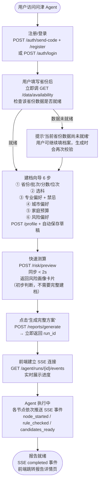
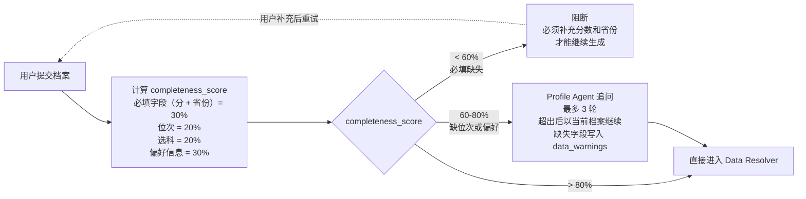
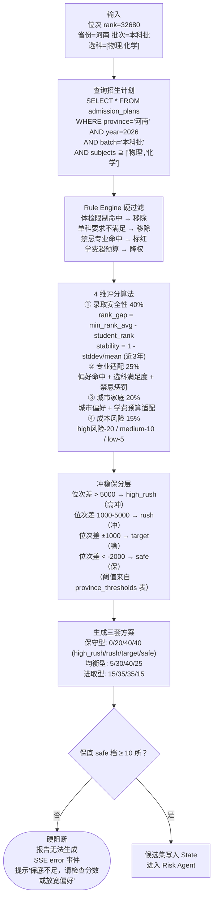
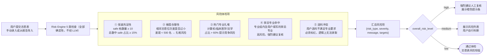
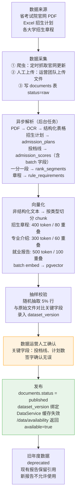
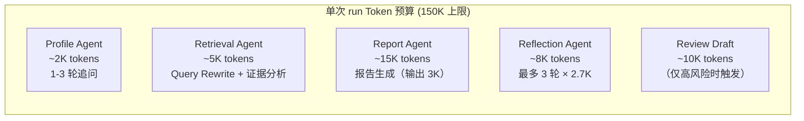

# 核心业务流程设计

> **v1.1**：已移除人工复核等待流程；鉴权改为 `POST /auth/send-code` + `/auth/register` + `/auth/login`（邮箱+密码，Resend 验证码）。

---

## 1. 核心业务全景

问津 Agent 的主流程是一个**高风险决策辅助系统**，核心约束是：

> 不能给出"保证录取"的结论，只能给出"基于数据的辅助决策"，并在 UI 明确展示高风险说明。

这个约束贯穿所有业务流程设计。

---

## 2. 主流程：从建档到报告交付

### 2.1 整体业务流程


> v1.1 已移除 HITL 分支（原 `human_interrupt` / 复核等待 / `resume`）。

### 2.2 建档完整度与追问策略



**为什么位次比分数更重要**：

不同省份的录取是按位次而不是分数（新高考省份尤其如此）。分数相同在河南可能是 3 万名，在宁夏可能是 1 千名，录取结果完全不同。

但很多用户只知道分数，不知道位次。这时 Profile Agent 会追问，并且在 `province_thresholds` 表里用"每 10 分 ≈ 1000 位次"的估算规则提供粗略换算，在报告中标注"位次估算，仅供参考"。

**追问轮次上限的设计**：无限追问会让用户感到烦躁（想象一个不停问问题的客服），设 3 轮上限强制继续，缺失字段以 `data_warnings` 标注，在报告中显示"以下推荐基于不完整信息"。

---

## 3. 报告生成流程（Agent 内部）

### 3.1 候选生成与冲稳保分层



**保底硬下限 10 所的设计依据**：

河南省最多填 96 个志愿，保守估计一套方案里 safe 档应该占 40%（约 38 所）。但考虑到用户可能偏好集中、省份数据部分缺失等情况，10 所是能保证"不因为没有保底学校而全军覆没"的最低阈值。

低于这个数字说明用户的条件（选科、偏好、预算）过于限制，推荐系统无法生成有意义的保底方案，与其生成一个名义上"有保底"实则风险极高的报告，不如直接阻断让用户调整条件。

### 3.2 志愿表风险体检



---

## 4. 数据管道（ETL）流程



**关键设计：为什么数据发布要人工确认**

系统的核心信任度建立在数据准确性上。如果招生计划的学校代码抄错了，或者投档线的行数据偏移了，系统会推荐完全错误的学校——而用户可能就此填报了。

自动化解析（尤其是 PDF OCR）有约 0.5-2% 的字段错误率。人工抽样校验 5% 行，可以发现系统性错误（比如某列全部偏移）。发现错误时整批数据回退到 `parsed` 状态，修复后重新校验发布。

---

## 5. 错误处理与降级策略

### 5.1 错误分层

```
                      ┌── 硬阻断 ──────────────────────────┐
                      │  数据未发布                          │
                      │  Rule Engine 不可用                 │
                      │  候选生成为空                        │
                      │  保底 < 10 所                       │
                      │  后果：立即终止 run，SSE error 事件   │
                      └─────────────────────────────────────┘

                      ┌── 可降级 ───────────────────────────┐
                      │  向量检索失败 → SQL 检索接管          │
                      │  Cohere Rerank 不可用 → 跳过精排     │
                      │  后果：继续执行，报告中标注"数据受限"  │
                      └─────────────────────────────────────┘

                      ┌── 可重试（瞬时故障）────────────────┐
                      │  LLM API 429 / 网络超时              │
                      │  重试策略：3次，1s→2s→4s 指数退避    │
                      │  超限后：阻断，run 标记 failed        │
                      └─────────────────────────────────────┘

                      ┌── 静默记录 ──────────────────────────┐
                      │  非关键 metadata 缺失                 │
                      │  次要字段解析失败                     │
                      │  后果：写 warning 日志，不传播给用户   │
                      └─────────────────────────────────────┘
```

**硬阻断的设计原则**：

高风险场景宁可明确失败，不能静默降级。想象如果 Rule Engine 故障了，系统"降级"为跳过规则校验，那选科不满足的学校也会被推荐出来。用户不知道规则没检查，报告看起来正常，但填报了不满足选科要求的专业就直接被退档。

所以 Rule Engine、数据发布状态、保底数量——这些是"底线约束"，失败只能阻断，不能降级。

### 5.2 降级的 State 传播

```python
# Retrieval Agent 降级后
if retrieval_failed:
    state["degraded_agents"].append("retrieval_agent")
    state["data_warnings"].append("向量检索不可用，已降级到结构化数据检索")

# Report Agent 生成报告时检查降级状态
if "retrieval_agent" in state["degraded_agents"]:
    report_template.add_disclaimer(
        "由于检索服务临时不可用，本报告中部分非结构化内容（专业介绍、就业解读）"
        "基于有限数据，仅供参考。"
    )
```

降级信息必须透传到报告，让用户知道"这部分内容的数据是降级的"，而不是看起来完整实则基于不完整数据的报告。

---

## 6. 可观测性设计

### 6.1 结构化日志

每条日志包含完整的追踪字段：

```json
{
  "timestamp": "2026-06-30T10:00:00+08:00",
  "level": "INFO",
  "service": "agent",
  "run_id": "run_abc123",
  "thread_id": "thread_xyz",
  "user_id": "user_001",
  "node": "retrieval_agent",
  "event": "vector_search_degraded",
  "message": "向量检索超时（3200ms），降级到 SQL 检索",
  "latency_ms": 3200,
  "error_code": "vector_search_timeout"
}
```

**敏感字段处理**：日志里不出现 `score`、`rank` 等成绩数据，只记录 `profile_id` 引用。原因：日志往往集中存储、多人可访问，成绩是个人隐私数据，不需要出现在日志里。

### 6.2 LangSmith Trace 追踪

每个 Agent run 对应一条 LangSmith Trace，`trace_url` 存在 `agent_runs.trace_url` 里，可以从管理后台一键跳转。

Trace 覆盖的关键信息：

| 字段 | 用途 |
|------|------|
| `node_name` | 知道是哪个节点出了问题 |
| `input_tokens / output_tokens` | 成本归因，识别哪个节点最贵 |
| `latency_ms` | 延迟瓶颈分析 |
| `tool_calls` | 工具调用入参/出参/耗时/成功率 |
| `model_name` | 模型切换后的对比分析 |
| `degraded` | 降级执行标记 |

### 6.3 关键监控指标

| 指标 | 告警阈值 | 含义 |
|------|---------|------|
| `agent_run_error_rate` | 5min > 10% | 系统性故障 |
| `report_p95_latency_ms` | > 60s | 超出用户等待上限 |
| `llm_cost_usd_per_run` | 单次 > $0.50 | prompt 可能有问题 |
| `reflection_max_iter_rate` | 5min > 5% | Report Agent 质量下降 |
| `human_review_pending_count` | > 20 条 | 复核员能力不足，需加人 |
| `vector_search_fallback_rate` | 5min > 20% | pgvector 或 Cohere 服务故障 |

---

## 7. 成本控制



**成本与质量的权衡**：

Reflection Agent 最多跑 3 轮，每轮约 2.7K tokens（Judge 是最贵的 LLM 节点之一）。3 轮上限一方面防止死循环，另一方面控制成本——3 轮约 8K tokens，如果放到 10 轮就是 27K，每次合规检测的成本翻 3 倍。

3 轮的依据：实际测试中，报告质量问题通常在第 1-2 轮就能修正，第 3 轮几乎不出现"第 3 轮通过但前 2 轮都没通过"的情况。如果 3 轮都没通过，大概率是 Report Agent 的 prompt 有问题，需要人工介入。
