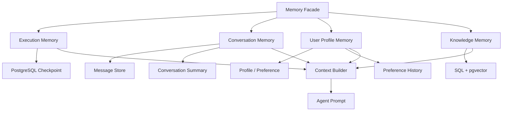

# 总体评价

你的记忆系统设计方向是对的，尤其适合高考志愿这种高风险业务：

> **重要事实结构化保存，对话用于连续体验，知识通过 RAG 按需召回。**

当前大约属于“中等成熟度”：

- 数据持久化：较好
- 多会话管理：较好
- 工作状态管理：基础可用
- Context 管理：偏初级
- 执行恢复：缺失
- 长期用户记忆：只有显式偏好，没有真正的记忆治理

不建议推倒重来，适合做一次“分层收敛式重构”。

---

# 一、当前有哪些记忆类型

## 1. 工作记忆 Working Memory

载体是 `VolunteerPlanState`：

- 用户档案
- 检索证据
- 规则结果
- 候选院校
- 风险项
- Reflection 轮数
- 工具调用日志

使用场景：单次报告生成中，不同节点交换信息。

优点：

- State 字段清晰
- 并行字段使用 Reducer，避免相互覆盖
- 每个节点职责边界明确

缺点：

- 当前只存在于进程运行期间
- 没有 Checkpointer
- Worker 崩溃后无法恢复
- State 中虽然有 `messages`，但主报告图并没有真正形成多轮对话记忆

---

## 2. 建档对话记忆 Conversation Memory

IntakeAgent 使用：

```text
Redis：intake:history:{owner_key}:{conversation_id}
PostgreSQL：intake_conversations
```

使用场景：

- 用户多轮咨询
- 从历史会话继续
- 建档前保持上下文
- 匿名用户登录后合并历史

优点：

- Redis 热层 + PostgreSQL 冷层
- 支持多会话
- 支持重命名、软删除
- 有用户/匿名身份隔离
- Redis 有 7 天 TTL

缺点：

- 只取最近 16 条，早期信息直接丢出 Context
- 没有历史摘要
- `messages_json` 整体覆盖，长期并发写入容易出现最后写入覆盖
- Redis 和数据库写入、回源逻辑分散在 API 文件里，没有统一 Memory Service

---

## 3. 报告问答记忆

ConversationAgent 使用：

```text
Redis：chat:history:{report_id}:{user_id}
PostgreSQL：report_conversations
```

使用场景：

- 用户针对报告连续追问
- 保持“上一个问题在讨论哪所学校”的语境
- 页面刷新后恢复问答

优点：

- 按报告隔离，避免不同报告上下文混用
- 最近历史进入 LLM
- PostgreSQL 可以在 Redis 丢失后兜底

缺点：

- 只保留最近 10 条进入 Prompt
- 没有摘要和重要信息提取
- 匿名身份的写入与读取 Key 存在不一致：发送时可能使用 `anon:{IP}`，读取/删除时使用 `"anon"`，需要优先修复
- DB 持久化是 best-effort，失败后没有补偿机制
- 同一用户并发发送两条消息可能产生历史覆盖

---

## 4. 结构化用户长期记忆

主要是：

- `StudentProfile`
- `Preference`

保存：

- 省份、分数、位次、选科
- 家庭预算
- 城市偏好
- 专业偏好
- 排斥专业
- 职业优先级
- 风险风格

使用场景：

- 规则校验
- 推荐评分
- 报告生成
- 局部重新生成

这是当前设计最正确的地方。

高风险业务中，“预算 8 万”“不能学医学”“必须留在省内”不能只存在聊天文本或向量库里，必须结构化保存，才能被规则引擎准确使用。

缺点：

- 只保存当前值，没有变化历史
- 没有记录信息来源
- 没有区分“用户明确表达”和“模型推断”
- 没有置信度、有效期、最后确认时间
- 偏好冲突时缺少处理策略

---

## 5. 外部知识记忆 Knowledge Memory

载体：

- 文档 Chunk
- Embedding
- pgvector
- SQL 招生数据
- Evidence Chain

使用场景：

- 招生政策
- 院校信息
- 专业介绍
- 历史录取数据
- 报告引用来源

优点：

- SQL 精确数据与向量语义检索分离
- 有 Rerank
- 有证据引用
- 不让向量检索决定硬性规则

注意：

> RAG 知识库属于“外部知识记忆”，不能等同于“用户长期记忆”。

---

## 6. 决策与运行记忆

目前还保存了：

- 报告版本
- `parent_report_id`
- `run_summary_json`
- `debug_summary_json`
- 节点耗时
- 工具调用记录
- Reflection 轮数

使用场景：

- 报告版本回溯
- 决策过程展示
- Admin 调试
- 故障定位

它属于审计和事件记忆，但当前不会自动参与下一次推理。

---

# 二、优缺点总结

## 优点

| 优点 | 价值 |
|---|---|
| 结构化事实与对话记忆分离 | 降低高风险业务中的幻觉 |
| Redis + PostgreSQL 双层存储 | 同时兼顾性能和持久化 |
| 多会话隔离 | 支持真实产品形态 |
| 用户档案直接进入规则引擎 | 可验证、可审计 |
| RAG 知识与用户偏好分开 | 记忆边界比较清晰 |
| 有 TTL 和消息数量限制 | 防止 Context 无限增长 |
| 报告版本和运行摘要 | 有决策回溯基础 |

## 缺点

| 缺点 | 后果 |
|---|---|
| 没有 Checkpoint | Worker 崩溃只能重跑 |
| 没有对话摘要 | 早期重要信息会遗忘 |
| 使用字符截断 | 不准确，可能截断 JSON |
| 没有统一 Context Builder | 每个 Agent 自己拼 Prompt |
| Memory 读写逻辑分散 | 容易出现 Key、TTL、身份规则不一致 |
| `messages_json` 整体覆盖 | 并发写入可能丢消息 |
| 长期偏好没有来源和置信度 | 模型推断可能污染事实 |
| 没有遗忘、纠错、冲突机制 | 旧偏好可能持续影响推荐 |
| 没有 Memory 评测 | 无法证明系统到底记得准不准 |

---

# 三、是否需要重新设计

结论：

> 不需要推倒重来，但需要重新划分 Memory 边界，并把分散逻辑收拢。

推荐架构：



不要设计一个什么都做的巨大 `MemoryManager`。建议保持四个独立领域：

1. Execution Memory：解决恢复
2. Conversation Memory：解决聊天连续性
3. User Memory：解决跨会话个性化
4. Knowledge Memory：解决外部知识召回

统一的是读取接口、身份隔离、观测和 Context 组装规则。

---

# 四、第一步：PostgreSQL Checkpoint

## 它解决什么

Checkpoint 不是聊天记录，而是 Agent 的执行快照。

例如：

```text
data_resolver ✅
retrieval_agent ✅
policy_rule_agent ✅
recommendation 执行中崩溃
```

恢复后应该直接从 recommendation 附近继续，不能重新检索和校验规则。

## 建议设计

- PostgreSQL 作为权威 Checkpoint 存储
- Redis 继续负责队列、SSE、会话缓存
- `thread_id` 标识一条执行线程
- `run_id` 标识一次执行尝试
- `checkpoint_id` 标识某个状态快照

## 必须同步解决幂等

Checkpoint 通常意味着至少一次执行，同一节点可能被重复执行。

因此：

- 报告写入增加 `run_id + version` 唯一约束
- SSE 完成事件需要去重
- 外部写工具携带 `idempotency_key`
- Report Agent 恢复后先查询是否已经写过结果
- 工具副作用状态单独记录

## 不要这样做

- 不要把 Checkpoint 当用户长期记忆
- 不要让业务代码直接依赖 Checkpoint 内部表
- 不要用 Checkpoint 替代 Report/Profile 数据库
- 不要把所有旧 Checkpoint 永久保留

## 测试

- 在每个节点后杀死 Worker
- 重启后 Resume
- 验证已完成节点没有重跑
- 验证报告没有重复
- 验证 SSE 终态没有重复
- 验证 PostgreSQL 短暂断连时状态一致

---

# 五、第二步：对话摘要

## 当前问题

简单的最近 N 条窗口会出现：

```text
第 1 条：预算最多 5 万
……
第 20 条：请重新推荐
```

预算信息已经被挤出窗口，Agent 就会遗忘。

## 推荐结构

保留两部分：

```text
历史摘要 + 最近原始消息
```

摘要最好是结构化的：

```json
{
  "confirmed_facts": [
    {"key": "budget", "value": 50000}
  ],
  "preferences": [
    {"type": "city", "value": "杭州"}
  ],
  "rejected_options": ["医学"],
  "previous_decisions": [],
  "open_questions": [],
  "covered_until_message_id": "msg_100"
}
```

## 触发时机

不要每轮都摘要。可以在以下条件触发：

- 历史超过 12～20 条
- Token 超过预算
- 会话进入新阶段
- 用户修改了重要约束
- 旧摘要覆盖的消息明显过多

## 摘要必须可追踪

保存：

- 摘要版本
- 覆盖到哪个 message
- 使用的模型
- 生成时间
- 来源消息 ID
- Token 压缩前后数量

## 测试

重点测试：

- 早期事实是否还能召回
- 新偏好是否覆盖旧偏好
- 摘要是否凭空创造事实
- 删除消息后摘要是否更新
- 摘要失败时能否退回滑动窗口
- Token 是否明显下降

---

# 六、第三步：统一 Context Builder

这是整个重构的核心。

当前 IntakeAgent、ConversationAgent、Report Agent、Reflection Agent 都各自拼接 Prompt，各自做截断。后续规则很容易不一致。

## Context Builder 的职责

输入：

```text
Agent 类型
用户身份
Conversation ID
当前问题
Token 上限
当前 State
```

输出：

```json
{
  "messages": [],
  "included_sources": [],
  "excluded_sources": [],
  "token_usage": {
    "system": 1200,
    "profile": 500,
    "summary": 800,
    "recent_messages": 1600,
    "evidence": 5000
  },
  "warnings": ["evidence_truncated"]
}
```

## 推荐优先级

```text
系统安全规则
  > 用户明确事实
  > 当前问题
  > 硬性业务约束
  > 最近消息
  > 历史摘要
  > RAG 证据
  > 一般背景信息
```

## 不再按字符截断

改为 token-aware：

- 先计算每个 Context Block 的 Token
- 按优先级分配预算
- 证据按相关性逐条加入
- JSON 以完整对象为单位删除，不能从中间切断
- 为模型输出预留 Token

## 不同 Agent 应使用不同策略

| Agent | 需要的 Context |
|---|---|
| IntakeAgent | 摘要、最近消息、少量用户档案 |
| RetrievalAgent | 当前问题、结构化档案、检索过滤条件 |
| Recommendation | 完整结构化档案、规则结果、证据摘要 |
| ReportAgent | 候选结果、风险、核心证据 |
| Reflection | 报告内容、合规规则，不需要完整聊天历史 |
| ConversationAgent | 报告上下文、摘要、最近消息、按需 RAG |

## 可观测性

每次构建 Context 都记录：

- 总 Token
- 各区块 Token
- 哪些内容被截断
- 为什么被截断
- 使用了哪条摘要
- 使用了哪些长期记忆

这样才能调试“Agent 为什么忘了”。

---

# 七、第四步：用户长期偏好记忆

你现在已经有 `Preference`，但它更像当前配置，不是完整长期记忆。

## 推荐分成两类

### 权威事实

用户明确填写：

- 预算
- 省份
- 选科
- 禁忌专业
- 身体限制

这些可以直接进入规则引擎。

### 推断偏好

从对话中推断：

- 似乎偏爱省会城市
- 更看重就业
- 不喜欢中外合作
- 对离家距离敏感

这些不能直接当事实。

## 推荐数据模型

```text
user_memories
├── user_id
├── memory_type
├── key
├── value_json
├── source_type
├── source_id
├── confidence
├── status
├── valid_from
├── valid_until
├── last_confirmed_at
├── sensitivity
└── created_at
```

关键字段：

- `source_type`：form / conversation / inferred
- `confidence`：模型推断置信度
- `status`：active / superseded / rejected
- `last_confirmed_at`：最后确认时间
- `source_id`：来源消息，可审计

## 使用规则

| 情况 | 行为 |
|---|---|
| 用户表单明确填写 | 直接保存为权威事实 |
| 用户在对话中明确表达 | 提取后保存，并回显确认 |
| 模型根据多轮对话推断 | 低置信度保存，不直接进入硬规则 |
| 新偏好与旧偏好冲突 | 标记旧值 superseded |
| 高影响偏好 | 生成报告前再次确认 |
| 用户删除记忆 | 数据库和向量索引同步删除 |

## 不建议一开始就全部向量化

预算、城市、专业等明确字段应该结构化检索。

向量库只适合保存：

- 较长的偏好描述
- 历史决策原因
- 无法稳定归类的个人背景
- 相似历史事件召回

---

# 八、建议的实施顺序

## P0：先修正确性问题

- 统一匿名用户 Memory Key
- 抽出统一身份作用域
- 明确 Redis 与 PostgreSQL 哪一个是权威源
- 增加并发写入控制
- 修正文档中“Checkpoint 已实现”的错误描述

## P1：PostgreSQL Checkpoint

先解决运行恢复和副作用幂等。

## P2：消息表与摘要

如果准备往大型项目演进，建议把 `messages_json` 逐步拆成追加式表：

```text
conversations
conversation_messages
conversation_summaries
```

短期可继续兼容现有 JSONB，采用双写迁移。

## P3：Context Builder

统一所有 Agent 的 Context 预算和可观测性。

## P4：长期偏好记忆

最后增加提取、确认、冲突和遗忘机制。

原因是：没有 Context Builder，即使保存了大量长期记忆，也不知道应该在什么时候、以什么优先级注入。

---

# 九、最终验收指标

| 能力 | 指标 |
|---|---|
| Checkpoint | Worker 崩溃恢复成功率 ≥99% |
| 幂等 | 故障恢复后重复报告数为 0 |
| 对话摘要 | 早期关键事实召回率 ≥95% |
| Context | Prompt Token 降低且正确率不下降 |
| 用户隔离 | 跨用户记忆泄漏为 0 |
| 偏好记忆 | 明确偏好提取准确率 ≥95% |
| 推断记忆 | 未确认推断不得进入硬规则 |
| 删除能力 | 用户删除后所有读取路径不可召回 |
| 可观测性 | 能解释每条记忆为何被注入 |

最终建议可以压缩成一句话：

> 保留现有 State、Redis/PostgreSQL 会话、Profile 和 RAG；新增 PostgreSQL Execution Checkpoint、追加式消息存储、结构化对话摘要、统一 Context Builder，以及带来源/置信度/冲突治理的长期偏好层。这样不需要推倒重建，但能从“有历史记录”升级为真正可恢复、可控、可解释的记忆系统。
