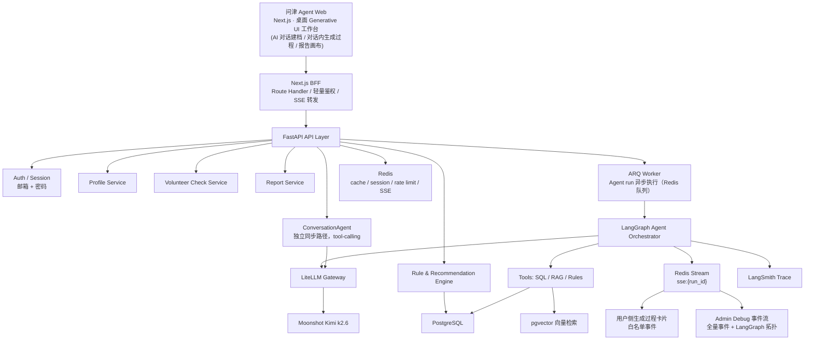
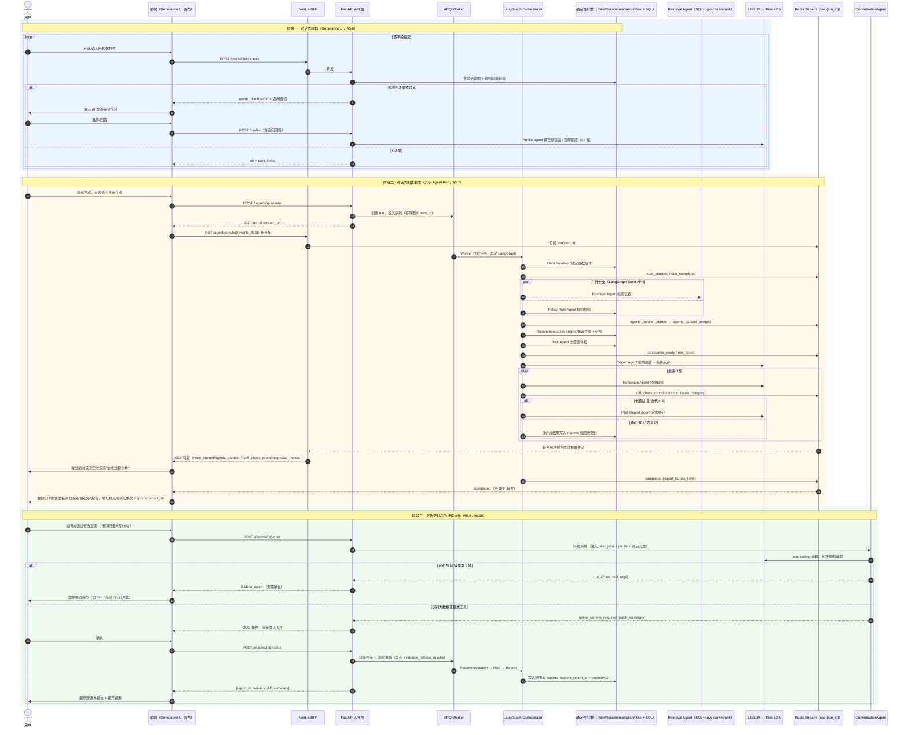
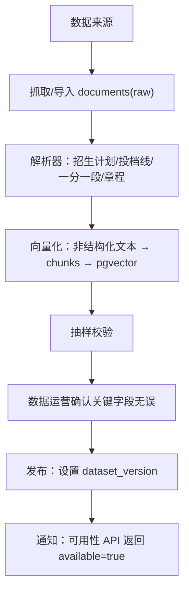
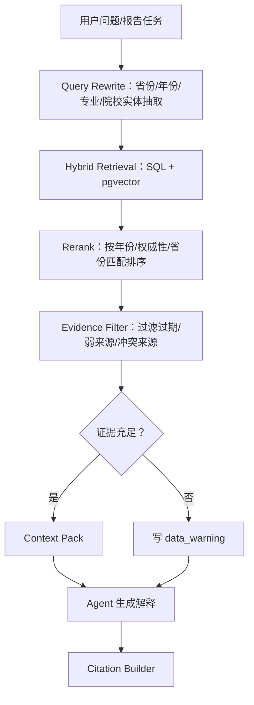
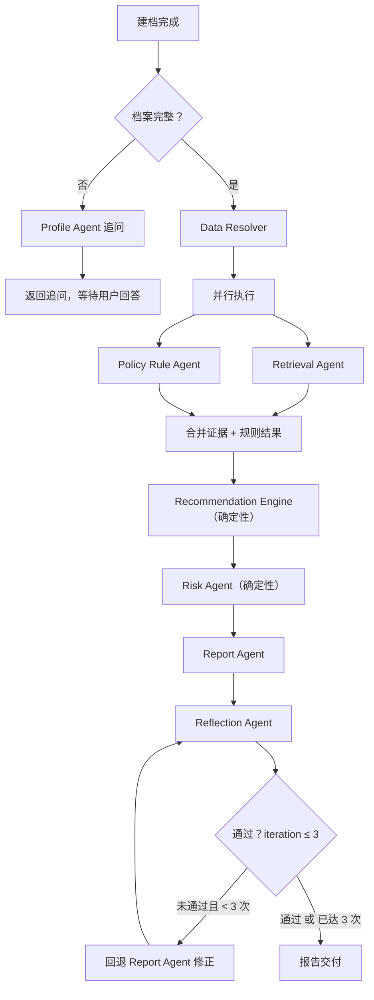

# 问津 Agent 后端 PRD v2

版本：v2.1（2026-07-08）—— 从 0 到 1 重新设计，"AI 全程协作者"为原生设计，非增量补丁；本次修订澄清 `/reports/generate` 触发时机与 `/refine` 建档中/交付后复用，对齐 `frontend-prd-v2.md` v2.2
后端框架：FastAPI + LangGraph
数据底座：PostgreSQL + pgvector + Redis
模型网关：LiteLLM Proxy → Moonshot Kimi（`kimi-k2.6`，OpenAI 兼容协议）
当前版本策略：所有功能免费开放，不做收费、套餐、订单、支付和付费解锁

> 本文档取代旧版 `docs/backend-prd.md` 作为面向"AI 全程协作者"产品形态的权威后端 PRD。旧文档保留在仓库中作为历史演进记录（v0.1 → v1.2 的逐版本补丁历史），不再维护。逐版本变更历史请查 git log，本文档不再采用版本变更表的写法。

---

## 1. 后端目标

后端是一个**双轨系统**：一条轨道是**确定性引擎**——用 SQL 和规则代码产出可验证、可复现、零幻觉的事实结论（选科是否满足、位次是否安全、保底是否充足）；另一条轨道是**可对话协作的 Agent 层**——用 LangGraph 编排的多节点图和一个独立的 ConversationAgent，把确定性结论转译成用户能理解、能追问、能持续调整的交互体验。两条轨道通过同一份 State 和同一套 SSE 事件流交汇，前端呈现为一个连续的 Generative UI 协作过程，而不是"先填表单，再等一个黑盒，最后看一份静态报告"。

具体支撑：

- **对话式建档**：以确定性字段依赖图驱动的结构化控件序列，Agent 只在检测到矛盾或歧义时介入追问。
- **风险画像与志愿草稿体检**：同步接口，规则引擎直接给结论；前端以对话内 Generative UI 卡片呈现，不作为独立页面。
- **冲稳保方案生成**：确定性推荐算法生成候选、评分、分层。
- **证据链检索**：RAG 检索 + 结构化数据联合产出，报告结论必须可追溯到具体来源。
- **报告生成与持续协作**：报告不是终点，用户可以通过对话继续追问、修改约束触发局部重新生成、对比多个方案版本。
- **Agent 运行过程可观测**：同一套事件基础设施对外呈现两层——终端用户看到的"对话内生成过程卡片/报告决策回放"（友好文案、脱敏）和管理员看到的"Debug 事件流 + LangGraph 拓扑图"（完整技术细节）。

当前版本不实现订单、支付、套餐、会员权益、付费回调、退款等商业化能力，也不实现任何形式的人工审核/人工介入流程——报告生成后由规则引擎和 Agent 共同产出结论，高风险信息直接展示给用户，由用户自主决策。

---

## 2. 总体架构



**关键分层说明：**

- **BFF 层**：Next.js Route Handler 承接前端请求，负责轻量鉴权、SSE 转发（含用户侧协作事件和报告问答流）。不含业务逻辑。
- **API 层**：FastAPI 处理所有同步业务请求；Agent run 类请求投入 ARQ 队列后立即返回 `run_id`。
- **异步任务层**：报告生成通过 **ARQ**（Async Redis Queue）执行，LangGraph 在独立 Worker 进程运行，进度事件写入同一条 Redis Stream。`FastAPI BackgroundTasks` 仅用于不重要的轻量操作（如访问日志），不用于 Agent run——进程重启会丢失任务，无法满足报告生成的可靠性要求。
- **Agent 层**：两条独立路径共用同一套基础设施：
  1. **主链路**：LangGraph 编排的报告生成图（`VolunteerPlanState`），通过工具调用确定性服务。
  2. **对话路径**：ConversationAgent，独立于主链路图之外的同步 tool-calling agent，服务报告问答和"改约束重新生成"。
- **模型网关层**：所有 LLM 调用统一经过 LiteLLM Proxy，虚拟模型名（`profile-agent`/`retrieval-agent`/`report-agent`/`reflection-agent`/`review-draft-agent`/`text-embedding-3-small`）全部路由到 `openai/kimi-k2.6`。改模型/加 provider 改 `litellm_config.yaml`，不改代码。
- **事件枢纽**：单条 Redis Stream（`sse:{run_id}`）是 Agent 层唯一的对外广播介质，两个消费端（用户侧 SSE、Admin Debug SSE）按事件类型白名单差异化过滤，是**同一份数据的两种呈现粒度**，不是两套独立系统。

### 2.1 端到端业务时序图

上面的分层图是静态结构，下图补充**动态时序**——完整业务流程分三个阶段：对话式建档、报告生成（异步 Agent Run）、报告交付后的持续协作。三个阶段共用同一套 FE/BFF/API 分层和同一条 Redis Stream，不是三套割裂的机制。



**读图要点**：

- 三个阶段共用同一套分层（FE→BFF→API），阶段二和阶段三还共用同一条 Redis Stream 和同一个 LangGraph 图定义——不是三套独立机制拼起来的。阶段二在产品上表现为**对话内生成过程卡片**，不需要独立生成进度页。
- 阶段一和阶段二在产品体验上**不是严格先后的两个页面**：只要阶段一收集完 `student_profiles` 的必填字段（省份、批次、分数/位次、选科、性别/体检限制），前端就可以立即调用 `POST /api/v1/reports/generate`，不需要等预算、城市、专业等建议字段填完——见 §5.1 说明。阶段二产出的首份报告（`version=1`）在前端呈现为"基础版"；此后用户在同一对话里继续补充的偏好，全部经由阶段三的 §5.9 `/refine` 接口处理，产出 `version=2、3…`，前端呈现为"偏好更新版"。阶段二与阶段三因此共用同一个报告血缘链，不因为触发时机（建档中 vs 报告交付后）而分裂成两套机制。
- 阶段一的"矛盾检测"和阶段二的"规则校验"复用的是同一批 Policy Rule Agent 工具（`check_subject_req` 等），只是调用时机不同：建档时做单字段前置校验，生成时做完整候选集校验。
- 阶段二的 `par` 块是 §10.3 并行执行的时序体现；`loop` 块是 §10.6 Reflection 循环保护的时序体现。
- 阶段三的 `alt` 分支对应 §10.9 两类工具的核心区别：UI 操作类不经过确认直接执行，数据变更类必须走确认卡片 + `/refine` 独立请求；这个确认+`/refine`流程同样适用于用户仍停留在建档页、报告只有"基础版"时发起的偏好补充，不要求先进入独立的报告工作台页面。

---

## 3. 模块职责

| 模块                     | 职责                                                                              |
| ------------------------ | --------------------------------------------------------------------------------- |
| BFF                      | 鉴权转发、SSE 代理、Cookie 注入、文件预处理                                       |
| Auth / Session           | 邮箱注册/登录、验证码（Resend + Redis）、HttpOnly Cookie 会话（`AuthSession`）    |
| Profile Service          | 学生档案、偏好、档案完整度计算、对话式建档的字段依赖图                           |
| Data Service             | 数据源、数据版本、解析状态、校验状态、数据可用性检查                              |
| Rule Engine              | 选科、批次、体检、单科、学费、专业组硬规则校验；对话式建档阶段的实时矛盾检测      |
| Recommendation Engine    | 候选生成、冲稳保分层、评分排序                                                    |
| Risk Engine              | 志愿表体检、保底充足性、梯度、热门扎堆、禁忌专业                                  |
| Retrieval Service        | SQL 检索、向量检索、rerank、证据打包                                              |
| Agent Orchestrator       | LangGraph 主链路多 Agent 编排、SSE 协作事件推送                                   |
| **ConversationAgent**    | **报告问答、意图识别、UI 操作类工具调用、数据变更类工具触发局部重新生成**         |
| Model Gateway            | LiteLLM Proxy：统一 LLM 调用入口、per-Agent 模型路由、成本归因                    |
| Report Service           | 报告生成、证据链嵌入、版本血缘管理、报告交付                                      |
| Tool Reliability         | ToolResponse 三态协议、CircuitBreaker 外部调用熔断、ToolFilter per-Agent 工具隔离 |
| Observability            | LangSmith Trace、结构化日志、用户侧协作事件转译、Admin Debug 事件流与指标        |

---

## 4. 确定性系统与 Agent 边界

高考志愿是高风险决策，不能让 LLM 直接决定事实或规则；同样，"要不要打断用户、该问哪个字段"这类高频交互也优先用确定性逻辑，只把真正需要语言理解和生成的环节交给 Agent。

| 能力                             | 推荐实现                | 说明                                                       |
| -------------------------------- | ----------------------- | ----------------------------------------------------------- |
| 省份、批次、位次、选科匹配       | SQL + Rule Engine        | 必须准确、可测试、可追溯                                    |
| 体检限制、单科限制、学费预算     | Rule Engine              | 高风险约束，不能靠 LLM 猜                                    |
| 候选学校生成                     | Recommendation Engine    | 需要稳定复现，必须绑定数据版本                                |
| 冲稳保分层                       | 算法 + 可配置阈值        | 便于评测和调参                                              |
| 志愿表风险体检                   | Risk Engine              | 风险不能漏检，规则引擎给结论，Agent 给解释                    |
| **建档问诊的字段排序/跳过**      | **确定性字段依赖图**     | **纯配置驱动，零延迟零成本，不经过 LLM**                      |
| **建档矛盾/歧义检测**            | **Rule Engine 前置校验** | **返回结构化结果，只有把结果转成自然语言追问才交给 Agent**    |
| 专业解释、城市解释               | RAG + Agent              | 适合自然语言解释和证据引用                                    |
| 报告生成                         | 模板 + Agent             | 结构由模板保证，语言由 Agent 生成                              |
| 合规检查                         | 规则 + Reflection Agent  | 禁词由规则强约束，语义过承诺由 LLM judge 检查                  |
| **ConversationAgent UI 操作**    | **确定性工具执行**       | **LLM 只负责识别意图并选择工具，工具本身的执行是确定性的前端状态变更** |
| **改约束重新生成的实际计算**     | **Recommendation/Risk/Report Agent** | **ConversationAgent 只能触发粗粒度"重新生成"请求，不能自己编造结果** |
| 报告交付决策                     | 规则                     | 是否可交付必须由规则决定，不能由 Agent 自行判断                |

**核心流程：**

```text
用户输入（对话式建档，字段依赖图驱动 + 矛盾时 Profile Agent 追问）
-> Data Resolver          数据版本锁定和可用性校验
-> [并行] Retrieval Agent + Policy Rule Agent
-> Recommendation Engine  候选生成和排序
-> Risk Agent
-> Report Agent           报告生成 + 条件点评
-> Reflection Agent       合规自检（最多 3 轮，阻断型问题不交付，非阻断型问题可带警告交付）
-> 报告交付（Generative UI 画布，用户可持续对话调整）
```

---

## 5. API 设计

### 5.1 核心接口

| 方法   | 路径                                    | 说明                                                          |
| ------ | --------------------------------------- | -------------------------------------------------------------- |
| POST   | `/api/v1/auth/send-code`                | 发送注册邮箱验证码（Resend，Redis TTL 10min）                  |
| POST   | `/api/v1/auth/register`                 | 邮箱 + 验证码 + 密码注册，Set-Cookie                            |
| POST   | `/api/v1/auth/login`                    | 邮箱 + 密码登录，Set-Cookie                                     |
| POST   | `/api/v1/auth/logout`                   | 清除 session cookie                                             |
| GET    | `/api/v1/auth/me`                       | 当前登录用户信息                                                |
| POST   | `/api/v1/auth/anonymous-session`        | 创建匿名会话，Set-Cookie，用于未登录测算/建档草稿               |
| POST   | `/api/v1/profile`                       | 创建/更新学生档案（对话式建档逐字段提交）                       |
| GET    | `/api/v1/profile/{id}`                  | 获取学生档案                                                    |
| POST   | `/api/v1/profile/field-check`           | 建档单字段实时校验，命中矛盾/歧义时返回结构化追问               |
| GET    | `/api/v1/intake/conversations`          | 建档前聊天会话列表（游标分页，侧栏历史用）                       |
| PATCH  | `/api/v1/intake/conversations/{id}`     | 重命名建档前聊天会话                                             |
| DELETE | `/api/v1/intake/conversations/{id}`     | 软删除建档前聊天会话（`deleted_at`，不物理删除）                 |
| POST   | `/api/v1/intake/chat`                   | Chat-first 建档前聊天（IntakeAgent，SSE 流式，function calling） |
| GET    | `/api/v1/intake/chat/history`           | 获取某个建档前聊天会话的历史（`?conversation_id=`）              |
| GET    | `/api/v1/data/availability`             | 查询省份数据可用性和版本状态                                    |
| POST   | `/api/v1/risk/preview`                  | 生成风险画像（同步，< 2s）                                      |
| POST   | `/api/v1/volunteer/check`               | 志愿草稿风险体检（同步，< 5s），由对话内志愿草稿卡片调用；不支持上传/OCR 自动解析 |
| POST   | `/api/v1/reports/generate`              | 触发报告生成（创建 Agent run）                                  |
| GET    | `/api/v1/reports/{id}`                  | 获取报告                                                        |
| GET    | `/api/v1/reports`                       | 获取当前用户报告历史（游标分页）                                |
| POST   | `/api/v1/reports/{id}/refine`           | 基于约束修改触发局部重新生成，产出新版本报告                    |
| POST   | `/api/v1/reports/{id}/chat`             | 发送一条对话消息，SSE 流式返回 ConversationAgent 回复/工具调用  |
| GET    | `/api/v1/reports/{id}/chat/history`     | 获取当前报告的对话历史（游标分页）                              |
| DELETE | `/api/v1/reports/{id}/chat`             | 清空当前报告的对话历史                                          |
| GET    | `/api/v1/sources/{id}`                  | 查看证据来源                                                    |
| POST   | `/api/v1/agent/runs`                    | 创建 Agent run，投入 ARQ 队列                                   |
| GET    | `/api/v1/agent/runs/{id}`               | 查询 Agent run 状态                                             |
| GET    | `/api/v1/agent/runs/{id}/events`        | 用户侧 SSE 协作事件流                                           |
| POST   | `/api/v1/agent/runs/{id}/stream-token`  | 生成 60s 一次性 SSE query token（仅 Cookie 不可用时使用）       |
| POST   | `/api/v1/notifications/mark-read`       | 标记站内通知为已读                                              |
| GET    | `/api/v1/notifications`                 | 获取当前用户站内通知列表                                        |
| GET    | `/api/v1/admin/runs`                    | 获取最近 Agent run 列表（`role=admin`，含成本/延迟摘要）        |
| GET    | `/api/v1/admin/runs/{id}`               | 获取单个 run 的完整调试元数据                                   |
| GET    | `/api/v1/admin/runs/{id}/debug-events`  | Admin Debug SSE 端点，全量事件流 + 历史回放                     |
| GET    | `/api/v1/admin/metrics/summary`         | 系统实时指标快照                                                |

**鉴权环境变量**：`RESEND_API_KEY`、`EMAIL_FROM`。仅支持邮箱 + 密码，不支持手机号/短信登录、不支持微信 OAuth（预留 `users.openid` 字段）。

**匿名会话说明**：用户首次进入前端时，BFF 调用 `POST /api/v1/auth/anonymous-session` 创建匿名会话并种下 `anonymous_id` / `session_token` Cookie。匿名用户可以完成测算、建档和生成前准备；尝试查看完整报告、保存档案或分享报告时触发登录/注册。注册或登录成功后，后端把同一匿名会话下的 `student_profiles`、未完成 `agent_runs`、草稿志愿表和报告记录绑定到正式 `user_id`，绑定过程幂等，避免重复创建档案。

**`/api/v1/reports/generate` 说明**：面向前端的语义化入口，内部等价于 `POST /api/v1/agent/runs`（`task_type=generate_report`）。前端收到 `run_id` 后在当前 AI 对话建档页追加/更新生成过程卡片，并驱动右侧实时报告面板渲染；当前版本不提供独立 `/reports/generating` 页面。**触发条件只要求 `student_profiles` 必填字段完整**（省份、批次、分数/位次、选科、性别/体检限制，对应 `profile_complete=true`），不要求预算、城市、专业等建议字段已填写——首次调用产出的报告即前端所称"基础版"（`version=1`）。生成完成后前端不强制跳转页面，只在拿到 `report_id` 后把地址栏无刷新切换为 `/reports/{id}`；此后用户在同一对话里补充的偏好统一走 §5.9 `/refine`，不会重新调用本接口。

**`agent_runs.status` 状态枚举**：`queued` / `running` / `completed` / `failed` / `timeout`。

### 5.2 标准错误响应格式

```json
{
  "error": {
    "code": "profile_incomplete",
    "message": "档案缺少必填字段：省份、分数",
    "details": [{ "field": "province", "issue": "required" }],
    "request_id": "req_abc123"
  }
}
```

| HTTP 状态 | `code` 示例            | 说明                                        |
| --------- | ---------------------- | ------------------------------------------- |
| 400       | `validation_error`     | 请求参数格式错误                            |
| 401       | `unauthenticated`      | 未登录或 Session 过期                       |
| 403       | `forbidden`            | 无权限访问该资源                            |
| 404       | `not_found`            | 资源不存在                                  |
| 409       | `conflict`             | 幂等冲突（如 run 已存在）                   |
| 422       | `profile_incomplete`   | 业务校验失败                                |
| 429       | `rate_limited`         | 超出限流，响应头带 `Retry-After: <seconds>` |
| 503       | `service_unavailable`  | 依赖服务不可用，带 `Retry-After`            |

### 5.3 SSE 鉴权

`EventSource` 不支持自定义请求头，方案：

1. **首选：HTTP-only Cookie**。登录时 BFF 层种下 `session_token`（`HttpOnly; SameSite=Strict`），SSE 请求自动携带。
2. **备选：短期 OTP Query Token**。`POST /api/v1/agent/runs/{id}/stream-token` 获取 60s 一次性 token，附在 URL query string。使用后立即失效。

> 不允许将长期 Bearer Token 放入 query string——会被访问日志记录。

### 5.4 列表接口分页规范

所有列表接口用**游标分页**：

```
GET /api/v1/reports?cursor=<opaque_cursor>&limit=20
```

```json
{ "items": [...], "next_cursor": "eyJpZCI6Ijk5In0=", "has_more": true }
```

### 5.5 数据可用性检查

```http
GET /api/v1/data/availability?province=河南&year=2026&batch=本科批
```

```json
{
  "province": "河南",
  "year": 2026,
  "batch": "本科批",
  "status": "published",
  "dataset_version": "henan_2026_v1",
  "available": true,
  "max_volunteers": 96,
  "warnings": []
}
```

### 5.6 建档字段实时校验

对话式建档每提交一个字段（或一组相关字段），前端调用此接口做前置校验，用于判断是否需要 Agent 介入追问：

```http
POST /api/v1/profile/field-check
```

```json
{
  "profile_id": "profile_123",
  "field": "subjects",
  "value": ["物理", "化学", "生物"],
  "known_fields": { "province": "河南", "batch": "本科批" }
}
```

响应（无矛盾）：

```json
{ "status": "ok", "next_fields": ["score", "rank"] }
```

响应（检测到矛盾，需要追问）：

```json
{
  "status": "needs_clarification",
  "issue": {
    "rule": "subject_combination_no_admission_plan",
    "message": "该选科组合在河南省本科批暂无对应招生计划",
    "options": [
      { "action": "adjust_subjects", "label": "调整选科" },
      { "action": "continue_anyway", "label": "仍按此继续" }
    ]
  }
}
```

**实现**：字段排序/跳过逻辑是纯配置驱动的字段依赖图（不调用 LLM）；矛盾检测复用 Policy Rule Agent 的规则工具（`check_subject_req`/`check_batch_eligibility` 等，见 §10.4）做同步前置校验，返回结构化结果——只有当需要把结果转成自然语言追问、或理解用户对追问的自由文本回应时，才会在 `POST /api/v1/profile` 主提交流程中调用 Profile Agent（详见 §10.1）。

### 5.6b Chat-first 建档前聊天（IntakeAgent）

前端首屏是一个真正的多轮流式 chatbot（Chat-first，见 `docs/frontend-prd-v2.md` §6.1），话题限定在高考志愿相关范围（查学校/查分数/查专业/对比学校/引导建档），不是"先分类再二选一"的旧版 `/profile/intent`（已废弃移除）。

```http
GET    /api/v1/intake/conversations        — 当前身份下的会话列表（游标分页，侧栏历史用）
PATCH  /api/v1/intake/conversations/{id}   — 重命名会话
DELETE /api/v1/intake/conversations/{id}   — 软删除会话（deleted_at，不物理删除）
POST   /api/v1/intake/chat                 — 发消息，不传 conversation_id 则懒创建新会话
GET    /api/v1/intake/chat/history         — 取某个会话的历史（?conversation_id=）
```

```json
{ "message": "浙江大学在河南大概多少分", "conversation_id": null }
```

多会话模型：`intake_conversations.id` 即会话/thread id。首次发消息不传 `conversation_id`，后端在这轮对话产出 `done` 事件前懒创建新会话（避免"新建对话"点一下就产生空行）；`done` 事件的 payload 带上 `conversation_id`，前端记下后续发消息都带着它，追加到同一会话。传入的 `conversation_id` 必须属于当前身份（`owner_key`）且未被软删除，否则 404，防止越权读写他人会话或复活已删除会话。

**标题**：首条用户消息截断生成（≤20 字）作为即时兜底；`done` 事件产出后，`POST /intake/chat` 用 FastAPI `BackgroundTasks`（挂在 `StreamingResponse(background=...)` 上，见 CLAUDE.md「Agent run 不用 BackgroundTasks」的例外情形——这里只是丢了也无所谓的标题美化，不是业务数据）异步调用轻量虚拟模型 `profile-agent` 把标题升级成自然语言摘要，失败/超时静默回退到截断标题，只在标题仍是创建时的截断态（未被用户手动重命名）才覆盖。**踩过的坑**：Moonshot Kimi 是推理模型，即使这么简单的任务也会先输出上百字 `reasoning_content` 才产出最终 `content`，`max_tokens` 给不够（实测 30~150 不够）时 `content` 永远是空字符串；且该模型只接受 `temperature=1`，其他值直接被 LiteLLM 拒绝 400。

**匿名转登录合并**：登录/注册成功时 `auth.py::_bind_anonymous_data` 把 `owner_key == "anon:{anonymous_id}"` 的会话整段改写为 `user_id`（同一函数已经在做 `StudentProfile`/`Report` 的合并，这里是第三处），多条匿名会话一次性转移，不影响该账号已有的历史会话（`owner_key` 非唯一）。

SSE 响应事件：`token`（增量文本）、`trigger_profile_capture`（前端收到即内联渲染建档表单）、`compliance_warning`、`done`（`{"conversation_id": "..."}`）、`error`。

**实现**（`backend/app/agent/intake_agent.py`）：复用新增的 `intake-agent` 虚拟模型（`litellm_config.yaml`），用 OpenAI 风格 function calling 挂 4 个工具：

| 工具 | 作用 | 是否过 LLM 生成数字 |
| --- | --- | --- |
| `lookup_university_score` | 查某校在某省的历年录取分/位次（`backend/app/engine/school_lookup.py`） | 否，纯 SQL |
| `lookup_subject_requirement` | 查某校（某专业）的选科要求/体检限制 | 否，纯 SQL |
| `compare_universities` | 多校在同一省份的分数/位次/选科要求并排对比，只出结构化数据不含定性介绍 | 否，纯 SQL |
| `start_profile_capture` | 识别到"开始建档/生成报告"意图时调用的信号工具，不返回数据 | — |

系统提示词硬性要求：涉及具体分数/位次/选科等事实性数据必须调用工具查询，禁止凭参数记忆回答数字；工具查不到数据时如实说"暂无该数据"；话题与高考志愿无关时礼貌拒答。这是 CLAUDE.md「确定性系统给结论，Agent 给解释」原则在 Chat-first 场景的延伸——聊天可以自由展开，但事实性数字必须过 SQL，不能由 LLM 现编。

历史持久化与报告问答（§5.10）同构：Redis 热层（`intake:history:{owner_key}:{conversation_id}`，7 天 TTL）+ PostgreSQL `intake_conversations` 表冷层兜底，限流 30 条/身份/天（跨该身份的所有会话共享一个计数）。`owner_key` 是登录用户的 `user_id` 或匿名会话的 `anonymous_id`（`anon:{anonymous_id}` 前缀）二选一——建档前还没有 `report_id` 可挂靠，前端需要先调用 `POST /api/v1/auth/anonymous-session` 换一个 `session_token` Cookie，否则本接口返回 401。持久化在 SSE `done` 事件 yield 之前完成（不是之后）——客户端收到 `done` 会立即用返回的 `conversation_id` 刷新侧栏会话列表，必须保证这时数据库已经能查到这条会话，否则会有"列表刷新跑在写入提交之前"的竞态。

### 5.7 Agent run 与协作可视化 SSE 事件

```http
POST /api/v1/agent/runs
```

```json
{
  "thread_id": "thread_123",
  "user_id": "user_123",
  "profile_id": "profile_123",
  "task_type": "generate_report",
  "input": { "province": "河南", "score": 612, "rank": 32680, "subjects": ["物理", "化学"] }
}
```

```json
{ "run_id": "run_123", "status": "queued", "stream_url": "/api/v1/agent/runs/run_123/events" }
```

用户侧 SSE 事件白名单（`GET /api/v1/agent/runs/{id}/events`，走 `sse:{run_id}` Stream）。前端消费这些事件时，应更新 AI 对话建档页中的**生成过程卡片**，报告页只读回放使用 `reports.run_summary_json`：

```text
event: node_started
data: {"node": "retrieval_agent", "message": "正在检索招生数据"}

event: agents_parallel_started
data: {"agents": ["retrieval_agent", "policy_rule_agent"], "message": "正在同时检索数据和校验规则"}

event: evidence_found
data: {"source_id": "src_001", "title": "2026年河南省本科批招生计划", "authority": "official"}

event: rule_checked
data: {"rule": "subject_requirement", "target": "计算机科学与技术", "status": "passed"}

event: agents_parallel_merged
data: {"agents": ["retrieval_agent", "policy_rule_agent"], "summary": "证据检索完成，规则校验完成"}

event: candidates_ready
data: {"total": 48, "rush": 12, "target": 20, "safe": 16}

event: risk_found
data: {"risk_type": "insufficient_safety", "severity": "high", "message": "当前方案保底数量不足"}

event: degraded_notice
data: {"stage": "retrieval", "message": "检索遇到延迟，已切换备用数据源"}

event: self_check_round
data: {"iteration": 1, "max_iterations": 3, "issue_category": "over_promise", "status": "revising"}

event: self_check_round
data: {"iteration": 2, "max_iterations": 3, "issue_category": "none", "status": "passed"}

event: completed
data: {"report_id": "report_123", "risk_level": "medium"}

event: error
data: {"severity": "critical", "message": "数据检索失败，请稍后重试"}
```

| 事件类型 | 用途 | 隐私约束 |
| --- | --- | --- |
| `node_started` | 节点开始执行 | 无 PII |
| `evidence_found` | 发现证据来源 | 无 PII |
| `rule_checked` | 规则校验结果 | 无 PII |
| `agents_parallel_started` | 并行分支开始，转译自内部的 `parallel_fan_out` | 只保留友好文案，不暴露节点技术名 |
| `agents_parallel_merged` | 并行分支汇合，转译自内部的 `parallel_fan_in` | 无 PII |
| `candidates_ready` | 候选集生成完成 | 无 PII |
| `risk_found` | 发现风险项 | 无 PII |
| `degraded_notice` | 降级兜底提示，转译自内部的 `degraded` | 不暴露具体服务名（如 Cohere/pgvector），人工维护"技术原因 → 用户文案"映射表 |
| `self_check_round` | Reflection 自我修正轮次，转译自内部的 `reflection_iteration` | 只传 `issue_category` 枚举（`over_promise`/`evidence_gap`/`none`），不传原始违规文本 |
| `completed` | run 完成 | 无 PII |
| `error` | 错误 | 无 PII |

> 这套白名单和下方 §5.8 的 Admin 全量事件流**共用同一条 Redis Stream 上的同一份原始事件**，用户侧生成器只是做了一次"技术事件 → 友好文案"的转译再转发，不是两套独立的埋点。产品层不再需要独立生成进度页，事件落点是对话内卡片和报告决策回放。

### 5.8 Debug SSE 事件规范（Admin 专属）

**设计原则**：`GET /api/v1/admin/runs/{id}/debug-events` 订阅同一 Stream，**不做白名单过滤，透传全部事件类型**（含 §5.7 未列出的 `node_completed`/`tool_called`/`circuit_breaker`/`parallel_fan_out`/`parallel_fan_in`/`reflection_iteration`/`state_checkpoint`）。

**隐私约束**：Debug 事件禁止包含用户 PII（`score`/`rank`/`province`/`profile` 内容、LLM prompt/response 原文），只传操作元数据。

**历史回放**：以 `XREAD COUNT 0 STREAMS sse:{run_id} 0-0` 从头读取已完成 run 的历史事件，再转为长连接等待新事件；已完成 run 推完历史后立即发送 `stream_end` 关闭连接。

```text
event: node_completed
data: {"node": "retrieval_agent", "status": "degraded", "latency_ms": 3240}

event: tool_called
data: {"node": "retrieval_agent", "tool": "vector_search", "status": "success", "latency_ms": 450, "result_summary": {"count": 20}}

event: degraded
data: {"node": "retrieval_agent", "original_tool": "vector_search", "fallback_tool": "sql_search", "reason": "vector_search_timeout"}

event: circuit_breaker
data: {"tool": "cohere_rerank", "state": "opened", "consecutive_failures": 3, "recovery_timeout_s": 300}

event: parallel_fan_out
data: {"from_node": "data_resolver", "to_nodes": ["retrieval_agent", "policy_rule_agent"]}

event: parallel_fan_in
data: {"to_node": "recommendation_engine", "from_nodes": ["retrieval_agent", "policy_rule_agent"], "latency_ms_each": {"retrieval_agent": 3240, "policy_rule_agent": 820}}

event: reflection_iteration
data: {"iteration": 1, "compliance_passed": false, "issues_count": 2, "early_exit": false}

event: state_checkpoint
data: {"after_node": "recommendation_engine", "summary": {"candidates_count": 48, "safe_count": 16, "degraded_agents": []}}

event: stream_end
data: {"reason": "run_completed", "total_events": 42}
```

**实现要点**：每个 LangGraph 节点函数在进入/退出时推送 `node_started`/`node_completed`；工具函数调用前后推送 `tool_called`；CircuitBreaker 状态变化推送 `circuit_breaker`。所有 Debug 事件通过独立的 `emit_debug_event(run_id, event_type, data)` 函数发送，与业务逻辑解耦，出错静默处理（try/except），不影响主流程。

### 5.9 报告局部重新生成

来自 ConversationAgent 的"改约束重新生成"能力（详见 §10.9），由用户表达修改意图、经确认后调用。这个接口在两个时机都会被调用，且是**同一套逻辑**：一是用户仍在 AI 对话建档页、报告只有基础版（`version=1`）时补充预算/城市/专业等偏好；二是报告已经进入独立的报告工作台页面之后继续改约束。两种时机都不区分"建档中"或"报告交付后"，都产出下一个 `version`，挂在同一个 `parent_report_id` 血缘链上：

```http
POST /api/v1/reports/{report_id}/refine
```

```json
{
  "patch": { "budget_max": 80000, "exclude_school_ids": ["sch_101"], "add_preferred_city": "杭州" },
  "source": "conversation",
  "conversation_id": "conv_abc"
}
```

**处理逻辑**：

1. 判断 `patch` 涉及**轻量约束**还是**重大约束**：
   - 轻量约束（预算、城市偏好、排除院校/专业等不影响证据检索范围的字段）→ 创建异步 refine run，只重跑 `Recommendation Agent → Risk Agent → Report Agent`，复用当前报告 checkpoint 中的 `evidence_list`/`rule_results`，不重新走 Data Resolver/Retrieval/Policy Rule，预计 5-10 秒完成。
   - 重大约束（省份、选科、批次变更）→ 返回 `422 requires_full_regenerate`，引导前端走完整的 `POST /api/v1/reports/generate`。
2. 轻量约束请求校验通过后立即返回 `202 Accepted`，前端用返回的 `run_id` 订阅 SSE，在报告工作台左侧对话栏展示局部重新生成状态。
3. Worker 完成轻量重跑后创建新的 `reports` 记录：`parent_report_id` 指向原报告，`version` 在同一血缘链内递增，并通过 `completed` SSE 返回新 `report_id`。
4. 响应：

```json
{
  "parent_report_id": "report_123",
  "run_id": "run_789",
  "stream_url": "/api/v1/agent/runs/run_789/events",
  "status": "queued",
  "estimated_seconds": 10
}
```

完成时 SSE：

```text
event: completed
data: {"report_id": "report_456", "parent_report_id": "report_123", "version": 2, "diff_summary": {"candidates_before": 48, "candidates_after": 31, "changed_tiers": ["balanced"]}}
```

**限流**：与 `/api/v1/reports/generate` 共用每用户每日 10 次生成限流计数。

| HTTP 状态 | `code` | 说明 |
| --- | --- | --- |
| 422 | `requires_full_regenerate` | patch 涉及重大约束，需完整重新生成 |
| 404 | `not_found` | `report_id` 不存在 |
| 409 | `checkpoint_not_found` | 原报告 checkpoint 已超出 7 天 TTL，无法复用，需走完整生成 |

### 5.10 报告问答（ConversationAgent）

```http
POST /api/v1/reports/{id}/chat
```

```json
{ "message": "帮我把预算改到8万以内", "conversation_id": "conv_abc" }
```

SSE 流式响应：

```text
event: token
data: {"token": "已经"}

event: citation
data: {"source_id": "src_001", "title": "2025年河南省本科批招生计划", "year": 2025}

event: ui_action
data: {"tool": "switch_tab", "args": {"tier": "aggressive"}}

event: refine_confirm_required
data: {"patch": {"budget_max": 80000}, "patch_summary": "预算上限 → 8 万元/年"}

event: compliance_warning
data: {"issue": "response_modified", "reason": "检测到潜在过承诺表述，已自动修正"}

event: done
data: {"conversation_id": "conv_abc", "message_id": "msg_007", "total_tokens": 1240}
```

`ui_action` 在 ConversationAgent 判定为 UI 操作类工具调用时立即发送，前端收到后直接执行报告画布本地状态变更，不等待 `done`。`refine_confirm_required` 在识别到数据变更意图时发送，前端在左侧对话栏渲染确认卡片，用户确认后由前端另行调用 §5.9 的 `/refine` 接口——本次 chat 请求正常以 `done` 结束，不自动触发重新生成。详细设计见 §10.9。

`GET /api/v1/reports/{id}/chat/history`、`DELETE /api/v1/reports/{id}/chat` 分别读取/清空对话历史（Redis 热层 + PostgreSQL 冷层，见 §6.1 `report_conversations`）。

**限流**：每用户每日对话条数上限 30 条（独立于报告生成限流），超出返回 `429 rate_limited`。

---

## 6. 数据模型

### 6.1 核心表

| 表 | 关键字段 |
| --- | --- |
| users | id、email（unique）、password_hash、email_verified、openid（预留）、role、created_at |
| sessions | id、user_id（匿名会话为 null）、anonymous_id、expires_at（ORM 类名 `AuthSession`） |
| student_profiles | id、user_id（登录后写入）、anonymous_id（匿名阶段写入）、province、score、rank、subjects、batch、family_budget、risk_style、completeness_score |
| preferences | id、profile_id、major_prefs、city_prefs、rejected_majors、career_priority |
| universities | id、name、province、city、level、tags、official_code |
| majors | id、name、category、degree_type、tags |
| admission_plans | year、province、batch、university_id、major_group、major_code、quota、subjects、tuition、dataset_version |
| admission_scores | year、province、batch、university_id、major_group、min_score、min_rank、dataset_version |
| rank_segments | year、province、score、rank_min、rank_max、dataset_version |
| rule_requirements | id、type、province、year、target_id、rule_json、source_id |
| documents | id、type、title、source_url、year、authority_level、checksum、status、deleted_at |
| chunks | id、document_id、content、embedding、embedding_model、metadata |
| reports | id、profile_id、user_id（登录后写入）、anonymous_id（匿名阶段写入）、status、risk_level、risk_score、plan_json、evidence_json、dataset_version、run_id、created_at、deleted_at、**version**（同一血缘链内从 1 递增）、**parent_report_id**（指向被 refine 的原报告，首版为 null）、**run_summary_json**（用户可见的生成过程摘要，供报告页"决策过程回放"卡片使用） |
| volunteer_checks | id、profile_id、report_id、risk_items_json、overall_risk_level、status |
| agent_runs | id、thread_id、user_id、profile_id、task_type、status、cost_tokens、cost_usd、trace_url、error_msg、**debug_summary_json**（Admin Debug 用，含 node_timings/tool_call_summary/state_summary/cost_breakdown）、created_at、completed_at |
| province_thresholds | id、province、year、high_rush_rank_gap、rush_rank_gap_min/max、target_rank_gap、safe_rank_gap |
| notifications | id、user_id、type、payload_json、read_at、created_at |
| report_conversations | id、report_id、user_id、**anonymous_id**（匿名会话标识，与 user_id 二选一为空；避免所有匿名用户共享 `user_id IS NULL` 导致同一报告下不同匿名人读到彼此历史）、messages_json（JSONB，最多 50 条）、created_at、updated_at |
| intake_conversations | id（会话/thread id）、owner_key（user_id 或 `anon:{anonymous_id}` 二选一，**非唯一**——一个 owner_key 可有多条会话）、title（首条用户消息截断生成，nullable）、messages_json（JSONB，最多 50 条）、created_at、updated_at |

**关于 checkpoint 存储**：LangGraph 使用独立内部表（`checkpoints`/`checkpoint_blobs`/`checkpoint_writes`）自动管理，不属于业务表。`agent_runs` 只存业务元数据，通过 `thread_id` 关联。

### 6.2 关键索引

| 表 | 索引 | 类型 | 用途 |
| --- | --- | --- | --- |
| admission_scores | `(province, year, batch)` | B-tree 复合 | 报告生成主路径 |
| admission_plans | `(province, year, batch, major_group)` | B-tree 复合 | 专业组精确查询 |
| rank_segments | `(province, year, score)` | B-tree 复合 | 位次转换查询 |
| chunks | `embedding` | HNSW（pgvector） | 向量近邻检索，`m=16, ef_construction=64` |
| chunks | `(document_id, metadata->>'province')` | B-tree + GIN | 元数据过滤加速 |
| agent_runs | `(user_id, status, created_at)` | B-tree 复合 | 用户 run 历史、限流计数 |

### 6.3 rule_requirements.rule_json 结构

```json
{
  "type": "subject_requirement",
  "logic": "OR",
  "required_subjects": [{ "group": "A", "subjects": ["物理"] }, { "group": "B", "subjects": ["物理", "化学"] }],
  "source": "2026年河南省招生章程第3条",
  "effective_year": 2026
}
```

```json
{
  "type": "medical_restriction",
  "conditions": ["色觉异常（色盲/色弱）", "视力低于4.8"],
  "restriction_level": "prohibited",
  "source": "招生章程体检要求"
}
```

### 6.4 reports.plan_json 结构

```json
{
  "condition_commentary": "你的地域偏好（仅限郑州）和预算（≤6000元/年）同时设置较紧，符合条件的候选数量有限；如果放宽地域偏好，候选会更充分。",
  "plans": [
    {
      "type": "conservative",
      "label": "保守型",
      "description": "以稳妥为主，保底充足，风险最低",
      "candidates": [
        {
          "id": "cand_001",
          "university_name": "郑州大学",
          "university_city": "郑州",
          "major_group": "060001",
          "major_name": "计算机科学与技术",
          "tier": "safe",
          "admission_safety_score": 82,
          "matching_confidence_score": 92.5,
          "overall_score": 74.5,
          "tuition_per_year": 6000,
          "subject_requirements": ["物理", "化学"],
          "rank_reference": { "year": 2025, "min_rank": 38500 },
          "historical_ranks": [
            { "year": 2025, "min_rank": 38500 },
            { "year": 2024, "min_rank": 37200 }
          ],
          "recommendation_reasons": ["历年最低位次稳定，安全边际充足", "专业就业方向与偏好匹配"],
          "risk_items": [],
          "evidence_ids": ["src_001", "src_003"]
        }
      ]
    },
    { "type": "balanced", "label": "均衡型", "description": "冲稳保比例合理，综合评分最优", "candidates": [] },
    { "type": "aggressive", "label": "进取型", "description": "优先冲击更高目标，保底数量满足最低要求", "candidates": [] }
  ]
}
```

`tier` 枚举：`rush`（冲）/ `target`（稳）/ `safe`（保）/ `high_rush`（高冲）。

**字段说明**：

- `condition_commentary`（顶层，可为 null）：Report Agent 生成的条件点评，指出用户输入条件里的张力或可优化点，前端展示在考生概况卡片下方；无明显张力时为 `null`，前端不展示该区块。当 `reports.version = 1`（仅用必填字段生成的"基础版"）且用户尚未提供预算/城市/专业偏好时，Report Agent 生成引导性点评（例如"目前只有基础建档信息，报告会先覆盖更多候选，避免过早收窄"）而非张力点评；`version > 1` 的 refine 结果则点评偏好纳入后的变化。
- `reports.version`：前端呈现约定——`version = 1` 标注为"基础版"，`version > 1`（经 §5.9 `/refine` 产生）标注为"偏好更新版"；进入独立的报告工作台页面后统一改用正式版本号（v1/v2…）展示在 `ReportVersionSwitcher`，两者是同一版本血缘链的不同文案，不是两套版本机制。
- `matching_confidence_score`（候选项）：0-100 的匹配置信分，用于解释排序和方案内相对安全边际；前端展示为 `92.5/100`，不得展示为"录取概率 92.5%"或暗示确定性录取结果。它与 `admission_safety_score`（0-100 定性安全度，驱动进度条和色彩）并存，是同一风险评估的不同呈现粒度，不是录取承诺。
- `historical_ranks`（候选项）：近两年该专业组最低投档位次并列展示，数据来自 `admission_scores` 表按年份聚合，无需新数据管道。`rank_reference` 指向报告生成时使用的主要参考年份。

### 6.5 reports.evidence_json 结构

证据链嵌入 `reports.evidence_json`，不做独立表。每条包含 `source_id`、`title`、`authority_level`、`year`、`province`、`fields`、`quote`。

### 6.6 暂不建表

当前版本不做：`orders`、`payments`、`packages`、`coupons`、`refunds`、`invoices`、`report_versions`（独立版本表，`reports.version`/`parent_report_id` 是表内简单版本号，已覆盖血缘追溯场景）、`candidate_sets`、`evidence_citations`、`family_annotations`。

---

## 7. 数据源、版本与数据管道

### 7.1 数据源分层

| 数据 | 类型 | 权威级别 | 用途 |
| --- | --- | --- | --- |
| 省考试院招生计划 | 结构化表格/PDF | 最高 | 招生计划、批次、院校专业组、计划数 |
| 一分一段表 | 结构化表格 | 最高 | 分数与位次转换 |
| 历年投档线 | 结构化表格 | 高 | 冲稳保判断、位次对比 |
| 学校招生章程 | PDF/HTML | 高 | 体检、单科、外语、专业限制 |
| 专业选科要求 | 结构化规则 | 高 | 选科硬过滤 |
| 就业质量报告 | PDF/HTML | 中 | 就业方向和区域解释 |
| 专业介绍 | 文本 | 中 | 专业学习内容解释 |

### 7.2 数据状态流转

```
raw → parsed → verified → published → deprecated
```

`dataset_version` 状态非 `published` 时，禁止创建正式报告；Data Resolver 在 Agent run 启动时锁定版本并校验状态。

### 7.3 数据管道（ETL）



### 7.4 证据链结构

```json
{
  "source_id": "src_001",
  "source_type": "admission_plan",
  "title": "2026年河南省本科批招生计划",
  "authority_level": "official",
  "year": 2026,
  "province": "河南",
  "dataset_version": "henan_2026_v1",
  "fields": ["major_group", "subjects", "quota", "tuition"],
  "quote": "不超过合规长度的短引用或字段摘要"
}
```

---

## 8. 推荐算法与规则

### 8.1 推荐评分

```text
overall_score = admission_score * 0.40 + major_fit_score * 0.25 + city_family_score * 0.20 + cost_risk_score * 0.15
```

**admission_score（录取安全性）**：`clip(50 + rank_gap / 500 * 30, 0, 100) * 0.7 + stability * 100 * 0.3`，`rank_gap` 为历史投档位次均值与学生位次之差，`stability` 为近 3 年位次稳定性；历史数据不足 2 年时 `stability` 置 0.5 并写入 `data_warnings`。

**major_fit_score**：`preference_match * 0.5 + subject_match * 0.3 + rejection_penalty * 0.2`。

**city_family_score**：`city_preference_match * 0.6 + budget_fit * 0.4`。

**cost_risk_score**：`100 - risk_penalty`（每个 high 风险项 -20，medium -10，low -5）。

### 8.2 冲稳保分层阈值

| 档位 | 位次差条件 | 含义 |
| --- | --- | --- |
| `high_rush`（高冲） | 学生位次 > 历史均值 5000+ | 不确定性很高，保留作为激进选项 |
| `rush`（冲） | 学生位次 > 历史均值 1000-5000 | 有一定风险 |
| `target`（稳） | 学生位次 在历史均值 ±1000 以内 | 历史位次匹配度较高，主力志愿 |
| `safe`（保） | 学生位次 < 历史均值 2000+ | 安全边际充足 |

### 8.3 方案生成策略

| 方案 | high_rush | rush | target | safe |
| --- | --- | --- | --- | --- |
| 保守型 | 0% | 20% | 40% | 40% |
| 均衡型 | 5% | 30% | 40% | 25% |
| 进取型 | 15% | 35% | 35% | 15% |

**保底硬下限**：任何方案 `safe` 档绝对数量 ≥ 10，不足则阻断交付。志愿数上限按省份从 `province_thresholds` 读取（默认 96）。

### 8.4 硬过滤规则（Rule Engine，不经过 LLM）

省份/批次不匹配 → 过滤；选科不满足 → 过滤或标红；体检限制命中 → 标红或禁止推荐；单科不满足 → 过滤；学费超预算 → 降权或提示；含不可接受专业 → 高风险；保底不足 → 不允许交付；数据版本未发布 → 不允许生成报告。

### 8.5 志愿表风险项

| 风险 | 示例 | 处理 |
| --- | --- | --- |
| 保底不足 | 只有冲和稳，无足够保底 | 高风险，需自行调整增加保底院校 |
| 梯度过密 | 多个志愿位次差距过小 | 中高风险，建议拉开梯度 |
| 热门专业扎堆 | 计算机、临床、法学集中 | 提示专业组调剂和竞争风险 |
| 不可接受专业命中 | 专业组含用户禁忌专业 | 高风险，必须提示 |
| 选科冲突 | 选科不满足专业要求 | 禁止推荐或标红 |
| 体检限制 | 色弱、视力等限制命中 | 高风险，需重新确认目标专业 |
| 学费超预算 | 中外合作/民办超预算 | 提示成本风险 |
| 地域冲突 | 不接受外省但方案包含外省 | 提示偏好冲突 |

---

## 9. RAG 设计



**原则**：结构化强约束数据进 PostgreSQL；RAG 只负责解释、补充和非结构化证据；录取安全度/选科/批次/体检限制必须走规则和结构化数据；证据不足时不生成强确定性结论。

**Embedding**：MVP 用 `text-embedding-3-small`（1536 维，经 LiteLLM Gateway）；后续技术演进可切换自托管 `BAAI/bge-large-zh-v1.5`（1024 维），两套模型**不能混用**，`chunks.embedding_model` 字段记录标识用于迁移过滤。

**Chunk 策略**：招生章程 400/80 token，专业介绍 300/60，就业报告 500/100，政策文件 300/50（大小/重叠）。

**BM25**：`pg_bm25` 扩展（ParadeDB），非原生 `tsvector`。SQL 精确检索结果不参与 RRF，直接注入 evidence_list；非结构化文本用向量检索 top-20，MVP 不做 BM25+RRF 融合。

**Reranker**：Cohere Rerank API（`rerank-multilingual-v3.0`），top-20 精排取 top-8。

**Evidence Filter**：年份 ≤3 年内，超过标 `stale`；同省优先；rerank score < 0.3 丢弃；单 source 最多 3 个 chunk；`authority_level` 高权威优先。

**Context Pack Token 预算**：≤ 6K tokens，超出按权威性降序截断，写入 `data_warnings: "context_truncated"`。

---

## 10. Agent 架构

### 10.1 Agent 角色与职责边界

| Agent / 节点 | 类型 | 职责 | 主要工具 |
| --- | --- | --- | --- |
| Profile Agent | LLM Agent | 建档字段依赖图检测到矛盾/歧义时，转成自然语言追问并理解用户回应；**最多追问 3 轮**，超出后以当前档案继续，缺失字段标记 `data_warnings`。是对话式建档（Generative UI）的后端支撑——前端的对话流外壳依赖它渲染澄清追问 | `get_profile`、`update_profile` |
| Data Resolver | 确定性节点 | 锁定数据版本，校验 published 状态 | `check_data_availability` |
| Retrieval Agent | LLM Agent | 从招生、政策、专业、就业库检索证据 | `search_admission_sql`、`vector_search`、`rerank_evidence` |
| Policy Rule Agent | 确定性节点 | 调用规则工具校验选科、体检、单科、批次、预算；同时是 §5.6 建档实时校验的后端实现 | `check_subject_req`、`check_medical_restriction`、`check_batch_eligibility` |
| Recommendation Agent | 确定性节点 | 候选生成和分层排序 | `generate_candidates`、`score`、`classify_tiers` |
| Risk Agent | 确定性节点 | 志愿表体检：保底、梯度、扎堆、禁忌 | `check_safety_adequacy`、`check_gradient`、`check_crowding` |
| Report Agent | LLM Agent | 生成报告 + 条件点评，绑定证据链 | `render_report_template`、`format_citation` |
| Reflection Agent | LLM judge 节点 | 合规检查、证据覆盖率检查、过度承诺检测，最多 3 轮 | `check_compliance`、`check_evidence_coverage`、`llm_judge` |
| ConversationAgent | tool-calling Agent | 独立于主链路的报告问答与画布操作，见 §10.9 | 见 §10.9 |

**Phase 2 后端方向**：当前 v2 后端不实现文件上传、OCR、志愿表自动解析。Phase 2 只预留一个明确产品方向：**Compare Service**，用于支撑独立学校/专业对比中心（`/compare`），提供学校、专业、城市、历史位次、风险项和证据来源的结构化对比接口。报告详情页内的方案对比和版本对比由现有报告数据与 ConversationAgent UI 工具完成，不依赖独立 Compare Service。

### 10.2 LangGraph State Schema

```python
class VolunteerPlanState(TypedDict):
    run_id: str
    thread_id: str
    user_id: str
    profile_id: str
    task_type: Literal["generate_report", "check_volunteer"]

    profile: dict | None
    profile_complete: bool
    profile_pending_questions: list[str]    # Profile Agent 待追问的问题

    dataset_version: str | None
    data_warnings: list[str]

    evidence_list: Annotated[list[dict], operator.add]      # 并行写入，需 Reducer
    retrieval_complete: bool

    rule_results: Annotated[list[dict], operator.add]       # 并行写入，需 Reducer
    hard_blocked_items: Annotated[list[str], operator.add]

    candidates: list[dict]
    scored_candidates: list[dict]
    tier_summary: dict

    risk_items: list[dict]
    overall_risk_level: Literal["low", "medium", "high"]

    report_draft: dict | None
    report_id: str | None

    compliance_passed: bool
    compliance_issues: list[str]
    reflection_iterations: int

    messages: Annotated[list[BaseMessage], add_messages]

    started_at: str
    completed_at: str | None
    error: str | None
    degraded_agents: list[str]
```

### 10.3 Agent 工作流（含并行执行）



`Retrieval Agent` 与 `Policy Rule Agent` 互不依赖，均只需 `profile` 和 `dataset_version`，用 LangGraph `Send` API 实现并行，各自写入 State 不同字段。

### 10.4 Agent 工具规格

| Agent | 工具 | 说明 |
| --- | --- | --- |
| Profile Agent | `get_profile` | 读取当前档案，返回缺失字段列表 |
| Profile Agent | `update_profile` | 写入补全的档案字段 |
| Retrieval Agent | `search_admission_sql` | 按省份/年份/批次/专业组检索结构化数据 |
| Retrieval Agent | `search_historical_scores` | 检索历年投档线和位次数据 |
| Retrieval Agent | `vector_search` | 语义检索非结构化文本 |
| Retrieval Agent | `rerank_evidence` | 按年份/权威性/省份匹配重排序 |
| Policy Rule Agent | `check_subject_req` | 选科是否满足专业要求 |
| Policy Rule Agent | `check_medical_restriction` | 体检条件是否触发限制专业 |
| Policy Rule Agent | `check_single_subject` | 单科成绩是否满足要求 |
| Policy Rule Agent | `check_batch_eligibility` | 分数/位次是否满足批次要求 |
| Risk Agent | `check_safety_adequacy` | 保底志愿数量是否充足 |
| Risk Agent | `check_gradient` | 志愿梯度是否合理 |
| Risk Agent | `check_crowding` | 热门专业是否扎堆 |
| Risk Agent | `check_rejected_major` | 是否命中用户禁忌专业 |
| Report Agent | `render_report_template` | 填充报告模板结构 |
| Report Agent | `format_citation` | 证据格式化为引用标注 |
| Reflection Agent | `check_compliance` | 检测禁用词和违规承诺 |
| Reflection Agent | `check_evidence_coverage` | 验证证据覆盖报告关键结论 |
| Reflection Agent | `llm_judge` | 语义级过度承诺检测 |

### 10.5 Memory / Checkpoint 生命周期

本版本只实现**短期记忆**（会话内/任务内），长期用户记忆和语义记忆不实现。

| 类型 | 存储 | Key 结构 | TTL | 内容 |
| --- | --- | --- | --- | --- |
| 短期记忆 | LangGraph checkpoint（Redis） | `checkpoint:{thread_id}:{run_id}` | 7 天 | 完整 State 快照、对话历史、工具调用中间结果 |

- 每个节点执行完成后，LangGraph 自动写入 checkpoint。
- run 完成后 checkpoint 在 TTL 内保留，支持调试回放和 §5.9 局部重新生成复用 `evidence_list`/`rule_results`。
- **Profile Agent 连续追问期间**（等待用户回答，最多 3 轮）checkpoint 同样依赖此 TTL；超过 7 天未回答，重新提交会收到 `checkpoint_not_found`，前端提示"会话已过期，请重新开始建档"。
- Redis 内存不足时可能提前驱逐（LRU）。生产环境建议 PostgreSQL checkpointer 双写，Redis 仅作热层；Redis 不可用时自动降级读 PostgreSQL，仅牺牲延迟。

### 10.6 Reflection 循环保护

- State 维护 `reflection_iterations` 计数器，每次失败回退 +1。
- `reflection_iterations >= 3` 时不再回退，但必须先按问题类型分流：
  - **阻断型合规问题**（保证录取、确定性概率承诺、内部渠道暗示、代填报等）→ 不交付报告，run 标记 `failed`，SSE 返回用户可理解的错误说明。
  - **非阻断型质量问题**（证据覆盖不足、部分来源过期、上下文被截断等）→ best-effort 交付，并把 `compliance_issues` / `data_warnings` 展示在报告页。
- **早退出机制**：LLM 输出 `passed=true` 或反馈含"无需改进"时，无论是否达最大轮次立即退出，避免浪费 token：

```python
for i in range(MAX_REFLECTION_ITERATIONS):   # MAX = 3
    feedback = await reflection_agent.run(state["report_draft"])
    state["reflection_iterations"] += 1
    if feedback.passed or "无需改进" in feedback.text:
        state["compliance_passed"] = True
        break
    state["compliance_issues"] = feedback.issues
    state["report_draft"] = await report_agent.fix(feedback.issues)
else:
    state["compliance_passed"] = False
```

> 异步流式变体（SSE 推送场景）不实现早退出，始终执行完整轮次，保证 `self_check_round` 事件完整推送给用户。

### 10.7 Agent 通信机制

**所有 Agent 节点之间不进行直接 API 调用，唯一通信介质是 LangGraph State**（checkpoint 持久化到 Redis）。

| 模式 | 实现方式 | 使用场景 |
| --- | --- | --- |
| 顺序传递 | 上游写 State 字段，下游读 | Retrieval → Recommendation |
| 并行扇出 | LangGraph `Send` API | Retrieval + Policy Rule 并发 |
| 条件路由 | `conditional_edge` | 根据 `profile_complete` 决定下一节点 |
| 暂停恢复 | checkpoint 持久化 | Profile Agent 追问，等待用户回答后恢复 |
| 回退修正 | 路由回 Report Agent | Reflection 自检失败，携带 `compliance_issues` 定向修正 |

**State 字段所有权**：

| Agent | 只写字段 | 只读字段 |
| --- | --- | --- |
| Profile Agent | `profile`, `profile_complete`, `profile_pending_questions` | — |
| Data Resolver | `dataset_version`, `data_warnings` | `profile` |
| Retrieval Agent | `evidence_list`, `retrieval_complete` | `profile`, `dataset_version` |
| Policy Rule Agent | `rule_results`, `hard_blocked_items` | `profile`, `dataset_version` |
| Recommendation Agent | `candidates`, `scored_candidates`, `tier_summary` | `evidence_list`, `rule_results`, `hard_blocked_items` |
| Risk Agent | `risk_items`, `overall_risk_level` | `scored_candidates` |
| Report Agent | `report_draft`, `report_id` | 全部上游字段 |
| Reflection Agent | `compliance_passed`, `compliance_issues`, `reflection_iterations` | `report_draft` |

### 10.8 工具可靠性设计

三个核心机制，参考 [HelloAgents](https://github.com/jjyaoao/helloagents) 适配，实现文件位于 `backend/app/agent/`。

**ToolResponse 三态协议**：所有工具函数统一返回 `ToolResponse`，替代裸 `dict`。

| 状态 | 含义 | 场景 |
| --- | --- | --- |
| `SUCCESS` | 结果完整可用 | 正常检索到足量证据 |
| `PARTIAL` | 结果可用但打折 | 数据缺失降级、Cohere 超时降级为向量 top-8 |
| `ERROR` | 无有效结果 | API 不可达、DB 异常 |

节点收到 `PARTIAL` 时把降级说明追加到 `state["data_warnings"]`，节点名写入 `state["degraded_agents"]`；收到 `ERROR` 时按 §12.3 阻断/降级规则决定是否终止。

**CircuitBreaker**：Cohere Rerank / LiteLLM Proxy / pgvector 三个外部调用点，连续 3 次 `ERROR` → `OPEN`（300s 冷却）→ `HALF_OPEN` 试探 → 成功则 `CLOSED`。单进程协程内存态，多进程部署需迁移到 Redis。

**ToolFilter**：每个 Agent 节点只能看到自己权限范围内的工具，防止 LLM 幻觉调用越权工具（如 Report Agent 意外调用 `check_subject_req`）。见 §10.4 表格的 Agent-工具映射，实现时通过 `ToolFilter.for_agent(node_name, full_registry)` 注入过滤后的工具列表。

### 10.9 ConversationAgent

**设计目标**：报告交付后，用户常有结构化界面无法回答的探索性问题（"为什么推荐郑州大学"）和结构化界面无法承接的操作意图（"帮我对比均衡型和进取型""预算改到 8 万以内"）。ConversationAgent 从设计之初就是一个**支持 tool-calling 的 Agent**，而不是简单的问答接口——它既能用文字回答问题，也能直接操作报告页这个 Generative UI 画布，或者触发后端重新计算。

**与主链路的关系**：ConversationAgent **不在**报告生成的 LangGraph 图（`VolunteerPlanState`）内，是独立的对话处理路径：

```
主链路：建档 → 报告生成图 → 报告交付
对话路径：用户提问/操作 → ConversationAgent（独立 tool-calling） → SSE 流式回复 / 前端 UI 工具调用 / 触发 §5.9 局部重新生成
```

两者共用 LiteLLM Proxy、pgvector 检索基础设施、`check_compliance` 合规工具、LangGraph 工具调用范式（与 Retrieval Agent / Policy Rule Agent 相同的调用方式）。

ConversationAgent **不直接修改**任何已有报告或档案数据——即使触发重新生成，也是通过 §5.9 接口创建**新的** `reports` 记录，不覆盖原报告。它本身不具备生成候选、写入 State 的能力，`regenerate_recommendations` 是一个粗粒度工具调用，实际计算在 §5.9 描述的独立 Agent run 中执行，保持 ToolFilter 隔离原则——ConversationAgent 不获得 Recommendation Agent 内部工具（`generate_candidates`/`render_report_template`）的细粒度访问权限。

**两类工具**：

| 类型 | 工具 | 效果 | 是否需要用户二次确认 |
| --- | --- | --- | --- |
| UI 操作类 | `switch_tab(tier)` | 切换报告页 Tab | 否 |
| UI 操作类 | `highlight_candidates(ids)` | 高亮指定候选卡片 | 否 |
| UI 操作类 | `open_compare_view(target_a, target_b)` | 打开方案/候选/版本对比视图 | 否 |
| UI 操作类 | `expand_risk_detail(risk_id)` | 展开指定风险详情 | 否 |
| 数据变更类 | `regenerate_recommendations(patch)` | 调用 §5.9 `/refine`，触发局部重新生成 | 是——前端展示确认卡片，确认后才执行 |

UI 操作类是纯前端状态变更，不经过后端计算，AI 判断到位就直接调用；数据变更类会产生实际计算成本和新报告版本，必须经用户二次确认，避免误触发。

**CompareTarget 结构**：

```json
{ "type": "plan", "id": "balanced" }
```

`type` 枚举：`plan`（三套方案，如 `conservative`/`balanced`/`aggressive`）、`candidate`（单个候选卡片）、`version`（报告版本，如 `report_456`）。ConversationAgent 调用 `open_compare_view` 时必须传两个合法 target，前端用同一套 `PlanCompareView` 渲染。

**输入上下文注入**：

| 来源 | 内容 | 注入方式 |
| --- | --- | --- |
| `reports.plan_json` | 三套方案完整数据 | 系统 Prompt 前缀（压缩后 ≤ 3K tokens） |
| `reports.evidence_json` | 证据链 | 按需检索 |
| `student_profiles` | 省份、位次、选科、偏好、预算 | 系统 Prompt 前缀 |
| `report_conversations.messages_json` | 对话历史（最近 10 条） | messages 参数 |

单次调用 Token 预算 20K（报告摘要 3K + 补充证据 4K + 对话历史 3K + 回复上限 10K），远低于主链路 150K 预算。

**可用工具一览**：`get_report_context`（从 `plan_json` 精确查询候选的评分理由和风险详情）、`vector_search`（只读，scoped 到报告同省份/年份）、`check_compliance`（禁词检测）、上表五个操作/变更工具。**禁止访问**（ToolFilter 隔离）：`update_profile`、`generate_candidates`、`render_report_template`、`check_subject_req`、`check_medical_restriction`。

**System Prompt 核心约束**：

```
你是问津 Agent 的报告解读助理。

你可以做到：
- 解读报告中的推荐结论和风险提示，引用报告内的具体数据
- 解释冲稳保分层、梯度风险、保底充足性等专业术语
- 补充查询学校/专业的公开信息
- 识别到用户想切换视图/对比方案时，调用对应的 UI 操作工具（无需用户确认）
- 识别到用户想修改约束并经用户确认后，调用 regenerate_recommendations 触发重新生成

你不能做到：
- 给出确定性录取概率或保证
- 自己编造或计算新的推荐结果——必须通过 regenerate_recommendations 交给后端重新计算
- 超出报告所用数据范围做推断
- 替代考生和家长做出最终填报决策

引用数据时必须标明来源年份和省份。无法确定时明确说明"当前数据不足以判断"。
```

**SSE 流式事件格式**：见 §5.10。

**合规检查机制**：不走完整 Reflection 循环（避免延迟），改用生成后修正——完整生成回复（内部非流式，约 2-4s）→ `check_compliance` 正则检测（< 10ms）→ 通过则流式推送，命中则自动修正后推送并发 `compliance_warning` 事件。不做 LLM Judge 语义检测（成本考量，仅正则层）。

**对话历史存储**：Redis 热层（`conv:{report_id}:{user_id}`，TTL 7 天，FIFO 保留最近 50 条）+ PostgreSQL 冷层（`report_conversations` 表，异步写入）。

**技术风险**：需要验证 LiteLLM → Moonshot Kimi（`kimi-k2.6`）在**流式回复与 tool calling 同时开启**场景下的稳定性和延迟表现。主链路 Agent 节点的工具调用都是非流式同步调用，ConversationAgent 是系统里第一个"流式 + 工具调用"并存的场景，两者交互方式（何时中断 token 流、如何在流式响应里插入工具调用结果）需要单独技术验证（spike），不能假设 OpenAI 兼容协议的工具调用行为完全一致。建议实现前先用真实 Kimi API 做小范围验证。

---

## 11. 安全、合规与风控

### 11.1 内容合规

两层独立检测，Reflection Agent（主链路）和 `check_compliance`（对话路径）共用同一份规则：

**第一层：规则匹配**（正则 + 关键词，速度快、成本低、零误判，命中即阻断）：

| 类别 | 示例禁词 |
| --- | --- |
| 保证录取 | 保证录取、必中、精准录取、包过、保上、百分百录取 |
| 内部渠道 | 内部数据、内部指标、关系户、走关系 |
| 代操作 | 代替填报、帮你填、我来操作 |
| 收入承诺 | 月薪保证、薪资承诺、年薪不低于 |

**第二层：LLM Judge**（针对无法用正则覆盖的语义风险，第一层通过后执行）：过度承诺检测（"这个志愿基本稳了"）、暗示不公平优势、数据夸大。输出 `{passed, issues}`，每次 Reflection 迭代执行一次，最多 3 轮。

### 11.2 数据合规

未成年人数据最小化采集；敏感信息加密存储；支持用户删除档案和报告；报告分享页有权限控制和失效机制；训练/评测/调试数据需脱敏。

### 11.3 Agent 风控

Prompt 注入防护（RAG 文档作为数据，不允许覆盖系统规则）；工具权限隔离（搜索/数据库权限按 Agent 拆分，Agent 不能直接写报告表）；所有 Agent 输出进入 Reflection Agent 合规检查；关键报告保存 prompt、工具调用链、证据来源、模型版本；Agent 不得绕过 Recommendation/Rule Engine 直接生成推荐。

### 11.4 成本控制与限流

| 控制项 | 策略 |
| --- | --- |
| 每次 run token 预算 | 单次 generate_report 上限 150K tokens |
| 每用户并发 run 数 | 同时最多 2 个活跃 run |
| 每用户每日 run 次数 | 10 次（Redis 计数器） |
| Reflection 最大轮次 | 3 次 |
| 对话每日条数 | 30 条 |
| 异步任务超时 | 120s 自动标记 timeout |

---

## 12. 错误处理、降级与重试

高风险场景遵循"宁可明确失败，不能静默错误"原则。

### 12.1 错误分类

| 分类 | 特征 | 处理原则 |
| --- | --- | --- |
| 硬阻断 | 数据未发布、规则服务不可用、候选生成为空、profile 不完整 | 立即终止 run，返回明确错误码 |
| 可重试（瞬时） | LLM API 超时、429、向量检索超时 | 指数退避重试，超出上限后阻断或降级 |
| 可降级 | 向量检索失败 | 降级为 SQL 检索，写 `data_warnings` |
| 静默记录 | 非关键 metadata 缺失 | 不影响主流程，写日志不传播 |

### 12.2 重试策略

| 组件 | 重试次数 | 退避策略 | 超出后行为 |
| --- | --- | --- | --- |
| LLM API 调用 | 3 次 | 1s → 2s → 4s | 阻断，run 标记 `failed` |
| 向量检索 | 2 次 | 500ms → 1s | 降级到 SQL 检索 |
| PostgreSQL 查询 | 2 次 | 300ms → 600ms | 阻断，返回 503 |
| Report Agent 生成 | 1 次立即重试 | 无退避 | 仍失败则阻断 |

**幂等设计**：`POST /api/v1/agent/runs` 以 `thread_id` 为幂等键，24h 内已有 `running`/`completed` 的 run 返回 `409` 并附带现有 `run_id`。

### 12.3 降级与阻断明细

| 模块 | 失败场景 | 处理 |
| --- | --- | --- |
| Data Resolver | 数据非 published | 阻断，SSE `error` 返回 |
| Rule Engine | 服务不可用 | 阻断，返回 503 |
| Retrieval Agent | 向量检索失败 | 降级到 SQL 检索，报告注明 |
| Retrieval Agent | 证据不足 | 继续但写 `data_warnings` |
| Recommendation Engine | 候选生成异常 | 阻断 |
| Risk Agent | 风险检查异常 | 阻断，不允许降级跳过 |
| Report Agent | 生成失败 | 重试 1 次，仍失败则阻断 |
| Reflection Agent | 3 轮未通过且存在阻断型合规问题 | 阻断交付，run 标记 `failed`，返回用户可理解错误 |
| Reflection Agent | 3 轮未通过但仅有非阻断型质量问题 | best-effort 交付（附 `compliance_issues` / `data_warnings`） |

**错误信息透明原则**：所有 SSE `error` 事件必须含 `severity`（`warning`/`error`/`critical`）和用户可理解的中文 `message`。

---

## 13. 可观测性

同一套 Redis Stream 事件基础设施，对外呈现**两个层次**——这是一个设计，不是两个系统：

- **用户侧生成过程卡片/决策回放**：§5.7 白名单事件（`agents_parallel_started/merged`、`self_check_round`、`degraded_notice` 等），友好文案、脱敏、面向决策者。
- **Admin Debug 事件流**：§5.8 全量事件 + LangGraph 拓扑图，面向调试和面试展示，技术细节完整、同样脱敏 PII。

### 13.1 LangSmith Trace

每个 Agent run 自动创建 Trace，`trace_url` 写入 `agent_runs.trace_url`。Trace 覆盖：`run_id`、`node_name`、`input_tokens`/`output_tokens`、`latency_ms`、`tool_calls`、`model_name`、`error`、`degraded`。

**离线评测**：基于 §14.3 黄金评测集构建 Dataset，覆盖规则召回、Citation 覆盖率（目标 ≥95%）、合规拦截。

### 13.2 结构化日志

```json
{
  "timestamp": "2026-07-06T10:00:00+08:00",
  "level": "INFO",
  "service": "agent",
  "run_id": "run_123",
  "node": "retrieval_agent",
  "event": "vector_search_degraded",
  "message": "向量检索超时，降级到 SQL 检索",
  "latency_ms": 3200
}
```

日志中不得出现 `score`/`rank` 等核心成绩数据，只记录 `profile_id` 引用。

### 13.3 关键监控指标

| 指标 | 含义 | 告警阈值 |
| --- | --- | --- |
| `agent_run_error_rate` | run 失败率 | 5min 内 > 10% |
| `report_p95_latency_ms` | 报告生成 P95 延迟 | > 60s |
| `llm_cost_usd_per_run` | 单次 run 费用 | 单次 > $0.50 |
| `vector_search_fallback_rate` | 向量检索降级比例 | 5min 内 > 20% |
| `reflection_max_iter_rate` | Reflection 达最大轮次比例 | 5min 内 > 5% |
| `run_timeout_rate` | run 超时率 | 5min 内 > 2% |
| `chat_response_p95_latency_ms` | ConversationAgent 首字节延迟 | > 10s |
| `chat_compliance_warning_rate` | 对话合规修正触发率 | 5min 内 > 2% |

### 13.4 Admin Debug 控制台后端设计

所有 `/api/v1/admin/*` 路由通过 `require_admin_role` Dependency 守卫（`users.role == 'admin'`，不满足返回 403）。

`GET /api/v1/admin/runs` 返回最近 50 条 run（游标分页），附带 `province`（不返回 `score`/`rank`）、`duration_s`、`cost_usd`、`risk_level`、`degraded_agents`、`reflection_iterations`、`trace_url`。

`GET /api/v1/admin/runs/{id}` 从 `agent_runs.debug_summary_json` 读取 `node_timings`、`tool_call_summary`、`warnings`、`state_summary`、`cost_breakdown`（Worker 在 run 完成时聚合写入）。

`GET /api/v1/admin/runs/{id}/debug-events`：见 §5.8，与用户侧 SSE 完全独立的连接，支持历史回放。

`GET /api/v1/admin/metrics/summary`：从 Redis 计数器聚合返回 `runs_last_5min`、`latency`、`cost`、`degradation` 快照，不引入新存储结构。

### 13.5 成本追踪

每个节点执行完成后累加 token 消耗到 `agent_runs.cost_tokens`，同时记录 LangSmith Trace。用于识别高成本 run 类型、评估 Reflection 每轮迭代的边际成本、触发预算超限提前终止，以及作为量化指标对外展示（"平均单次报告生成成本 $X，P95 延迟 Ys"）。

---

## 14. 评测与验收

### 14.1 技术验收

- FastAPI 自动生成 OpenAPI 文档；Agent run 支持 `thread_id` 恢复。
- RAG 检索结果带 `source_id` 和 metadata；结构化规则优先于 LLM 判断。
- 报告生成链路有 trace、cost_tokens、latency 记录；报告绑定 `dataset_version`，`evidence_json` 含完整证据链。
- Reflection Agent 有轮次上限，实现"无需改进"早退出；3 轮未通过时能区分阻断型合规问题与非阻断型质量问题，前者不交付，后者 best-effort 交付并展示 `compliance_issues` / `data_warnings`。
- 不存在订单、支付、套餐相关接口，不存在任何人工审核/复核相关接口或数据表。
- State Schema 并行写入字段（`evidence_list`/`rule_results`/`hard_blocked_items`）有正确 Reducer 注解。
- 所有工具函数返回 `ToolResponse`；`PARTIAL` 自动触发 `data_warnings` 写入；CircuitBreaker 对三个外部调用点生效；ToolFilter 确保每个节点只见权限范围内工具。
- `admission_scores` 含 `batch` 字段；`province_thresholds` 已预置默认值；SSE 用 Cookie 鉴权，不在 query string 传长期 token。
- 建档字段依赖图跳过逻辑不调用 LLM（可通过 mock LLM 客户端断言零调用验证）；矛盾检测正确触发 Profile Agent 追问，追问轮次 ≤3。
- `POST /api/v1/reports/generate` 只校验必填字段（省份、批次、分数/位次、选科、性别/体检限制）完整即放行，未填预算/城市/专业等建议字段不阻断请求（可通过构造仅含必填字段的 profile 断言 202 而非 422 验证）。
- BM25 通过 `pg_bm25` 实现；`chunks` 表有 `embedding_model` 字段。
- ConversationAgent 回复不含禁词；不调用 `update_profile`/`generate_candidates`/`render_report_template`（ToolFilter 隔离，可通过单元测试验证）。
- ConversationAgent 的 UI 操作类工具调用不经过用户二次确认即执行，数据变更类工具必须先发送 `refine_confirm_required` 再等待前端调用 `/refine`。
- `POST /api/v1/reports/{id}/refine` 对轻量约束只重跑 Recommendation→Risk→Report（可通过验证 checkpoint 中 `evidence_list` 未变化来断言未重新检索）；对重大约束正确返回 `422 requires_full_regenerate`。
- `GET /api/v1/admin/*` 对 `role != admin` 返回 403；`debug-events` 历史回放正确从 `0-0` 读取，完成后发送 `stream_end`；Debug 事件不含用户 PII。
- 用户侧协作事件（`agents_parallel_started/merged`、`self_check_round`、`degraded_notice`）与 Admin 全量事件源自同一份数据，可通过对比同一 run 两个端点的事件时间戳验证一致性。

### 14.2 质量指标

| 指标 | 目标 |
| --- | ---: |
| 风险画像 P95 延迟 | < 2s |
| 志愿草稿体检 P95 延迟 | < 5s |
| 报告生成 P95 延迟 | < 45s |
| 局部重新生成 P95 延迟 | < 10s |
| RAG citation 覆盖率 | 95%+ |
| 硬规则误判率 | < 0.5% |
| Agent 工具调用失败率 | < 2% |
| 高风险漏检率 | 0 容忍 |
| 合规禁词漏检 | 0 容忍 |
| 单次报告生成 token 消耗 | < 100K |

### 14.3 黄金评测集

30-50 个案例，覆盖：选科不满足专业要求、体检限制命中、保底不足、梯度过密、热门专业扎堆、不可接受专业命中、学费超预算、省份数据缺失、位次缺失只提供分数、报告出现违规表达、Reflection 3 次迭代未通过、建档字段矛盾触发追问、约束修改触发局部重新生成。每个案例保存输入档案、预期风险项、预期证据来源、预期 `degraded_agents`、实际输出对比。
