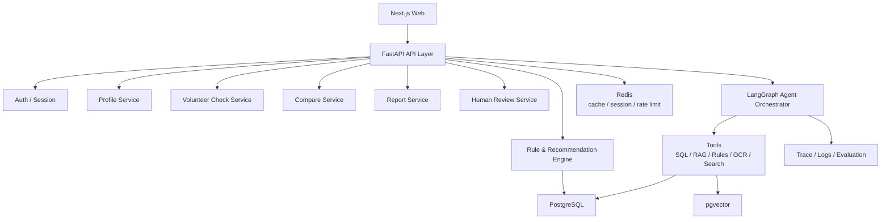
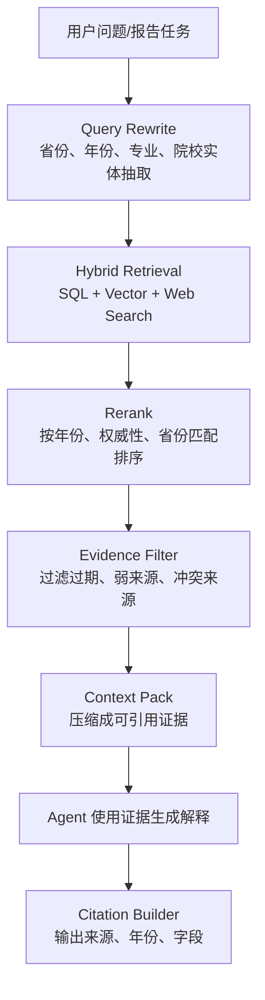
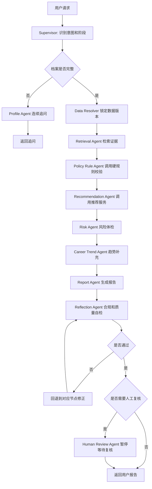

# 志愿规划 Agent 后端 PRD

版本：v0.1  
日期：2026-06-28  
后端框架：FastAPI + LangGraph  
数据底座：PostgreSQL + pgvector + Redis  
当前版本策略：所有功能免费开放，不做收费、套餐、订单、支付和付费解锁

---

## 1. 后端目标

后端的核心目标是稳定地产生可解释、可追溯、可复核的志愿辅助决策结果。

需要支撑：

- 用户建档。
- 风险画像。
- 志愿表风险体检。
- 学校/专业/城市对比。
- 冲稳保方案生成。
- 证据链检索。
- 报告生成与版本管理。
- 家庭协同标注。
- 免费人工复核流程。
- Agent run 追踪、恢复和评测。

当前版本不实现订单、支付、套餐、会员权益、付费回调、退款等商业化能力。

---

## 2. 总体架构



---

## 3. 模块职责

| 模块 | 职责 |
|---|---|
| Auth / Session | 登录态、匿名会话、用户绑定 |
| Profile Service | 学生档案、家庭偏好、档案完整度 |
| Data Service | 数据源、数据版本、解析状态、校验状态 |
| Rule Engine | 选科、批次、体检、单科、学费、专业组硬规则 |
| Recommendation Engine | 候选生成、冲稳保分层、评分排序 |
| Risk Engine | 志愿表体检、保底、梯度、热门扎堆、禁忌专业 |
| Retrieval Service | SQL 检索、向量检索、rerank、证据打包 |
| Agent Orchestrator | LangGraph 多 Agent 编排、SSE 进度、状态恢复 |
| Report Service | 报告生成、报告版本、证据链、导出数据 |
| Family Service | 家庭成员标注、冲突识别、会议议程 |
| Human Review Service | 免费人工复核任务、复核清单、结论留痕 |
| Observability | Trace、日志、成本、延迟、工具调用、评测 |

---

## 4. 确定性系统与 Agent 边界

| 能力 | 推荐实现 | 说明 |
|---|---|---|
| 省份、批次、位次、选科匹配 | SQL + Rule Engine | 必须准确、可测试、可追溯 |
| 体检限制、单科限制、学费预算 | Rule Engine | 高风险约束，不能靠 LLM 猜 |
| 候选学校生成 | Recommendation Engine | 需要稳定复现 |
| 冲稳保分层 | 算法 + 可配置阈值 | 便于评测和调参 |
| 志愿表风险体检 | Risk Engine | 风险不能漏检 |
| 专业解释、城市解释 | RAG + Agent | 适合自然语言解释 |
| 家庭偏好冲突解释 | Agent | 适合多目标权衡和表达 |
| 报告生成 | 模板 + Agent | 兼顾结构稳定和可读性 |
| 合规检查 | 规则 + Reflection Agent | 禁词和承诺必须强约束 |

核心流程：

```text
用户输入
-> Profile Resolver 档案补全
-> Data Resolver 数据版本锁定
-> Rule Engine 硬规则过滤
-> Candidate Generator 候选生成
-> Scoring Engine 排序打分
-> Risk Engine 风险体检
-> Agent Explainer 解释与报告生成
-> Compliance Checker 合规质检
-> Human Review 人工复核
```

---

## 5. API 设计

### 5.1 核心接口

| 方法 | 路径 | 说明 |
|---|---|---|
| POST | `/api/v1/auth/session` | 创建匿名或登录会话 |
| POST | `/api/v1/profile` | 创建/更新学生档案 |
| GET | `/api/v1/profile/{id}` | 获取学生档案 |
| POST | `/api/v1/risk/preview` | 生成风险画像 |
| POST | `/api/v1/volunteer/check` | 志愿表风险体检 |
| POST | `/api/v1/compare` | 学校/专业/城市候选对比 |
| POST | `/api/v1/agent/chat` | Agent 多轮问诊 |
| POST | `/api/v1/agent/runs` | 创建 Agent run |
| GET | `/api/v1/agent/runs/{id}` | 查询 Agent run 状态 |
| GET | `/api/v1/agent/runs/{id}/events` | SSE 进度事件 |
| POST | `/api/v1/reports/generate` | 生成志愿报告 |
| GET | `/api/v1/reports/{id}` | 获取报告 |
| GET | `/api/v1/reports/{id}/versions` | 获取报告版本 |
| POST | `/api/v1/family/annotations` | 家庭成员标注 |
| GET | `/api/v1/sources/{id}` | 查看证据来源 |
| POST | `/api/v1/reviews` | 创建免费人工复核任务 |
| GET | `/api/v1/reviews/{id}` | 获取复核任务 |
| PATCH | `/api/v1/reviews/{id}` | 更新复核结论 |

当前版本不提供：

- `/api/v1/orders`
- `/api/v1/payments/*`
- `/api/v1/packages`
- `/api/v1/refunds`

### 5.2 Agent run 请求

```http
POST /api/v1/agent/runs
Content-Type: application/json
```

```json
{
  "thread_id": "thread_123",
  "user_id": "user_123",
  "profile_id": "profile_123",
  "task_type": "generate_report",
  "input": {
    "province": "河南",
    "score": 612,
    "rank": 32680,
    "subjects": ["物理", "化学"]
  }
}
```

响应：

```json
{
  "run_id": "run_123",
  "status": "running",
  "stream_url": "/api/v1/agent/runs/run_123/events"
}
```

事件流：

```text
event: node_started
data: {"node":"retrieval_agent"}

event: evidence_found
data: {"source_id":"src_001","title":"某省招生计划"}

event: rule_checked
data: {"rule":"subject_requirement","status":"passed"}

event: human_interrupt
data: {"reason":"high_risk_volunteer_plan","review_task_id":"review_123"}

event: completed
data: {"report_id":"report_123"}
```

---

## 6. 数据模型

### 6.1 核心表

| 表 | 关键字段 |
|---|---|
| users | id、openid、phone、role、created_at |
| sessions | id、user_id、anonymous_id、expires_at |
| student_profiles | id、user_id、province、score、rank、subjects、batch、family_budget、risk_style |
| preferences | profile_id、major_prefs、city_prefs、rejected_majors、career_priority |
| family_members | id、profile_id、role、preference_json、created_at |
| universities | id、name、province、city、level、tags、official_code |
| majors | id、name、category、degree_type、tags |
| admission_plans | year、province、batch、university_id、major_group、major_code、quota、subjects、tuition、dataset_version |
| admission_scores | year、province、university_id、major_group、min_score、min_rank、dataset_version |
| rank_segments | year、province、score、rank_min、rank_max、dataset_version |
| rule_requirements | id、type、province、year、target_id、rule_json、source_id |
| documents | id、type、title、source_url、year、authority_level、checksum、status |
| chunks | id、document_id、content、embedding、metadata |
| reports | id、profile_id、status、risk_score、plan_json、evidence_json、dataset_version |
| report_versions | id、report_id、version_no、version_type、content_json、created_by |
| volunteer_checks | id、profile_id、report_id、risk_items、status |
| human_reviews | id、report_id、reviewer_id、status、checklist、conclusion |
| family_annotations | report_id、member_role、target_id、annotation_type |
| agent_runs | id、thread_id、user_id、status、cost、trace_url |

### 6.2 暂不建表

当前版本不做收费，因此暂不建：

- `orders`
- `payments`
- `packages`
- `coupons`
- `refunds`
- `invoices`

---

## 7. 数据源与版本

### 7.1 数据源分层

| 数据 | 类型 | 权威级别 | 用途 |
|---|---|---|---|
| 省考试院招生计划 | 结构化表格/PDF | 最高 | 招生计划、批次、院校专业组、计划数 |
| 一分一段表 | 结构化表格 | 最高 | 分数与位次转换 |
| 历年投档线 | 结构化表格 | 高 | 冲稳保判断、位次对比 |
| 学校招生章程 | PDF/HTML | 高 | 体检、单科、外语、专业限制 |
| 专业选科要求 | 结构化规则 | 高 | 选科硬过滤 |
| 就业质量报告 | PDF/HTML | 中 | 就业方向和区域解释 |
| 专业介绍 | 文本 | 中 | 专业学习内容解释 |
| 行业趋势报告 | 报告/新闻 | 中低 | 趋势补充，不能作为硬结论 |
| 顾问案例库 | 内部文本 | 内部 | 相似案例和服务经验 |

### 7.2 数据状态

| 状态 | 说明 |
|---|---|
| raw | 原始文件已抓取或上传 |
| parsed | 已解析成结构化字段或文本 chunk |
| verified | 已完成抽样校验或人工校验 |
| published | 可用于正式报告 |
| deprecated | 已过期，不再用于新报告 |

### 7.3 证据链结构

```json
{
  "source_id": "src_001",
  "source_type": "admission_plan",
  "title": "2026 年河南省本科批招生计划",
  "authority_level": "official",
  "year": 2026,
  "province": "河南",
  "batch": "本科批",
  "dataset_version": "henan_2026_v1",
  "retrieved_at": "2026-06-25T10:00:00+08:00",
  "fields": ["major_group", "subjects", "quota", "tuition"],
  "quote": "不超过合规长度的短引用或字段摘要"
}
```

---

## 8. 推荐算法与规则

### 8.1 推荐评分

总分 100：

- 录取安全性：35%
- 专业适配：20%
- 就业/行业趋势：15%
- 城市与家庭资源：15%
- 成本与风险：15%

```text
overall_score =
  admission_score * 0.35 +
  major_fit_score * 0.20 +
  career_trend_score * 0.15 +
  city_family_score * 0.15 +
  cost_risk_score * 0.15
```

### 8.2 硬过滤规则

- 省份、批次不匹配，过滤。
- 选科要求不满足，过滤或标红。
- 体检限制命中，标红或禁止推荐。
- 单科成绩限制不满足，过滤。
- 学费超过预算，降权或提示。
- 院校专业组中包含不可接受专业，标为高风险。
- 保底数量不足，方案不允许进入最终交付。
- 数据版本未发布或未校验，不允许生成正式报告。

### 8.3 志愿表风险项

| 风险 | 示例 | 处理 |
|---|---|---|
| 保底不足 | 整张表只有冲和稳，没有足够保底 | 高风险，建议人工复核 |
| 梯度过密 | 多个志愿位次差距过小 | 中高风险，建议拉开梯度 |
| 热门专业扎堆 | 计算机、临床、法学等集中 | 提示专业组调剂和竞争风险 |
| 不可接受专业命中 | 专业组内含用户禁忌专业 | 高风险，必须提示 |
| 选科冲突 | 用户选科不满足专业要求 | 禁止推荐或标红 |
| 体检限制 | 色弱、视力等限制命中 | 高风险，必须复核 |
| 学费超预算 | 中外合作/民办超预算 | 提示成本风险 |
| 地域冲突 | 用户不接受外省但方案包含外省 | 提示偏好冲突 |

---

## 9. RAG 设计



原则：

- 结构化强约束数据必须进入 PostgreSQL。
- RAG 只负责解释、补充和非结构化证据。
- 录取概率、选科、批次、体检限制必须走规则和结构化数据。
- MVP 使用 PostgreSQL + pgvector，后续数据规模扩大后再考虑 Qdrant 或 Milvus。

---

## 10. Agent 架构

### 10.1 Agent 角色

| Agent | 职责 | 主要工具 |
|---|---|---|
| Supervisor Agent | 判断任务阶段，调度子 Agent，合并结论 | LangGraph state、routing |
| Profile Agent | 连续追问，补全学生和家庭信息 | 用户档案库、Memory |
| Retrieval Agent | 从招生、政策、专业、就业、行业库检索证据 | SQL、向量库、rerank |
| Policy Rule Agent | 调用规则工具校验省份、选科、体检、单科、批次 | 规则引擎、结构化招生库 |
| Recommendation Agent | 调用推荐服务生成候选和排序解释 | 推荐算法、历史位次库 |
| Risk Agent | 检查滑档、退档、调剂、热门扎堆、保底不足 | 风险规则、志愿草稿解析 |
| Career Trend Agent | 分析专业与 5-10 年行业趋势 | 行业报告库、联网搜索 |
| Report Agent | 生成面向家长可读的报告 | 报告模板、证据链 |
| Reflection Agent | 自检是否过度承诺、数据缺失、风险漏报 | 合规规则、LLM judge |
| Human Review Agent | 生成免费人工复核底稿和清单 | 复核工作台、interrupt |

### 10.2 Agent 工作流



### 10.3 Memory

| 类型 | 存储 | 内容 | 用途 |
|---|---|---|---|
| 短期记忆 | LangGraph checkpoint / Redis | 当前对话、当前报告生成状态、当前工具调用结果 | 多轮问诊、可恢复 |
| 长期用户记忆 | PostgreSQL + LangGraph Store | 家庭预算、城市偏好、专业禁忌、过往选择 | 跨会话个性化 |
| 语义记忆 | pgvector | 用户自由文本偏好、复核总结、历史咨询摘要 | 相似案例召回 |

---

## 11. 人工复核

当前版本人工复核免费开放，用于展示 Human-in-the-loop。

触发条件：

- 用户无位次或位次可信度低。
- 数据源缺失或未验证。
- 保底不足。
- 专业组内含不可接受专业。
- 选科、体检、单科限制冲突。
- 报告风险等级为高。
- Reflection Agent 判断存在过度承诺或证据不足。
- 用户主动申请复核。

复核任务状态：

- pending。
- need_more_info。
- reviewed。
- closed。

---

## 12. 安全与合规

### 12.1 内容合规

禁止输出：

- 保证录取、必中、精准录取、内部数据、包过、保上。
- 代替考试院填报。
- 要求用户提供官方系统密码。
- 夸大专业就业收入或承诺未来薪资。
- 暗示任何人可以获得不公平录取优势。

### 12.2 数据合规

- 未成年人数据最小化采集。
- 敏感信息加密存储。
- 支持用户删除档案和报告。
- 上传图片、语音、PDF 设置过期清理策略。
- 复核人员只能访问自己负责的复核任务。
- 报告分享页必须有权限控制和失效机制。
- 训练、评测、调试数据需要脱敏。

### 12.3 Agent 风控

- Prompt 注入防护：RAG 文档作为数据，不允许覆盖系统规则。
- 工具权限隔离：搜索、数据库、复核任务拆分权限。
- 高风险结论强制 Human-in-the-loop。
- 所有 Agent 输出进入 Reflection Agent 做合规检查。
- 关键报告保存 prompt、工具调用、证据来源、模型版本和生成时间。
- Agent 不得绕过规则引擎直接生成最终推荐。

---

## 13. 评测与验收

### 13.1 技术验收

- FastAPI 自动生成 OpenAPI 文档。
- Agent run 支持 thread_id 恢复。
- RAG 检索结果带 source_id 和 metadata。
- 结构化规则优先于 LLM 判断。
- 报告生成链路有 trace、cost、latency 记录。
- 高风险报告触发 human interrupt。
- 报告绑定 dataset_version。
- 不存在订单、支付、套餐相关接口。

### 13.2 质量指标

| 指标 | 目标 |
|---|---:|
| 风险画像 P95 延迟 | < 2s |
| 志愿表体检 P95 延迟 | < 5s |
| 报告生成 P95 延迟 | < 45s |
| RAG citation 覆盖率 | 95%+ |
| 硬规则误判率 | < 0.5% |
| Agent 工具调用失败率 | < 2% |
| 高风险漏检率 | 0 容忍 |
| 合规禁词漏检 | 0 容忍 |

### 13.3 黄金评测集

作品集和工程验收都需要准备 30-50 个黄金案例。

案例类型：

- 选科不满足专业要求。
- 体检限制命中。
- 保底不足。
- 梯度过密。
- 热门专业扎堆。
- 不可接受专业命中。
- 学费超预算。
- 省份数据缺失。
- 位次缺失，只提供分数。
- 家庭偏好冲突。
- 报告出现“保证录取”等违规表达。

每个案例保存：

- 输入档案。
- 输入志愿表。
- 预期风险项。
- 预期是否触发人工复核。
- 预期证据来源。
- 实际输出对比。

