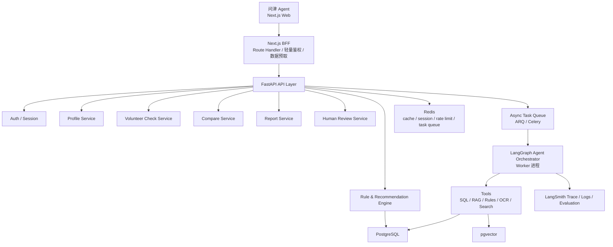
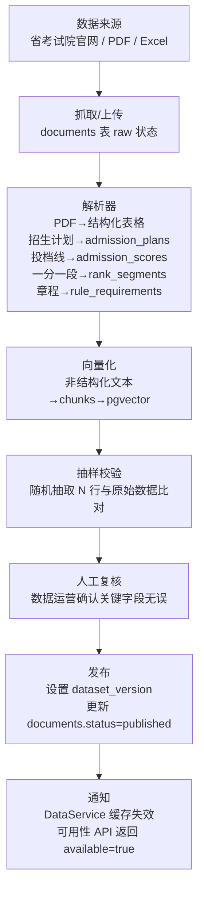
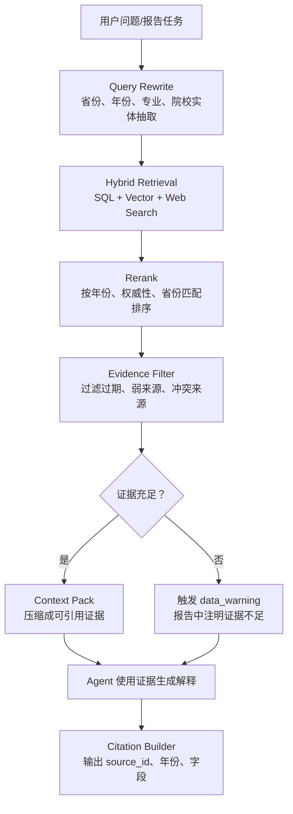
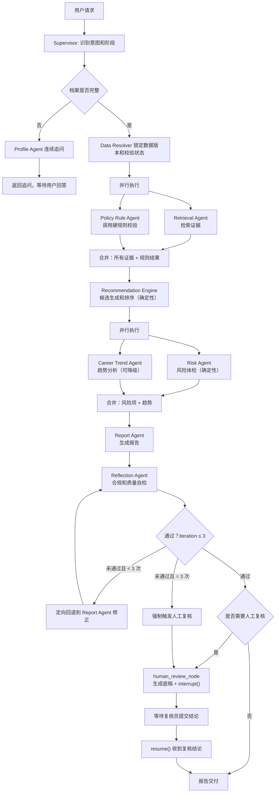

# 问津 Agent 后端 PRD

版本：v0.2  
日期：2026-06-28  
后端框架：FastAPI + LangGraph  
数据底座：PostgreSQL + pgvector + Redis  
当前版本策略：所有功能免费开放，不做收费、套餐、订单、支付和付费解锁

v0.2 相对 v0.1 的核心变更：
- 架构图补充 BFF 层和异步任务层
- Agent 工作流改为两阶段并行执行，降低报告生成延迟
- 明确 Human Review 是 LangGraph interrupt 节点，不是 Agent
- 新增 LangGraph State Schema
- 新增 Agent 工具规格表
- 数据模型补充 candidate_sets、evidence_citations 表，完善 agent_runs
- 新增错误处理与降级策略
- 新增成本控制与限流设计
- 补充数据管道 ETL 流程

---

## 1. 后端目标

后端的核心目标是稳定地产生可解释、可追溯、可复核的志愿辅助决策结果。

需要支撑：

- 用户建档。
- 风险画像。
- 志愿表风险体检。
- 学校/专业/城市对比。
- 冲稳保方案生成。
- 证据链检索。
- 报告生成与版本管理。
- 家庭协同标注。
- 免费人工复核流程。
- Agent run 追踪、恢复和评测。
- Agent run 成本控制与降级策略。

当前版本不实现订单、支付、套餐、会员权益、付费回调、退款等商业化能力。

---

## 2. 总体架构



**关键分层说明：**

- **BFF 层**：Next.js Route Handler 承接前端请求，负责轻量鉴权、SSE 转发、文件上传预处理和数据预取。不包含业务逻辑。
- **API 层**：FastAPI 处理所有业务 HTTP 请求，同步返回或下发异步任务。
- **异步任务层**：报告生成等耗时操作通过 ARQ（或 Celery）投入队列，LangGraph 在独立 Worker 进程中执行。前端通过 SSE 订阅进度事件。
- **Agent 层**：LangGraph 编排多 Agent 工作流，通过工具调用确定性服务，不直接访问数据库原始表。

---

## 3. 模块职责

| 模块                  | 职责                                                         |
| --------------------- | ------------------------------------------------------------ |
| BFF                   | 鉴权转发、SSE 代理、文件预处理、服务端渲染数据预取           |
| Auth / Session        | 登录态、匿名会话、用户绑定                                   |
| Profile Service       | 学生档案、家庭偏好、档案完整度计算                           |
| Data Service          | 数据源、数据版本、解析状态、校验状态、数据可用性检查         |
| Rule Engine           | 选科、批次、体检、单科、学费、专业组硬规则校验               |
| Recommendation Engine | 候选生成、冲稳保分层、评分排序                               |
| Risk Engine           | 志愿表体检、保底充足性、梯度、热门扎堆、禁忌专业             |
| Retrieval Service     | SQL 检索、向量检索、rerank、证据打包                         |
| Agent Orchestrator    | LangGraph 多 Agent 编排、SSE 进度事件、状态恢复、interrupt   |
| Report Service        | 报告生成、报告版本、证据链、导出                             |
| Family Service        | 家庭成员标注、冲突识别、会议议程生成                         |
| Human Review Service  | 人工复核任务创建、复核清单、结论留痕、状态流转               |
| Async Task Queue      | ARQ 任务投递、进度事件发布到 Redis Pub/Sub、任务超时管理     |
| Observability         | LangSmith Trace、日志、成本统计、延迟监控、工具调用成功率    |

---

## 4. 确定性系统与 Agent 边界

高考志愿是高风险决策，不能让 LLM 直接决定事实或规则。

| 能力                         | 推荐实现                | 说明                                              |
| ---------------------------- | ----------------------- | ------------------------------------------------- |
| 省份、批次、位次、选科匹配   | SQL + Rule Engine       | 必须准确、可测试、可追溯                          |
| 体检限制、单科限制、学费预算 | Rule Engine             | 高风险约束，不能靠 LLM 猜                         |
| 候选学校生成                 | Recommendation Engine   | 需要稳定复现，必须绑定数据版本                    |
| 冲稳保分层                   | 算法 + 可配置阈值       | 便于评测和调参                                    |
| 志愿表风险体检               | Risk Engine             | 风险不能漏检，规则引擎给结论，Agent 给解释        |
| 专业解释、城市解释           | RAG + Agent             | 适合自然语言解释和证据引用                        |
| 家庭偏好冲突解释             | Agent                   | 适合多目标权衡和自然语言表达                      |
| 报告生成                     | 模板 + Agent            | 结构由模板保证，语言由 Agent 生成                 |
| 合规检查                     | 规则 + Reflection Agent | 禁词由规则强约束，语义过承诺由 LLM judge 检查     |
| 报告交付决策                 | 规则                    | 是否可交付必须由规则决定，不能由 Agent 自行判断   |

**核心流程（详细见 Section 10）：**

```text
用户输入
-> Profile Resolver       档案完整性检查，不足则追问
-> Data Resolver          数据版本锁定和可用性校验
-> [并行] Retrieval Agent + Policy Rule Agent
-> Recommendation Engine  候选生成和排序（依赖上一步结果）
-> [并行] Risk Agent + Career Trend Agent
-> Report Agent           报告生成（依赖上面全部结果）
-> Reflection Agent       合规自检（最多 3 轮）
-> [条件] Human Review    interrupt 等待复核（高风险时触发）
-> 报告交付
```

---

## 5. API 设计

### 5.1 核心接口

| 方法  | 路径                              | 说明                              |
| ----- | --------------------------------- | --------------------------------- |
| POST  | `/api/v1/auth/session`            | 创建匿名或登录会话                |
| POST  | `/api/v1/profile`                 | 创建/更新学生档案                 |
| GET   | `/api/v1/profile/{id}`            | 获取学生档案                      |
| GET   | `/api/v1/data/availability`       | 查询省份数据可用性和版本状态      |
| POST  | `/api/v1/risk/preview`            | 生成风险画像（同步，< 2s）        |
| POST  | `/api/v1/volunteer/check`         | 志愿表风险体检（同步，< 5s）      |
| POST  | `/api/v1/compare`                 | 学校/专业/城市候选对比            |
| POST  | `/api/v1/agent/runs`              | 创建 Agent run，投入异步队列      |
| GET   | `/api/v1/agent/runs/{id}`         | 查询 Agent run 状态               |
| GET   | `/api/v1/agent/runs/{id}/events`  | SSE 进度事件流                    |
| POST  | `/api/v1/agent/runs/{id}/resume`  | 提交 interrupt 恢复数据（复核后） |
| POST  | `/api/v1/reports/generate`        | 触发报告生成（创建 Agent run）    |
| GET   | `/api/v1/reports/{id}`            | 获取报告                          |
| GET   | `/api/v1/reports/{id}/versions`   | 获取报告版本历史                  |
| POST  | `/api/v1/family/annotations`      | 家庭成员标注                      |
| GET   | `/api/v1/sources/{id}`            | 查看证据来源                      |
| POST  | `/api/v1/reviews`                 | 创建免费人工复核任务               |
| GET   | `/api/v1/reviews/{id}`            | 获取复核任务和清单                |
| PATCH | `/api/v1/reviews/{id}`            | 提交复核结论（触发 run 恢复）     |

当前版本不提供：`/api/v1/orders`、`/api/v1/payments/*`、`/api/v1/packages`、`/api/v1/refunds`。

### 5.2 数据可用性检查

前端在用户输入省份后应主动调用，避免用户完整建档后才发现数据缺失。

```http
GET /api/v1/data/availability?province=河南&year=2026&batch=本科批
```

响应：

```json
{
  "province": "河南",
  "year": 2026,
  "batch": "本科批",
  "status": "published",
  "dataset_version": "henan_2026_v1",
  "available": true,
  "warnings": []
}
```

当 `available: false` 时，前端需要提示用户"当前省份数据尚未就绪，报告生成可能受限"。

### 5.3 Agent run 请求与 SSE 事件

```http
POST /api/v1/agent/runs
```

```json
{
  "thread_id": "thread_123",
  "user_id": "user_123",
  "profile_id": "profile_123",
  "task_type": "generate_report",
  "input": {
    "province": "河南",
    "score": 612,
    "rank": 32680,
    "subjects": ["物理", "化学"]
  }
}
```

响应：

```json
{
  "run_id": "run_123",
  "status": "queued",
  "stream_url": "/api/v1/agent/runs/run_123/events"
}
```

SSE 事件流（标准格式，所有事件都有 `data` 字段）：

```text
event: node_started
data: {"node": "retrieval_agent", "message": "正在检索招生数据"}

event: evidence_found
data: {"source_id": "src_001", "title": "2026年河南省本科批招生计划", "authority": "official"}

event: rule_checked
data: {"rule": "subject_requirement", "target": "计算机科学与技术", "status": "passed"}

event: rule_checked
data: {"rule": "medical_restriction", "target": "临床医学", "status": "blocked", "reason": "色觉要求不符"}

event: candidates_ready
data: {"total": 48, "rush": 12, "target": 20, "safe": 16}

event: risk_found
data: {"risk_type": "insufficient_safety", "severity": "high", "message": "当前方案保底数量不足"}

event: human_interrupt
data: {"reason": "high_risk_report", "review_task_id": "review_123", "message": "报告风险等级较高，已创建人工复核任务"}

event: error
data: {"code": "career_trend_unavailable", "message": "职业趋势数据暂时不可用，报告将跳过趋势分析", "severity": "warning"}

event: completed
data: {"report_id": "report_123", "risk_level": "medium", "needs_review": false}
```

---

## 6. 数据模型

### 6.1 核心表

| 表                   | 关键字段                                                                                                     |
| -------------------- | ------------------------------------------------------------------------------------------------------------ |
| users                | id、openid、phone、role、created_at                                                                          |
| sessions             | id、user_id、anonymous_id、expires_at                                                                        |
| student_profiles     | id、user_id、province、score、rank、subjects、batch、family_budget、risk_style、completeness_score           |
| preferences          | id、profile_id、major_prefs、city_prefs、rejected_majors、career_priority                                    |
| family_members       | id、profile_id、role、preference_json、created_at                                                            |
| universities         | id、name、province、city、level、tags、official_code                                                         |
| majors               | id、name、category、degree_type、tags                                                                        |
| admission_plans      | year、province、batch、university_id、major_group、major_code、quota、subjects、tuition、dataset_version     |
| admission_scores     | year、province、university_id、major_group、min_score、min_rank、dataset_version                             |
| rank_segments        | year、province、score、rank_min、rank_max、dataset_version                                                   |
| rule_requirements    | id、type、province、year、target_id、rule_json、source_id                                                    |
| documents            | id、type、title、source_url、year、authority_level、checksum、status                                         |
| chunks               | id、document_id、content、embedding、metadata                                                                |
| candidate_sets       | id、run_id、profile_id、dataset_version、candidates_json、scored_json、tier_summary、created_at              |
| reports              | id、profile_id、status、risk_level、risk_score、plan_json、dataset_version、run_id                           |
| evidence_citations   | id、report_id、source_id、source_type、authority_level、year、province、quote、fields_used、created_at       |
| report_versions      | id、report_id、version_no、version_type、content_json、created_by                                            |
| volunteer_checks     | id、profile_id、report_id、risk_items_json、overall_risk_level、status                                       |
| human_reviews        | id、report_id、run_id、reviewer_id、status、checklist_json、conclusion、created_at、completed_at             |
| family_annotations   | id、report_id、member_role、target_id、target_type、annotation_type、created_at                              |
| agent_runs           | id、thread_id、user_id、profile_id、task_type、status、checkpoint_data、cost_tokens、cost_usd、trace_url、error_msg、created_at、completed_at |

### 6.2 rule_requirements.rule_json 结构

`rule_json` 不是自由格式，必须符合以下 schema，规则引擎按 type 分发处理：

```json
{
  "type": "subject_requirement",
  "logic": "OR",
  "required_subjects": [
    {"group": "A", "subjects": ["物理"]},
    {"group": "B", "subjects": ["物理", "化学"]}
  ],
  "source": "2026年河南省招生章程第3条",
  "effective_year": 2026
}
```

```json
{
  "type": "medical_restriction",
  "conditions": ["色觉异常（色盲/色弱）", "视力低于4.8"],
  "restriction_level": "prohibited",
  "source": "招生章程体检要求"
}
```

### 6.3 candidate_sets 说明

`candidate_sets` 存储 Agent run 过程中 Recommendation Engine 的输出，用于：
- 报告生成失败时的状态恢复（不重新跑推荐算法）
- 调试和评测（可回放某次推荐结果）
- 审计（记录哪个数据版本生成了哪些候选）

### 6.4 evidence_citations 说明

`evidence_citations` 将 `reports.plan_json` 中嵌入的证据链规范化到独立表，好处：
- 支持按 source_id 查询"这个证据被哪些报告引用过"
- 支持证据链完整性校验（RAG citation 覆盖率指标依赖此表）
- 支持数据过期时批量标记引用该数据源的报告

### 6.5 暂不建表

当前版本不做收费，因此暂不建：`orders`、`payments`、`packages`、`coupons`、`refunds`、`invoices`。

---

## 7. 数据源、版本与数据管道

### 7.1 数据源分层

| 数据             | 类型           | 权威级别 | 用途                               |
| ---------------- | -------------- | -------- | ---------------------------------- |
| 省考试院招生计划 | 结构化表格/PDF | 最高     | 招生计划、批次、院校专业组、计划数 |
| 一分一段表       | 结构化表格     | 最高     | 分数与位次转换                     |
| 历年投档线       | 结构化表格     | 高       | 冲稳保判断、位次对比               |
| 学校招生章程     | PDF/HTML       | 高       | 体检、单科、外语、专业限制         |
| 专业选科要求     | 结构化规则     | 高       | 选科硬过滤                         |
| 就业质量报告     | PDF/HTML       | 中       | 就业方向和区域解释                 |
| 专业介绍         | 文本           | 中       | 专业学习内容解释                   |
| 行业趋势报告     | 报告/新闻      | 中低     | 趋势补充，不能作为硬结论           |
| 顾问案例库       | 内部文本       | 内部     | 相似案例和服务经验                 |

### 7.2 数据状态流转

```
raw → parsed → verified → published → deprecated
```

| 状态       | 说明                                           |
| ---------- | ---------------------------------------------- |
| raw        | 原始文件已抓取或上传，未解析                   |
| parsed     | 已解析成结构化字段或文本 chunk，未校验         |
| verified   | 已完成抽样校验或人工校验，可用于测试报告       |
| published  | 可用于正式报告生成，绑定 dataset_version       |
| deprecated | 已过期，不再用于新报告，但现有报告保留引用     |

**关键约束**：`dataset_version` 状态非 `published` 时，系统禁止创建正式报告。`Data Resolver` 在 Agent run 启动时锁定版本并校验状态。

### 7.3 数据管道（ETL）



**文件解析处理**：OCR 和 PDF 解析为异步任务，不阻塞 API 响应。上传接口立即返回 `document_id`，前端轮询解析状态。解析失败返回 `status: failed` 并附带可操作提示（如"请重新上传清晰版本"）。

### 7.4 证据链结构

```json
{
  "source_id": "src_001",
  "source_type": "admission_plan",
  "title": "2026年河南省本科批招生计划",
  "authority_level": "official",
  "year": 2026,
  "province": "河南",
  "batch": "本科批",
  "dataset_version": "henan_2026_v1",
  "retrieved_at": "2026-06-25T10:00:00+08:00",
  "fields": ["major_group", "subjects", "quota", "tuition"],
  "quote": "不超过合规长度的短引用或字段摘要"
}
```

---

## 8. 推荐算法与规则

### 8.1 推荐评分

总分 100：

- 录取安全性：35%
- 专业适配：20%
- 就业/行业趋势：15%
- 城市与家庭资源：15%
- 成本与风险：15%

```text
overall_score =
  admission_score * 0.35 +
  major_fit_score * 0.20 +
  career_trend_score * 0.15 +
  city_family_score * 0.15 +
  cost_risk_score * 0.15
```

当 Career Trend Agent 降级时，`career_trend_score` 使用历史均值填充，并在报告中注明"趋势数据暂不可用，该维度使用历史估算"。

### 8.2 硬过滤规则（Rule Engine 执行，不经过 LLM）

- 省份、批次不匹配，过滤。
- 选科要求不满足，过滤或标红。
- 体检限制命中，标红或禁止推荐。
- 单科成绩限制不满足，过滤。
- 学费超过预算，降权或提示。
- 院校专业组中包含不可接受专业，标为高风险。
- 保底数量不足，方案不允许进入最终交付。
- 数据版本未发布或未校验，不允许生成正式报告。

### 8.3 志愿表风险项

| 风险             | 示例                           | 处理                     |
| ---------------- | ------------------------------ | ------------------------ |
| 保底不足         | 整张表只有冲和稳，没有足够保底 | 高风险，建议人工复核     |
| 梯度过密         | 多个志愿位次差距过小           | 中高风险，建议拉开梯度   |
| 热门专业扎堆     | 计算机、临床、法学等集中       | 提示专业组调剂和竞争风险 |
| 不可接受专业命中 | 专业组内含用户禁忌专业         | 高风险，必须提示         |
| 选科冲突         | 用户选科不满足专业要求         | 禁止推荐或标红           |
| 体检限制         | 色弱、视力等限制命中           | 高风险，必须复核         |
| 学费超预算       | 中外合作/民办超预算            | 提示成本风险             |
| 地域冲突         | 用户不接受外省但方案包含外省   | 提示偏好冲突             |

---

## 9. RAG 设计



原则：

- 结构化强约束数据必须进入 PostgreSQL。
- RAG 只负责解释、补充和非结构化证据。
- 录取概率、选科、批次、体检限制必须走规则和结构化数据。
- 证据不足时不生成强确定性结论，在报告中显式标注。
- MVP 使用 PostgreSQL + pgvector，后续数据规模扩大后再考虑 Qdrant 或 Milvus。

---

## 10. Agent 架构

### 10.1 Agent 角色与职责边界

| Agent / 节点         | 类型           | 职责                                                         | 主要工具                           |
| -------------------- | -------------- | ------------------------------------------------------------ | ---------------------------------- |
| Supervisor           | 路由节点       | 识别任务阶段，决定下一个节点，合并最终结论                   | LangGraph conditional_edge         |
| Profile Agent        | LLM Agent      | 连续追问，补全学生和家庭信息                                 | get_profile、update_profile        |
| Data Resolver        | 确定性节点     | 锁定数据版本，校验 published 状态，返回 data_warnings        | check_data_availability            |
| Retrieval Agent      | LLM Agent      | 从招生、政策、专业、就业、行业库检索证据                     | search_admission、vector_search、rerank |
| Policy Rule Agent    | 确定性节点     | 调用规则工具校验选科、体检、单科、批次、预算                 | check_subject、check_medical、check_batch |
| Recommendation Agent | 确定性节点     | 调用推荐算法生成候选和分层，保存 candidate_sets              | generate_candidates、score、classify_tiers |
| Risk Agent           | 确定性节点     | 志愿表体检：保底、梯度、扎堆、禁忌、冲突                     | check_safety、check_gradient、check_crowding |
| Career Trend Agent   | LLM Agent      | 分析专业与 5-10 年行业趋势（可降级）                         | search_industry_reports、web_search |
| Report Agent         | LLM Agent      | 按模板生成面向家长可读的报告，绑定证据链                     | render_template、format_citation   |
| Reflection Agent     | LLM judge 节点 | 合规检查（禁词）、证据覆盖率检查、过度承诺检测，最多 3 轮    | check_compliance、check_coverage、llm_judge |
| human_review_node    | interrupt 节点 | **非 Agent**，生成复核底稿后调用 `interrupt()`，等待人工复核 | render_review_draft                |

**重要说明**：`human_review_node` 是 LangGraph 的 `interrupt()` 节点，不是持续运行的 LLM Agent。它执行一次 LLM 调用生成复核底稿，然后暂停图执行，等待人工通过 `PATCH /api/v1/reviews/{id}` 提交结论，再通过 `POST /api/v1/agent/runs/{id}/resume` 恢复图执行。

### 10.2 LangGraph State Schema

所有 Agent 节点共享同一个 State 对象，通过 LangGraph checkpoint 持久化到 Redis，支持恢复。

```python
class VolunteerPlanState(TypedDict):
    # ── 基础信息 ──
    run_id: str
    thread_id: str
    user_id: str
    profile_id: str
    task_type: Literal["generate_report", "check_volunteer", "compare"]

    # ── 档案 ──
    profile: dict | None                    # StudentProfile 序列化
    family_members: list[dict]
    profile_complete: bool
    profile_pending_questions: list[str]    # Profile Agent 待追问的问题列表

    # ── 数据版本 ──
    dataset_version: str | None
    data_warnings: list[str]               # 数据不完整提示

    # ── 检索结果 ──
    evidence_list: list[dict]              # 证据列表，含 source_id、authority 等
    retrieval_complete: bool

    # ── 规则校验结果 ──
    rule_results: list[dict]               # {rule_type, target, status, reason}
    hard_blocked_items: list[str]          # 被硬过滤的院校专业组 id

    # ── 候选集 ──
    candidate_set_id: str | None           # 指向 candidate_sets 表
    candidates: list[dict]
    scored_candidates: list[dict]
    tier_summary: dict                     # {rush: N, target: N, safe: N}

    # ── 风险检查 ──
    risk_items: list[dict]                 # {risk_type, severity, message, targets}
    overall_risk_level: Literal["low", "medium", "high"]

    # ── 报告 ──
    report_draft: dict | None
    report_id: str | None

    # ── 合规自检 ──
    compliance_passed: bool
    compliance_issues: list[str]
    reflection_iterations: int             # 最大 3，超出则强制触发 human review

    # ── 人工复核 ──
    needs_human_review: bool
    review_reasons: list[str]
    review_task_id: str | None

    # ── 多轮对话消息 ──
    messages: Annotated[list[BaseMessage], add_messages]

    # ── 运行元数据 ──
    started_at: str
    completed_at: str | None
    error: str | None
    degraded_agents: list[str]             # 记录哪些 Agent 发生了降级
```

### 10.3 Agent 工作流（含并行执行）

**顺序执行改为两阶段并行**，相比 v0.1 的纯顺序流，可大幅降低报告生成延迟：



**并行执行说明**：
- 阶段一并行：`Retrieval Agent` 和 `Policy Rule Agent` 不相互依赖，均只需要 profile 和 dataset_version。
- 阶段二并行：`Risk Agent` 基于候选集做确定性检查，`Career Trend Agent` 做行业趋势分析，两者独立。
- LangGraph 中使用 `Send` API 实现并行，每个并行分支写入 State 的不同字段。

### 10.4 Agent 工具规格

| Agent              | 工具                       | 说明                                              |
| ------------------ | -------------------------- | ------------------------------------------------- |
| Profile Agent      | `get_profile`              | 读取当前档案，返回缺失字段列表                    |
| Profile Agent      | `update_profile`           | 写入补全的档案字段                                |
| Retrieval Agent    | `search_admission_sql`     | 按省份/年份/批次/专业组检索结构化招生数据          |
| Retrieval Agent    | `search_historical_scores` | 检索历年投档线和位次数据                          |
| Retrieval Agent    | `vector_search`            | 语义检索非结构化文本（专业介绍、政策、章程）      |
| Retrieval Agent    | `rerank_evidence`          | 对检索结果按年份、权威性、省份匹配重排序          |
| Policy Rule Agent  | `check_subject_req`        | 选科是否满足专业要求，返回 pass/fail + reason      |
| Policy Rule Agent  | `check_medical_restriction`| 体检条件是否触发限制专业                          |
| Policy Rule Agent  | `check_single_subject`     | 单科成绩是否满足要求                              |
| Policy Rule Agent  | `check_batch_eligibility`  | 分数/位次是否满足当前批次要求                     |
| Risk Agent         | `check_safety_adequacy`    | 保底志愿数量是否充足                              |
| Risk Agent         | `check_gradient`           | 志愿梯度是否合理                                  |
| Risk Agent         | `check_crowding`           | 热门专业是否存在扎堆风险                          |
| Risk Agent         | `check_rejected_major`     | 候选中是否命中用户禁忌专业                        |
| Career Trend Agent | `search_industry_reports`  | 检索行业就业趋势报告（向量库）                    |
| Career Trend Agent | `web_search`               | 联网搜索最新行业动态（工具降级时跳过）            |
| Report Agent       | `render_report_template`   | 填充报告模板结构（保证必要字段不缺失）            |
| Report Agent       | `format_citation`          | 将 evidence_list 格式化为可引用证据标注            |
| Reflection Agent   | `check_compliance`         | 检测禁用词和违规承诺（规则优先，LLM 辅助）        |
| Reflection Agent   | `check_evidence_coverage`  | 验证 evidence_citations 覆盖所有关键结论          |
| Reflection Agent   | `llm_judge`                | 语义级别的过度承诺检测                            |
| human_review_node  | `render_review_draft`      | 生成面向复核员的咨询底稿和风险清单                |

### 10.5 Memory

| 类型         | 存储                              | 内容                                           | 用途             |
| ------------ | --------------------------------- | ---------------------------------------------- | ---------------- |
| 短期记忆     | LangGraph checkpoint（Redis）     | 当前 State、对话历史、工具调用中间结果         | 多轮问诊、状态恢复 |
| 长期用户记忆 | PostgreSQL + LangGraph Store      | 家庭预算、城市偏好、专业禁忌、过往选择         | 跨会话个性化     |
| 语义记忆     | pgvector                          | 用户自由文本偏好、复核总结、历史咨询摘要       | 相似案例召回     |

### 10.6 Reflection 循环保护

Reflection Agent 自检失败后会触发修正回退。为防止死循环：

- State 中维护 `reflection_iterations` 计数器。
- 每次 Reflection 失败并回退，计数器 +1。
- 当 `reflection_iterations >= 3` 时，不再回退，直接标记 `needs_human_review = true`，附上所有 `compliance_issues`，进入 `human_review_node`。
- 复核员看到的清单中会包含"AI 自检未通过"条目，指向具体问题。

---

## 11. 人工复核

### 11.1 触发条件

- 用户无位次，或位次可信度低。
- 关键数据源缺失或未验证。
- 保底志愿数量不足。
- 专业组内含不可接受专业。
- 选科、体检、单科限制冲突。
- 报告整体风险等级为高。
- Reflection Agent 经过 3 次迭代仍未通过。
- 用户主动申请复核。

### 11.2 interrupt 机制

当 `human_review_node` 触发时：

1. `render_review_draft` 工具调用 LLM，生成包含风险摘要、数据清单、待确认项的咨询底稿。
2. 底稿和复核清单写入 `human_reviews` 表，状态设为 `pending`。
3. LangGraph 调用 `interrupt({"review_task_id": id})`，图执行暂停，checkpoint 保存当前 State。
4. API 通过 SSE 向前端推送 `human_interrupt` 事件。
5. 复核员通过 `PATCH /api/v1/reviews/{id}` 提交结论。
6. Review Service 调用 `POST /api/v1/agent/runs/{run_id}/resume`，将复核结论注入 State，图从 `human_review_node` 之后恢复执行，进入报告交付。

### 11.3 复核任务状态

| 状态           | 说明                               |
| -------------- | ---------------------------------- |
| pending        | 等待复核员领取                     |
| need_more_info | 复核员要求用户补充信息             |
| reviewed       | 复核完成，结论已提交               |
| closed         | 图已恢复执行，报告已交付           |

---

## 12. 安全、合规与风控

### 12.1 内容合规

禁止输出：

- 保证录取、必中、精准录取、内部数据、包过、保上。
- 代替考试院填报。
- 要求用户提供官方系统密码。
- 夸大专业就业收入或承诺未来薪资。
- 暗示任何人可以获得不公平录取优势。

### 12.2 数据合规

- 未成年人数据最小化采集。
- 敏感信息加密存储。
- 支持用户删除档案和报告。
- 上传图片、语音、PDF 设置过期清理策略。
- 复核人员只能访问自己负责的复核任务。
- 报告分享页必须有权限控制和失效机制。
- 训练、评测、调试数据需要脱敏。

### 12.3 Agent 风控

- Prompt 注入防护：RAG 文档作为数据，不允许覆盖系统规则。
- 工具权限隔离：搜索、数据库、复核任务拆分权限，Agent 不能直接写报告表。
- 高风险结论强制进入 interrupt，不能绕过。
- 所有 Agent 输出进入 Reflection Agent 做合规检查。
- 关键报告保存 prompt、工具调用链、证据来源、模型版本和生成时间。
- Agent 不得绕过 Recommendation Engine 和 Rule Engine 直接生成推荐。

### 12.4 成本控制与限流

Agent run 涉及多次 LLM 调用，需要明确的成本边界：

| 控制项                    | 策略                                                          |
| ------------------------- | ------------------------------------------------------------- |
| 每次 run 的 token 预算    | 单次 generate_report run 上限 150K tokens，超出提前终止       |
| 每用户并发 run 数         | 同一用户同时最多 2 个活跃 run                                 |
| 每用户每日 run 次数       | MVP 阶段每用户每天 10 次 generate_report（Redis 计数器）      |
| Career Trend Agent 限流   | 联网搜索每次 run 最多 5 次 web_search 调用                    |
| Reflection Agent 最大轮次 | 最多 3 次，防止成本叠加（见 Section 10.6）                    |
| 异步任务超时              | run 超过 120s 自动标记 timeout，通过 SSE 通知前端，可重试     |

---

## 13. 错误处理与降级策略

高考志愿场景对正确性要求高，错误处理必须遵循"宁可明确失败，不能静默错误"原则。

| 模块               | 失败场景                     | 降级处理                                                     |
| ------------------ | ---------------------------- | ------------------------------------------------------------ |
| Data Resolver      | 省份数据非 published 状态    | 阻断流程，通过 SSE `error` 事件返回，不继续生成报告          |
| Rule Engine        | 规则服务不可用               | 阻断流程，规则校验不能降级，返回 503 并提示重试              |
| Retrieval Agent    | 向量检索失败                 | 降级到 SQL 检索，在报告中注明"部分非结构化证据检索失败"      |
| Retrieval Agent    | 证据不足（< 最低阈值）       | 继续但在 State 设置 data_warning，报告中显式标注证据不足     |
| Recommendation Engine | 候选生成异常              | 阻断流程，候选不足时无法生成报告，返回明确错误               |
| Risk Agent         | 风险检查异常                 | 阻断流程，风险不能漏检，不允许降级跳过                       |
| Career Trend Agent | 联网搜索失败 / 超时          | 降级：跳过趋势分析，在 State `degraded_agents` 记录，report 中注明趋势维度不可用，career_trend_score 使用历史均值 |
| Report Agent       | 报告生成失败                 | 重试 1 次，仍失败则返回错误，保留已生成的 candidate_sets     |
| Reflection Agent   | 3 轮迭代未通过               | 强制触发 human_review_node（见 Section 10.6）                |
| human_review_node  | 超时未复核（24h）            | 自动关闭复核任务，通过邮件/站内信通知用户，run 标记超时      |
| 整个 run 超时      | Worker 进程异常              | LangGraph checkpoint 保存 State，用户可通过重新请求 resume   |

**错误信息透明原则**：所有 SSE `error` 事件必须包含 `severity`（`warning` / `error` / `critical`）和 `message`（用户可理解的中文说明），不允许只输出工程异常码。

---

## 14. 评测与验收

### 14.1 技术验收

- FastAPI 自动生成 OpenAPI 文档。
- Agent run 支持 thread_id 恢复，kill 后重连可继续。
- RAG 检索结果带 source_id 和 metadata。
- 结构化规则优先于 LLM 判断。
- 报告生成链路有 trace、cost_tokens、latency 记录。
- 高风险报告触发 human interrupt。
- 报告绑定 dataset_version，evidence_citations 表完整。
- Reflection Agent 有轮次上限，不存在死循环。
- 不存在订单、支付、套餐相关接口。

### 14.2 质量指标

| 指标                   | 目标    |
| ---------------------- | ------: |
| 风险画像 P95 延迟      | < 2s    |
| 志愿表体检 P95 延迟    | < 5s    |
| 报告生成 P95 延迟      | < 45s   |
| RAG citation 覆盖率    | 95%+    |
| 硬规则误判率           | < 0.5%  |
| Agent 工具调用失败率   | < 2%    |
| 高风险漏检率           | 0 容忍  |
| 合规禁词漏检           | 0 容忍  |
| 单次报告生成 token 消耗 | < 100K |
| Agent run 超时率       | < 1%    |

### 14.3 黄金评测集

作品集和工程验收都需要准备 30-50 个黄金案例。

案例类型：

- 选科不满足专业要求。
- 体检限制命中。
- 保底不足。
- 梯度过密。
- 热门专业扎堆。
- 不可接受专业命中。
- 学费超预算。
- 省份数据缺失（data_warnings 是否正确返回）。
- 位次缺失，只提供分数。
- 家庭偏好冲突。
- 报告出现"保证录取"等违规表达（Reflection Agent 是否拦截）。
- Reflection Agent 3 次迭代未通过（human review 是否正确触发）。
- Career Trend Agent 降级（报告是否正确标注趋势不可用）。

每个案例保存：

- 输入档案。
- 输入志愿表（如适用）。
- 预期风险项。
- 预期是否触发人工复核。
- 预期证据来源（source_id 列表）。
- 预期 degraded_agents（如适用）。
- 实际输出对比。
