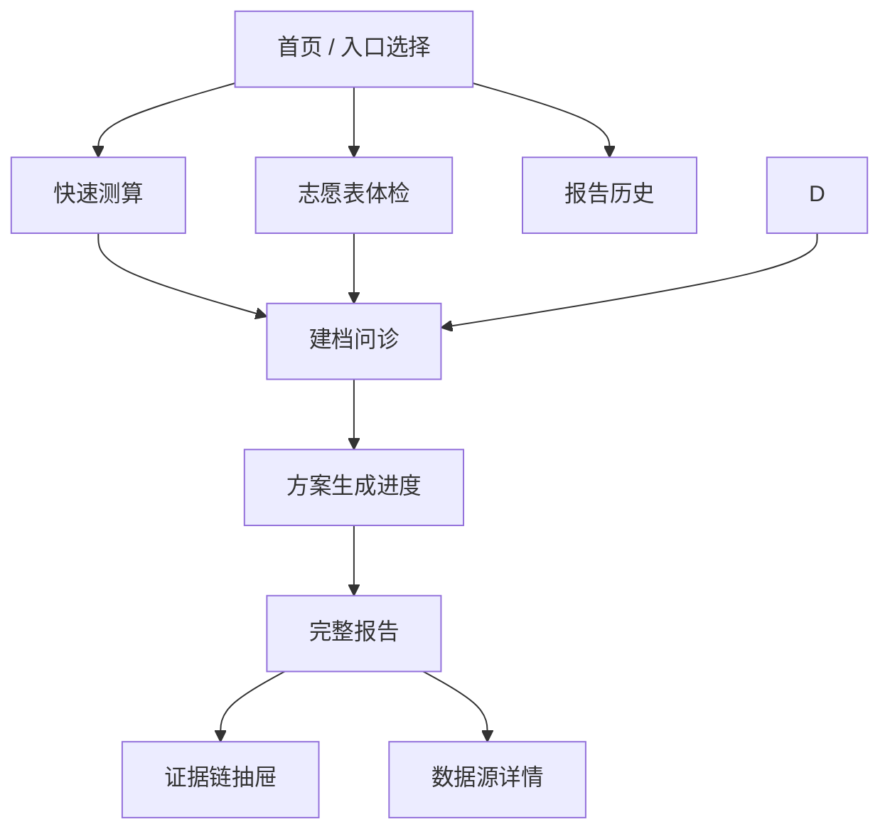
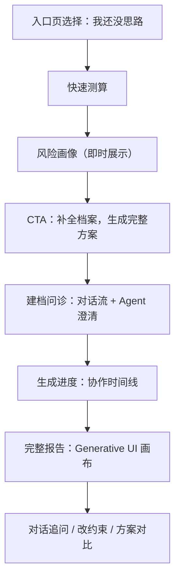
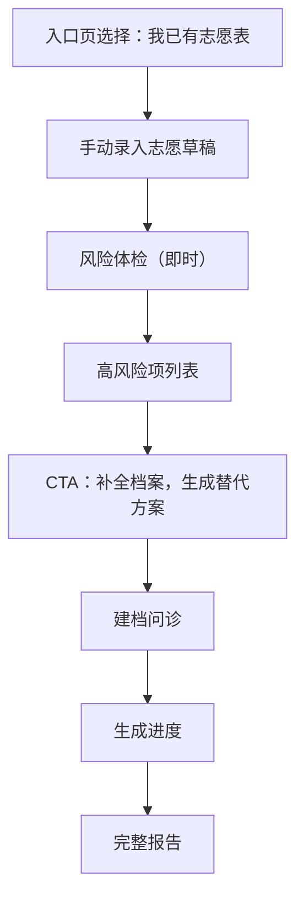
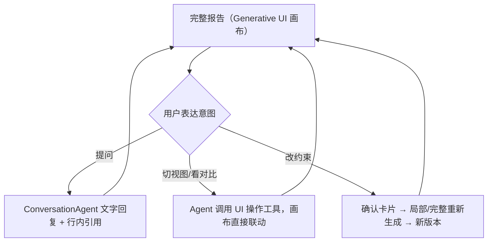
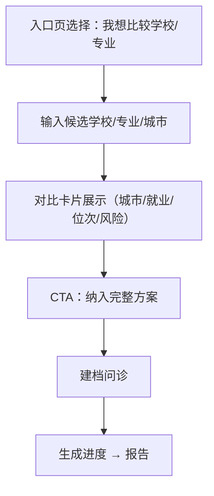
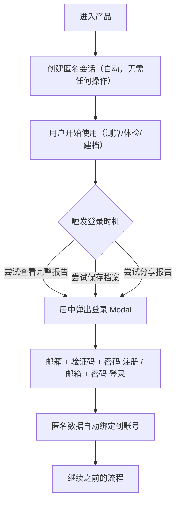

# 问津 Agent 前端 PRD v2

版本：v2.0（2026-07-06）—— 从 0 到 1 重新设计，以「AI 全程协作者」为原生架构
前端框架：Next.js + React + TypeScript
当前版本策略：所有功能免费开放，不做收费、套餐、订单、支付和付费解锁

> 本文档是问津 Agent 前端的完整设计规范，取代早期以表单向导为中心的设计草案。如需查阅历史迭代记录，见 `docs/frontend-prd.md`（保留作为历史参考，不再维护）。

---

## 0. 产品定位与设计哲学

问津 Agent 不是"填表单生成报告的工具"，也不是"套壳大模型的纯聊天机器人"。它是一个**AI 全程协作者**：从建档、生成到报告交付的每一步，用户都能感知到 Agent 在做什么、为什么这么判断，并且可以随时用自然语言介入、调整、追问。

这个定位落地为一个具体的架构选择——**Generative UI 混合形态**：

- **Chat 是控制层**：用户表达意图（回答问题、修改约束、要求对比）的唯一入口是自然语言对话。
- **结构化视图是呈现层**：Tab、卡片、风险总览、对比视图、表单控件，是 Agent 用来回应用户、承载信息的画布。
- **两者不是割裂的两个目的地**，而是同一个 Agent 交互的两种输出形式。Agent 判断某个响应该用文字说清楚，还是该直接操作画布上的某个组件（切换 Tab、高亮卡片、弹出对比视图），取决于内容本身的性质，不取决于"现在是哪个页面"。

**为什么不做成纯聊天界面**：志愿填报是信息密集、需要反复横向比较的决策任务——几十条候选院校、冲稳保分层、位次差、风险标记，用户需要"扫一眼定位、随时回看对比"。聊天记录是线性的、一次性的，无法承载这种需求；市面上把报告直接挂进通用 Chat 对话的产品，实际操作性明显弱于结构化界面。所以问津选择让 Chat 驱动结构化组件，而不是用 Chat 取代结构化组件。

这个哲学贯穿三个核心页面，它们共用同一套"对话流外壳 + Agent 渲染/操作结构化组件"的架构，不是三段割裂的体验：

| 页面 | 对话驱动的内容 | 结构化呈现的内容 |
| --- | --- | --- |
| 建档问诊（§6.4） | Agent 决定问什么、何时插入澄清追问 | 每个问题用结构化控件（下拉/数字输入/多选 chip）呈现，用户点选而非打字描述 |
| 生成进度（§6.5） | Agent 的并行处理、自我修正过程实时转述 | 协作时间线用分组框、状态图标呈现 Agent 的工作状态 |
| 报告详情（§6.6） | 用户通过对话提问、修改约束、要求对比 | Tab、推荐卡片、风险总览、对比视图承载信息，Agent 可直接操作这些组件 |

### 设计原则

- **过程可见**：凡是 Agent 产生的协作信号（并行执行、自我修正、降级重试），只要不涉及技术黑话或用户 PII，就要有一个用户能看懂的呈现方式，不能只留在开发者可见的调试工具里。
- **对话优先于表单，但不迷信对话**：需要澄清歧义或收集有判断成分的信息时，用"AI 追问 + 用户回答"；纯粹结构化、无歧义的原子字段（省份、分数这类）仍然用结构化控件呈现，只是不再包在固定步骤的表单外壳里——控件本身也是 Agent 渲染出来的内容，只是不需要每次都经过 LLM 判断。
- **报告是起点不是终点**：报告生成完成不等于交互结束，用户应该能在报告基础上继续表达"改一下约束""这个和那个比比看"，AI 能听懂意图并采取行动，而不是只能回答"为什么推荐这个"。
- **技术真实性**：所有"看起来很智能"的呈现必须对应后端真实发生的事情，不能为了好看而编造不存在的 Agent 行为。
- 响应式设计，同时支持桌面端和移动端浏览器。
- 首屏直接进入可用工具，不做营销式落地页。
- 不使用"精准预测""必上""保录"等高风险文案。
- 所有推荐结论必须有证据入口。
- 高风险项要明显、可解释、有据可查。
- 不把基础风险藏起来，当前版本所有功能免费开放。
- 报告页面要适合微信内浏览器长阅读和分享。

---

## 1. 前端目标

前端的核心目标是让高考生和家长在 Web 端，通过一个持续在场的 AI 协作者完成：

- 进入产品并选择使用入口。
- 用对话式建档流程输入成绩、位次、选科、家庭背景、预算和偏好，遇到矛盾或模糊输入时被 AI 当场澄清，而不是等到最后才发现问题。
- 在生成过程中看到 Agent 真实的工作状态——哪些任务在并行处理、有没有自我修正、有没有遇到降级——而不是盯着一条不说明任何东西的进度条。
- 查看风险画像、三套冲稳保方案和证据链，并能继续追问、修改约束、要求方案对比。
- 手动录入志愿表并完成风险体检。
- 在高风险场景中获得明确的风险说明，自行判断决策。

当前版本不承担商业化转化目标，前端不展示价格、套餐卡、订单状态、支付弹窗或付费墙。

---

## 2. 技术选型

### 2.1 推荐方案

首期使用 **Next.js + React + TypeScript**。

原因：

- 当前目标是网页版产品，不是原生小程序多端应用。
- Next.js 适合构建完整 Web 产品，内置路由、服务端渲染、数据获取、Route Handler、图片优化和部署生态。
- 本产品需要报告分享页、登录态、服务端数据预取和轻量 BFF，Next.js 的工程结构更完整。
- SSE 长连接（生成进度、协作时间线、报告问答流式回复）是产品的核心交互载体，Next.js Route Handler 可以承担轻量转发/鉴权职责。

### 2.2 建议技术栈

| 能力       | 推荐                                         |
| ---------- | -------------------------------------------- |
| 框架       | Next.js App Router                           |
| 语言       | TypeScript                                   |
| UI         | Tailwind CSS + CSS Modules，不引入重型组件库 |
| 表单/控件  | React Hook Form + Zod（用于结构化控件的字段校验，不等同于传统整页表单） |
| 服务端状态 | TanStack Query                               |
| 客户端状态 | Zustand                                      |
| 图标       | lucide-react                                 |
| 图表       | Recharts                                     |
| 流式进度   | EventSource / SSE                            |

---

## 3. 设计系统

### 3.1 设计基调

产品面向高考生和家长，这是一个高风险、高信息密度的决策场景。设计基调应该是：

- **专业可信**：不是活泼的学生 App，也不是冰冷的政府网站，接近"可信赖的专业工具"。
- **清晰易读**：信息密度高，但层次分明，关键数字和风险项要突出。
- **风险可视**：高/中/低风险必须靠颜色直观区分，用户无需阅读文字就能感知危险程度。
- **对话自然**：Agent 的对话式交互要克制、专业，不使用拟人化的寒暄或表情堆砌，语气接近一个靠谱的顾问，而不是聊天软件里的虚拟角色。

### 3.2 色彩系统

#### 品牌色

| 用途   | 色值      | 说明                                               |
| ------ | --------- | -------------------------------------------------- |
| 主色   | `#1E40AF` | 深蓝，传递专业和可信赖感，用于主按钮、链接、激活态 |
| 辅助色 | `#0D9488` | 蓝绿，用于进度条、完成状态、正向指引               |

#### 风险等级色

这是整个产品最重要的视觉语言，必须全局统一。

| 等级          | 色值      | 背景色    | 使用场景                                                     |
| ------------- | --------- | --------- | -------------------------------------------------------------- |
| 高风险        | `#DC2626` | `#FEF2F2` | 保底不足、选科冲突、体检限制命中，需要用户重点关注并调整的项 |
| 中风险        | `#D97706` | `#FFFBEB` | 梯度过密、热门专业扎堆、学费接近预算上限                     |
| 低风险 / 正常 | `#16A34A` | `#F0FDF4` | 推荐理由支撑充分、规则校验通过                               |
| 提示 / 信息   | `#2563EB` | `#EFF6FF` | 数据覆盖不足提示、建议补充位次                               |

#### AI 协作语义色（新增语义，非新增色值）

| 用途 | 复用色值 | 使用场景 |
| --- | --- | --- |
| AI 工具执行反馈 | `#F0FDF4`（浅绿背景） | 区分"AI 直接执行了操作"与"AI 只是在回答问题" |
| Agent 并行/自检分组框 | 浅灰背景 + 主色边框 | 生成进度页的协作时间线分组框 |

#### 中性色

| 用途          | 色值      |
| ------------- | --------- |
| 页面背景      | `#F8FAFC` |
| 卡片/面板背景 | `#FFFFFF` |
| 主要文字      | `#0F172A` |
| 次要文字      | `#64748B` |
| 占位/禁用     | `#94A3B8` |
| 分割线/边框   | `#E2E8F0` |

### 3.3 字体与字号

字体优先使用系统字体，保证在主流桌面和移动浏览器上的渲染效果。

```
font-family: -apple-system, "PingFang SC", "Noto Sans SC", "Helvetica Neue", sans-serif
```

| 层级     | 字号 | 行高 | 字重 | 使用场景                     |
| -------- | ---- | ---- | ---- | ---------------------------- |
| 大标题   | 20px | 28px | 600  | 页面主标题                   |
| 小标题   | 17px | 24px | 600  | 卡片标题、章节标题           |
| 正文     | 15px | 22px | 400  | 主要内容                     |
| 次要文字 | 13px | 18px | 400  | 标签、说明、辅助信息         |
| 数字强调 | 22px | 28px | 700  | 分数、位次、安全度等关键数字 |

### 3.4 间距系统

基于 4px 基准：4 / 8 / 12 / 16 / 20 / 24 / 32 / 48px。

- 卡片内边距：16px
- 页面水平边距：16px
- 列表项间距：12px
- 章节间距：24px

### 3.5 圆角与阴影

- 卡片圆角：12px
- 按钮圆角：8px
- 标签/徽章圆角：4px
- 对话气泡圆角：16px（比卡片更圆润，视觉上区分"对话"和"数据卡片"两种内容类型）
- 卡片阴影：`0 1px 3px rgba(0,0,0,0.08), 0 1px 2px rgba(0,0,0,0.06)`

---

## 4. 信息架构

### 4.1 页面层级



### 4.2 导航结构

当前版本是**任务流驱动**，用户按流程推进，不是多 Tab 内容浏览 App。导航策略如下：

**顶部导航栏**（所有页面固定）：

- 左侧：返回箭头（首页除外）
- 中间：当前页面标题
- 右侧：用户头像/登录入口（首页）或空

**不设置底部 Tab 导航栏**：产品是线性决策流程，底部 Tab 会破坏流程感，且当前功能模块不够独立。

**报告历史入口**：首页顶部右侧用户头像点击后，展示报告历史和账号信息。

**关键跳转规则**：

- 从任意流程（快速测算/体检/对比）进入建档问诊时，携带 `profile_id` 参数。
- 报告生成后，跳转至 `/reports/[id]`，浏览器历史保留生成进度页，支持返回查看进度日志。

### 4.3 页面清单

| 页面         | 路由                   | 说明                                                                      |
| ------------ | ---------------------- | ------------------------------------------------------------------------- |
| 入口页       | `/`                    | 两个当前入口 + 登录入口 + 报告历史快捷入口；学校专业对比入口 Phase 2 再展示 |
| 快速测算     | `/assess`              | 省份、分数/位次、选科、批次                                               |
| 建档问诊     | `/profile`             | 对话流外壳 + 结构化控件，家庭背景、预算、偏好、禁忌、风险风格             |
| 生成进度     | `/reports/generating`  | Agent 协作时间线：并行任务、自我修正、降级可视化                          |
| 报告详情     | `/reports/[id]`        | 三套方案、证据链、风险体检、决策过程回放、报告问答、方案对比              |
| 志愿表体检   | `/volunteer-check`     | 手动录入志愿草稿，查看风险                                                |
| 数据源详情   | `/sources/[id]`        | 证据来源、年份、字段和可信度                                              |
| 报告历史     | `/reports`             | 用户历史报告列表                                                          |
| Admin Debug 控制台 | `/admin/debug`   | 内部页面，仅 `role=admin` 可访问；Run 列表、LangGraph 实时拓扑图、Debug 事件时间线、系统指标看板 |
| 学校专业对比 | `/compare`             | 对比学校、专业、城市、风险（**Phase 2，MVP 不实现**）                     |

### 4.4 Phase 2 范围

当前版本不实现独立的学校/专业对比中心，也不实现任何文件上传或 OCR 能力。Phase 2 只保留一个明确产品方向：

- **学校/专业独立对比中心（`/compare`）**：用户输入候选学校、专业或城市后，系统展示结构化对比卡片，并支持把对比结果纳入完整建档和报告生成流程。

报告详情页内的方案对比、版本对比、ConversationAgent 打开对比视图，属于当前 v2 核心体验，不等同于独立 `/compare` 页面。

---

## 5. 核心流程

### 5.1 没思路用户



### 5.2 已有志愿表用户



### 5.3 报告生成后的持续协作

这是问津区别于"一次性报告工具"的核心体验，任何入口生成报告后都会进入这条循环：



### 5.4 学校专业对比用户

> **Phase 2，MVP 阶段不实现。** Compare Service 尚未建设，该入口在当前版本入口页上暂不展示。下方流程为未来版本参考，不作为当前开发依据。



### 5.5 认证与会话流程

认证采用**匿名优先**策略，降低用户启动门槛。



**登录 UI 规则**：

- 登录/注册使用 **`LoginModal`**：Web 居中 Modal（非底部 Sheet）。
- 注册：邮箱 → 获取验证码（Resend）→ 6 位验证码 + 密码（≥8 位）；密码框带显示/隐藏切换。
- 登录：邮箱 + 密码。
- 登录成功后 Modal 关闭，页面继续原有操作。
- 首页顶部右侧展示登录入口（未登录显示「登录」，已登录显示头像）。
- 不支持微信 OAuth，不支持手机号登录，仅邮箱验证码注册 / 邮箱密码登录。

---

## 6. 页面需求

### 6.1 入口页

目标：让用户在 5 秒内选择最接近自己的状态。

**布局**：

- 顶部：产品名称 + 简短定位语（一行）。
- 顶部右侧：登录入口 / 用户头像。
- 中部：两张当前入口卡片，纵向排列；学校/专业独立对比入口 Phase 2 再开放。
- 底部：已有报告的快速入口（登录用户显示"继续上次的报告"）。

**入口卡片内容**（每张）：

| 元素         | 说明                                                 |
| ------------ | ---------------------------------------------------- |
| 图标         | lucide 图标，区分两种当前状态                        |
| 主标题       | "我还没思路" / "我已有志愿表"                        |
| 一句话说明   | 适合谁、解决什么问题                                 |
| 需要准备什么 | 例：准考证号、一分一段表位次                         |
| 预计耗时     | 快速测算 3 分钟 / 完整建档 15 分钟                   |
| 开始按钮     | 主色填充按钮                                         |

**禁止出现**：套餐价格、付费权益、"立即购买"、"解锁报告"。

---

### 6.2 快速测算页

**字段与交互**：

| 字段           | 类型            | 交互说明                                                     |
| -------------- | --------------- | ------------------------------------------------------------ |
| 省份           | 单选下拉        | 未深度覆盖的省份在选中后展示"数据覆盖提示"（信息蓝色提示条） |
| 批次           | 单选            | 根据省份动态加载可选批次                                     |
| 分数           | 数字输入        | 与位次联动                                                   |
| 位次           | 数字输入        | 优先级高于分数；填入后隐藏"将用分数估算"的提示               |
| 选科           | 多选            | 物理/历史二选一 + 其余 4 科多选，动态展示可选组合            |
| 性别           | 单选            | 影响体检限制筛选                                             |
| 是否有体检限制 | 单选 + 展开说明 | 选"有"后展示常见限制多选项                                   |

**即时反馈**：

- 填入位次后，在字段下方展示"你的位次约在全省前 X%"（用一分一段表估算）。
- 分数和位次至少填一个，否则无法提交。
- 没有位次时，提示"将用分数估算，准确性较低，建议查询一分一段表后再填"。

**输出（提交后即时展示，不跳转新页面）**：

风险画像卡片，包含：

- 综合安全等级（高/中/低，配色使用风险色系）。
- 预计可冲学校层级区间。
- 数据完整度（进度条 + 百分比）。
- 是否建议补充位次。
- **CTA 主按钮**："补全档案，生成三套方案"（进入建档问诊）。

---

### 6.3 志愿表体检页

#### 录入方式

志愿表编辑器采用**有序卡片列表**形式，不做 Excel 式表格（移动端不友好）：

- 每条志愿以卡片展示，顶部显示序号和志愿标签（冲/稳/保/高冲）。
- 卡片内字段：学校名称、院校专业组代码、专业名称、是否服从调剂。
- 支持**拖拽排序**（长按卡片出现拖拽把手，拖拽调整顺序）。
- 支持新增（底部"+ 添加志愿"按钮）和删除（右滑卡片出现删除按钮）。
- 最多支持志愿数以**当前省份政策上限**为准（从后端 `GET /api/v1/data/availability` 响应的 `max_volunteers` 字段获取，默认 96）。硬编码 30 会导致无法展示后端生成的完整方案。
- **拖拽排序后立即触发风险重检**：梯度（志愿序位差异）和热门专业扎堆依赖志愿顺序，排序变更后前端 debounce 800ms 后调用 `POST /api/v1/volunteer/check`，风险摘要条实时刷新。

#### 风险体检展示

体检结果在录入完成后以**悬浮风险摘要条**展示（页面底部固定位置），点击展开详情面板：

| 风险类型         | 视觉处理                 |
| ---------------- | ------------------------ |
| 保底不足         | 高风险红色，排在列表最前 |
| 梯度过密         | 中风险橙色               |
| 热门专业扎堆     | 中风险橙色               |
| 不可接受专业命中 | 高风险红色               |
| 选科冲突         | 高风险红色               |
| 体检限制         | 高风险红色               |
| 学费超预算       | 中风险橙色               |
| 地域冲突         | 中风险橙色               |

风险项列表中，每条风险：

- 展示命中的具体志愿行号和学校/专业名。
- 给出一句调整建议。
- 高风险项末尾展示醒目的红色风险标签，提示用户重点关注并自行调整。

---

### 6.4 建档问诊页

**架构**：对话流外壳 + Agent 渲染结构化控件。外壳是聊天容器，每条"AI 消息"渲染的是恰当的结构化输入控件（下拉/数字输入框/多选 chip），用户点选/输入结构化值，不需要打字描述答案。字段排序和跳过用确定性配置驱动，只有检测到矛盾或模糊输入时才插入对话式澄清追问。这套架构和报告详情页（§6.6）共用同一套 Generative UI 组件体系。

#### 字段清单

| 分组 | 字段 | 结构化控件类型 | 必填 |
| ---- | ---- | -------------- | ---- |
| 学生基础信息 | 省份 | 单选下拉 | 是 |
| 学生基础信息 | 分数 / 位次 | 数字输入框（双字段联动） | 是 |
| 学生基础信息 | 选科 | 单选（物理/历史）+ 多选 chip | 是 |
| 学生基础信息 | 性别 / 体检限制 | 单选 + 条件展开多选 | 是 |
| 家庭预算 | 年学费上限、是否接受外省 | 数字输入框 + 单选 | 建议 |
| 风险风格 | 保守/均衡/进取 | 单选卡片 | 建议 |
| 城市偏好 | 优先城市、不接受城市 | 多选 chip | 建议 |
| 专业偏好 | 感兴趣方向、不可接受专业 | 多选 chip + 标签输入 | 建议 |
| 未来规划 | 是否考虑读研、职业方向关键词 | 单选 + 标签输入 | 可选 |

#### 对话流布局

```
┌─────────────────────────────────────┐
│ 建档问诊              进度 ▓▓▓▓▓░░░ 62% │
├─────────────────────────────────────┤
│ 🤖 你在哪个省份参加高考？               │
│    [下拉：请选择省份 ▾]                │
│                                       │
│ 🤖 高考分数是多少？                    │
│    [数字输入框：例 587]                │
│                                       │
│ 🤖 你选择了"物理+化学+生物"，但河南省    │
│    2026 年该组合在你所在批次暂无对应     │
│    招生计划，要调整选科组合吗？          │
│    [调整选科]  [仍按此组合继续]         │
│                                       │
│ 🤖 年学费上限大概是多少？（可跳过）       │
│    [数字输入框]  [跳过这项]             │
├─────────────────────────────────────┤
│ 已回答的问题可随时点击上方气泡修改回答     │
└─────────────────────────────────────┘
```

#### 确定性逻辑与 Agent 边界

字段排序、跳过、以及"是否存在矛盾"的判断都是确定性的（规则/配置驱动），只有把校验结果转成自然语言追问、理解用户对追问的自由文本回应时才需要 LLM：

| 环节 | 实现方式 | 是否调用 LLM |
| --- | --- | --- |
| 下一个字段该问什么、该不该跳过（如选了专科批跳过某些本科限定字段） | 确定性配置驱动的字段依赖图 | 否，纯前端/规则判断，零延迟零成本 |
| 检测到矛盾或模糊项（选科组合无招生计划、体检限制未说明具体项） | 每个字段提交后调用 `POST /api/v1/profile/field-check`（同步，非 Agent run），复用 Policy Rule Agent 现有规则工具（`check_subject_req`/`check_batch_eligibility` 等）做前置校验 | 否，规则引擎判断，返回结构化结果 |
| 把校验结果转成自然语言追问、理解用户对追问的自由文本回应 | Profile Agent | 是，仅这一步涉及 LLM |

多数字段的连续渲染是即时的，只有真正出现歧义时才产生一次 Agent 交互延迟。

#### 交互规则

- 顶部展示**动态进度百分比**（基于已收集必填字段数 / 预估总字段数估算），不展示固定的"步骤 X/N"，因为顺序/跳过因人而异。
- 每个问题气泡下方控件旁，建议/可选字段附带"跳过这项"次级文字链接；必填字段无跳过入口。
- 数据**自动保存草稿**（每次控件值变化 debounce 500ms 写入本地状态，下一条消息渲染前同步到服务端）。
- 已回答的问题气泡可点击回看/修改，修改后其后依赖该字段的问题按新依赖图重新计算是否需要展示或调整。
- 用户关闭或中断后再进入，自动恢复到对话历史的当前位置。
- **AI 澄清追问轮数上限**为 3 轮，超出后带着 `data_warnings` 继续，前端展示"以下信息可能不完整"提示。
- 全部字段收集完成后，展示档案摘要卡片和"开始生成方案"主按钮。

#### 必填 vs 建议补充的视觉区分

- 必填字段：控件旁无特殊标记，跳过时按钮禁用并提示"这项需要填写"。
- 建议补充：控件旁显示"建议"蓝色小徽章，跳过不阻断流程但会降低档案完整度分。
- 可选字段：控件旁显示"选填"灰色小徽章。

#### 验收标准（Given/When/Then）

- **Given** 用户选择的选科组合在目标省份/批次无历史招生数据，**When** 提交该字段后，**Then** 系统立即以对话气泡形式展示 AI 追问，而不是等剩余字段填完再统一提示。
- **Given** 用户处于专科批场景，**When** 进入建档流程，**Then** 系统自动跳过仅本科批相关的字段，不经过 LLM 判断（纯配置驱动）。
- **Given** 用户已达到 3 轮追问上限仍有未澄清项，**When** 继续流程，**Then** 系统正常进入下一步，并在生成进度页/报告页标注"以下信息基于不完整档案生成"。

---

### 6.5 生成进度页

展示 Agent 运行进度，用户在此等待（P95 约 45 秒）。呈现为**协作时间线**，让用户看到多个 Agent 并行工作、Reflection 自我修正的真实过程，而不是一条不说明任何东西的进度条。

#### 布局

- 顶部：报告标题 + 考生简要信息（姓名/省份/分数）。
- 中部：协作时间线。
- 底部：动态文案 + 预计剩余时间。

#### 协作时间线

```
┌─────────────────────────────────────────┐
│ 报告标题 + 考生简要信息                     │
├─────────────────────────────────────────┤
│  ● 档案检查 · 已完成                        │
│  ● 数据版本锁定 · 已完成                     │
│  ┌─ 正在并行处理 ──────────────────┐        │
│  │ ⟳ 检索招生数据与政策依据          │        │
│  │ ⟳ 校验选科/体检/批次规则          │        │
│  └────────────────────────────────┘        │
│    → 已发现 2026年河南省招生计划数据          │
│    → 选科校验通过，体检项发现 1 处限制         │
│  ● 生成候选方案 · 已完成（共 48 所候选）       │
│  ● 志愿梯度体检 · 已完成                      │
│  ● 生成报告初稿 · 已完成                      │
│  ┌─ AI 正在自我检查 ────────────────┐         │
│  │ 第 1 轮：发现表述可能构成过度承诺   │         │
│  │         → 正在修正...            │         │
│  │ 第 2 轮：检查通过 ✓               │         │
│  └────────────────────────────────┘         │
│  ● 报告已生成                                │
├─────────────────────────────────────────┤
│ 预计剩余时间 / 已用时                        │
└─────────────────────────────────────────┘
```

时间线由三类节点组成，均通过用户侧 SSE 事件驱动：

| 展示元素 | 触发事件 | 说明 |
| --- | --- | --- |
| 普通步骤（●） | `node_started` / `evidence_found` / `rule_checked` / `candidates_ready` / `risk_found` / `completed` | 单节点顺序步骤 |
| 「正在并行处理」分组框 | `agents_parallel_started` → `agents_parallel_merged` | 收到 `agents_parallel_started` 时渲染分组框，框内两个子任务同时展示"进行中"状态；收到 `agents_parallel_merged` 后分组框收起，保留结果摘要文字 |
| 「AI 正在自我检查」分组框 | `self_check_round` | 每轮展示"第 N 轮：发现 XX 类问题 → 正在修正 / 检查通过"，**只展示类别化原因**（如"表述可能构成过度承诺""证据引用不完整"），不展示具体禁用词或原始 LLM 输出 |

进行中节点下方展示实时发现的关键信息，例如：

- "发现 2024 年河南省招生计划数据"
- "规则校验：选科通过 / 发现 1 项体检风险"

**降级提示转译**：收到 `degraded_notice` 事件时，不展示技术错误原文，而是转译为安心文案，例如"检索遇到延迟，已切换备用数据源，不影响结果质量"，正面框定而不是让用户担心出错。

#### 时间管理

- 页面打开即展示"预计约 40 秒"。
- 每个步骤完成后更新"预计剩余 X 秒"。
- 超过 60 秒未完成时，展示"生成时间较长，可以先去做别的事情，完成后将在页面展示结果"。
- 用户刷新或关闭后重新进入，通过 `run_id` 恢复当前状态，已完成节点显示为完成态。

#### 失败处理

- 单个节点失败时，以红色状态图标标出，展示可理解的错误描述（不展示技术报错）。
- 例："数据检索超时，正在重试（1/3）"。
- 全流程失败后展示错误摘要 + "重新生成"按钮。

#### 验收标准

- 收到 `agents_parallel_started` 事件后，时间线在 1 秒内渲染出"正在并行处理"分组框，框内两个子任务状态均为"进行中"。
- 收到 `self_check_round` 事件时，时间线展示轮次和类别化原因，不展示原始违规文本或禁用词。
- 收到 `degraded_notice` 事件时，展示的是映射表转译后的安心文案，不展示技术服务名（如 Cohere、pgvector）。

---

### 6.6 报告详情页

报告页是产品核心交付物，也是移动端阅读体验最关键的页面。它不是生成完就定型的静态页面，而是 Agent 可以持续操作的 **Generative UI 画布**——chat 是控制层，本节的 Tab/卡片/对比视图是呈现层，用户可以通过对话让 Agent 直接操作画布上的组件。

#### 整体布局（纵向滚动，无横向分栏）

```
┌─────────────────────────────────┐
│  顶部导航栏（返回 + 报告标题 + 版本切换） │
├─────────────────────────────────┤
│  考生概况卡片                     │
│  （省份 / 分数 / 位次 / 选科）      │
├─────────────────────────────────┤
│  生成后 AI 点评卡片                │
│  （条件张力提示 + 收窄建议）        │
├─────────────────────────────────┤
│  风险总览卡片                     │
│  （整体安全等级 + 关键风险数）       │
├─────────────────────────────────┤
│  「AI 是如何得出这份方案的」        │
│  （默认折叠，点击展开决策过程回放）  │
├─────────────────────────────────┤
│  三套方案 Tab 切换      [对比]     │
│  [保守型]  [均衡型]  [进取型]      │
│                                 │
│  推荐卡片列表（当前 Tab 内容）      │
│  卡片 1 ─────────────────────── │
│  卡片 2 ─────────────────────── │
│  ...                            │
├─────────────────────────────────┤
│  志愿表体检结果（如有录入）         │
├─────────────────────────────────┤
│  操作区                          │
│  [分享]                          │
└─────────────────────────────────┘
```

#### 三套方案 Tab

- 默认展示"均衡型"Tab。
- Tab 下方滚动展示该方案的推荐卡片列表（3-5 张，按冲→稳→保顺序排列）。
- 切换 Tab 时列表滚动到顶部，不保留滚动位置。
- Tab 可由用户手动点击切换，也可由 ConversationAgent 通过 `switch_tab(tier)` 工具直接切换，两种触发方式共用同一套状态。

#### 推荐卡片

每张卡片展示以下信息：

**主要信息（始终可见）**：

- 学校名称（大字）+ 城市 + 层级标签（冲/稳/保/高冲，色彩区分）
- 专业名称 + 专业组代码
- 模拟录取安全度（数字 + 进度条，颜色与安全等级对应）+ **匹配置信分**（如 `78/100`，用于排序解释，不表达确定性录取概率）
- 综合评分 + 学费/年

**次要信息（点击展开）**：

- 选科要求
- **近两年历史投档位次并列展示**（如 `2024: 38500  2025: 37200`），让"综合评分"从抽象数字变成可追溯的历史依据
- 推荐理由（2-3 条结构化说明）
- 风险提示（如有，红色/橙色小标签）
- 证据入口：点击"查看数据来源"打开证据链抽屉
- 支持勾选加入「方案对比」

#### 证据链抽屉

从屏幕底部滑出（Bottom Sheet），不全屏覆盖：

- 来源标题、数据年份、省份
- 权威级别标签（官方 / 高 / 中）
- 关键字段列表（招生计划数、最低位次、专业组代码等）
- 短引用摘要
- 底部：数据来源完整页入口

#### 风险总览卡片

- 整体安全等级（高/中/低，大色块）。
- 关键风险列表（最多展示 3 条，其余折叠）。
- 每条风险：等级图标 + 一句描述 + 来源志愿位置。
- "查看全部风险"展开按钮。
- 可由 ConversationAgent 通过 `expand_risk_detail(id)` 工具直接展开某条风险详情。

#### 生成后 AI 点评卡片

- 位置：考生概况卡片下方。
- 内容：报告生成完成后，追加一段 AI 生成的"条件点评"，指出用户输入条件里的张力或可优化点，例如"你的地域偏好和预算存在冲突，如果放宽 XX，候选会更充分"。
- 生成方式：复用 report-agent 模型，作为报告生成流程的一部分产出，不新增额外 API 调用。
- 价值：不需要在建档阶段打断表单流程，事后一段话就能传达"AI 认真分析过你的输入，不是套模板"。

#### 「AI 是如何得出这份方案的」决策过程回放卡片

- 位置：风险总览卡片下方，默认折叠。
- 内容：复用生成过程中记录的时间线数据（`run_summary_json`），**只读回放**，不重新调用 Agent。展示节选：并行处理过哪些任务、Reflection 修正了几轮、是否发生过降级——即生成进度页（§6.5）"协作时间线"的精简回放版。
- 价值：把生成过程中转瞬即逝的信息沉淀成报告的一部分，用户事后想验证"这份报告靠不靠谱"时可以回来看。

#### 方案对比视图

- **入口**：三套方案 Tab 旁的「对比」按钮（手动勾选任意两个方案触发）；版本切换器旁的「对比其他版本」；对话触发（用户说"帮我对比均衡型和进取型"，ConversationAgent 调用 `open_compare_view(target_a, target_b)` 工具打开同一个视图）。`target` 统一为 `{ type: "plan" | "candidate" | "version", id: string }`，三种入口共用一套组件。
- **呈现**：Bottom Sheet / Drawer，与证据链抽屉一致的呈现方式，逐项对比学校、专业、位次差、学费、风险等级共 5 个维度，差异项高亮标出（非纯文字罗列）。
- **AI 取舍建议**：底部固定一句 AI 生成的取舍建议（复用 report-agent 模型），例如"方案 A 安全边际更高但学费更高，方案 B 目标层级更高但不确定性更大，求稳可优先看 A"。文案只做取舍解释，不替用户作最终填报决定。
- **验收标准**：勾选两个方案进入对比后，视图渲染完成时至少展示学校/专业/位次差/学费/风险等级 5 个维度的逐项差异，且差异项有视觉区分。

#### 报告问答 Chat Panel

报告页提供**对话入口**，让用户在查看报告后能就具体推荐、风险和数据来源提问，也能直接表达修改/操作意图（如"预算改到 8 万以内""帮我对比这两个方案"），由 ConversationAgent 处理。ConversationAgent 是 **tool-calling agent**，不是纯文本问答机器人。

**入口**：

- 报告页右下角悬浮按钮，标签"问一问"，主色（`#1E40AF`）填充背景，白色文字，带聊天气泡图标。
- 仅在报告状态为 `completed` 时展示；报告生成中时按钮不展示。

**布局（响应式）**：

| 断点 | 展开形式 | 尺寸 |
| --- | --- | --- |
| 移动端（< 768px） | 底部 Sheet，可上拉 | 默认高度 70vh，上拉后全屏 |
| 桌面端（≥ 1024px） | 右侧 Drawer，叠加在报告内容上方 | 宽度 380px，高度 100vh |

Panel 打开时悬浮按钮替换为"关闭"图标，不影响底部导航区域。

**初始状态（对话历史为空时）**：

- 顶部展示简短说明文字："可以问我任何关于这份报告的问题，也可以让我帮你调整方案"。
- 展示 4 条预设建议问题（Suggested Questions），以圆角卡片形式竖排：
  - "推荐的学校是怎么筛选出来的？"
  - "我的志愿梯度风险需要担心吗？"
  - "保守型和均衡型方案的核心差别在哪？"
  - "这份报告用的是哪年的招生数据？"
- 点击建议问题直接发送，无需手动输入。
- 已有对话历史时，直接展示历史消息列表，不显示建议问题。

**意图处理**：ConversationAgent 收到消息后判断走哪条路径：

| 意图类型 | 触发工具 | 前端表现 | 是否需要二次确认 |
| --- | --- | --- | --- |
| 答疑 | 无（纯文字回复） | 普通 AI 回复气泡 | 否 |
| UI 操作 | `switch_tab` / `highlight_candidates` / `open_compare_view` / `expand_risk_detail` | 画布对应组件立即联动（切 Tab / 高亮卡片 / 弹出对比视图 / 展开风险详情），AI 回复带一句确认文案（"已为你打开对比视图"） | 否，不涉及重新计算，可撤销、无成本 |
| 数据变更（改约束重新生成） | `regenerate_recommendations(patch)` | 聊天气泡下方展示确认卡片，用户确认后调用 `POST /api/v1/reports/{report_id}/refine` | 是，避免误触发重新生成消耗成本 |

数据变更类确认卡片样式：

```
检测到你想调整：预算上限 → 8 万元/年
[确认，重新生成方案]  [取消，继续问答]
```

确认后：

- **轻量约束**（预算、城市偏好、排除某校/某专业）：局部重新生成。用户确认后立即进入小型生成状态，预计 5-10 秒完成；完成后聊天面板给出反馈，例如"已根据新预算重新生成，候选从 48 所变为 31 所，均衡型方案里新增 2 所"。
- **重大约束**（省份、选科、批次变更）：AI 明确告知"这类修改需要完整重新生成，预计耗时与首次生成一致"，用户确认后走完整生成流程（复用生成进度页 §6.5）。
- 成功后报告页顶部出现/更新**版本切换器**（`v1` / `v2` ...），可在版本间切换查看。

**消息气泡规范**：

| 角色 | 对齐 | 背景色 | 说明 |
| --- | --- | --- | --- |
| 用户消息 | 右对齐 | `#EFF6FF`（信息蓝浅色） | 纯文字，气泡尾朝右 |
| AI 回复 | 左对齐 | `#FFFFFF`（白色卡片） | 含引用标签，气泡尾朝左，顶部有"问津助手"小标签 |
| AI 工具执行反馈 | 左对齐 | `#F0FDF4`（浅绿，区别于普通回复） | 一句话确认文案，如"已为你打开对比视图" |
| 生成中状态 | 左对齐 | `#FFFFFF` | 展示三点打字动画（`•••`），无文字 |

**行内引用标签**：

AI 回复中引用了具体数据来源时，在对应句子末尾展示行内标签（小圆角徽章）：

```
…2025年位次约 38500（来源：河南省2025招生计划 ↗）
```

- 标签点击跳转到 `/sources/[id]`（证据来源详情页，新标签页打开）。
- 桌面端悬停时展示 Tooltip（来源标题 + 年份 + 权威级别）。

**合规提示**：

- 若 ConversationAgent 触发合规修正（`compliance_warning` 事件），气泡底部展示灰色小字：「内容已通过安全审核」。
- 所有 AI 回复底部展示固定一行灰色说明文字（`13px`）：「以上分析基于报告数据，最终填报请以省级考试院为准」。

**操作控件**：

- 底部固定输入区：多行文本框（最多 200 字，超出禁止输入）+ 右侧发送按钮（Enter 发送，Shift+Enter 换行）。
- Panel 右上角：「清除对话」文字链，点击后二次确认弹窗，确认后清空历史并回到初始建议问题状态。
- 对话历史超过 40 条时，顶部展示提示条：「对话较长，建议清除后重新提问以保持上下文准确」。

**错误与限制状态**：

| 场景 | 处理 |
| --- | --- |
| 每日 30 条上限已用完 | 输入框禁用，展示「今日提问次数已达上限（30/30），明日重置」 |
| SSE 流中断 | 气泡底部展示「回复中断，点击重试」，点击后重发最后一条消息 |
| 网络错误 | Toast 提示「问答服务暂时不可用，请稍后再试」 |
| 对话历史已过期（7天） | 打开 Panel 时提示「上次对话已过期，已为你清除」，显示初始建议问题 |
| `/refine` 重新生成失败 | 确认卡片下方展示「重新生成失败，点击重试」，不影响当前已展示的报告版本 |

**验收标准**：

- 用户在聊天面板输入"预算超过 10 万的别推荐了"，AI 识别为约束修改并经用户确认后，系统立即展示局部重新生成状态，并在 10 秒左右完成基于新约束的过滤/排序，且明确说明变化了什么。
- 用户要求修改省份，触发重新生成确认时，系统明确告知"这类修改需要完整重新生成，预计耗时与首次生成一致"。
- UI 操作类工具（如 `open_compare_view`）执行时不展示确认卡片，直接联动画布并给出一句话反馈。

---

### 6.7 数据源详情页

从报告中的"查看数据来源"跳转，展示单个证据的完整信息。

**页面内容**：

| 字段       | 说明                                                 |
| ---------- | ---------------------------------------------------- |
| 来源标题   | 例："2025 年河南省本科批招生计划"                    |
| 数据类型   | 招生计划 / 一分一段表 / 投档线 / 招生章程 / 就业报告 |
| 权威级别   | 官方（省考试院）/ 高（学校官方）/ 中（第三方统计）   |
| 数据年份   | 如：2025 年                                          |
| 省份       | 如：河南省                                           |
| 批次       | 如：本科批                                           |
| 数据集版本 | 内部版本号，用于追溯                                 |
| 检索时间   | 证据检索的时间戳                                     |
| 关键字段   | 该来源覆盖的字段列表                                 |
| 引用摘要   | 不超过 200 字的原文摘要                              |

底部展示：使用该来源的报告推荐卡片列表（反向追溯）。

---

### 6.8 报告历史页

登录用户可访问，展示过去生成的所有报告。

**列表项**：

- 报告生成时间。
- 考生省份 + 分数/位次。
- 报告状态（生成中 / 已完成 / 失败）。
- 报告整体风险等级色块。
- 点击进入报告详情。

**空状态**：未登录或无报告时，展示引导卡片"你还没有报告，从这里开始生成"，点击跳转入口页。

---

### 6.9 Admin Debug 控制台（`/admin/debug`）

仅 `role=admin` 可访问，其他用户重定向 403 页面。用于开发阶段实时观察 Agent 执行状态、调试节点行为、分析性能瓶颈，**不面向普通用户开放**——用户侧的"协作可见"通过 §6.5/§6.6 的时间线和回放卡片实现，Admin Debug 是面向开发者的更细粒度调试工具，两者共享同一条底层事件流，呈现层各自独立演进。

#### 整体布局（桌面端 ≥ 1024px，三栏）

```
┌─────────────────────────────────────────────────────────────────────┐
│  顶部导航：🔧 Admin Debug 控制台    [系统指标条]    [LangSmith ↗]      │
├────────────┬────────────────────────────┬───────────────────────────┤
│ 左侧        │ 中部（主区域）              │ 右侧                       │
│ Run 列表    │ LangGraph 拓扑图           │ Debug 事件时间线            │
│ （240px）  │ （静态布局 + 实时节点着色）  │ （320px）                  │
│            │                            │                           │
│ ┌────────┐ │  ┌─────────────────────┐  │  ┌─────────────────────┐  │
│ │run_abc │ │  │  LangGraph Topology │  │  │  事件时间线          │  │
│ │ 42s ✓  │ │  │  （见下方详细设计）   │  │  │  10:00:01 node_started │
│ │────────│ │  └─────────────────────┘  │  │  10:00:04 tool_called  │
│ │run_xyz │ │                            │  │  10:00:08 tool_called  │
│ │ 23s ⟳  │ │  ┌─────────────────────┐  │  │  10:00:09 node_completed│
│ │────────│ │  │  节点详情面板（展开）  │  │  │  10:00:09 parallel_fan_in│
│ │run_err │ │  │  （点击节点后展开）   │  │  └─────────────────────┘  │
│ │ 12s ✗  │ │  └─────────────────────┘  │                           │
│ └────────┘ │                            │  [在 LangSmith 查看 ↗]    │
└────────────┴────────────────────────────┴───────────────────────────┘
```

移动端（< 768px）：不展示 Debug 控制台，直接显示"请在桌面端使用 Debug 控制台"提示页。Debug 是开发工具，不需要移动适配。

#### 顶部系统指标条

固定在顶部导航栏下方，展示全局实时指标（来自 `GET /api/v1/admin/metrics/summary`，每 30s 轮询）：

```
错误率 0%  |  P95 延迟 42s  |  今日费用 $1.24  |  运行中 1
```

- 错误率 > 10% 时整条变红色背景，醒目提示。
- P95 延迟 > 60s 时数字标红。

"LangSmith ↗" 按钮在顶部右侧，点击跳转 LangSmith Dashboard（新标签页）。

#### 左侧 Run 列表

TanStack Query 每 10s 自动刷新（`refetchInterval: 10000`），展示最近 50 条 run：

**每行信息**：

| 元素 | 说明 |
| --- | --- |
| run_id（缩略） | 前 8 位 + 省略号 |
| 状态图标 | ✓ completed / ⟳ running（旋转）/ ✗ failed |
| 耗时 | `42s`，running 状态实时计时 |
| 费用 | `$0.03`，无值时显示 `—` |
| 风险等级 | 高/中/低色块 |
| 降级标记 | 橙色三角形（有降级）/ 无 |

点击 run 行 → 选中该 run，中部展示其拓扑图，右侧展示其事件时间线。

**"实时跟随"开关**：列表顶部右侧 Toggle。开启后，新 run 出现时自动选中并切换到最新 run 的视图（调试时的默认工作模式）。

**筛选栏**：
- 状态筛选：All / Running / Completed / Failed
- 仅显示含降级的 run（Checkbox）

#### 中部：LangGraph 拓扑图（核心功能）

**节点定义与静态布局**：

图由 **9 个节点 + 固定边** 组成，拓扑固定，使用 CSS Grid + 绝对定位 SVG 线条实现，**不引入 ReactFlow 等重型图库**（避免 admin-only 页面带来的主包体积影响，可用代码分割但保持简单）。

节点类型与视觉规范：

| 节点 | 显示名称 | 类型 | 图标 |
| --- | --- | --- | --- |
| `profile_agent` | 档案补全 | LLM（蓝色） | 🤖 |
| `data_resolver` | 数据版本 | 确定性（绿色） | 🗄️ |
| `retrieval_agent` | 证据检索 | LLM（蓝色） | 🔍 |
| `policy_rule_agent` | 规则校验 | 确定性（绿色） | ✅ |
| `recommendation_engine` | 方案生成 | 确定性（绿色） | 📊 |
| `risk_agent` | 风险体检 | 确定性（绿色） | ⚠️ |
| `report_agent` | 报告生成 | LLM（蓝色） | 📝 |
| `reflection_agent` | 合规自检 | LLM Judge（紫色） | 🔄 |
| `deliver` | 报告交付 | Terminal（灰绿色） | 🎉 |

**节点状态颜色规范**（优先级从上到下）：

| 状态 | 边框色 | 背景色 | 附加效果 |
| --- | --- | --- | --- |
| `pending`（未到达） | `#E2E8F0` | `#F8FAFC` | 无 |
| `running` | `#2563EB` | `#EFF6FF` | 边框脉冲动画（CSS pulse） |
| `completed` | `#16A34A` | `#F0FDF4` | 右上角绿色小勾 |
| `degraded` | `#D97706` | `#FFFBEB` | 右上角橙色警告三角 |
| `failed` | `#DC2626` | `#FEF2F2` | 右上角红色 ✗ |
| `skipped`（非本次路径） | `#E2E8F0` 虚线 | `#F8FAFC` | 节点半透明（opacity 0.4） |

**节点内信息**（completed 状态后展示）：耗时（如 `3.2s`）显示在节点名称下方。

**边（Edge）规范**：

| 边类型 | 视觉 | 使用场景 |
| --- | --- | --- |
| 主流程顺序边 | 实线灰色箭头 | 正常节点间流转 |
| 并行分叉边 | 实线分叉箭头 | `data_resolver → [retrieval + policy_rule]` |
| 并行汇合边 | 两线汇合箭头 | `[retrieval + policy_rule] → recommendation` |
| 条件边 | 虚线箭头 | `reflection → report`（回退循环），`reflection → deliver`（通过或仅有非阻断型质量问题时带警告交付），`reflection → failed`（存在阻断型合规问题时终止） |

当 `parallel_fan_out` 事件到达时，两条并行边同时高亮（蓝色动画流动效果，CSS animation）；`parallel_fan_in` 到达时，高亮消失，汇合后的主流程边高亮。

**Reflection 回退循环可视化**：
`reflection_agent` 到 `report_agent` 有一条向上的弯曲虚线箭头（左侧绕行）。每次 `reflection_iteration` 事件触发时，此箭头闪烁一次（表示正在回退）。节点右侧展示当前迭代次数（如 `1/3`）。

**布局草图**（纵向流，并行节点并排）：

```
         ┌─────────────┐
         │ 档案补全     │ profile_agent
         └──────┬──────┘
                │
         ┌──────▼──────┐
         │ 数据版本     │ data_resolver
         └──────┬──────┘
         ┌──────▼──────────────────────┐  ← parallel_fan_out
         │                             │
┌────────▼────────┐  ┌─────────────────▼──┐
│  证据检索        │  │  规则校验            │  [并行区域 - 浅灰背景框]
│ retrieval_agent  │  │ policy_rule_agent   │
└────────┬────────┘  └─────────┬──────────┘
         └──────────┬──────────┘  ← parallel_fan_in
                    │
         ┌──────────▼──────┐
         │  方案生成         │ recommendation_engine
         └──────────┬──────┘
                    │
         ┌──────────▼──────┐
         │  风险体检         │ risk_agent
         └──────────┬──────┘
                    │
  ┌─────────────────▼──────┐
  │       报告生成            │ report_agent  ←──────────────┐
  └─────────────────┬──────┘                               │（回退循环）
                    │                                       │
  ┌─────────────────▼──────┐                               │
  │       合规自检            │ reflection_agent  ─────────┘
  └─────────────────┬──────┘
                    │（通过 或 仅有非阻断型质量问题时带警告交付）
         ┌──────────▼──────┐
         │     报告交付      │ deliver
         └─────────────────┘
                    │（存在阻断型合规问题）
         ┌──────────▼──────┐
         │     终止交付      │ failed
         └─────────────────┘
```

并行执行区域用浅灰色圆角矩形框标出，内含"并行执行"小标签。

**点击节点 → 展开节点详情面板**（在图的下方）：

展示该节点的：
- 执行状态 + 耗时
- 调用的工具列表（来自 `tool_called` 事件），每个工具展示：名称、状态、耗时、结果摘要
- 若有降级：展示原始工具 → 降级工具 + 原因
- 若有 CircuitBreaker 事件：展示熔断状态
- Reflection 节点额外展示：迭代次数、每轮 passed 状态

#### 右侧：Debug 事件时间线

消费 `GET /api/v1/admin/runs/{id}/debug-events` SSE 流，结构化展示所有事件：

**时间线样式**（纵向，最新事件在底部）：

```
时间戳        事件类型              内容摘要                    耗时
─────────────────────────────────────────────────────────────────
10:00:00.100  node_started        profile_agent
10:00:00.440  node_completed      profile_agent               340ms ✓
10:00:00.460  node_started        data_resolver
10:00:00.580  node_completed      data_resolver               120ms ✓
10:00:00.590  parallel_fan_out    → [retrieval, policy_rule]
10:00:00.600  node_started        retrieval_agent
10:00:00.601  node_started        policy_rule_agent
10:00:01.050  tool_called         vector_search               450ms ✓ (20条)
10:00:01.420  tool_called         policy_rule/check_subject   18ms  ✓ (12条)
10:00:03.420  tool_called         cohere_rerank               280ms ✓ (8条)
10:00:04.420  tool_called         vector_search               5000ms ✗ timeout
10:00:04.421  degraded            vector_search→sql_search
10:00:05.840  node_completed      retrieval_agent             3240ms ⚠ degraded
10:00:06.840  node_completed      policy_rule_agent           820ms  ✓
10:00:06.850  parallel_fan_in     ← [retrieval, policy_rule]
10:00:06.860  node_started        recommendation_engine
...
```

**事件颜色编码**：

| 事件类型 | 颜色 |
| --- | --- |
| `node_started` | 蓝色左边框 |
| `node_completed (success)` | 绿色左边框 |
| `node_completed (degraded)` | 橙色左边框 |
| `node_completed (failed)` | 红色左边框 |
| `tool_called (success)` | 绿色细字 |
| `tool_called (error)` | 红色细字 |
| `degraded` | 橙色背景行 |
| `circuit_breaker` | 红色背景行 |
| `parallel_fan_out / fan_in` | 紫色斜体 |
| `reflection_iteration` | 紫色左边框 |
| `state_checkpoint` | 灰色背景（可折叠） |

**筛选与搜索**：
- 顶部 Checkbox 组：全部 / 仅 node 事件 / 仅 tool 事件 / 仅异常事件
- 自动滚动到最新事件（可关闭 Auto-scroll）

**"在 LangSmith 查看" 按钮**：固定在右侧面板底部，点击跳转 `agent_runs.trace_url`（新标签页），用于深入查看 LLM prompt/response、完整 token 明细。

#### 空状态与错误处理

| 场景 | 处理 |
| --- | --- |
| 无 run 记录 | 空状态插图 + "还没有 run 记录，生成一份报告后再来看" |
| Run SSE 连接失败 | 右侧时间线显示"连接失败，点击重试"，不影响左侧 run 列表 |
| Redis Stream 过期（> 7天） | 点击历史 run 时提示"该 run 的 Debug 事件已过期（> 7 天），请直接查看 LangSmith" + 跳转按钮 |
| Admin 权限不足（403） | 整页展示 403 提示，不渲染任何 run 数据 |

---

## 7. UI 状态规范

每个关键页面和组件必须定义以下状态，防止在开发过程中遗漏：

### 7.1 加载状态

- 推荐卡片列表：展示 3 张骨架屏卡片（Skeleton），高度与真实卡片相同。
- 证据链抽屉：内容区展示 2 行骨架屏文字。
- 报告详情页初次加载：顶部考生概况和风险总览先渲染骨架，Tab 区域占位。
- 生成进度页本身不使用骨架屏，用协作时间线传达进度。

### 7.2 空状态

| 场景             | 展示内容                                      |
| ---------------- | --------------------------------------------- |
| 报告历史无报告   | 插图 + "你还没有生成过报告" + 跳转入口页按钮  |
| 志愿表体检无录入 | 引导文字 + 两种录入方式入口                   |
| 风险体检无风险   | 绿色图标 + "未发现明显风险，建议继续完整建档" |

### 7.3 React 错误边界

以下关键区域必须包裹 `ErrorBoundary`，避免单个组件崩溃白屏整页：

| 区域                     | 降级展示                                            |
| ------------------------ | --------------------------------------------------- |
| `CandidateCard` 列表渲染 | "部分推荐卡片加载失败，请刷新页面" + 重试按钮       |
| `EvidenceDrawer` 内容    | "证据详情暂时无法显示"                              |
| `AgentCollaborationTimeline` | 仅展示静态"生成中..."文案，不显示动态步骤       |
| 整个 `/reports/[id]` 页  | 友好错误页 + "返回首页"按钮，不展示任何原始错误堆栈 |

### 7.4 错误状态

| 场景                | 处理方式                                                                               |
| ------------------- | ---------------------------------------------------------------------------------------- |
| 网络请求失败        | Toast 提示"网络异常，请重试" + 请求重试按钮（不清空已填内容）                          |
| Agent 超时（> 60s） | 页面内提示"生成时间较长，可稍后回来查看"；用户重新进入生成进度页时通过 run_id 恢复状态 |
| 省份数据不覆盖      | 信息蓝色提示条，说明当前省份数据有限，建议补充位次以提高准确性                         |
| SSE 连接断开        | 自动重连（最多 3 次），3 次失败后展示"连接中断，点击刷新"按钮                          |

### 7.5 禁用/不可操作状态

- 档案完整度低于 40% 时，"生成三套方案"按钮显示禁用态，Tooltip 提示"请先完成基础信息填写"。
- 报告生成中时，所有修改档案的入口禁用。
- 数据版本未发布时，报告详情页展示"当前报告依赖的数据版本未完成校验"提示条。

---

## 8. 组件清单

| 模块     | 组件                    | 关键行为                                  |
| -------- | ----------------------- | ----------------------------------------- |
| 首页入口 | `EntryCard`             | 图标 + 标题 + 说明 + 耗时 + 按钮          |
| 认证     | `LoginModal`            | Web 居中 Modal，邮箱验证码注册 / 邮箱密码登录，成功后自动关闭 |
| 表单     | `ProvinceSelect`        | 下拉 + 数据覆盖提示                       |
| 表单     | `ScoreRankInput`        | 分数/位次双字段，联动提示                 |
| 表单     | `SubjectSelector`       | 物理/历史二选一 + 其余多选                |
| 建档     | `ConversationalFormShell` | 对话流外壳容器，渲染 AI 消息气泡 + 动态进度百分比 |
| 建档     | `StructuredFieldRenderer` | 字段 schema → 结构化控件（下拉/数字输入/多选 chip）的映射渲染器 |
| 建档     | `ClarificationPrompt`   | AI 澄清追问卡片，含选项按钮（如"调整选科"/"仍按此继续"） |
| 建档     | `RiskStyleSelector`     | 三张选项卡片（保守/均衡/进取），单选      |
| 建档     | `RejectedMajorInput`    | 标签式输入，可删除                        |
| 志愿表   | `VolunteerCard`         | 可拖拽排序，行内编辑，右滑删除            |
| 志愿表   | `VolunteerEditor`       | 卡片列表容器 + 新增按钮                  |
| 报告     | `RiskOverview`          | 安全等级色块 + 风险数 + 展开列表          |
| 报告     | `PlanTabs`              | 三套方案 Tab 切换，支持 Agent 通过 `switch_tab` 工具驱动 |
| 报告     | `CandidateCard`         | 可展开/收起，含层级标签、匹配置信分、近两年历史位次、证据入口，支持勾选加入对比 |
| 报告     | `EvidenceDrawer`        | 底部 Sheet，证据字段展示                  |
| 报告     | `RiskBadge`             | 高/中/低风险色彩徽章                      |
| 报告     | `AiCommentaryCard`      | 生成后 AI 点评卡片，展示条件张力/收窄建议 |
| 报告     | `DecisionReplayCard`    | 「AI 是如何得出这份方案的」折叠卡片，只读回放协作时间线数据 |
| 报告     | `PlanCompareView`       | 方案对比 Bottom Sheet/Drawer，5 维度差异高亮 + AI 取舍建议 |
| 报告     | `ReportVersionSwitcher` | 顶部版本切换器（v1/v2...），联动 `report_version` 状态 |
| 体检     | `RiskChecklist`         | 风险项列表，按等级排序                    |
| 体检     | `RiskSummaryBar`        | 固定底部悬浮摘要条，点击展开              |
| 进度     | `AgentCollaborationTimeline` | 纵向协作时间线，支持并行分组框（`agents_parallel_started/merged`）和自我检查分组框（`self_check_round`） |
| 通用     | `Button`                | 主色填充 / 描边 / 文字 三种样式           |
| 通用     | `BottomSheet`           | 底部滑出面板，通用容器                    |
| 通用     | `Skeleton`              | 卡片、文字、进度条三种骨架                |
| 通用     | `EmptyState`            | 插图 + 文字 + 可选按钮                    |
| 通用     | `Toast`                 | 顶部弹出，成功/错误/警告三种              |
| 通用     | `Tag`                   | 风险等级 / 层级 / 建议/选填 等标签        |
| 报告问答 | `ChatPanel`             | 右侧 Drawer（桌面）/ 底部 Sheet（移动）容器，含历史列表和输入区 |
| 报告问答 | `ChatMessageBubble`     | 用户/AI 消息气泡，支持行内引用标签，AI 气泡含合规修正小字，含"工具执行反馈"变体（浅绿背景） |
| 报告问答 | `ChatSuggestedQuestions` | 对话为空时展示的 4 条预设问题卡片，点击直接发送 |
| 报告问答 | `ChatInput`             | 多行文本框 + 发送按钮，200 字上限，Enter 发送 / Shift+Enter 换行 |
| 报告问答 | `ChatTypingIndicator`   | AI 生成中的三点打字动画气泡               |
| 报告问答 | `CitationInline`        | 回复中行内来源引用徽章，hover 展示 Tooltip，点击跳转证据详情页 |
| 报告问答 | `RegenerateConfirmCard` | 数据变更类工具（`regenerate_recommendations`）触发的确认卡片，含确认/取消按钮 |
| Debug   | `DebugRunList`          | 左侧 Run 列表，含状态图标、耗时、费用、降级标记、实时跟随开关  |
| Debug   | `DebugMetricsBar`       | 顶部系统指标条，展示错误率/P95/费用，异常时变色         |
| Debug   | `LangGraphTopology`     | 静态 LangGraph 拓扑图，CSS Grid + SVG 边线 + 实时节点状态着色  |
| Debug   | `TopologyNode`          | 单个图节点，含类型图标/显示名/状态颜色/耗时/降级徽章/脉冲动画  |
| Debug   | `TopologyEdge`          | SVG 连线，支持主流程/并行/条件三种边样式            |
| Debug   | `NodeDetailPanel`       | 点击节点后展开，展示工具调用列表、降级详情、Reflection 迭代状态 |
| Debug   | `DebugEventTimeline`    | 右侧 Debug 事件时间线，颜色编码、筛选、Auto-scroll             |
| Debug   | `DebugEventRow`         | 单条事件行：时间戳/类型色块/节点/内容摘要/耗时                  |

---

## 9. 状态管理

### 9.1 本地状态（Zustand）

- 当前会话入口（快速测算 / 体检）。
- 建档问诊对话历史（已回答字段的气泡列表）+ 动态进度百分比。
- 表单临时状态（未提交的字段值）。
- 志愿表草稿。
- 报告页当前 Tab（保守/均衡/进取），支持 Agent 工具 `switch_tab` 写入。
- 报告页当前选中的 `report_version`（默认最新版本）。
- 方案对比视图选中的两个对比对象 + 展开/收起状态。
- 底部 Sheet 的展开/收起状态。
- Chat Panel 展开/收起状态（`isChatPanelOpen`）。
- 当前对话 `conversation_id`（首次收到服务端 `done` 事件后写入，用于后续消息关联同一对话）。
- 对话消息列表（前端展示用缓存，`ChatMessage[]`，含流式生成中的临时消息）。
- 正在生成中的消息流式 token 缓冲（`streamingToken: string`，每个 `token` 事件追加）。
- **Debug 状态（admin 专属，非 admin 用户不初始化）**：
  - 当前选中的 `selectedRunId`。
  - "实时跟随"模式开关（`isLiveFollowing: boolean`）。
  - Run 列表筛选条件（`debugRunFilter: {status, degraded_only}`）。
  - 当前 run 的节点状态 Map（`nodeStates: Record<NodeName, NodeStatus>`，由 Debug SSE 事件驱动更新）。
  - 当前 run 的事件时间线（`debugEvents: DebugEvent[]`）。
  - 事件时间线筛选（`timelineFilter: 'all' | 'nodes' | 'tools' | 'errors'`）。
  - Auto-scroll 开关（`isAutoScroll: boolean`，默认 true）。

### 9.2 服务端状态（TanStack Query）

- 用户会话和登录态。
- 学生档案（含完整度）。
- 报告详情和版本列表。
- Agent run 状态（SSE 补充）。
- 志愿表体检结果。
- 数据源详情。

TanStack Query 配置要求：

- 报告详情：`staleTime: 30s`，用户主动刷新时重新请求。
- `POST /reports/{id}/refine` 返回 `202 + run_id` 后，前端订阅局部重新生成 SSE；收到 `completed` 事件后，`invalidateQueries` 使该 `profile_id` 下的报告版本列表失效并重新拉取，前端切换到新返回的 `report_version`。
- Agent run 状态：通过 SSE 更新，不使用轮询。
- 档案数据：`staleTime: Infinity`，明确 mutation 后失效。
- mutation 成功后统一调用 `queryClient.invalidateQueries` 失效相关 key。

### 9.3 SSE 鉴权方案

`EventSource` API 不支持自定义请求头，无法直接传 Bearer Token。前端统一使用以下方案：

- **Cookie 鉴权**（首选）：登录后由 BFF 种下 `HttpOnly` Session Cookie，SSE 连接自动携带，BFF 层校验后转发到 FastAPI。前端无需额外处理。
- **Query Token 备选**：若无法使用 Cookie（跨域等），先调用 `POST /api/v1/agent/runs/{id}/stream-token` 获取一次性短期 token（60s 有效），再拼入 SSE URL：`/api/v1/agent/runs/{id}/events?token=xxx`。

### 9.4 站内通知机制

报告生成完成、run 失败等异步事件需通知用户。当前版本不引入 Web Push（需 Service Worker，复杂度高），采用**长连接 SSE 推送**：

- 用户在任意页面时，前端建立 `GET /api/v1/notifications/stream`（永久 SSE 连接）。
- 后端有新通知时推送 `event: notification` 事件。
- 前端收到后在顶部展示 Toast 并刷新通知列表。
- 用户关闭页面后 SSE 断开，重新进入时调用 `GET /api/v1/notifications?unread=true` 补全遗漏通知。

---

## 10. 响应式与兼容性要求

### 10.1 断点与布局

| 断点   | 宽度范围       | 布局策略                                                 |
| ------ | -------------- | ---------------------------------------------------------- |
| 移动端 | < 768px        | 单列，全宽卡片，纵向滚动                                 |
| 平板   | 768px - 1024px | 可适当双列，报告侧边信息展开                             |
| 桌面端 | > 1024px       | 内容区最大宽度 960px 居中，两栏布局（主内容 + 侧边摘要） |

- 最小可用宽度：375px，以 390px（iPhone 14）和 1280px（桌面常见宽度）为主要测试基准。
- 长报告阅读不出现横向滚动。
- 表单控件不溢出，Select 和多选使用自定义组件保证跨浏览器一致性。

### 10.2 交互适配

- 移动端：所有交互不依赖 hover，点击区域最小 44×44px。
- 底部主要操作按钮在移动端需预留 `env(safe-area-inset-bottom)` 安全区间距。
- 桌面端：支持 hover 状态提示，键盘焦点可见（`focus-visible`）。
- 表单页面在软键盘弹出时，当前激活的输入框需滚动到可见区域（`scrollIntoView`）。

### 10.3 分享页 OG 标签

报告分享页（`/reports/[id]`）需设置 OG 标签，保证在社交平台分享时展示正确的预览信息：

- `og:title`：`[学生名] 的问津志愿规划报告`
- `og:description`：省份、分数/位次、整体安全等级摘要
- `og:image`：报告封面缩略图（Next.js OG image 动态生成）

---

## 11. 文案与合规

### 11.1 禁止文案

在任何页面、按钮、标签、提示文字中禁止出现：

- 保录、必中、精准录取、包过、保上。
- 内部数据、独家数据、独家渠道。
- 付费后更容易录取、付费解锁完整报告。
- 任何形式的录取概率精确承诺（"录取率 85%"等）。

### 11.2 推荐文案

| 场景         | 推荐文案                                           |
| ------------ | --------------------------------------------------- |
| 风险评估结论 | "基于当前数据的模拟风险评估"                       |
| 推荐理由     | "该结论依赖 [数据年份] [省份] 数据版本"            |
| 有风险项时   | "请结合自身情况重点关注，最终填报以省级考试院为准" |
| 证据来源     | "来源：[来源名称]，[年份]，权威级别：[官方/高/中]" |
| 无法确定时   | "当前数据覆盖有限，以下为估算结果，仅供参考"       |

---

## 12. 前端验收标准

### 12.1 功能验收

- 两个当前入口（"我还没思路" / "我已有志愿表"）都能进入完整流程并生成报告；学校/专业独立对比入口 MVP 不展示。
- 匿名用户可以完成测算和建档，登录后数据自动绑定。
- 报告页三套方案 Tab 切换正常，推荐卡片展开/收起正常。
- 证据链抽屉可以从推荐卡片唤起，展示正确的来源信息。
- 志愿表可以手动录入、拖拽排序。
- 建档问诊全程不展示固定的"步骤 X/N"，进度以动态百分比呈现；草稿在刷新后可恢复。
- 生成进度页通过 SSE 实时更新，刷新后通过 run_id 恢复状态。
- 高风险报告展示明确的风险说明，用户自行判断决策。
- 报告历史页展示过往报告列表。
- 志愿表录入最多条数与当前省份上限一致（从 data/availability 接口读取），不硬编码 30 条。
- 拖拽排序后风险摘要条在 1 秒内刷新（debounce 800ms + 接口响应时间）。
- 关键渲染区域有 ErrorBoundary，单组件崩溃不影响其他区域展示。
- 报告页仅在 run 状态为 `completed` 时展示"问一问"悬浮按钮，生成中不展示。
- Chat Panel 在移动端正确展开为底部 Sheet（70vh），在桌面端展开为右侧 Drawer（380px）。
- 预设建议问题点击后立即发送并消失，历史对话不重复展示建议问题。
- AI 回复中的引用标签（`CitationInline`）点击跳转到 `/sources/[id]`（新标签页）。
- 每日 30 条上限触达后输入框禁用，并展示明确的上限提示文字。
- AI 所有回复底部均展示「以上分析基于报告数据，最终填报请以省级考试院为准」。
- 合规修正事件（`compliance_warning`）触发后，对应气泡展示「内容已通过安全审核」小字。
- 选科组合在目标省份/批次无历史招生数据时，建档问诊在提交该字段后立即展示 AI 澄清追问气泡，而非等全部字段填完后统一提示；专科批场景自动跳过本科批限定字段且不产生 LLM 调用延迟。
- 生成进度页收到 `agents_parallel_started` 事件后 1 秒内渲染"正在并行处理"分组框；收到 `agents_parallel_merged` 后分组框收起并保留结果摘要。
- 生成进度页收到 `self_check_round` 事件时只展示类别化修正原因（如"表述可能构成过度承诺"），不展示原始违规文本；收到 `degraded_notice` 时展示映射表转译后的安心文案，不暴露具体技术服务名。
- 报告页「AI 是如何得出这份方案的」卡片默认折叠，展开后只读回放生成过程时间线，不触发任何 Agent 调用。
- 推荐卡片展示匹配置信分和近两年历史投档位次并列数据，不再只有冲/稳/保定性标签；页面不出现"录取概率 X%"这类确定性概率表达。
- 聊天面板识别到 UI 操作类意图（`switch_tab`/`highlight_candidates`/`open_compare_view`/`expand_risk_detail`）时直接执行并联动画布，不展示确认卡片；识别到数据变更类意图（`regenerate_recommendations`）时必须先展示确认卡片，用户确认后才调用 `/refine`。
- `/refine` 对应的局部重新生成 SSE `completed` 后，报告页顶部出现/更新版本切换器，可在 `v1`/`v2` 等版本间切换查看。
- 方案对比视图（手动勾选、版本对比、对话触发三种入口）渲染后至少展示学校/专业/位次差/学费/风险等级 5 个维度的逐项差异，且差异项有视觉区分。
- `/admin/debug` 路由对 `role != admin` 的用户重定向 403 页面，不渲染任何 run 数据。
- LangGraph 拓扑图中 9 个节点全部正确渲染，并行区域（retrieval + policy_rule）有浅灰背景框标注。
- 节点状态颜色随 Debug SSE 事件实时更新：`running` 状态展示脉冲动画，`completed` 展示绿色勾，`degraded` 展示橙色警告三角。
- `parallel_fan_out` 事件到达时两条并行边同时高亮，`parallel_fan_in` 到达时高亮消失。
- Reflection 回退循环箭头在 `reflection_iteration (passed=false)` 事件时闪烁一次，节点右侧显示当前迭代计数（如 `1/3`）。
- Debug 事件时间线 Auto-scroll 默认开启，新事件到达时自动滚动到底部。
- "实时跟随"开关开启后，新 run 出现时自动切换选中，拓扑图和时间线自动重置到新 run。
- Redis Stream 过期（>7天）的历史 run 点击时展示提示并跳转 LangSmith 按钮，不展示空时间线。
- 顶部系统指标条错误率 > 10% 时整条变红色背景；P95 > 60s 时数字标红。

### 12.2 体验验收

- 375px 宽度下所有页面无横向滚动、无元素溢出。
- 高风险项有明确视觉提示（红色标签、色块）。
- 每个关键推荐都有证据入口可点击。
- 空状态、加载状态、错误状态均有对应 UI，不展示空白页面。
- Agent 生成超过 30 秒时，页面有明确的等待引导文案。
- 所有表单字段在软键盘弹出时不被遮挡。

### 12.3 合规验收

- 全流程不出现禁止文案清单中的任何词语。
- 不出现价格、套餐、订单、支付、付费解锁相关 UI 元素。
- 所有推荐结论有数据来源标注，不出现无来源的确定性断言。
