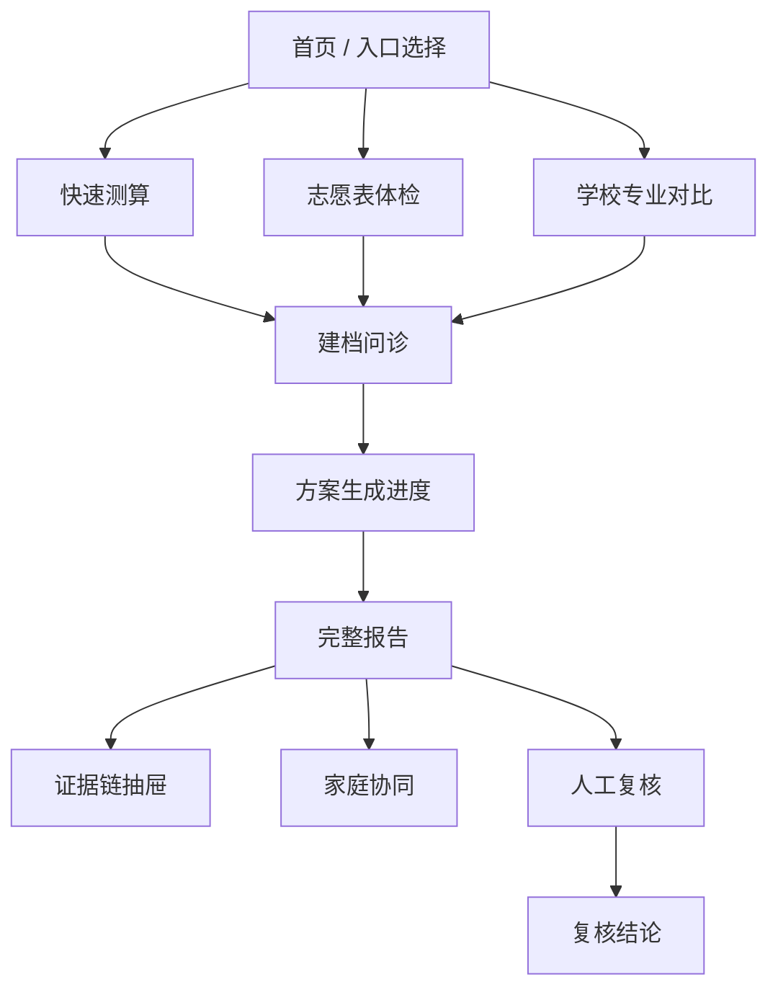
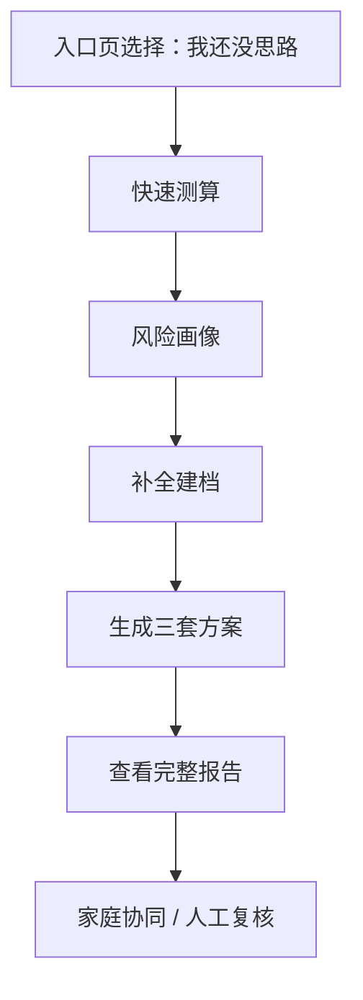
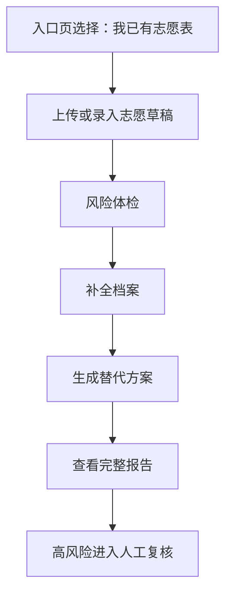
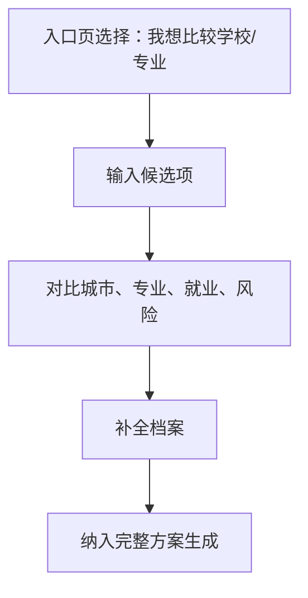

# 志愿规划 Agent 前端 PRD

版本：v0.1  
日期：2026-06-28  
前端框架：Next.js + React + TypeScript  
当前版本策略：所有功能免费开放，不做收费、套餐、订单、支付和付费解锁

---

## 1. 前端目标

前端的核心目标是让高考生和家长在移动端浏览器中快速完成：

- 进入产品并选择使用入口。
- 输入成绩、位次、选科和省份。
- 补全家庭背景、预算、城市/专业偏好和不可接受项。
- 查看风险画像、三套冲稳保方案和证据链。
- 录入或上传志愿表并完成风险体检。
- 让学生、父亲、母亲分别标注偏好并看到冲突。
- 在高风险场景中进入免费人工复核流程。

当前版本不承担商业化转化目标，前端不展示价格、套餐卡、订单状态、支付弹窗或付费墙。

---

## 2. 技术选型

### 2.1 推荐方案

首期使用 **Next.js + React + TypeScript**。

原因：

- 当前目标是网页版产品，不是原生小程序多端应用。
- Next.js 适合构建完整 Web 产品，内置路由、服务端渲染、数据获取、Route Handler、图片优化和部署生态。
- 本产品需要报告分享页、微信内浏览器访问、登录态、文件上传、服务端数据预取和轻量 BFF。
- React + Vite 更适合轻量前端原型；当产品进入登录、报告、分享、文件上传和服务端协同时，Next.js 的工程结构更完整。
- 后续如需原生微信小程序，可以复用 FastAPI 后端和核心业务 API，单独开发小程序壳。

准确说，React 和 Next.js 不是同级二选一：React 是 UI 库，Next.js 是基于 React 的 Web 应用框架。

### 2.2 建议技术栈

| 能力 | 推荐 |
|---|---|
| 框架 | Next.js App Router |
| 语言 | TypeScript |
| UI | Tailwind CSS 或 CSS Modules，避免过早引入重型组件库 |
| 表单 | React Hook Form + Zod |
| 服务端状态 | TanStack Query |
| 客户端状态 | Zustand 或 React Context |
| 图标 | lucide-react |
| 图表 | Recharts 或 ECharts |
| 文件上传 | 原生 input + 自定义上传组件 |
| 流式进度 | EventSource / SSE |

---

## 3. 设计原则

- 移动端优先，桌面端自适应。
- 首屏直接进入可用工具，不做营销式落地页。
- 不使用“精准预测”“必上”“保录”等高风险文案。
- 所有推荐结论必须有证据入口。
- 高风险项要明显、可解释、可复核。
- 不把基础风险藏起来，当前版本所有功能免费开放。
- 表单问题要短、明确、能跳过，减少建档阻力。
- 报告页面要适合微信内浏览器长阅读和分享。

---

## 4. 信息架构

---

## 5. 页面清单

| 页面 | 路由建议 | 说明 |
|---|---|---|
| 入口页 | `/` | 三个入口：没思路、已有志愿表、想比较 |
| 快速测算 | `/assess` | 省份、分数/位次、选科、批次输入 |
| 志愿表体检 | `/volunteer-check` | 上传/录入志愿草稿，查看风险 |
| 学校专业对比 | `/compare` | 对比学校、专业、城市、风险 |
| 建档问诊 | `/profile` | 家庭背景、预算、偏好、禁忌、风险风格 |
| 生成进度 | `/reports/generating` | 展示 Agent 节点进度和证据发现 |
| 报告详情 | `/reports/[id]` | 三套方案、证据链、风险体检、协同入口 |
| 家庭协同 | `/reports/[id]/family` | 学生、父亲、母亲分别标注和冲突汇总 |
| 人工复核 | `/reports/[id]/review` | 高风险复核清单、AI 底稿、复核结论 |
| 数据源详情 | `/sources/[id]` | 展示证据来源、年份、字段和可信度 |

---

## 6. 核心流程

### 6.1 没思路用户

### 6.2 已有志愿表用户

### 6.3 学校专业对比用户

---

## 7. 页面需求

### 7.1 入口页

目标：让用户在 5 秒内选择最接近自己的状态。

入口卡片：

- 我还没思路。
- 我已有志愿表。
- 我想比较学校/专业。

每个入口展示：

- 一句话说明。
- 需要准备的信息。
- 预计耗时。
- 开始按钮。

禁止出现：

- 套餐价格。
- 付费权益。
- “立即购买”。
- “解锁报告”。

### 7.2 快速测算页

字段：

- 省份。
- 批次。
- 分数。
- 位次。
- 选科。
- 性别。
- 是否有体检限制。

交互要求：

- 分数和位次至少填一个。
- 位次优先于分数。
- 没有位次时提示“将用分数估算，准确性较低”。
- 省份未深度覆盖时提示数据覆盖风险。

输出：

- 风险画像。
- 数据完整度。
- 是否建议补充位次。
- 是否建议人工复核。

### 7.3 志愿表体检页

输入方式：

- 手动录入学校、专业组、专业、排序。
- 上传 Excel/PDF/图片后由后端解析。
- 暂时无法解析时允许用户手动修正。

风险类型：

- 保底不足。
- 梯度过密。
- 热门专业扎堆。
- 不可接受专业命中。
- 选科冲突。
- 体检限制。
- 学费超预算。
- 地域冲突。

输出：

- 风险总览。
- 风险项列表。
- 命中的志愿行。
- 调整建议。
- 是否建议人工复核。

### 7.4 建档问诊页

建档模块：

- 学生基础信息。
- 家庭预算。
- 风险风格。
- 城市偏好。
- 专业偏好。
- 不可接受专业。
- 是否接受外省。
- 是否考虑读研。
- 家庭成员偏好。

交互要求：

- 支持分步填写。
- 支持保存草稿。
- 必填项尽量少，影响推荐质量的字段用“建议补充”提示。
- 展示档案完整度。

### 7.5 生成进度页

展示 Agent 运行进度：

- 档案检查。
- 数据版本锁定。
- 规则校验。
- 候选生成。
- 风险体检。
- 证据检索。
- 报告生成。
- 合规自检。

要求：

- 使用 SSE 接收后端进度。
- 节点失败时给出可理解错误。
- 用户刷新后能恢复当前 run 状态。

### 7.6 报告详情页

报告结构：

- 考生概况。
- 风险总览。
- 三套方案：保守型、均衡型、进取型。
- 院校专业组卡片。
- 推荐理由。
- 风险提示。
- 证据链。
- 志愿表体检结果。
- 家庭偏好冲突。
- 人工复核入口。

每个推荐卡片展示：

- 学校。
- 城市。
- 专业组。
- 层级：冲、稳、保、高冲。
- 模拟录取安全度。
- 综合分。
- 学费。
- 选科要求。
- 推荐理由。
- 风险项。
- 证据入口。

### 7.7 家庭协同页

角色：

- 学生。
- 父亲。
- 母亲。
- 其他家庭成员，后续扩展。

标注类型：

- 喜欢。
- 不能接受。
- 有疑问。

输出：

- 分歧最多的学校/专业。
- 三方共同接受的候选。
- 冲突原因。
- 家庭会议议程。

### 7.8 人工复核页

当前版本免费开放。

展示：

- AI 咨询底稿。
- 高风险清单。
- 需要复核的数据点。
- 复核结论。
- 用户需要补充的信息。
- 家庭会议建议。

状态：

- 待复核。
- 需要补充。
- 已复核。
- 已关闭。

---

## 8. 组件清单

| 模块 | 组件 |
|---|---|
| 首页入口 | EntrySelector、EntryCard |
| 表单 | ProvinceSelect、ScoreRankInput、SubjectSelector、BudgetInput |
| 建档 | ProfileStepper、PreferenceSelector、RejectedMajorInput |
| 报告 | RiskOverview、PlanTabs、CandidateCard、EvidenceDrawer |
| 体检 | VolunteerSheetEditor、RiskChecklist、RiskBadge |
| 协同 | FamilyMemberTabs、AnnotationButton、ConflictPanel |
| 复核 | AdvisorDraft、ReviewChecklist、ReviewConclusion |
| 通用 | Button、Tabs、Tag、Modal、Toast、Stepper、Skeleton、EmptyState |

---

## 9. 状态管理

### 9.1 本地状态

- 当前入口。
- 当前步骤。
- 临时表单。
- 上传文件。
- 志愿表草稿。
- 报告页局部 UI 状态。

### 9.2 服务端状态

- 用户会话。
- 学生档案。
- 报告。
- 报告版本。
- Agent run。
- 志愿表体检结果。
- 家庭标注。
- 人工复核状态。

推荐使用 TanStack Query 管理服务端状态，确保：

- 自动缓存。
- 失败重试。
- 页面恢复。
- 后台刷新。
- mutation 后统一失效。

---

## 10. 移动 H5 与微信内浏览器适配

要求：

- 375px 宽度下所有页面可用。
- 表单控件不溢出。
- 长报告阅读不出现横向滚动。
- 分享页有明确标题、摘要和封面图。
- 文件上传在微信内浏览器中有替代方案。
- 底部主要操作按钮避免被浏览器工具栏遮挡。
- 所有交互不依赖 hover。

暂不承诺：

- 原生微信小程序编译。
- 微信小程序组件体系。
- 微信原生订阅消息。

---

## 11. 文案与合规

禁止文案：

- 保录。
- 必中。
- 精准录取。
- 内部数据。
- 包过。
- 保上。
- 付费后更容易录取。

推荐文案：

- “模拟风险评估”。
- “基于当前数据的辅助判断”。
- “建议人工复核”。
- “最终填报请以省级考试院官方系统为准”。
- “该结论依赖当前数据版本”。

---

## 12. 前端验收标准

- 三个入口都能进入完整流程。
- 用户无需付费即可查看完整报告、证据链、体检结果和复核入口。
- 表单填写中断后可以恢复。
- 报告页可在移动端顺畅阅读。
- 高风险项有明确视觉提示。
- 每个关键推荐都有证据入口。
- Agent 生成进度可见，失败可恢复。
- 不出现价格、套餐、订单、支付、付费解锁相关 UI。

