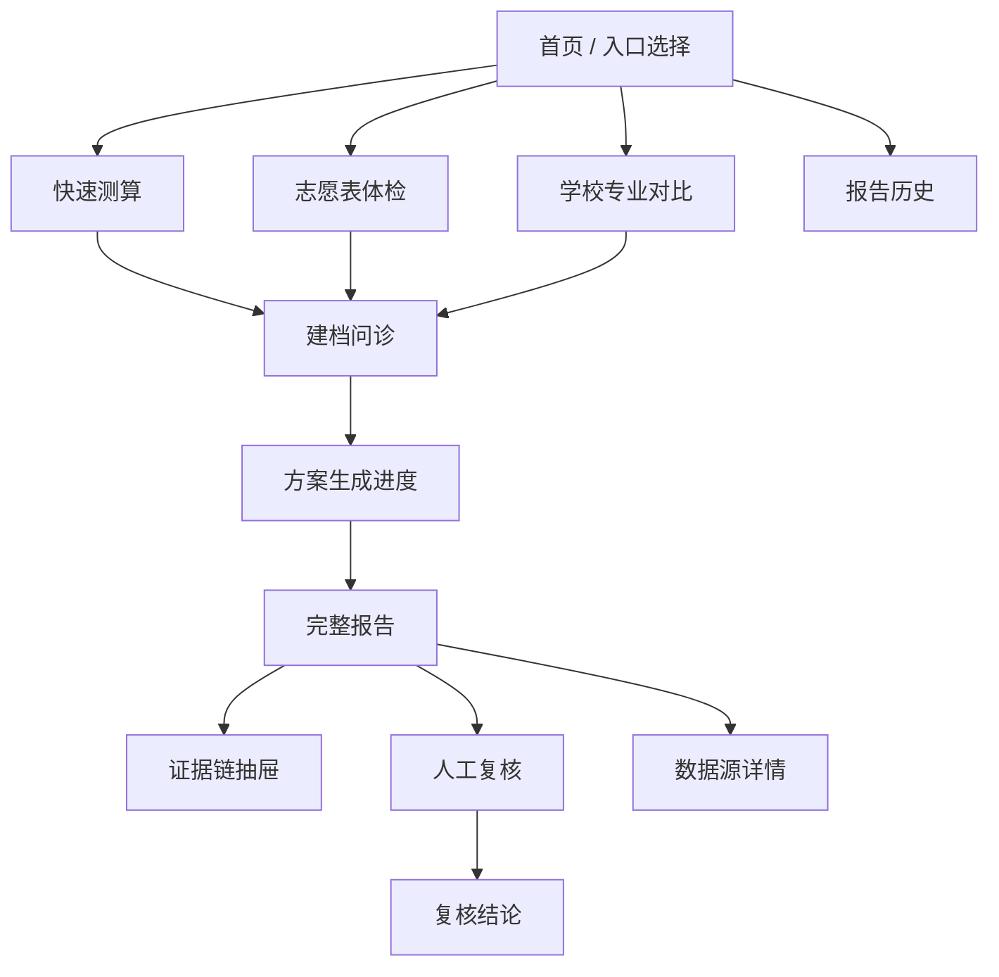
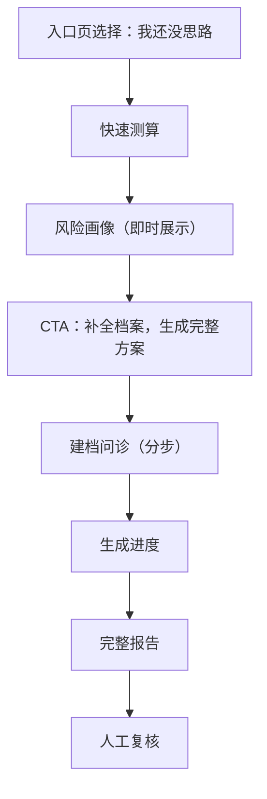
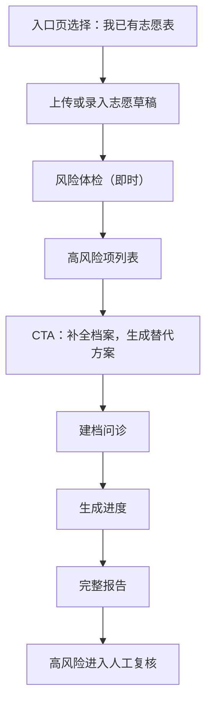
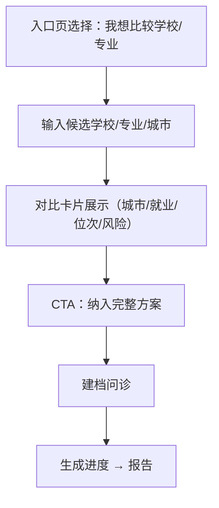
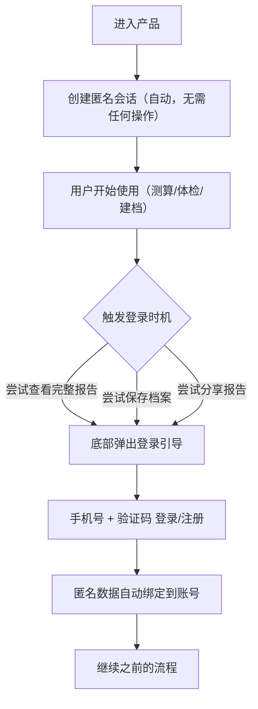

# 问津 Agent 前端 PRD

版本：v0.6  
日期：2026-06-28  
前端框架：Next.js + React + TypeScript  
当前版本策略：所有功能免费开放，不做收费、套餐、订单、支付和付费解锁

---

## Changelog

| 版本 | 日期 | 主要变更 |
| ---- | ---------- | -------- |
| v0.6 | 2026-06-29 | 技术审查修正：志愿数上限改为省份动态上限（默认 96，从后端 province_thresholds 取）；拖拽排序后触发即时风险重检；新增复核员工作台页（/admin/reviews）；新增站内通知展示方案（SSE 推送）；新增 SSE 鉴权说明（Cookie 方案）；补充 React 错误边界规范 |
| v0.5 | 2026-06-28 | 完全移除家庭协同功能（含分享标注、角色切换、冲突汇总）；删除家庭协同页（原 8.7）；建档 Wizard 减为 6 步（删除家庭成员偏好步骤）；清理信息架构、页面清单、流程图、组件表、状态管理及验收标准中所有家庭协同引用 |
| v0.4 | 2026-06-28 | 同步后端移除决策：/compare 标记为 Phase 2；家庭协同页去除 Agent 冲突解释和会议议程，改为标注聚合展示；修正通知推送为页面内状态轮询 |
| v0.3 | 2026-06-28 | 产品改名为问津 Agent；设计原则改为响应式优先；Section 12 重写为响应式与兼容性要求，去除 H5 / 微信内浏览器专项适配 |
| v0.2 | 2026-06-28 | 新增完整设计系统（色彩 / 字体 / 间距 / 圆角）；细化所有页面需求；新增 UI 状态规范（加载 / 空 / 错误 / 禁用）；新增组件清单；补充认证与会话流程 |
| v0.1 | 2026-06-28 | 初版，技术选型、页面清单、三个核心流程、基础组件和状态管理 |

---

## 1. 前端目标

前端的核心目标是让高考生和家长在 Web 端快速完成：

- 进入产品并选择使用入口。
- 输入成绩、位次、选科和省份。
- 补全家庭背景、预算、城市/专业偏好和不可接受项。
- 查看风险画像、三套冲稳保方案和证据链。
- 录入或上传志愿表并完成风险体检。
- 在高风险场景中进入免费人工复核流程。

当前版本不承担商业化转化目标，前端不展示价格、套餐卡、订单状态、支付弹窗或付费墙。

---

## 2. 技术选型

### 2.1 推荐方案

首期使用 **Next.js + React + TypeScript**。

原因：

- 当前目标是网页版产品，不是原生小程序多端应用。
- Next.js 适合构建完整 Web 产品，内置路由、服务端渲染、数据获取、Route Handler、图片优化和部署生态。
- 本产品需要报告分享页、登录态、文件上传、服务端数据预取和轻量 BFF，Next.js 的工程结构更完整。

### 2.2 建议技术栈

| 能力       | 推荐                                         |
| ---------- | -------------------------------------------- |
| 框架       | Next.js App Router                           |
| 语言       | TypeScript                                   |
| UI         | Tailwind CSS + CSS Modules，不引入重型组件库 |
| 表单       | React Hook Form + Zod                        |
| 服务端状态 | TanStack Query                               |
| 客户端状态 | Zustand                                      |
| 图标       | lucide-react                                 |
| 图表       | Recharts                                     |
| 文件上传   | 原生 input + 自定义上传组件                  |
| 流式进度   | EventSource / SSE                            |

---

## 3. 设计系统

### 3.1 设计基调

产品面向高考生和家长，这是一个高风险、高信息密度的决策场景。设计基调应该是：

- **专业可信**：不是活泼的学生 App，也不是冰冷的政府网站，接近"可信赖的专业工具"。
- **清晰易读**：信息密度高，但层次分明，关键数字和风险项要突出。
- **风险可视**：高/中/低风险必须靠颜色直观区分，用户无需阅读文字就能感知危险程度。

### 3.2 色彩系统

#### 品牌色

| 用途   | 色值      | 说明                                               |
| ------ | --------- | -------------------------------------------------- |
| 主色   | `#1E40AF` | 深蓝，传递专业和可信赖感，用于主按钮、链接、激活态 |
| 辅助色 | `#0D9488` | 蓝绿，用于进度条、完成状态、正向指引               |

#### 风险等级色

这是整个产品最重要的视觉语言，必须全局统一。

| 等级          | 色值      | 背景色    | 使用场景                                           |
| ------------- | --------- | --------- | -------------------------------------------------- |
| 高风险        | `#DC2626` | `#FEF2F2` | 保底不足、选科冲突、体检限制命中，必须人工复核的项 |
| 中风险        | `#D97706` | `#FFFBEB` | 梯度过密、热门专业扎堆、学费接近预算上限           |
| 低风险 / 正常 | `#16A34A` | `#F0FDF4` | 推荐理由支撑充分、规则校验通过                     |
| 提示 / 信息   | `#2563EB` | `#EFF6FF` | 数据覆盖不足提示、建议补充位次                     |

#### 中性色

| 用途          | 色值      |
| ------------- | --------- |
| 页面背景      | `#F8FAFC` |
| 卡片/面板背景 | `#FFFFFF` |
| 主要文字      | `#0F172A` |
| 次要文字      | `#64748B` |
| 占位/禁用     | `#94A3B8` |
| 分割线/边框   | `#E2E8F0` |

### 3.3 字体与字号

字体优先使用系统字体，保证在主流桌面和移动浏览器上的渲染效果。

```
font-family: -apple-system, "PingFang SC", "Noto Sans SC", "Helvetica Neue", sans-serif
```

| 层级     | 字号 | 行高 | 字重 | 使用场景                     |
| -------- | ---- | ---- | ---- | ---------------------------- |
| 大标题   | 20px | 28px | 600  | 页面主标题                   |
| 小标题   | 17px | 24px | 600  | 卡片标题、章节标题           |
| 正文     | 15px | 22px | 400  | 主要内容                     |
| 次要文字 | 13px | 18px | 400  | 标签、说明、辅助信息         |
| 数字强调 | 22px | 28px | 700  | 分数、位次、安全度等关键数字 |

### 3.4 间距系统

基于 4px 基准：4 / 8 / 12 / 16 / 20 / 24 / 32 / 48px。

- 卡片内边距：16px
- 页面水平边距：16px
- 列表项间距：12px
- 章节间距：24px

### 3.5 圆角与阴影

- 卡片圆角：12px
- 按钮圆角：8px
- 标签/徽章圆角：4px
- 卡片阴影：`0 1px 3px rgba(0,0,0,0.08), 0 1px 2px rgba(0,0,0,0.06)`

---

## 4. 设计原则

- 响应式设计，同时支持桌面端和移动端浏览器。
- 首屏直接进入可用工具，不做营销式落地页。
- 不使用"精准预测""必上""保录"等高风险文案。
- 所有推荐结论必须有证据入口。
- 高风险项要明显、可解释、可复核。
- 不把基础风险藏起来，当前版本所有功能免费开放。
- 表单问题要短、明确、能跳过，减少建档阻力。
- 报告页面要适合微信内浏览器长阅读和分享。

---

## 5. 信息架构

### 5.1 页面层级



### 5.2 导航结构

当前版本是**任务流驱动**，用户按流程推进，不是多 Tab 内容浏览 App。导航策略如下：

**顶部导航栏**（所有页面固定）：

- 左侧：返回箭头（首页除外）
- 中间：当前页面标题
- 右侧：用户头像/登录入口（首页）或空

**不设置底部 Tab 导航栏**：产品是线性决策流程，底部 Tab 会破坏流程感，且当前功能模块不够独立。

**报告历史入口**：首页顶部右侧用户头像点击后，展示报告历史和账号信息。

**关键跳转规则**：

- 从任意流程（快速测算/体检/对比）进入建档问诊时，携带 `profile_id` 参数。
- 报告生成后，跳转至 `/reports/[id]`，浏览器历史保留生成进度页，支持返回查看进度日志。
- 人工复核通过报告页内的按钮进入，不作为独立顶级入口。

---

## 6. 页面清单

| 页面         | 路由                   | 说明                                   |
| ------------ | ---------------------- | -------------------------------------- |
| 入口页       | `/`                    | 三个入口 + 登录入口 + 报告历史快捷入口 |
| 快速测算     | `/assess`              | 省份、分数/位次、选科、批次            |
| 志愿表体检   | `/volunteer-check`     | 上传/录入志愿草稿，查看风险            |
| 学校专业对比 | `/compare`             | 对比学校、专业、城市、风险（**Phase 2，MVP 不实现**） |
| 建档问诊     | `/profile`             | 家庭背景、预算、偏好、禁忌、风险风格   |
| 生成进度     | `/reports/generating`  | Agent 节点进度和证据发现               |
| 报告详情     | `/reports/[id]`        | 三套方案、证据链、风险体检、复核入口   |
| 人工复核     | `/reports/[id]/review` | 高风险复核清单、AI 底稿、复核结论      |
| 数据源详情   | `/sources/[id]`        | 证据来源、年份、字段和可信度           |
| 报告历史     | `/reports`             | 用户历史报告列表                       |
| 复核员工作台 | `/admin/reviews`       | 内部页面，仅 `role=reviewer/admin` 可访问；待复核队列、任务领取、提交结论 |

---

## 7. 核心流程

### 7.1 没思路用户



### 7.2 已有志愿表用户



### 7.3 学校专业对比用户

> **Phase 2，MVP 阶段不实现。** Compare Service 已从后端移除，该入口在当前版本入口页上暂不展示。下方流程为未来版本参考，不作为当前开发依据。



### 7.4 认证与会话流程

认证采用**匿名优先**策略，降低用户启动门槛。



**登录 UI 规则**：

- 登录弹窗以底部 Sheet 形式出现，不打断当前页面内容。
- 登录成功后 Sheet 收起，页面继续原有操作，无需刷新。
- 首页顶部右侧始终展示登录入口（未登录时显示"登录"文字，已登录显示头像）。
- 当前版本不支持微信 OAuth，仅手机号验证码。

---

## 8. 页面需求

### 8.1 入口页

目标：让用户在 5 秒内选择最接近自己的状态。

**布局**：

- 顶部：产品名称 + 简短定位语（一行）。
- 顶部右侧：登录入口 / 用户头像。
- 中部：三张入口卡片，纵向排列。
- 底部：已有报告的快速入口（登录用户显示"继续上次的报告"）。

**入口卡片内容**（每张）：

| 元素         | 说明                                                 |
| ------------ | ---------------------------------------------------- |
| 图标         | lucide 图标，区分三种状态                            |
| 主标题       | "我还没思路" / "我已有志愿表" / "我想比较学校/专业"  |
| 一句话说明   | 适合谁、解决什么问题                                 |
| 需要准备什么 | 例：准考证号、一分一段表位次                         |
| 预计耗时     | 快速测算 3 分钟 / 完整建档 15 分钟 / 对比模式 5 分钟 |
| 开始按钮     | 主色填充按钮                                         |

**禁止出现**：套餐价格、付费权益、"立即购买"、"解锁报告"。

---

### 8.2 快速测算页

**字段与交互**：

| 字段           | 类型            | 交互说明                                                     |
| -------------- | --------------- | ------------------------------------------------------------ |
| 省份           | 单选下拉        | 未深度覆盖的省份在选中后展示"数据覆盖提示"（信息蓝色提示条） |
| 批次           | 单选            | 根据省份动态加载可选批次                                     |
| 分数           | 数字输入        | 与位次联动                                                   |
| 位次           | 数字输入        | 优先级高于分数；填入后隐藏"将用分数估算"的提示               |
| 选科           | 多选            | 物理/历史二选一 + 其余 4 科多选，动态展示可选组合            |
| 性别           | 单选            | 影响体检限制筛选                                             |
| 是否有体检限制 | 单选 + 展开说明 | 选"有"后展示常见限制多选项                                   |

**即时反馈**：

- 填入位次后，在字段下方展示"你的位次约在全省前 X%"（用一分一段表估算）。
- 分数和位次至少填一个，否则无法提交。
- 没有位次时，提示"将用分数估算，准确性较低，建议查询一分一段表后再填"。

**输出（提交后即时展示，不跳转新页面）**：

风险画像卡片，包含：

- 综合安全等级（高/中/低，配色使用风险色系）。
- 预计可冲学校层级区间。
- 数据完整度（进度条 + 百分比）。
- 是否建议补充位次。
- 是否建议人工复核。
- **CTA 主按钮**："补全档案，生成三套方案"（进入建档问诊）。

---

### 8.3 志愿表体检页

#### 录入方式

**方式一：手动录入（默认）**

志愿表编辑器采用**有序卡片列表**形式，不做 Excel 式表格（移动端不友好）：

- 每条志愿以卡片展示，顶部显示序号和志愿标签（冲/稳/保/高冲）。
- 卡片内字段：学校名称、院校专业组代码、专业名称、是否服从调剂。
- 支持**拖拽排序**（长按卡片出现拖拽把手，拖拽调整顺序）。
- 支持新增（底部"+ 添加志愿"按钮）和删除（右滑卡片出现删除按钮）。
- 最多支持志愿数以**当前省份政策上限**为准（从后端 `GET /api/v1/data/availability` 响应的 `max_volunteers` 字段获取，默认 96）。硬编码 30 会导致无法展示后端生成的完整方案。
- **拖拽排序后立即触发风险重检**：梯度（志愿序位差异）和热门专业扎堆依赖志愿顺序，排序变更后前端 debounce 800ms 后调用 `POST /api/v1/volunteer/check`，风险摘要条实时刷新。

**方式二：上传文件**

- 支持格式：Excel / PDF / 图片（JPG/PNG）。
- 上传后展示解析进度，解析完成后自动填充到卡片列表。
- 解析失败的字段以**橙色高亮**标出，旁边展示"点击修正"入口，进入行内编辑。
- OCR 置信度低于阈值的字段，字段旁展示"⚠ 请核对"小标签。

#### 风险体检展示

体检结果在录入完成后以**悬浮风险摘要条**展示（页面底部固定位置），点击展开详情面板：

| 风险类型         | 视觉处理                 |
| ---------------- | ------------------------ |
| 保底不足         | 高风险红色，排在列表最前 |
| 梯度过密         | 中风险橙色               |
| 热门专业扎堆     | 中风险橙色               |
| 不可接受专业命中 | 高风险红色               |
| 选科冲突         | 高风险红色               |
| 体检限制         | 高风险红色               |
| 学费超预算       | 中风险橙色               |
| 地域冲突         | 中风险橙色               |

风险项列表中，每条风险：

- 展示命中的具体志愿行号和学校/专业名。
- 给出一句调整建议。
- 高风险项末尾展示"建议人工复核"标签。

---

### 8.4 建档问诊页

采用**分步 Wizard（多步骤向导）**模式，一次只呈现一个模块，减少填写压力。

#### 步骤结构

| 步骤 | 模块                                                  | 必填 |
| ---- | ----------------------------------------------------- | ---- |
| 1    | 学生基础信息（省份、分数/位次、选科、性别、体检限制） | 是   |
| 2    | 家庭预算（年学费上限，是否接受外省）                  | 建议 |
| 3    | 风险风格（保守/均衡/进取，单选卡片）                  | 建议 |
| 4    | 城市偏好（优先城市、不接受城市，可多选）              | 建议 |
| 5    | 专业偏好（感兴趣方向、不可接受专业）                  | 建议 |
| 6    | 未来规划（是否考虑读研、职业方向关键词）              | 可选 |

#### 交互规则

- 顶部显示步骤进度条（当前步骤/总步骤）和当前步骤名称。
- 每步都有"下一步"主按钮和"跳过这步"次级文字链接。
- 第 1 步（基础信息）不允许跳过。
- 数据**自动保存草稿**（每个字段 onChange 后 debounce 500ms 写入本地状态，步骤跳转时同步到服务端）。
- 右上角始终显示档案完整度（进度百分比），鼓励用户补充。
- 用户关闭或中断后再进入，自动恢复到上次中断的步骤。
- 最后一步完成后，展示档案摘要卡片和"开始生成方案"主按钮。

#### 必填 vs 建议补充的视觉区分

- 必填字段：标签旁无特殊标记，跳过时会弹出提示。
- 建议补充：字段标签旁显示"建议"蓝色小徽章，跳过不阻断流程但会降低档案完整度分。
- 可选字段：标签旁显示"选填"灰色小徽章。

---

### 8.5 生成进度页

展示 Agent 运行进度，用户在此等待（P95 约 45 秒）。

#### 布局

- 顶部：报告标题 + 考生简要信息（姓名/省份/分数）。
- 中部：步骤列表（纵向时间线样式）。
- 底部：动态文案 + 预计剩余时间。

#### 步骤列表

每个节点显示状态图标（等待中 / 进行中旋转 / 完成 / 失败）：

| 步骤         | 说明文案                     |
| ------------ | ---------------------------- |
| 档案检查     | 正在读取您的档案信息         |
| 数据版本锁定 | 正在确认数据版本             |
| 规则校验     | 正在校验选科、批次和体检限制 |
| 候选生成     | 正在从 X 所学校中筛选候选    |
| 风险体检     | 正在检查梯度和保底充分性     |
| 证据检索     | 正在收集招生数据和政策依据   |
| 报告生成     | 正在生成三套方案             |
| 合规自检     | 正在进行内容合规检查         |

进行中节点下方展示实时发现的关键信息（来自 SSE 事件），例如：

- "发现 2024 年河南省招生计划数据"
- "规则校验：选科通过 / 发现 1 项体检风险"

#### 时间管理

- 页面打开即展示"预计约 40 秒"。
- 每个步骤完成后更新"预计剩余 X 秒"。
- 超过 60 秒未完成时，展示"生成时间较长，可以先去做别的事情，完成后将在页面展示结果"。
- 用户刷新或关闭后重新进入，通过 `run_id` 恢复当前状态，已完成节点显示为完成态。

#### 失败处理

- 单个节点失败时，以红色状态图标标出，展示可理解的错误描述（不展示技术报错）。
- 例："数据检索超时，正在重试（1/3）"。
- 全流程失败后展示错误摘要 + "重新生成"按钮。

---

### 8.6 报告详情页

报告页是产品核心交付物，也是移动端阅读体验最关键的页面。

#### 整体布局（纵向滚动，无横向分栏）

```
┌─────────────────────────────────┐
│  顶部导航栏（返回 + 报告标题）      │
├─────────────────────────────────┤
│  考生概况卡片                     │
│  （省份 / 分数 / 位次 / 选科）      │
├─────────────────────────────────┤
│  风险总览卡片                     │
│  （整体安全等级 + 关键风险数）       │
├─────────────────────────────────┤
│  三套方案 Tab 切换                │
│  [保守型]  [均衡型]  [进取型]      │
│                                 │
│  推荐卡片列表（当前 Tab 内容）      │
│  卡片 1 ─────────────────────── │
│  卡片 2 ─────────────────────── │
│  ...                            │
├─────────────────────────────────┤
│  志愿表体检结果（如有录入）         │
├─────────────────────────────────┤
│  操作区                          │
│  [人工复核]  [分享]               │
└─────────────────────────────────┘
```

#### 三套方案 Tab

- 默认展示"均衡型"Tab。
- Tab 下方滚动展示该方案的推荐卡片列表（3-5 张，按冲→稳→保顺序排列）。
- 切换 Tab 时列表滚动到顶部，不保留滚动位置。

#### 推荐卡片

每张卡片展示以下信息：

**主要信息（始终可见）**：

- 学校名称（大字）+ 城市 + 层级标签（冲/稳/保/高冲，色彩区分）
- 专业名称 + 专业组代码
- 模拟录取安全度（数字 + 进度条，颜色与安全等级对应）
- 综合评分 + 学费/年

**次要信息（点击展开）**：

- 选科要求
- 推荐理由（2-3 条结构化说明）
- 风险提示（如有，红色/橙色小标签）
- 证据入口：点击"查看数据来源"打开证据链抽屉

#### 证据链抽屉

从屏幕底部滑出（Bottom Sheet），不全屏覆盖：

- 来源标题、数据年份、省份
- 权威级别标签（官方 / 高 / 中）
- 关键字段列表（招生计划数、最低位次、专业组代码等）
- 短引用摘要
- 底部：数据来源完整页入口

#### 风险总览卡片

- 整体安全等级（高/中/低，大色块）。
- 关键风险列表（最多展示 3 条，其余折叠）。
- 每条风险：等级图标 + 一句描述 + 来源志愿位置。
- "查看全部风险"展开按钮。

---

### 8.7 人工复核页

当前版本免费开放，展示 Human-in-the-loop 的完整流程。

#### 进入方式

- 报告风险等级为高时，报告页底部展示"建议人工复核"橙色提示条 + 主按钮。
- 用户也可主动点击报告页底部的"申请人工复核"按钮。

#### 页面布局

**状态栏**（顶部）：复核状态（待复核 / 需要补充 / 已复核 / 已关闭）+ 状态颜色。

**AI 咨询底稿**：

- 折叠卡片，点击展开。
- 展示 Agent 生成的综合判断和推荐理由摘要。

**高风险清单**：

- 每条高风险项：等级图标 + 描述 + 涉及的志愿行。
- 复核人员已处理的项显示绿色勾选。

**用户待补充信息**（如有）：

- 列表显示复核人员要求补充的信息。
- 每条旁边有文字输入框或文件上传。

**复核结论**（复核完成后展示）：

- 结论文本。
- 调整建议。
- 复核人员签名和时间。

---

### 8.8 数据源详情页

从报告中的"查看数据来源"跳转，展示单个证据的完整信息。

**页面内容**：

| 字段       | 说明                                                 |
| ---------- | ---------------------------------------------------- |
| 来源标题   | 例："2025 年河南省本科批招生计划"                    |
| 数据类型   | 招生计划 / 一分一段表 / 投档线 / 招生章程 / 就业报告 |
| 权威级别   | 官方（省考试院）/ 高（学校官方）/ 中（第三方统计）   |
| 数据年份   | 如：2025 年                                          |
| 省份       | 如：河南省                                           |
| 批次       | 如：本科批                                           |
| 数据集版本 | 内部版本号，用于追溯                                 |
| 检索时间   | 证据检索的时间戳                                     |
| 关键字段   | 该来源覆盖的字段列表                                 |
| 引用摘要   | 不超过 200 字的原文摘要                              |

底部展示：使用该来源的报告推荐卡片列表（反向追溯）。

---

### 8.9 报告历史页

登录用户可访问，展示过去生成的所有报告。

**列表项**：

- 报告生成时间。
- 考生省份 + 分数/位次。
- 报告状态（生成中 / 已完成 / 待复核 / 已复核）。
- 报告整体风险等级色块。
- 点击进入报告详情。

**空状态**：未登录或无报告时，展示引导卡片"你还没有报告，从这里开始生成"，点击跳转入口页。

---

### 8.10 复核员工作台（`/admin/reviews`）

仅 `role=reviewer` 或 `role=admin` 的用户可访问，其他用户跳转 403 页面。

**布局**：

```
┌─────────────────────────────────┐
│  顶部：待复核 / 进行中 / 已完成 Tab │
├─────────────────────────────────┤
│  任务列表（游标分页）              │
│  每行：触发原因 / 风险等级 /        │
│       创建时间 / 剩余 SLA /        │
│       领取按钮                    │
├─────────────────────────────────┤
│  点击任务行 → 展开详情面板          │
│  AI 底稿 / 风险清单 /              │
│  Checklist 逐项判断 /             │
│  通过 / 拒绝 / 需补充 按钮         │
└─────────────────────────────────┘
```

**交互要点**：

- 领取任务后（`PATCH /api/v1/reviews/{id}/claim`），该任务在列表中标记为"进行中"，其他复核员不可重复领取。
- 提交结论时，所有 `required: true` 的 checklist 项必须选择（pass/flag），否则按钮置灰。
- SLA 倒计时展示：任务创建超过 3h 后高亮提示"即将超时"。
- 任务列表 SSE 实时刷新（复核员工作台常驻），有新任务进入时 Toast 提示。

---

## 9. UI 状态规范

每个关键页面和组件必须定义以下状态，防止在开发过程中遗漏：

### 9.1 加载状态

- 推荐卡片列表：展示 3 张骨架屏卡片（Skeleton），高度与真实卡片相同。
- 证据链抽屉：内容区展示 2 行骨架屏文字。
- 报告详情页初次加载：顶部考生概况和风险总览先渲染骨架，Tab 区域占位。
- 生成进度页本身不使用骨架屏，用步骤列表传达进度。

### 9.2 空状态

| 场景             | 展示内容                                             |
| ---------------- | ---------------------------------------------------- |
| 报告历史无报告   | 插图 + "你还没有生成过报告" + 跳转入口页按钮         |
| 志愿表体检无录入 | 引导文字 + 两种录入方式入口                          |
| 志愿表体检无录入 | 引导文字 + 两种录入方式入口                          |
| 风险体检无风险   | 绿色图标 + "未发现明显风险，建议继续完整建档"        |

### 9.3 React 错误边界

以下关键区域必须包裹 `ErrorBoundary`，避免单个组件崩溃白屏整页：

| 区域 | 降级展示 |
| ---- | -------- |
| `CandidateCard` 列表渲染 | "部分推荐卡片加载失败，请刷新页面" + 重试按钮 |
| `EvidenceDrawer` 内容 | "证据详情暂时无法显示" |
| `AgentProgressTimeline` | 仅展示静态"生成中..."文案，不显示动态步骤 |
| 整个 `/reports/[id]` 页 | 友好错误页 + "返回首页"按钮，不展示任何原始错误堆栈 |

### 9.4 错误状态

| 场景                | 处理方式                                                      |
| ------------------- | ------------------------------------------------------------- |
| 网络请求失败        | Toast 提示"网络异常，请重试" + 请求重试按钮（不清空已填内容） |
| Agent 超时（> 60s） | 页面内提示"生成时间较长，可稍后回来查看"；用户重新进入生成进度页时通过 run_id 恢复状态 |
| 文件上传失败        | 行内红色提示 + 支持重新上传                                   |
| OCR 解析失败        | 提示"无法自动解析，请手动录入" + 切换到手动模式               |
| 省份数据不覆盖      | 信息蓝色提示条，说明当前省份数据有限，建议补充位次后人工复核  |
| SSE 连接断开        | 自动重连（最多 3 次），3 次失败后展示"连接中断，点击刷新"按钮 |

### 9.5 禁用/不可操作状态

- 档案完整度低于 40% 时，"生成三套方案"按钮显示禁用态，Tooltip 提示"请先完成基础信息填写"。
- 报告生成中时，所有修改档案的入口禁用。
- 数据版本未发布时，报告详情页展示"当前报告依赖的数据版本未完成校验"提示条。

---

## 10. 组件清单

| 模块     | 组件                    | 关键行为                                  |
| -------- | ----------------------- | ----------------------------------------- |
| 首页入口 | `EntryCard`             | 图标 + 标题 + 说明 + 耗时 + 按钮          |
| 认证     | `LoginSheet`            | 底部弹出，手机号 + 验证码，成功后自动关闭 |
| 表单     | `ProvinceSelect`        | 下拉 + 数据覆盖提示                       |
| 表单     | `ScoreRankInput`        | 分数/位次双字段，联动提示                 |
| 表单     | `SubjectSelector`       | 物理/历史二选一 + 其余多选                |
| 建档     | `ProfileStepper`        | 顶部进度条 + 步骤标题 + 跳过链接          |
| 建档     | `RiskStyleSelector`     | 三张选项卡片（保守/均衡/进取），单选      |
| 建档     | `RejectedMajorInput`    | 标签式输入，可删除                        |
| 志愿表   | `VolunteerCard`         | 可拖拽排序，行内编辑，右滑删除            |
| 志愿表   | `VolunteerEditor`       | 卡片列表容器 + 新增按钮 + 上传入口        |
| 志愿表   | `OCRConfidenceTag`      | 低置信度字段标记，点击进入修正            |
| 报告     | `RiskOverview`          | 安全等级色块 + 风险数 + 展开列表          |
| 报告     | `PlanTabs`              | 三套方案 Tab 切换                         |
| 报告     | `CandidateCard`         | 可展开/收起，含层级标签、安全度、证据入口 |
| 报告     | `EvidenceDrawer`        | 底部 Sheet，证据字段展示                  |
| 报告     | `RiskBadge`             | 高/中/低风险色彩徽章                      |
| 体检     | `RiskChecklist`         | 风险项列表，按等级排序                    |
| 体检     | `RiskSummaryBar`        | 固定底部悬浮摘要条，点击展开              |
| 复核     | `ReviewStatusBar`       | 顶部状态条，颜色跟随状态变化              |
| 复核     | `AdvisorDraft`          | 折叠卡片，AI 底稿内容                     |
| 复核     | `ReviewChecklist`       | 高风险清单 + 复核状态标记                 |
| 复核     | `ReviewConclusion`      | 结论文本 + 签名 + 时间                    |
| 进度     | `AgentProgressTimeline` | 纵向时间线，节点状态 + 实时发现文字       |
| 通用     | `Button`                | 主色填充 / 描边 / 文字 三种样式           |
| 通用     | `BottomSheet`           | 底部滑出面板，通用容器                    |
| 通用     | `Skeleton`              | 卡片、文字、进度条三种骨架                |
| 通用     | `EmptyState`            | 插图 + 文字 + 可选按钮                    |
| 通用     | `Toast`                 | 顶部弹出，成功/错误/警告三种              |
| 通用     | `Tag`                   | 风险等级 / 层级 / 建议/选填 等标签        |

---

## 11. 状态管理

### 11.1 本地状态（Zustand）

- 当前会话入口（快速测算 / 体检 / 对比）。
- 建档向导当前步骤。
- 表单临时状态（未提交的字段值）。
- 上传文件和 OCR 解析结果。
- 志愿表草稿。
- 报告页当前 Tab（保守/均衡/进取）。
- 底部 Sheet 的展开/收起状态。

### 11.2 服务端状态（TanStack Query）

- 用户会话和登录态。
- 学生档案（含完整度）。
- 报告详情和版本列表。
- Agent run 状态（SSE 补充）。
- 志愿表体检结果。
- 人工复核任务状态。
- 数据源详情。

TanStack Query 配置要求：

- 报告详情：`staleTime: 30s`，用户主动刷新时重新请求。
- Agent run 状态：通过 SSE 更新，不使用轮询。
- 档案数据：`staleTime: Infinity`，明确 mutation 后失效。
- mutation 成功后统一调用 `queryClient.invalidateQueries` 失效相关 key。

### 11.3 SSE 鉴权方案

`EventSource` API 不支持自定义请求头，无法直接传 Bearer Token。前端统一使用以下方案：

- **Cookie 鉴权**（首选）：登录后由 BFF 种下 `HttpOnly` Session Cookie，SSE 连接自动携带，BFF 层校验后转发到 FastAPI。前端无需额外处理。
- **Query Token 备选**：若无法使用 Cookie（跨域等），先调用 `POST /api/v1/agent/runs/{id}/stream-token` 获取一次性短期 token（60s 有效），再拼入 SSE URL：`/api/v1/agent/runs/{id}/events?token=xxx`。

### 11.4 站内通知机制

人工复核完成、run 失败等异步事件需通知用户。当前版本不引入 Web Push（需 Service Worker，复杂度高），采用**长连接 SSE 推送**：

- 用户在任意页面时，前端建立 `GET /api/v1/notifications/stream`（永久 SSE 连接）。
- 后端有新通知时推送 `event: notification` 事件。
- 前端收到后在顶部展示 Toast 并刷新通知列表。
- 用户关闭页面后 SSE 断开，重新进入时调用 `GET /api/v1/notifications?unread=true` 补全遗漏通知。

---

## 12. 响应式与兼容性要求

### 12.1 断点与布局

| 断点   | 宽度范围       | 布局策略                                                 |
| ------ | -------------- | -------------------------------------------------------- |
| 移动端 | < 768px        | 单列，全宽卡片，纵向滚动                                 |
| 平板   | 768px - 1024px | 可适当双列，报告侧边信息展开                             |
| 桌面端 | > 1024px       | 内容区最大宽度 960px 居中，两栏布局（主内容 + 侧边摘要） |

- 最小可用宽度：375px，以 390px（iPhone 14）和 1280px（桌面常见宽度）为主要测试基准。
- 长报告阅读不出现横向滚动。
- 表单控件不溢出，Select 和多选使用自定义组件保证跨浏览器一致性。

### 12.2 交互适配

- 移动端：所有交互不依赖 hover，点击区域最小 44×44px。
- 底部主要操作按钮在移动端需预留 `env(safe-area-inset-bottom)` 安全区间距。
- 桌面端：支持 hover 状态提示，键盘焦点可见（`focus-visible`）。
- 表单页面在软键盘弹出时，当前激活的输入框需滚动到可见区域（`scrollIntoView`）。

### 12.3 文件上传

- 支持拖拽上传（桌面端）和点击选择（所有端）。
- 支持格式：Excel、PDF、图片（JPG/PNG）。
- 手动录入始终作为备选方案，优先级等同于文件上传。
- 上传后展示解析进度，解析失败提示"无法自动解析，请手动录入"。

### 12.4 分享页 OG 标签

报告分享页（`/reports/[id]`）需设置 OG 标签，保证在社交平台分享时展示正确的预览信息：

- `og:title`：`[学生名] 的问津志愿规划报告`
- `og:description`：省份、分数/位次、整体安全等级摘要
- `og:image`：报告封面缩略图（Next.js OG image 动态生成）

---

## 13. 文案与合规

### 13.1 禁止文案

在任何页面、按钮、标签、提示文字中禁止出现：

- 保录、必中、精准录取、包过、保上。
- 内部数据、独家数据、独家渠道。
- 付费后更容易录取、付费解锁完整报告。
- 任何形式的录取概率精确承诺（"录取率 85%"等）。

### 13.2 推荐文案

| 场景         | 推荐文案                                           |
| ------------ | -------------------------------------------------- |
| 风险评估结论 | "基于当前数据的模拟风险评估"                       |
| 推荐理由     | "该结论依赖 [数据年份] [省份] 数据版本"            |
| 有风险项时   | "建议人工复核，最终填报以省级考试院为准"           |
| 证据来源     | "来源：[来源名称]，[年份]，权威级别：[官方/高/中]" |
| 无法确定时   | "当前数据覆盖有限，以下为估算结果，仅供参考"       |

---

## 14. 前端验收标准

### 14.1 功能验收

- 三个入口都能进入完整流程并生成报告。
- 匿名用户可以完成测算和建档，登录后数据自动绑定。
- 报告页三套方案 Tab 切换正常，推荐卡片展开/收起正常。
- 证据链抽屉可以从推荐卡片唤起，展示正确的来源信息。
- 志愿表可以手动录入、拖拽排序，上传文件后 OCR 结果填充正确。
- 建档问诊分步完成，草稿在刷新后可恢复。
- 生成进度页通过 SSE 实时更新，刷新后通过 run_id 恢复状态。
- 高风险报告展示人工复核入口。
- 报告历史页展示过往报告列表。
- 复核员工作台（`/admin/reviews`）可正常领取任务、提交结论，普通用户访问跳转 403。
- 复核完成后用户收到站内通知（Toast 提示 + 通知列表更新）。
- 志愿表录入最多条数与当前省份上限一致（从 data/availability 接口读取），不硬编码 30 条。
- 拖拽排序后风险摘要条在 1 秒内刷新（debounce 800ms + 接口响应时间）。
- 关键渲染区域有 ErrorBoundary，单组件崩溃不影响其他区域展示。

### 14.2 体验验收

- 375px 宽度下所有页面无横向滚动、无元素溢出。
- 高风险项有明确视觉提示（红色标签、色块）。
- 每个关键推荐都有证据入口可点击。
- 空状态、加载状态、错误状态均有对应 UI，不展示空白页面。
- Agent 生成超过 30 秒时，页面有明确的等待引导文案。
- 所有表单字段在软键盘弹出时不被遮挡。

### 14.3 合规验收

- 全流程不出现禁止文案清单中的任何词语。
- 不出现价格、套餐、订单、支付、付费解锁相关 UI 元素。
- 所有推荐结论有数据来源标注，不出现无来源的确定性断言。
