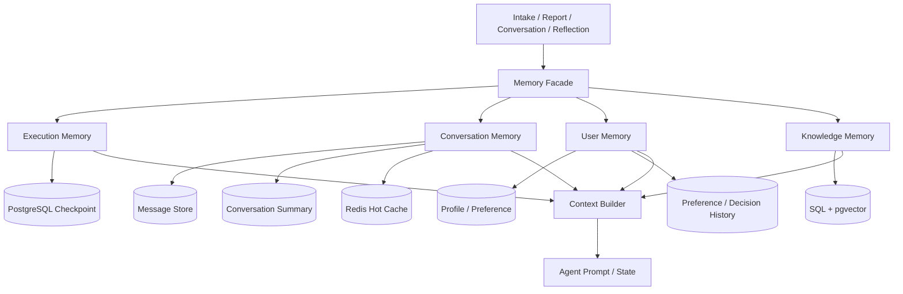

# 问津 Agent 记忆模块架构评审

> 评审口径：以当前 PRD 与真实代码为准，区分已实现、部分实现和未实现。  
> 阅读目标：理解 Agent Memory 的底层原理、工程取舍、业务价值与演进路线。

---

## 一、现状评价

问津当前并不是“没有记忆”，而是已经形成了几种分散的记忆能力：

> **重要事实结构化保存，对话用于连续体验，知识通过 RAG 按需召回。**

这个方向很适合高考志愿这种高风险业务。分数、位次、选科、预算等信息不能只存在聊天文本或向量库中，必须进入结构化数据库，供规则引擎精确读取；对话历史主要负责交互连续性；招生政策和院校资料则通过 RAG 召回。

当前整体成熟度属于“基础能力较完整，但尚未平台化”：

| 维度 | 评价 | 说明 |
|---|---|---|
| 数据持久化 | 较好 | Redis 热层 + PostgreSQL 冷层 |
| 多会话管理 | 较好 | Intake 支持多会话、重命名、软删除和匿名合并 |
| 工作状态管理 | 基础可用 | LangGraph State 清晰，但只存在于运行期 |
| Context 管理 | 偏初级 | 主要依靠最近 N 条和字符截断 |
| 执行恢复 | 缺失 | PRD 有 Checkpoint 设计，代码没有接入 checkpointer |
| 长期用户记忆 | 部分实现 | 有 Profile/Preference，但没有来源、置信度和冲突治理 |
| 记忆可观测性 | 部分实现 | 有运行调试数据，但没有“哪条记忆为何被注入”的记录 |

结论：

> 不需要推倒重来，适合进行一次“分层收敛式重构”：保留现有 State、Redis/PostgreSQL 会话、Profile 和 RAG，在其上补齐 Checkpoint、摘要、Context Builder 和长期记忆治理。

---

## 二、记忆类型与使用场景

### 2.1 工作记忆 Working Memory

***状态：已实现，但未持久化。***

载体是 `VolunteerPlanState`，保存：

- 用户档案；
- 检索证据；
- 规则结果；
- 候选院校；
- 风险项；
- Reflection 轮数；
- 工具调用日志。

使用场景：一次报告生成过程中，LangGraph 节点通过 State 交换信息。

底层原理：Working Memory 是当前任务的“共享白板”。State 中并行写入字段使用 Reducer 合并，避免 Retrieval Agent 和 Policy Rule Agent 相互覆盖数据。

当前限制：图使用无 Checkpointer 的 `graph.compile()`，Worker 崩溃后 State 丢失，不能从中间节点恢复。

### 2.2 建档对话记忆 Conversation Memory

**状态：已实现。**

```text
Redis：intake:history:{owner_key}:{conversation_id}
PostgreSQL：intake_conversations.messages_json
```

使用场景：

- 建档前多轮咨询；
- 从历史会话继续；
- 匿名用户登录后继承历史；
- 页面刷新或 API 重启后恢复会话。

当前策略：Redis 保存 7 天热缓存，PostgreSQL 冷层兜底；每次给 IntakeAgent 注入最近 16 条消息。

### 2.3 报告问答记忆

**状态：已实现。**

```text
Redis：chat:history:{report_id}:{user_id}
PostgreSQL：report_conversations.messages_json
```

使用场景：

- 针对同一份报告连续追问；
- 维持“上一轮正在讨论哪所学校”的语境；
- 恢复报告问答历史。

当前策略：ConversationAgent 注入最近 10 条消息，并将报告 Plan 和 Evidence 作为当前回答上下文。

已发现的问题：匿名用户发送消息时可能使用 `anon:{IP}`，读取和删除时却使用固定 `anon`，导致 Redis Key 不一致。这说明 Memory 身份作用域尚未统一。

### 2.4 结构化用户长期记忆 User Memory

**状态：部分实现。**

载体：

- `StudentProfile`；
- `Preference`。

保存内容：

- 省份、分数、位次、选科、批次；
- 家庭预算、风险风格；
- 城市偏好、专业偏好、排斥专业、职业优先级。

使用场景：规则校验、推荐评分、报告生成和局部重新生成。

这是当前最正确的记忆设计：高风险事实进入结构化数据库，规则引擎不需要从自然语言或向量相似度中猜测。

当前不足：只保存当前值，没有来源、变化历史、置信度、有效期和最后确认时间，也没有区分“用户明确表达”和“模型推断”。

### 2.5 外部知识记忆 Knowledge Memory

**状态：主报告链路已实现。**

载体：

- 招生 SQL 数据；
- 文档 Chunk；
- Embedding；
- pgvector；
- Cohere Rerank；
- Evidence Chain。

使用场景：招生政策、院校资料、专业介绍、历史录取数据和报告引用。

底层原理：结构化数据走 SQL 精确检索，非结构化资料走向量召回和 Rerank。RAG 只补充知识与解释，不直接决定选科、批次或录取安全度。

注意：RAG 是外部知识记忆，不能等同于用户长期记忆。

### 2.6 决策与情景记忆 Episodic Memory

**状态：部分实现。**

当前保存：

- 报告版本与 `parent_report_id`；
- `run_summary_json`；
- `debug_summary_json`；
- 节点耗时、工具调用和 Reflection 轮数。

使用场景：报告回溯、决策过程展示、Admin 调试和故障定位。

当前它更接近“审计记录”。只有当系统能够在新任务中召回“上次为什么拒绝某校、为什么修改预算”，并用于后续解释或决策时，才形成真正的 Episodic Memory。

### 2.7 程序性记忆 Procedural Memory

**状态：已实现，但不属于用户数据。**

载体是 System Prompt、LangGraph 工作流、规则代码、Tool Registry 和合规约束。

它描述 Agent“应该怎么做”，例如什么时候调用工具、哪些结论必须走规则引擎。程序性记忆与用户记忆应该独立版本管理。

### 2.8 类型总览

| 类型 | 解决的问题 | 当前实现 | 状态 |
|---|---|---|---|
| Working Memory | 单次任务如何协作 | LangGraph State | 已实现 |
| Execution Memory | 任务中断后如何继续 | PRD 有设计，代码未接 Checkpointer | 未实现 |
| Conversation Memory | 当前会话说过什么 | Redis + PostgreSQL | 已实现 |
| User Memory | 跨会话记住用户什么 | Profile/Preference | 部分实现 |
| Episodic Memory | 上次为何做出某个决定 | 报告版本与运行摘要 | 部分实现 |
| Knowledge Memory | 外部事实如何召回 | SQL + pgvector + Rerank | 已实现 |
| Procedural Memory | Agent 应该如何行动 | Prompt + Workflow + Tools | 已实现 |

---

## 三、优缺点

### 3.1 优点

| 优点 | 架构价值 | 业务价值 |
|---|---|---|
| 结构化事实与对话历史分离 | 降低自然语言解析的不确定性 | 避免记错分数、位次和硬约束 |
| Redis + PostgreSQL 双层存储 | 兼顾低延迟和持久化 | 页面刷新、服务重启后仍能恢复历史 |
| 多会话隔离 | 支持 Thread 级上下文 | 用户可以分别讨论不同方案 |
| Profile 直接进入规则引擎 | 可验证、可审计 | 推荐结果更可信 |
| SQL 与向量检索分工 | 精确事实与语义知识各走合适路径 | 引用更可靠，解释更丰富 |
| 有 TTL 和窗口限制 | 控制存储和 Prompt 成本 | 避免长对话拖慢响应 |
| 报告版本和运行摘要 | 提供决策血缘 | 可以解释方案如何变化 |

### 3.2 缺点

| 缺点 | 技术后果 | 用户影响 |
|---|---|---|
| 没有 PostgreSQL Checkpoint | Worker 崩溃后只能重跑 | 等待时间和模型成本增加 |
| 没有对话摘要 | 早期信息被窗口挤出 | 用户需要重复表达预算和偏好 |
| 使用字符截断 | Token 预算不准确，JSON 可能被半截切断 | 回答遗漏或语义异常 |
| Memory 逻辑分散在 API | Key、TTL、回源策略容易不一致 | 同一功能在不同入口表现不同 |
| `messages_json` 整体覆盖 | 并发写入可能丢消息 | 历史不完整 |
| DB 持久化 best-effort | Redis 与 PostgreSQL 可能不一致 | 缓存过期后历史消失 |
| 长期偏好没有来源和置信度 | 模型推断可能污染事实 | 推荐错误地继承旧偏好 |
| 没有纠错、冲突和遗忘机制 | 旧值持续影响后续任务 | 用户无法让系统真正“忘记” |
| 没有 Memory 评测 | 无法量化记忆质量 | 问题只能依赖人工体验发现 |

---

## 四、是否需要重构

结论：

> 需要优化和收敛，但不需要推倒重建。

现有能力已经覆盖正确的基础设施：State、Redis、PostgreSQL、Profile 和 pgvector 都可以保留。真正需要重构的是边界和调用方式。

建议保持四个独立领域：

1. **Execution Memory**：解决执行恢复；
2. **Conversation Memory**：解决聊天连续性；
3. **User Memory**：解决跨会话个性化；
4. **Knowledge Memory**：解决外部知识召回。

统一的是：

- 身份与 Thread 作用域；
- 读写接口；
- Context 组装；
- Token 预算；
- 可观测性；
- 安全、纠错和遗忘策略。

不建议建立一个什么都负责的巨大 `MemoryManager`，否则执行状态、聊天历史、用户偏好和向量检索会再次耦合。

---

## 五、推荐架构



### 5.1 PostgreSQL Checkpoint

Checkpoint 保存的是 Agent 执行快照，而不是聊天记录。

```text
data_resolver           ✅
retrieval_agent         ✅
policy_rule_agent       ✅
recommendation          Worker 崩溃
                            ↓ Resume
recommendation          从有效边界继续
```

关键设计：

- PostgreSQL 是权威 Checkpoint 存储；
- `thread_id` 表示可恢复执行线程；
- `run_id` 表示一次执行尝试；
- `checkpoint_id` 表示某个 State 快照；
- Redis 继续负责 ARQ、SSE 和会话热缓存；
- 业务代码不直接依赖 LangGraph Checkpoint 内部表。

Checkpoint 必须与幂等同时设计。进程可能在“报告写库成功、Checkpoint 尚未提交”之间崩溃，因此恢复后节点可能再次执行：

- Report 使用业务唯一键去重；
- SSE 终态事件去重；
- 外部写工具携带 `idempotency_key`；
- 节点恢复前检查副作用是否已经完成。

### 5.2 Conversation Summary

采用：

```text
结构化历史摘要 + 最近原始消息
```

推荐摘要结构：

```json
{
  "confirmed_facts": [],
  "preferences": [],
  "rejected_options": [],
  "previous_decisions": [],
  "open_questions": [],
  "covered_until_message_id": "msg_100"
}
```

摘要不是事实源，必须保留：

- 摘要版本；
- 覆盖消息范围；
- 来源消息 ID；
- 使用模型和 Prompt 版本；
- 压缩前后 Token；
- 生成状态。

摘要失败时继续使用最近消息窗口，不能阻断聊天。

### 5.3 Context Builder

Context Builder 是整个重构的核心。它统一决定“什么记忆应该进入本次 Prompt”，而不是简单读取所有历史。

输入：

```text
Agent 类型 + 用户身份 + Conversation/Thread + 当前问题 + State + Token 上限
```

输出：

```json
{
  "messages": [],
  "included_sources": [],
  "excluded_sources": [],
  "token_usage": {},
  "warnings": []
}
```

推荐优先级：

```text
系统安全规则
  > 已确认硬事实
  > 当前请求
  > 已确认硬约束
  > 最近消息
  > 历史摘要
  > 相关长期记忆
  > RAG Evidence
  > 一般背景信息
```

必须改为 Token-aware：先计算每个 Context Block 的 Token，再按优先级分配预算；JSON、Evidence 和工具结果以完整对象为单位裁剪。

不同 Agent 使用不同策略：

| Agent | 主要 Context |
|---|---|
| IntakeAgent | 摘要、最近消息、少量已确认档案 |
| RetrievalAgent | 当前任务、档案过滤条件和实体 |
| Recommendation | 完整结构化档案、规则结果和证据摘要 |
| ReportAgent | 候选、风险、核心证据和已确认偏好 |
| ReflectionAgent | 报告内容与合规规则，不需要完整聊天历史 |
| ConversationAgent | 报告、摘要、最近消息、相关长期记忆和按需 RAG |

### 5.4 用户长期偏好记忆

长期记忆必须区分两类：

| 类型 | 示例 | 使用规则 |
|---|---|---|
| 权威事实/明确偏好 | 预算、城市、选科、禁忌专业 | 用户明确填写或确认后，可以进入规则和评分 |
| 推断偏好 | 更看重就业、可能不喜欢中外合作 | 只能作为待确认候选，不能直接影响硬规则 |

每条长期记忆至少包含：

- 类型和值；
- 来源类型与来源消息；
- 置信度；
- confirmed / proposed / rejected / superseded 状态；
- 生效范围和有效期；
- 最后确认时间；
- 敏感级别。

结构化字段继续保存在 Profile/Preference；较长的背景、决策原因和相似历史事件才考虑向量化。

### 5.5 标准设计原则

1. 能结构化就存数据库，不全部塞向量库。
2. 最近消息保留原文，旧消息生成摘要。
3. 按 user / thread / tenant 严格隔离。
4. 记忆写入必须带来源和置信度。
5. 用户能够查看、修改和删除长期记忆。
6. Checkpoint 与 Conversation Memory 分开设计。
7. Context Builder 按 Token 预算选择记忆，不无限注入。
8. 敏感信息采用最小化、TTL、访问控制、脱敏和审计。

---

## 六、分阶段演进方案

### P0：先修正确性和统一边界

**为什么会出现这个问题**

Intake 建档前聊天和 Report 报告问答是两条先后独立长出来的功能线，各自在没有共享抽象的前提下自己发明了一遍"这条记忆归属于谁"的判断逻辑。这不是一次性疏忽，而是分散式记忆架构必然会积累的一致性债务：没有统一入口时，同一个语义会在不同代码路径上被略微不同地重新实现一次，功能越多，分叉点越多，出错只是时间问题。

会话并发丢消息是同一类根因的另一种表现：最早的存储模型是"整条历史 JSON 覆盖式写入"，这是原型阶段最简单的实现方式，但没有为"用户同时开着两个标签页、或网络重试导致同一条消息被发送两次"这类必然会发生的现实情况做防护。

**现状是什么**

- Redis 层：`chat.py` 里 POST/GET/DELETE 三个端点各自计算身份 key——发消息时用请求方 IP，读历史和清空历史时却用一个写死的占位字符串 `"anon"`，三处逻辑互不一致；
- Postgres 层：`report_conversations` 用 `user_id IS NULL` 一刀切区分"匿名"和"非匿名"，没有字段能区分*哪个*匿名用户；
- ConversationAgent 和 IntakeAgent 的身份解析、限流 key、Redis 读写这几块逻辑，各自在两个 API handler 里手写一遍，没有共享代码；
- `messages_json` 是整条 JSON 覆盖式写入，读-改-写之间没有任何并发保护。

**带来什么影响**

- 匿名用户发消息后自己读不到刚发的历史，清空历史后旧消息又"复活"；
- 不同匿名用户在同一份报告下会互相读到对方的问答记录，属于数据串号；
- 高并发场景下（用户重复点击、网络重试）消息会被后写请求覆盖丢失，对话历史不完整；
- 身份/存储逻辑分散在两条链路里，同一个 bug 可能以不同形式在两处各出现一次，后续每次改动都要多处同步，回归成本高。

**业务价值**

Chat-first 首屏的核心流量入口是匿名用户（建档前还没有登录），身份识别一旦错配，后果是两种同样致命的体验：要么用户清空后再发消息，历史却"复活"或读不回来（体验上等同于 AI 失忆）；要么更严重——不同匿名用户在同一份报告下彼此看到对方的问答历史（数据隔离和信任问题）。志愿填报是强隐私、高决策风险场景，一旦被用户感知到"串号"，对信任的伤害远大于一般产品里的同类 bug；并发丢消息则会让用户上一轮谈好的预算、排除院校等关键信息凭空消失，规则引擎和推荐会拿着不完整的上下文做决策。

**如何解决的**

1. **身份解析统一**：定义统一的 `owner_key(identity)` 抽象，登录用户是 `user.id`，匿名用户是 `anon:{anonymous_id}`（由 `session_token` 派生，不是 IP，因为 IP 在多人共享网络/移动网络下不是稳定的用户标识），Intake 和 Conversation 两条链路都改为调用这一套解析，收进新建的 `backend/app/services/conversation_store.py`；`thread_id` 明确只承载 LangGraph 执行维度语义，不参与记忆归属判断。
2. **Postgres 层精确匹配**：给 `report_conversations` 加 `anonymous_id` 字段（迁移 `011_report_conversation_anonymous_id`），回源查询按 `user_id`（登录）或 `anonymous_id`（匿名）精确匹配，替换掉 `user_id IS NULL` 的一刀切写法。
3. **抽出 Memory Facade**：`conversation_store.py` 把身份解析、限流 key、Redis 读写、Postgres upsert 这几块两条链路共用的基础设施收拢成一层，`chat.py`/`intake_chat.py` 只保留各自的业务特有部分（Intake 的多会话/软删除/标题升级，Conversation 的单行 upsert），避免同一段逻辑被复制两份。
4. **并发写入控制**：第一版尝试用 Redis `WATCH`/`MULTI` 做客户端乐观重试，压测到 20 并发时仍然丢消息——本质是客户端"读快照-改-提交"这套 CAS 在网络往返延迟下窗口期太长，多个客户端会在同一个快照上各自重试。后来换成服务端 Lua 脚本做原子 append + trim，把"读-改-写"整体下沉成 Redis 侧的一次原子操作；Postgres 侧给 `report_conversations`/`intake_conversations` 加 `version` 字段，接入 SQLAlchemy `version_id_col` 做行级乐观锁，冲突时应用层自动重试。
5. **验证方式**：20 个并发请求写 Redis 无丢失、5 个并发请求写 DB 无丢失（消息总数与预期一致）；另外用两个真实独立的匿名身份跑通完整流程（发消息、读、清空、再发）确认互不可见、清空后不复活。

文档里"Checkpoint 已实现"这条描述性错误当时选择了暂缓修正，原因是 P1 的 PostgreSQL Checkpointer 正在并行推进，文档要描述的"是否已实现"本身是个随进度移动的目标，等 P1 验证通过后再一次性收口更划算。

### P1：PostgreSQL Checkpoint

**为什么会出现这个问题**

主报告生成链路要串起多个 LangGraph 节点，中间多次调用 LLM 和外部工具，是一个可能持续几十秒到几分钟的异步任务，跑在 ARQ worker 进程里。而 worker 进程在生产环境中因为超时、发布重启、资源回收等原因被杀掉是必然会发生的事，区别只是什么时候发生。最初选择不带 checkpointer 的图编译方式，是 MVP 阶段"先把功能跑通"的合理取舍，但这个取舍的代价是：一旦进程被杀，就没有任何中间状态可用，只能整体重来。

**现状是什么**

- `create_graph`/`create_refine_graph` 用无 checkpointer 的 `graph.compile()`，State 只存在于 worker 进程内存里；
- worker 被杀（超时/重启/OOM）后，`data_resolver` 到 `reflection` 之间已经跑完的节点结果全部丢失，任务只能重新入队从头执行；
- `report_agent.py` 每次都 `uuid4()` 插入一行新报告，没有幂等键，报告写库和 SSE 终态推送也没有去重；
- worker 侧把所有失败原因（超时、外部取消、真实异常）统一记成 `failed`，看不出区别。

**带来什么影响**

- 一次报告生成如果在最后一个节点（如 `reflection`）失败，前面 `data_resolver`/`retrieval_agent`/`policy_rule_agent`/`recommendation`/`risk` 五个节点已经消耗的 LLM 调用和工具调用全部作废，需要重新花费一遍；
- 用户视角是"进度条从 0 开始"，即便只差最后一步，等待时间也要翻倍；
- 一旦以后接入 checkpoint 做重试，没有幂等设计会导致 report 表出现同一次运行的重复行、SSE 出现重复终态事件；
- 运维层面所有失败都长得一样，无法判断是基础设施正常回收资源（该自动重试）还是任务本身出错（不该无脑重试），故障定位效率低。

**业务价值**

每个节点背后都是真实的模型调用，report 节点还叠加了 Reflection 合规自检的多轮循环，一次报告生成如果失败后只能整体重跑，意味着重复消耗真实的 token 成本，也意味着用户要重新等待几十秒到几分钟。对于高考志愿这种决策窗口短、体验高度敏感的场景，"失败了就当没发生过、全部重来"无论在成本还是体验上都难以接受。

**如何解决的**

1. **Checkpointer 选型**：用 `langgraph-checkpoint-postgres` 的 `AsyncPostgresSaver`，而不是复用 Redis——checkpoint 是需要长期可靠、可审计的执行快照（要保证 worker 重启、跨天重试都能读到），语义上更接近权威存储而不是热缓存，PostgreSQL 本来就是系统里承担这个角色的存储。Worker 进程 `on_startup` 建一次长连接池并调用 `.setup()`，`create_graph`/`create_refine_graph` 编译图时挂上这个 checkpointer，每个 superstep 结束后自动落盘到 `checkpoints`/`checkpoint_blobs`/`checkpoint_writes` 三张表，业务代码不直接读写这几张表。
2. **Resume 策略**：`run_agent`/`run_refine` 默认按 `thread_id` 查是否已有 checkpoint——有则 `graph_input=None`（图从最后一个已提交的 checkpoint 继续跑，被 LangGraph 判定为"已完成"的节点不会重新执行），没有则从头构建初始 state 正常起跑。
3. **Retry 与 Resume 的边界**：新增 `POST /api/v1/agent/runs/{id}/retry`，只对 `failed`/`timeout`/`interrupted` 三种终态生效，内部显式调用 `adelete_thread` 清空该 `thread_id` 下的 checkpoint，再强制从头重跑。之所以要单独做这个分支，是因为如果不清空 checkpoint，`/retry` 走的还是"续跑"路径，达不到用户想要的"整体重来"效果——`/refine` 语义不受影响，继续复用父报告证据的局部子图。
4. **幂等设计**：`report_agent.py` 从"每次 `uuid4()` 插入新行"改成"按 `run_id` upsert"（查到就更新同一行，查不到才插入），`reports.run_id` 加唯一约束兜底防止极端并发下的重复插入；同时去掉 report 节点内部提前触发的 `completed`/`failed` SSE 推送，只保留 worker 收尾时的单次终态推送——这一步是必须和 checkpoint 一起做的，否则断点续跑会导致同一次运行产生多条报告记录或多次终态事件。
5. **故障分类可观测性**：区分 `asyncio.CancelledError` 是被 `job_timeout` 触发（记 `timeout`）还是被外部提前取消（记 `interrupted`），不再统一归并成 `failed`；成功收尾时清掉上一次失败尝试遗留的 `error_msg`，避免误导下次排查。
6. **验证方式**：真实报告生成中途撞上 `job_timeout` 被 ARQ 自动重试，日志证实续跑正确跳过了 `data_resolver/retrieval_agent/policy_rule_agent/recommendation/risk` 五个已完成节点，只重新执行 `report`→`reflection`；`reflection` 循环内 `report` 节点被多次调用，但最终该 run 在 `reports` 表里只留 1 行；`agent_runs.status` 正确落到 `timeout` 而非笼统的 `failed`；另外手动模拟 `failed` 状态调用 `/retry`，验证到确实清空 checkpoint 后从 `data_resolver` 整体重跑，报告行按 `run_id` 复用同一个 `id` 被覆盖更新，而不是新增一行。

### P2：追加式消息和对话摘要

- 将 `messages_json` 逐步拆成 Conversation、Message、Summary；
- 采用双写、回填、切读、停旧写的兼容迁移；
- 增加结构化增量摘要；
- 摘要失败时回退最近消息窗口。

业务价值：长对话不再遗忘早期关键事实，同时控制 Token 成本。

### P3：统一 Context Builder

- 统一 Intake、Conversation、Report 和 Reflection 的 Context 构建；
- 采用 Token-aware 预算；
- 为不同 Agent 配置不同 Context Policy；
- 记录每次注入、裁剪、摘要和长期记忆来源。

业务价值：让记忆使用可解释、可调试，并减少无效 Prompt 成本。

### P4：用户长期偏好治理

- 从对话提取记忆候选；
- Intake 和 ConversationAgent 均支持用户确认；
- 增加来源、置信度、冲突、有效期和 superseded 状态；
- 提供查看、修改、确认、拒绝和删除能力；
- confirmed 记忆按规则投影到 Preference。

业务价值：用户跨会话被持续理解，同时避免错误推断污染推荐。

推荐顺序：

```text
正确性修复
  → PostgreSQL Checkpoint
  → 对话摘要
  → Context Builder
  → 用户长期偏好记忆
```

原因：没有稳定身份和消息源，摘要不可信；没有摘要和 Context Builder，保存再多长期记忆也不知道何时应该注入。

---

## 七、测试与验收指标

### 7.1 当前能力基线测试

| 测试 | 操作 | 当前期望结果 |
|---|---|---|
| 多轮记忆 | 先说“预算 5 万”，几轮后询问预算 | 窗口内能回忆；超出窗口可能遗忘，作为摘要基线 |
| 会话隔离 | A 会话说喜欢北京，B 会话询问偏好 | B 不能读取 A 的历史 |
| 用户隔离 | 两个账号分别聊天 | 不得串数据 |
| Redis 降级 | 写入聊天后删除 Redis 缓存，再读取历史 | 能从 PostgreSQL 恢复 |
| 窗口截断 | 连续发送 20 条编号信息并检查 Prompt | Intake 最近 16 条；Conversation 最近 10 条 |
| API 重启恢复 | 重启 API 后打开旧会话 | PostgreSQL 历史仍存在 |
| 删除测试 | 删除 Intake 会话后继续访问 | 返回 404，不能复活 |
| 匿名合并 | 匿名聊天后登录 | 历史归属登录用户，并暴露当前 Report Chat Key 问题 |
| Context 超限 | 构造超长报告、大量 Evidence 和长对话 | 请求不崩溃，记录截断内容、Token 和答案正确性 |
| Checkpoint 基线 | 报告生成中杀死 Worker | 当前应无法节点级恢复，证明 Checkpointer 未实现 |

重点记录：

- **Recall Accuracy**：该记住的信息是否正确召回；
- **Isolation Accuracy**：不该读取的信息是否被隔离；
- **Token Cost**：记忆注入后 Prompt 增长多少。

### 7.2 重构后测试

| 能力 | 必测场景 |
|---|---|
| Checkpoint | 每个节点后杀 Worker、重复 Resume、图版本不兼容、无 Checkpoint |
| 幂等 | 报告写入后崩溃、SSE 写入后崩溃、工具超时后重试 |
| Conversation | 并发追加、重复幂等键、Redis 丢失、数据库回源 |
| Summary | 早期事实、新值覆盖旧值、冲突、超时、非法 JSON、删除消息 |
| Context | Token 上限、优先级、完整对象裁剪、Evidence 淘汰 |
| User Memory | proposed 不生效、确认、拒绝、替代、过期、删除 |
| Privacy | 敏感信息不进入日志、删除后所有路径不可召回 |

### 7.3 最终验收指标

| 能力 | 指标 |
|---|---|
| Checkpoint | Worker 崩溃恢复成功率 ≥ 99% |
| 幂等 | 故障恢复后的重复报告和重复终态事件为 0 |
| 对话摘要 | 早期关键事实召回率 ≥ 95% |
| Context | 不超过 Token 上限，成本下降且正确率不降低 |
| 用户隔离 | 跨用户记忆泄漏为 0 |
| 偏好记忆 | 明确偏好提取准确率 ≥ 95% |
| 推断记忆 | 未确认推断影响硬规则次数为 0 |
| 删除能力 | 删除后所有读取和召回路径不可见 |
| 可观测性 | 能解释每条记忆为何被注入或排除 |

---

## 八、面试表达总结

可以用下面这段话概括项目：

> 问津当前已经有 LangGraph State、Redis/PostgreSQL 会话历史、结构化 Profile/Preference 和 pgvector RAG，但这些能力还是分散的。我的重构思路不是把所有内容塞进一个 MemoryManager，而是把记忆拆成 Execution、Conversation、User 和 Knowledge 四个领域。PostgreSQL Checkpoint 负责执行恢复，消息窗口与摘要负责会话连续性，结构化用户记忆负责可靠个性化，RAG 负责外部知识；最后由 Token-aware Context Builder 按可信度、相关性和优先级统一组装。这样既保留高风险业务的确定性，又让 Agent 具备可恢复、可控、可解释的长期记忆能力。

最终建议：

> 保留现有 State、Redis/PostgreSQL 会话、Profile 和 RAG；新增 PostgreSQL Execution Checkpoint、追加式消息存储、结构化对话摘要、统一 Context Builder，以及带来源、置信度、冲突和遗忘治理的长期偏好层。
